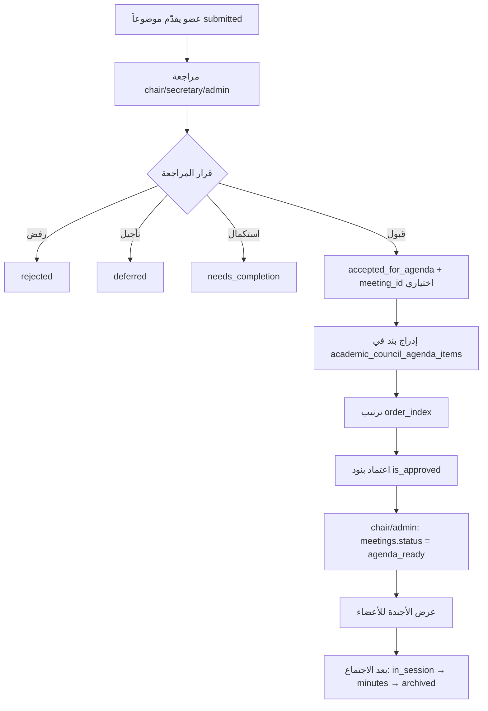

# COUNCILS-AGENDA-UI-PLANNING-01 — تقرير تحليل وتخطيط

**التاريخ:** 2026-07-06  
**القرار:** **PASS**  
**التوصية التالية:** **READY_FOR_COUNCILS_AGENDA_FUNCTIONS_01**

> هذه مرحلة **تخطيط فقط**. لا تعني جاهزية الإنتاج — smoke اختبار الاجتماعات ما زال **NO-GO** (غياب بيانات دخول فقط) ويجب إعادته قبل واجهة أجندة إنتاجية.

---

## السياق

| المرحلة السابقة | النتيجة |
|-----------------|---------|
| COUNCILS-MEETINGS-RLS-APPLY-01 | PASS — `can_schedule_council_meeting` على `meetings_insert/update` |
| COUNCILS-MEETINGS-ADMIN-CHAIR-UI-01 | merged في `main` |
| COUNCILS-MEETINGS-MANUAL-SMOKE-01 | NO-GO — لا حسابات اختبار |

---

## تأكيد النطاق — لم يُنفَّذ

| العنصر | الحالة |
|--------|--------|
| migrations / DB / RLS | ❌ |
| data writes / seed | ❌ |
| UI / server functions / routes | ❌ |
| service role | ❌ |
| إنشاء اجتماعات أو بنود أجندة | ❌ |
| حذف / cleanup | ❌ |

**المخرج الوحيد:** هذا التقرير.

---

## 1. الجداول التي تم فحصها

| الجدول | ملاحظة |
|--------|--------|
| `academic_councils` | مجلس الكلية + مجالس الأقسام |
| `academic_council_members` | عضويات المجلس — *(الاسم الفعلي؛ ليس `academic_council_memberships`)* |
| `academic_council_meetings` | الاجتماعات + enum دورة الحياة |
| `academic_council_topics` | الموضوعات + `meeting_id` اختياري |
| `academic_council_agenda_items` | **جدول الأعمال** |
| `academic_council_topic_attachments` | مرفقات الموضوعات (قراءة/عرض) |

**مصادر:** `supabase/migrations/20260703192337_*.sql`، `20260710120000_council_meeting_schedule_helpers.sql`، `src/integrations/supabase/types.ts`، `admin-councils.functions.ts`، `faculty-councils.functions.ts`، واجهتا admin/faculty.

---

## 2. Schema جدول الأعمال — `academic_council_agenda_items`

### 2.1 الحقول المتوفرة

| الحقل | موجود | ملاحظة |
|-------|--------|--------|
| `meeting_id` | ✅ | FK → `academic_council_meetings` |
| `topic_id` | ✅ | اختياري — يدعم بنداً يدوياً بدون موضوع |
| `title` | ✅ | مطلوب |
| `order_index` | ✅ | `UNIQUE (meeting_id, order_index)` |
| `notes` | ✅ | اختياري |
| `status` (enum بند) | ❌ | لا يوجد — الاعتماد على `is_approved` |
| `created_by` / `updated_by` | ✅ | |
| `created_at` / `updated_at` | ✅ | trigger `trg_acagenda_touch` |
| `is_approved` / `approved_by` / `approved_at` | ✅ | اعتماد على مستوى البند |

### 2.2 قيود وسلوك DB

- **لا DELETE** لـ `authenticated` — `REVOKE DELETE` على الجدول.
- **RLS:** `agenda_select` لأعضاء المجلس أو admin؛ `agenda_insert/update` عبر `can_write_council_agenda` على `council_id` الاجتماع.
- **لا قيد فريد** على `(meeting_id, topic_id)` — منع الإدراج المكرر يجب أن يكون في طبقة التطبيق.
- **إعادة الترتيب:** تتطلب تحديثاً دفعياً لـ `order_index` مع احترام UNIQUE (ترتيب مؤقت أو transaction).

### 2.3 هل يكفي لـ MVP؟

**نعم — يكفي لـ MVP تشغيلي أول** لـ:

- ربط موضوع مقبول باجتماع كبند أجندة.
- إضافة بند يدوي (`topic_id = null`).
- ترتيب البنود.
- اعتماد جزئي على مستوى البند (`is_approved`).
- عرض الأجندة للأعضاء (SELECT موجود).

**تحسينات schema اختيارية لاحقة** (ليست حاجزاً لهذه المرحلة):

| التحسين | السبب |
|---------|--------|
| `is_removed` أو soft-delete على البند | لا يوجد DELETE؛ إزالة البند من الأجندة في MVP **مؤجَّلة** |
| `UNIQUE (meeting_id, topic_id) WHERE topic_id IS NOT NULL` | منع تكرار نفس الموضوع |
| `presenter_id` / `estimated_minutes` | تحسين UX لاحق |
| `agenda_locked_at` على الاجتماع أو helper `can_finalize_agenda` | فصل الإعداد عن الاعتماد النهائي |

**قرار schema:** **PASS** — لا حاجة لـ migration قبل `COUNCILS-AGENDA-FUNCTIONS-01`، مع توثيق الفجوات أعلاه.

---

## 3. Helpers و RLS ذات الصلة

### 3.1 `can_write_council_agenda(_user, _council)`

```sql
is_council_admin(_user)
OR has_council_role(_user, _council, 'chair')
OR has_council_role(_user, _council, 'secretary')
```

- يحكم **INSERT/UPDATE** على `academic_council_agenda_items`.
- يحكم أيضاً **UPDATE** على `academic_council_topics` (مراجعة/قبول).
- **لم يتغيّر** بعد `COUNCILS-MEETINGS-RLS-APPLY-01`.

### 3.2 `can_schedule_council_meeting(_user, _council)`

```sql
is_council_admin(_user) OR has_council_role(_user, _council, 'chair')
```

- يحكم **INSERT/UPDATE** على `academic_council_meetings` فقط.
- **secretary لا يجدول اجتماعاً** ولا يغيّر `meetings.status` (مثل `intake_open` / `agenda_ready`) عبر RLS الحالي.

### 3.3 فجوة تشغيلية (ليست حاجز schema)

| العملية | secretary اليوم | chair/admin |
|---------|-----------------|-------------|
| إعداد/ترتيب بنود الأجندة | ✅ | ✅ |
| تغيير `meetings.status` → `agenda_ready` | ❌ RLS | ✅ |
| فتح/إغلاق استقبال الموضوعات (`intake_*`) | ❌ RLS | ✅ |

**قرار MVP:** secretary **يُعدّ** الأجندة؛ **chair/admin** يغلق الاستقبال ويعلن `agenda_ready`. مرحلة لاحقة اختيارية: `COUNCILS-MEETINGS-OPERATIONS-RLS-01` (`can_operate_council_meeting`).

---

## 4. Workflow جدول الأعمال المقترح



### خطوات تفصيلية

| # | الخطوة | الجهة | تمثيل DB |
|---|--------|-------|----------|
| 1 | استلام موضوع مقدم | member/chair/secretary | `topics.status = submitted` |
| 2 | مراجعة | chair/secretary/admin | `under_review` + `review_note` |
| 3 | قبول للأجندة | chair/secretary/admin | `accepted_for_agenda`؛ تعيين `meeting_id` |
| 4 | ربط باجتماع | ضمني عند القبول أو عند الإدراج | `topics.meeting_id` |
| 5 | إضافة بند أجندة | chair/secretary/admin | `INSERT agenda_items` |
| 6 | ترتيب البنود | chair/secretary/admin | `UPDATE order_index` (دفعي) |
| 7 | تثبيت/اعتماد | chair/admin (MVP) | `is_approved=true` + `agenda_ready` |
| 8 | عرض للأعضاء | كل الأعضاء | SELECT + UI قراءة |
| 9 | أرشفة | بعد الجلسة | `meeting.status = archived` |

### حالة الاجتماع المرتبطة

`scheduled` → `intake_open` → `intake_closed` → **`agenda_ready`** → `in_session` → `minutes_draft` → `minutes_locked` → `archived`

---

## 5. مصفوفة الصلاحيات — جدول الأعمال

| القدرة | admin / system_admin | chair | secretary | member | viewer |
|--------|-------------------|-------|-----------|--------|--------|
| عرض بنود أجندة مجلسه | ✅ كل المجالس | ✅ مجلسه | ✅ مجلسه | ✅ مجلسه | ✅ قراءة |
| إضافة موضوع مقبول للأجندة | ✅ | ✅ مجلسه | ✅ مجلسه | ❌ | ❌ |
| إضافة بند يدوي | ✅ | ✅ مجلسه | ✅ مجلسه | ❌ | ❌ |
| ترتيب البنود | ✅ | ✅ مجلسه | ✅ مجلسه | ❌ | ❌ |
| تعديل عنوان/ملاحظات بند | ✅ | ✅ مجلسه | ✅ مجلسه | ❌ | ❌ |
| اعتماد بند `is_approved` | ✅ | ✅ مجلسه | ⚠️ RLS يسمح؛ **UI MVP:** secretary يُعد فقط | ❌ | ❌ |
| إعلان `agenda_ready` | ✅ | ✅ مجلسه | ❌ RLS حالي | ❌ | ❌ |
| جدولة اجتماع | ✅ | ✅ مجلسه | ❌ | ❌ | ❌ |
| تقديم موضوع | — | ✅ | ✅ | ✅ | ❌ |
| مراجعة موضوع (قبول/رفض) | ✅ | ✅ مجلسه | ✅ مجلسه | ❌ | ❌ |
| إزالة بند من الأجندة | ❌ MVP | ❌ MVP | ❌ MVP | ❌ | ❌ |
| فتح مرفقات موضوع مرتبط | ✅ | ✅ | ✅ | ✅ | ✅ |

**الحماية النهائية:** RLS على `agenda_*` + `topics_update` + دوال server مع `context.supabase` فقط.

---

## 6. العلاقة مع الموضوعات — حالات `academic_council_topic_status`

**في DB:** `draft`, `submitted`, `under_review`, `needs_completion`, `accepted_for_agenda`, `deferred`, `rejected`, `decided`, `closed`

| الحالة | في enum؟ | ملاحظة |
|--------|---------|--------|
| `submitted` | ✅ | بعد `submitCouncilTopic` |
| `under_review` | ✅ | مراجعة إدارية — **لا دالة مراجعة بعد** |
| `accepted_for_agenda` | ✅ | جاهز للإدراج في الأجندة |
| `rejected` / `deferred` | ✅ | |
| **`added_to_agenda`** | ❌ | **مُشتقة:** وجود صف في `academic_council_agenda_items` حيث `topic_id = topics.id` |
| `archived` (موضوع) | ⚠️ | UI يعرض تسمية؛ DB يستخدم `closed` للموضوع |

### قواعد عرض UI مقترحة

```text
displayStatus(topic):
  if exists agenda_item where topic_id = topic.id
    → "مُضاف إلى جدول الأعمال" (added_to_agenda — مشتقة)
  else
    → topic.status (مع التسميات العربية الحالية في faculty UI)
```

### عند `addTopicToAgenda`

1. التحقق: `topic.status IN ('accepted_for_agenda', 'under_review')` — سياسة MVP: **`accepted_for_agenda` فقط**.
2. `INSERT agenda_item` مع `title` من الموضوع.
3. `UPDATE topic SET meeting_id = :meeting` إن كان `null`.
4. **لا تغيير** `topic.status` إلى قيمة جديدة — الحالة المشتقة تكفي.

---

## 7. الوضع الحالي في الكود

### 7.1 الدوال الموجودة

| الدالة | الملف | علاقة بالأجندة |
|--------|-------|----------------|
| `getCouncilMeetingsForAdmin` | admin-councils | اجتماعات فقط |
| `scheduleCouncilMeeting` / `updateCouncilMeeting` | admin-councils | جدولة — ليس أجندة |
| `getMyCouncilMeetingsV2` | faculty-councils | **يقرأ** `agenda_items` لبناء `agenda_summary` فقط |
| `getMyCouncilTopics` | faculty-councils | يعرض `agenda_order` مشتقاً من `agenda_items` |
| `submitCouncilTopic` | faculty-councils | تقديم موضوع — لا مراجعة ولا أجندة |
| `getCouncilsSummary` | admin-councils | KPIs لمراحل الموضوعات (counts) |

**لا توجد** دوال CRUD لـ `academic_council_agenda_items` بعد.

### 7.2 الواجهات الحالية

**`/admin/academic-councils`**

- قسم «الاجتماعات» — **مفعّل** (`CouncilMeetingsPanel`).
- قسم «جدول الأعمال» — **placeholder**: بطاقات عدّادات + `LockedAction` فقط.
- «رفع موضوع جديد» — مقفول.

**`/faculty-portal/academic-councils`**

- اجتماعات V2 مع `agenda_summary` نصي مختصر.
- مواضيع + تقديم موضوع — **مفعّل**.
- **لا محرر أجندة** لـ chair/secretary.

---

## 8. واجهة الأدمن المقترحة — `/admin/academic-councils`

### 8.1 موضع UX

استبدال/توسيع قسم **«جدول الأعمال»** الحالي (بعد «الاجتماعات») — **لا route جديد**.

### 8.2 تسلسل الاستخدام

1. اختيار **مجلس** (موجود في الصفحة).
2. اختيار **اجتماع قادم** من قائمة اجتماعات ذلك المجلس (`scheduled` … `agenda_ready`).
3. لوحة من عمودين (أو تبويبين):

| العمود | المحتوى |
|--------|---------|
| **موضوعات متاحة** | موضوعات `accepted_for_agenda` لنفس المجلس، غير مُدرجة بعد في أجندة هذا الاجتماع |
| **بنود جدول الأعمال** | قائمة مرتبة بـ `order_index` — عنوان، مصدر (موضوع/يدوي)، ملاحظات، شارة `is_approved` |

### 8.3 إجراءات MVP

| إجراء | وصف |
|-------|-----|
| إضافة موضوع للأجندة | زر «إضافة» بجانب كل موضوع متاح |
| إضافة بند يدوي | نموذج قصير: عنوان + ملاحظات |
| ترتيب | أزرار ↑↓ أو سحب-وإفلات → «حفظ الترتيب» |
| تعديل بند | حوار: عنوان، ملاحظات |
| حالة الأجندة | شارة من `meeting.status` + «X/Y بنود معتمدة» |
| اعتماد الأجندة | زر لـ chair/admin: ضبط `is_approved` على الكل + `status = agenda_ready` |
| حذف | **لا في MVP** — رسالة توضيحية |

### 8.4 رسائل عربية

اتباع نمط الاجتماعات: «لا تملك صلاحية…»، «تعذر حفظ جدول الأعمال»، «تم حفظ الترتيب بنجاح».

---

## 9. واجهة رئيس المجلس — `/faculty-portal/academic-councils`

### 9.1 الظهور

قسم جديد **«جدول الأعمال (رئيس المجلس)»** — يظهر فقط إذا `chairMemberships.length > 0` (نفس نمط `ChairMeetingScheduleSection`).

### 9.2 التسلسل

1. اختيار مجلس (إن تعددت رئاسته).
2. اختيار اجتماع **قادم** لذلك المجلس فقط.
3. نفس محرر البنود المختصر (موضوعات متاحة + قائمة مرتبة + حفظ ترتيب).
4. زر **«إعلان جاهزية جدول الأعمال»** → `agenda_ready` (صلاحية chair).

### 9.3 قيود

- لا إدارة مجلس آخر.
- لا جدولة اجتماع (قسم منفصل موجود).
- مراجعة الموضوعات (`under_review` → `accepted_for_agenda`) يمكن دمجها هنا أو في مرحلة `TOPICS-REVIEW` منفصلة.

---

## 10. واجهة الأعضاء — member / secretary / viewer

### 10.1 secretary (إعداد)

- نفس محرر الأجندة **بدون** زر `agenda_ready` وبدون اعتماد نهائي في MVP.
- يمكنه ترتيب وإضافة بنود حسب RLS.

### 10.2 member / viewer (قراءة)

توسيع `MeetingCard`:

- قسم قابل للطي **«جدول الأعمال»** عند وجود بنود.
- لكل بند مرتبط بموضوع: رابط «عرض المرفقات» عبر `getCouncilTopicAttachments` + signed URL.
- لا أزرار تعديل.

### 10.3 موضوعاتي

الإبقاء على `agenda_order` وعرض الحالة المشتقة `added_to_agenda` عند وجود `agenda_item`.

---

## 11. الدوال المطلوبة لاحقاً — `COUNCILS-AGENDA-FUNCTIONS-01`

جميعها عبر `createServerFn` + `requireSupabaseAuth` + `context.supabase` — **بدون service role**.

| الدالة | الغرض | المستخدمون |
|--------|-------|------------|
| `getAgendaItemsForMeeting` | قائمة بنود مرتبة + metadata موضوع | admin, chair, secretary, member, viewer (قراءة) |
| `getAvailableTopicsForAgenda` | موضوعات قابلة للإضافة لاجتماع | admin, chair, secretary |
| `addTopicToAgenda` | ربط موضوع + INSERT بند | admin, chair, secretary |
| `addManualAgendaItem` | بند بدون `topic_id` | admin, chair, secretary |
| `updateAgendaItem` | عنوان، ملاحظات، `is_approved` (مقيّد UI لـ chair/admin للاعتماد) | admin, chair, secretary* |
| `reorderAgendaItems` | `{ meetingId, items: [{ id, order_index }] }` دفعي | admin, chair, secretary |
| `finalizeMeetingAgenda` | اعتماد كل البنود + `meetings.status = agenda_ready` | admin, chair |
| `removeAgendaItem` | **مؤجَّل** — يحتاج soft-delete أو سياسة لاحقة | — |

### دوال موازية (مرحلة سابقة/موازية للأجندة)

| الدالة | الغرض |
|--------|-------|
| `reviewCouncilTopic` | قبول / رفض / تأجيل / طلب استكمال |
| `getCouncilTopicsForAdmin` | قائمة مراجعة حسب مجلس/حالة |

> بدون `reviewCouncilTopic` لن يمتلك الأدمن مساراً لإنتاج موضوعات `accepted_for_agenda` — يُنصح بتنفيذها **قبل أو مع** دوال الأجندة.

### حماية المدخلات (نمط الاجتماعات)

رفض من الواجهة: `created_by`, `meeting_id` (في addTopic), `order_index` (يُحسب server-side), `approved_by` (يُضبط من السياق عند الاعتماد).

---

## 12. المراحل التنفيذية المقترحة

| # | المرحلة | النطاق |
|---|---------|--------|
| 0 | **RETRY** `COUNCILS-MEETINGS-MANUAL-SMOKE-01` | حسابات اختبار — شرط قبل إنتاج |
| 1 | `COUNCILS-TOPICS-REVIEW-FUNCTIONS-01` | مراجعة وقبول الموضوعات |
| 2 | **`COUNCILS-AGENDA-FUNCTIONS-01`** | دوال الأجندة أعلاه |
| 3 | `COUNCILS-AGENDA-ADMIN-UI-01` | محرر أدمن |
| 4 | `COUNCILS-AGENDA-FACULTY-UI-01` | chair + قراءة أعضاء |
| 5 | `COUNCILS-AGENDA-MANUAL-SMOKE-01` | اختبار يدوي |
| *(اختياري)* | `COUNCILS-MEETINGS-OPERATIONS-RLS-01` | secretary يفتح/يغلق الاستقبال |
| *(اختياري)* | `COUNCILS-AGENDA-SCHEMA-ENHANCE-01` | soft-delete، UNIQUE topic/meeting |

---

## 13. المخاطر

| # | الخطر | الأثر | التخفيف |
|---|-------|-------|---------|
| R1 | smoke الاجتماعات NO-GO | قد تظهر مشاكل صلاحيات لم تُختبر | إعادة smoke قبل UI إنتاجي |
| R2 | secretary لا يغيّر `meetings.status` | لا يعلن `agenda_ready` بنفسه | chair/admin في MVP؛ operations RLS لاحقاً |
| R3 | لا DELETE على بنود الأجندة | لا إزالة بند في MVP | تأجيل `removeAgendaItem`؛ توثيق للمستخدم |
| R4 | `UNIQUE(order_index)` | فشل إعادة الترتيب إن لم تُحدَّث دفعياً | دالة `reorderAgendaItems` transaction-safe |
| R5 | تكرار `topic_id` في نفس الاجتماع | بيانات مكررة | تحقق تطبيقي في `addTopicToAgenda` |
| R6 | فصل الإعداد عن الاعتماد | secretary يعتمد بنوداً دون قصد | UI يخفي `is_approved` و`finalize` عن secretary في MVP |
| R7 | لا مراجعة موضوعات في admin بعد | لا موضوعات `accepted_for_agenda` | `TOPICS-REVIEW-FUNCTIONS` قبل الأجندة |
| R8 | `added_to_agenda` غير موجود في enum | التباس حالة العرض | اشتقاق من `agenda_items` — موثّق |

---

## 14. ملاحظات UI

- الاتساق مع أقسام «الاجتماعات» و«جدولة اجتماع (رئيس المجلس)»: `SectionCard` / `SectionShell`، RTL، toast عربي.
- في الإدمن: الاعتماد على **مجلس محدد + اجتماع محدد** — لا عرض أجندة كل المجالس دفعة واحدة.
- عرض `agenda_summary` الحالي في بطاقة الاجتماع يبقى؛ المحرر يعرض التفاصيل الكاملة.
- حالة «معتمد على جدول الأعمال» في KPIs الإدمن = `accepted_for_agenda` count — ليست عدد بنود الأجندة.

---

## 15. القرار والتوصية

| البند | النتيجة |
|-------|---------|
| **القرار** | **PASS** |
| schema يكفي MVP؟ | **نعم** |
| حاجة migration فورية؟ | **لا** — تحسينات اختيارية لاحقة |
| **التوصية التالية** | **READY_FOR_COUNCILS_AGENDA_FUNCTIONS_01** |

**مسار DB/RLS اختياري (ليس حاجزاً لـ PASS):** إن رُغب تمكين secretary من `intake_open/closed` قبل UI الأجندة → `READY_FOR_COUNCILS_AGENDA_DB_RLS_01` / `COUNCILS-MEETINGS-OPERATIONS-RLS-01`.

---

*نهاية التقرير — COUNCILS-AGENDA-UI-PLANNING-01*
