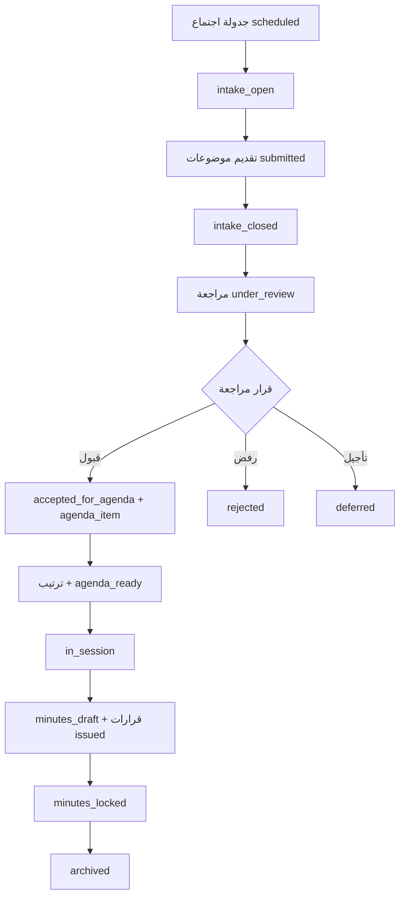

# COUNCILS-MEETINGS-AGENDA-MINUTES-DECISIONS-DESIGN-01 — تقرير تحليل وتصميم

**التاريخ:** 2026-07-05  
**النطاق:** تحليل وتصميم فقط — **لم يُنفَّذ أي** migration / DB / RLS / UI / server functions / data writes.  
**القرار:** **PASS** (مع فجوات RLS/helpers وتحسينات schema اختيارية لاحقة)

**التوصية التالية:** **READY_FOR_COUNCILS_MEETINGS_FOUNDATION_PLANNING**

> ملاحظة: الجداول الأساسية **موجودة** منذ `COUNCILS-MVP-DB-APPLY-01`. المراحل اللاحقة تركز على **RLS/helpers + functions + UI** أكثر من إنشاء جداول جديدة. بعض التحسينات schema **موصى بها** وليست حاجزاً لـ MVP التشغيلي الأول.

---

## تأكيد النطاق (لم يُنفَّذ)

| العنصر | الحالة |
|--------|--------|
| migrations / DB / RLS | ❌ |
| Storage / UI / functions / routes | ❌ |
| seed / اجتماعات / موضوعات / محاضر / قرارات | ❌ |
| service role / data writes | ❌ |

**المخرج الوحيد:** هذا التقرير.

---

## 1. الجداول التي تم فحصها

| الجدول الفعلي | ملاحظة |
|---------------|--------|
| `academic_councils` | مجلس الكلية + مجالس الأقسام |
| `academic_council_members` | *(ليس `academic_council_memberships`)* |
| `academic_council_meetings` | الاجتماعات |
| `academic_council_topics` | الموضوعات |
| `academic_council_agenda_items` | جدول الأعمال |
| `academic_council_minutes` | المحاضر |
| `academic_council_decisions` | القرارات |
| `academic_council_topic_attachments` | مرفقات (خارج نطاق هذه الدورة لكن مرتبطة بالموضوعات) |

**مصادر:** `supabase/migrations/20260703192337_...sql`، `20260704200326_...sql` (توسيع topics/meetings SELECT)، `src/integrations/supabase/types.ts`، `admin-councils.functions.ts`، `faculty-councils.functions.ts`، واجهتا admin/faculty.

---

## 2. هل schema الحالي يدعم كل كيان؟

| الكيان | يدعم؟ | التقييم |
|--------|-------|---------|
| **الاجتماعات** | ✅ **نعم — جوهرياً** | جدول كامل + enum حالة + نافذة استقبال |
| **جدول الأعمال** | ✅ **نعم — MVP** | `academic_council_agenda_items` موجود؛ حقول إضافية اختيارية |
| **المحاضر** | ✅ **نعم — MVP** | سجل واحد/اجتماع + `is_locked`؛ لا enum حالة منفصل |
| **القرارات** | ✅ **نعم — MVP** | قرار/اجتماع + متابعة تنفيذ؛ لا دورة نشر منفصلة بالكامل |

**الخلاصة:** **لا حاجة لجداول جديدة لبدء MVP التشغيلي.** قد نحتاج **تعديلات schema خفيفة** (helpers + أعمدة اختيارية + توحيد enums) في مراحل لاحقة — انظر §12.

---

## 3. جدولة الاجتماعات

### 3.1 الحقول المتوفرة — `academic_council_meetings`

| الحقل | موجود | ملاحظة |
|-------|--------|--------|
| `council_id` | ✅ | ربط بالمجلس (كلية/قسم) |
| `title` | ✅ | عنوان الاجتماع |
| `scheduled_at` | ✅ | الموعد (بدل `meeting_date`) |
| `location` | ✅ | |
| `status` | ✅ | enum دورة الحياة |
| `created_by` / `updated_by` | ✅ | |
| `intake_opens_at` / `intake_closes_at` | ✅ | نافذة استقبال الموضوعات |
| `notes` | ✅ | |
| `meeting_number` | ✅ | ترقيم داخل المجلس/سنة |
| `academic_year_id` | ✅ | اختياري |
| حقول محضر داخل الاجتماع | ❌ | المحضر في جدول `academic_council_minutes` منفصل |

**حالات الاجتماع (`academic_council_meeting_status`):**
`scheduled` → `intake_open` → `intake_closed` → `agenda_ready` → `in_session` → `minutes_draft` → `minutes_locked` → `archived` | `cancelled`

### 3.2 صلاحيات الجدولة — المطلوب vs الحالي

| الدور | المطلوب (من المواصفة) | RLS الحالي (`meetings_insert/update`) | الفجوة |
|-----|----------------------|----------------------------------------|--------|
| **admin / system_admin** | جدولة أي مجلس | ✅ `is_council_admin` ضمن `can_write_council_agenda` | — |
| **chair** (رئيس مجلس الكلية/القسم) | جدولة مجلسه فقط | ✅ `has_council_role(..., chair)` ضمن `can_write_council_agenda` | يحتاج تقييد **per council_id** في التطبيق |
| **secretary** | **لا يجدول** (MVP) | ⚠️ **يستطيع حالياً** عبر `can_write_council_agenda` | **فجوة RLS** — يحتاج helper منفصل |
| **member / viewer** | لا جدولة | ❌ | — |

**تصميم مقترح لاحقاً (`COUNCILS-MEETINGS-RLS-HELPERS-01`):**

```sql
can_schedule_council_meeting(_user, _council)
  := is_council_admin(_user)
     OR has_council_role(_user, _council, 'chair')

can_operate_council_meeting(_user, _council)
  := can_schedule_council_meeting(...)
     OR has_council_role(_user, _council, 'secretary')
```

- **INSERT/UPDATE اجتماع (إنشاء/جدولة):** `can_schedule_council_meeting`
- **فتح استقبال / أجندة / محضر / قرارات:** `can_operate_council_meeting` أو `can_write_council_agenda` (كما هو)

### 3.3 مجلس الكلية vs مجلس القسم

| النوع | `council_type` | من يجدول |
|-------|----------------|----------|
| مجلس الكلية | `college`, `department_id IS NULL` | admin **أو** `chair` **في ذلك** `council_id` |
| مجلس القسم | `department`, `department_id` معيّن | admin **أو** `chair` **في ذلك** `council_id` فقط |

**عزل المجالس:** كل صلاحية تُقيَّد بـ `council_id` عبر عضوية `academic_council_members` — رئيس قسم IT **لا** يدير مجلس قسم CS إلا إذا رُبط هناك بدور `chair`.

**dean:** غير مدرج في `is_council_admin` — يرى/يدير فقط المجالس التي رُبط بها كعضو (سلوك قائم).

---

## 4. استقبال الموضوعات

### 4.1 النموذج الحالي

- العضو يقدّم عبر faculty: `submitCouncilTopic` → `status=submitted`, **`meeting_id=null`** (موضوع على مستوى المجلس أولاً).
- مرفقات اختيارية مرتبطة بـ `topic_id` + `council_id`.

### 4.2 دورة الاستقبال المقترحة

```
[مجلس + اجتماع مجدول]
     │
     ▼
meetings.status = intake_open
+ intake_opens_at / intake_closes_at (اختياري)
     │
     ▼
أعضاء (غير viewer) يقدّمون موضوعات → topics.status = submitted
     │
     ▼
meetings.status = intake_closed  (إغلاق يدوي أو تلقائي عند closes_at)
     │
     ▼
مراجعة chair/secretary/admin → under_review | needs_completion | rejected | deferred
     │
     ▼
accepted_for_agenda + ربط meeting_id + إدراج agenda_item
```

| سؤال | قرار التصميم |
|------|--------------|
| هل الاستقبال حسب الاجتماع؟ | **نعم تشغيلياً** — يُفتح لاجتماع محدد؛ الموضوع يُربط بـ `meeting_id` عند القبول أو عند التقديم إن كان الاستقبال مفتوحاً لذلك الاجتماع |
| موضوع على مستوى المجلس أولاً؟ | **مدعوم حالياً** (`meeting_id null`) — مناسب لـ MVP؛ عند القبول يُعيَّن `meeting_id` |
| إغلاق الاستقبال قبل الاجتماع؟ | ✅ عبر `intake_closed` + `intake_closes_at` |
| هل schema يكفي؟ | ✅ **نعم** — قد نضيف لاحقاً قيداً: لا تقديم موضوع جديد إلا إذا `intake_open` لاجتماع نشط (طبقة تطبيق + helper) |

### 4.3 حالات الموضوع

**في DB (`academic_council_topic_status`):**
`draft`, `submitted`, `under_review`, `needs_completion`, `accepted_for_agenda`, `deferred`, `rejected`, `decided`, `closed`

| حالة في المواصفة | في DB؟ | ملاحظة |
|------------------|--------|--------|
| `submitted` | ✅ | |
| `under_review` | ✅ | |
| `needs_completion` | ✅ | |
| `accepted_for_agenda` | ✅ | |
| `rejected` | ✅ | |
| `added_to_agenda` | ❌ | **لا enum** — يُشتق من وجود صف في `academic_council_agenda_items` أو نضيف قيمة لاحقاً |
| `archived` | ⚠️ | للموضوع: `closed`؛ للاجتماع: `archived` |

**تحديث الموضوع:** `can_write_council_agenda` يستطيع تغيير الحالة؛ المالك يعدّل في `draft` / `needs_completion` / `submitted` فقط.

---

## 5. مراجعة الموضوعات

| الدور | المراجعة | الآلية المقترحة |
|-----|----------|-----------------|
| admin / system_admin | كل المجالس | `is_council_admin` + UPDATE topic |
| chair | مجلسه فقط | `can_write_council_agenda` + نفس `council_id` |
| secretary | تحضير/فرز | `can_write_council_agenda` — مراجعة تشغيلية دون اعتماد نهائي إن رُغب (سياسة UI) |
| member | مواضيعه فقط | SELECT + متابعة `status` / `review_note` |
| viewer | قراءة | SELECT فقط حسب RLS |

**faculty الحالي:** يعرض `mySubmittedTopics` + `councilVisibleTopics` — لا لوحة مراجعة admin بعد.

---

## 6. جدول الأعمال — `academic_council_agenda_items`

### 6.1 الحقول المتوفرة

| الحقل | موجود |
|-------|--------|
| `meeting_id` | ✅ |
| `topic_id` | ✅ (اختياري — بند بدون موضوع ممكن نظرياً) |
| `order_index` | ✅ UNIQUE per meeting |
| `title` | ✅ |
| `notes` | ✅ |
| `is_approved` / `approved_by` / `approved_at` | ✅ |
| `created_by` / `updated_by` | ✅ |

### 6.2 غير موجود (اختياري لاحقاً)

| حقل مقترح | أولوية |
|-----------|--------|
| `presenter_id` | متوسطة |
| `estimated_minutes` | منخفضة |
| `status` (بند) | منخفضة — يمكن الاعتماد على `is_approved` |

### 6.3 Workflow جدول الأعمال

```
1. قبول موضوع → status = accepted_for_agenda
2. INSERT agenda_item (meeting_id, topic_id, order_index, title من الموضوع)
3. ترتيب البنود → UPDATE order_index (ضمن can_write_council_agenda)
4. اعتماد الأجندة → is_approved=true على البنود + meetings.status = agenda_ready
5. عرض للأعضاء → faculty: جدول أعمال الاجتماع عند agenda_ready أو أسبق
```

**هل يكفي schema؟** ✅ **نعم لـ MVP** — تحسينات أعمدة اختيارية في `COUNCILS-AGENDA-SCHEMA-ENHANCE-01` إن لزم.

---

## 7. المحاضر — `academic_council_minutes`

### 7.1 الحقول المتوفرة

| الحقل | موجود |
|-------|--------|
| `meeting_id` | ✅ UNIQUE (محضر واحد/اجتماع) |
| `body` | ✅ (= minutes_text) |
| `drafted_by` | ✅ (= prepared_by) |
| `approved_by` | ✅ |
| `is_locked` / `locked_at` | ✅ |
| `reviewed_by` | ❌ |
| `status` enum | ❌ — يُستنتج من `is_locked` + `meeting.status` |
| مرفقات محضر | ❌ (لاحقاً — bucket منفصل) |

### 7.2 حالات المحضر — mapping مقترح

| حالة مقترحة | التمثيل في MVP |
|-------------|----------------|
| `draft` | `is_locked=false`, `meeting.status=minutes_draft` |
| `under_review` | `is_locked=false`, chair يحدّث `approved_by` null |
| `approved` | `is_locked=true`, `approved_by` معيّن |
| `archived` | `meeting.status=archived` |

### 7.3 صلاحيات المحضر (RLS الحالي)

| العملية | من |
|---------|-----|
| INSERT | secretary أو admin (عبر `minutes_insert_secretary`) |
| UPDATE قبل القفل | secretary أو admin |
| بعد `is_locked=true` | trigger يمنع التعديل |
| SELECT | admin أو عضو المجلس |
| اعتماد/قفل | **تطبيق:** chair يضبط `approved_by` + `is_locked=true` (قد يحتاج policy توسيع لـ chair في مرحلة RLS) |

**فجوة:** اعتماد chair على المحضر قد يتطلب توسيع `minutes_update` ليشمل `can_manage_council` (chair) وليس secretary فقط.

---

## 8. القرارات — `academic_council_decisions`

### 8.1 الحقول المتوفرة

| الحقل | موجود |
|-------|--------|
| `meeting_id` | ✅ |
| `topic_id` | ✅ اختياري |
| `decision_number` | ✅ UNIQUE per meeting |
| `title` / `body` | ✅ |
| `status` | ✅ enum تنفيذي |
| `responsible_user_id` / `due_date` / `execution_note` | ✅ متابعة |
| `created_by` / `updated_by` | ✅ |
| `council_id` | ❌ — يُشتق من `meeting.council_id` |
| `visibility` | ❌ |
| `issued_at` / `approved_by` | ❌ — يمكن استخدام `created_at` |

### 8.2 حالات القرار — mapping

**في DB:** `issued`, `assigned`, `in_progress`, `partially_completed`, `completed`, `delayed`, `cancelled`

| حالة مقترحة | mapping MVP |
|-------------|-------------|
| `draft` | إنشاء داخلي قبل `issued` — أو status `issued` مع `meeting` لم يُقفل بعد |
| `approved` | اعتماد chair عند `minutes_locked` |
| `published` | `issued` + اجتماع `archived` أو `minutes_locked` |
| `archived` | `completed`/`cancelled` + أرشيف اجتماع |

### 8.3 صلاحيات (RLS الحالي)

- INSERT/UPDATE: `can_write_council_agenda` (chair, secretary, admin)
- SELECT: admin، عضو المجلس، أو `responsible_user_id`

---

## 9. مصفوفة الصلاحيات المقترحة (MVP)

رموز: ✅ مسموح · 👁 قراءة · ❌ ممنوع · ⚙️ عبر admin فقط

| القدرة | admin | dean* | chair | secretary | member | viewer |
|--------|-------|-------|-------|-----------|--------|--------|
| جدولة اجتماع | ✅ | 👁† | ✅‡ | ❌ | ❌ | ❌ |
| فتح/إغلاق استقبال موضوعات | ✅ | 👁† | ✅‡ | ✅‡ | ❌ | ❌ |
| مراجعة/قبول/رفض موضوع | ✅ | 👁† | ✅‡ | ✅‡ | ❌ | 👁 |
| إضافة لجدول الأعمال | ✅ | 👁† | ✅‡ | ✅‡ | ❌ | ❌ |
| ترتيب جدول الأعمال | ✅ | 👁† | ✅‡ | ✅‡ | ❌ | 👁 |
| اعتماد جدول الأعمال | ✅ | 👁† | ✅‡ | ⚙️ | ❌ | 👁 |
| عقد الاجتماع (in_session) | ✅ | 👁† | ✅‡ | ✅‡ | 👁 | 👁 |
| تحرير محضر | ✅ | 👁† | 👁‡ | ✅‡ | ❌ | ❌ |
| اعتماد/قفل محضر | ✅ | 👁† | ✅‡ | ❌ | ❌ | ❌ |
| إنشاء قرار | ✅ | 👁† | ✅‡ | ✅‡ | ❌ | ❌ |
| اعتماد/نشر قرار | ✅ | 👁† | ✅‡ | ⚙️ | ❌ | 👁 |
| متابعة تنفيذ قرار | ✅ | 👁† | ✅‡ | ✅‡ | 👁§ | 👁 |
| قراءة الأرشيف | ✅ | 👁† | ✅‡ | ✅‡ | 👁‡ | 👁‡ |
| تقديم موضوع | ✅ | 👁† | ✅‡ | ✅‡ | ✅‡ | ❌ |

\* dean: فقط إن رُبط بعضوية المجلس — ليس admin تلقائياً.  
† ضمن المجالس المربوطة فقط.  
‡ ضمن `council_id` الخاص بذلك المجلس فقط.  
§ member: قراءة قرارات مجلسه؛ مسؤول التنفيذ إن عُيِّن `responsible_user_id`.

---

## 10. دورة العمل الكاملة (مخطط)



**نفس المسار** لمجلس الكلية ومجالس الأقسام — الفرق **فقط** في `council_id` وصلاحيات `chair` المعزولة per council.

---

## 11. الواجهة المقترحة

### 11.1 `/admin/academic-councils`

**الوضع الحالي:** عضويات فعّالة + KPIs + `LockedAction` لباقي العمليات.

**تصميم مقترح (تبويبات أو أقسام بعد اختيار مجلس):**

| قسم | المحتوى |
|-----|---------|
| **العضويات** | موجود — بحث، ربط، تعطيل |
| **الاجتماعات** | قائمة + إنشاء/تعديل + فتح/إغلاق استقبال + انتقال الحالة |
| **الموضوعات المقدمة** | طابور مراجعة + قبول/رفض/طلب استكمال |
| **جدول الأعمال** | بنود اجتماع محدد + سحب/إفلات ترتيب + اعتماد |
| **المحاضر** | محرر نص + قفل/اعتماد |
| **القرارات** | إنشاء + إسناد مسؤول + متابعة تنفيذ |
| **الأرشيف** | اجتماعات/محاضر/قرارات `archived` |

### 11.2 `/faculty-portal/academic-councils`

**الوضع الحالي:** عضويات، اجتماعات، مواضيع + مرفقات، تقديم موضوع.

**إضافات مقترحة:**

| قسم | المحتوى |
|-----|---------|
| **اجتماعاتي القادمة** | موجود — توسيع: شارة `intake_open` |
| **جدول أعمال الاجتماع** | قراءة `agenda_items` لاجتماع قادم عند `agenda_ready+` |
| **مواضيعي** | موجود + مرفقات |
| **محاضر المجالس** | قراءة `minutes.body` بعد `is_locked` أو حسب سياسة |
| **قرارات المجالس** | قراءة قرارات مجلس العضو |
| **الأرشيف** | اجتماعات/موضوعات ضمن فترة العضوية (RLS موجود جزئياً) |

---

## 12. فجوات schema / RLS الموصى بها لاحقاً

| # | الفجوة | أولوية | مرحلة مقترحة |
|---|--------|--------|--------------|
| G-01 | فصل `can_schedule_council_meeting` عن secretary | **عالية** | MEETINGS-RLS-HELPERS-01 |
| G-02 | chair يعتمد المحضر (`minutes_update`) | عالية | MINUTES-RLS-01 |
| G-03 | helper: هل الاستقبال مفتوح لاجتماع؟ | متوسطة | MEETINGS-RLS-HELPERS-01 |
| G-04 | `added_to_agenda` كحالة أو مشتق | منخفضة | AGENDA-optional |
| G-05 | `presenter_id`, `estimated_minutes` على الأجندة | منخفضة | AGENDA-SCHEMA-ENHANCE |
| G-06 | `reviewed_by` / `status` على المحضر | منخفضة | MINUTES-SCHEMA-ENHANCE |
| G-07 | `council_id` مكرر على القرارات (أداء RLS) | منخفضة | DECISIONS-optional |
| G-08 | event log انتقالات الحالة | متوسطة | لاحقاً — اختياري |

**لا NO-GO:** الفجوات قابلة للمعالجة تدريجياً دون إعادة بناء الجداول.

---

## 13. المراحل التنفيذية المقترحة (مُبسَّطة)

بما أن **معظم الجداول موجودة**، يُفضَّل تجميع المراحل:

| # | المرحلة | النطاق |
|---|---------|--------|
| 1 | **COUNCILS-MEETINGS-RLS-HELPERS-01** | `can_schedule_council_meeting`, فصل secretary عن الجدولة، توسيع minutes لـ chair |
| 2 | **COUNCILS-MEETINGS-ADMIN-FUNCTIONS-01** | جدولة، فتح/إغلاق استقبال، انتقال حالة اجتماع |
| 3 | **COUNCILS-TOPICS-REVIEW-ADMIN-FUNCTIONS-01** | مراجعة موضوع، قبول/رفض، ربط `meeting_id` |
| 4 | **COUNCILS-AGENDA-FUNCTIONS-01** | CRUD أجندة، ترتيب، اعتماد |
| 5 | **COUNCILS-MINUTES-FUNCTIONS-01** | محضر: إنشاء، تحرير، قفل |
| 6 | **COUNCILS-DECISIONS-FUNCTIONS-01** | قرارات + متابعة تنفيذ |
| 7 | **COUNCILS-MEETINGS-ADMIN-UI-01** | تفعيل أقسام admin (إزالة LockedAction تدريجياً) |
| 8 | **COUNCILS-MEETINGS-FACULTY-UI-01** | أجندة، محاضر، قرارات، أرشيف في faculty |
| 9 | **COUNCILS-MEETINGS-ARCHIVE-NOTIFY-01** | تنبيهات in-app (بريد لاحقاً) |

**اختياري schema فقط إن طُلب:** `COUNCILS-AGENDA-SCHEMA-ENHANCE-01`, `COUNCILS-MINUTES-SCHEMA-ENHANCE-01`.

---

## 14. المخاطر

| # | المخاطرة | التخفيف |
|---|----------|---------|
| R-01 | secretary يجدول اجتماعات اليوم عبر RLS | G-01 فوراً في أول مرحلة RLS |
| R-02 | موضوع بدون `meeting_id` يبقى يتيماً | workflow مراجعة يُلزم الربط عند القبول |
| R-03 | ترتيب أجندة متعارض | UNIQUE `(meeting_id, order_index)` + transaction في functions |
| R-04 | محضر يُقفل قبل اعتماد chair | UI + policy: فقط chair/admin يضبط `is_locked` |
| R-05 | قرار يُنشر قبل قفل المحضر | قاعدة تطبيق: لا `issued` رسمي قبل `minutes_locked` |
| R-06 | تسريب بين مجالس الأقسام | عزل `council_id` في كل policy (موجود) |
| R-07 | dean بدون عضوية لا يرى شيئاً | توثيق + ربط عضوية إن لزم |

---

## 15. الوضع التطبيقي الحالي

| القدرة | DB | RLS | Functions | Admin UI | Faculty UI |
|--------|-----|-----|-----------|----------|------------|
| جدولة اجتماع | ✅ | ⚠️ secretary | ❌ | Locked | عرض فقط |
| استقبال موضوعات | ✅ | جزئي | ✅ submit | Locked | ✅ |
| مراجعة موضوعات | ✅ | ✅ UPDATE | ❌ | Locked | — |
| جدول أعمال | ✅ | ✅ | ❌ | KPI فقط | — |
| محضر | ✅ | ✅ | ❌ | Locked | ملخص نصي فقط |
| قرارات | ✅ | ✅ | ❌ | KPI | — |
| مرفقات موضوع | ✅ | ✅ | ✅ | — | ✅ |

---

## 16. الخلاصة والتوصية

| البند | القرار |
|-------|--------|
| **القرار** | **PASS** |
| **Schema اجتماعات** | ✅ يدعم |
| **Schema أجندة** | ✅ يدعم MVP |
| **Schema محاضر** | ✅ يدعم MVP (تحسينات اختيارية) |
| **Schema قرارات** | ✅ يدعم MVP + متابعة تنفيذ |
| **جدولة مجلس الكلية** | admin + chair في `council_id` الكلية — **بعد G-01** |
| **جدولة مجلس القسم** | admin + chair في `council_id` القسم فقط — **بعد G-01** |
| **التوصية** | **READY_FOR_COUNCILS_MEETINGS_FOUNDATION_PLANNING** |

الخطوة الأولى الموصى بها: **COUNCILS-MEETINGS-RLS-HELPERS-01** ثم دوال الاجتماعات والمراجعة في admin.

---

*نهاية التقرير — COUNCILS-MEETINGS-AGENDA-MINUTES-DECISIONS-DESIGN-01*
