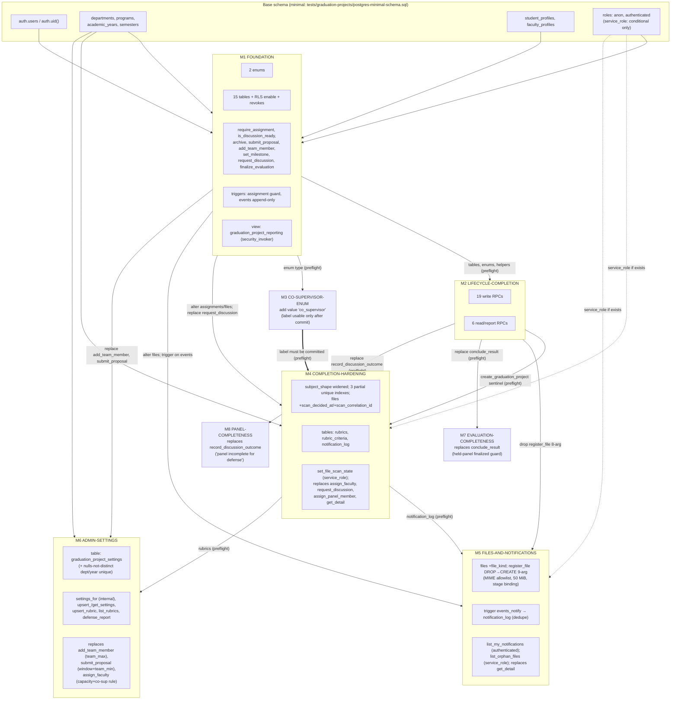

# GRADUATION-PROJECTS M1–M8 — OBJECT INVENTORY & DEPENDENCY GRAPH (AUDIT-05)

Independent audit artifact. Source of truth: the 8 NOT_APPLIED drafts under
`docs/migration-drafts/GRADUATION-PROJECTS-M1-…-M8-….NOT_APPLIED.sql`
(k3 timestamps 20260730100000..20260730100007) and the minimal base schema
`tests/graduation-projects/postgres-minimal-schema.sql`. All 8 drafts are
`begin; … DO $$ preflight $$ … commit;` units; none has been applied anywhere
(MIGRATIONS_APPLIED=0).

## 1. Base schema dependencies

`auth.users(id)`, `auth.uid()` (reads `request.jwt.claim.sub`),
`public.departments`, `public.programs`, `public.academic_years`,
`public.semesters`, `public.student_profiles(id,user_id,department_id)`,
`public.faculty_profiles(id,user_id,department_id)`, roles `anon` and
`authenticated`, `gen_random_uuid()`. `service_role` is referenced only
conditionally (`DO` blocks in M4/M5 grant EXECUTE to it only if the role
exists) and is not required to exist.

## 2. Object inventory per migration

### M1 — FOUNDATION (20260730100000)

- Preflight: raises `graduation projects foundation already exists; refuse ambiguous retry` if `to_regclass('public.graduation_projects') is not null`.
- Enums (2): `graduation_project_state` (14 labels: draft, submitted, under_review, revision_required, approved, active, discussion_requested, discussion_scheduled, evaluating, corrections_required, completed, archived, rejected, cancelled); `graduation_project_assignment_role` (6 labels: student, supervisor, coordinator, department_head, dean, panel_member).
- Tables (15, all `public`, all RLS-enabled, zero policies):
  1. `graduation_projects` — pk id; FK department_id→departments(restrict); nullable FKs program_id/academic_year_id/semester_id; proposal_title check 3..300; state enum default draft; progress_percent 0..100; version bigint default 1; unique(id, department_id).
  2. `graduation_project_assignments` — role enum; student_profile_id XOR faculty_profile_id (check `assignment_subject_shape`); user_id→auth.users; department_id→departments; generated stored `processing_unit_id = department_id`, `processing_role = role`; check `assignment_interval` (active ⇔ ended_at null); composite FK (project_id, department_id)→projects(id, department_id); unique(id, project_id).
  3. `graduation_project_approvals` — stage text; decision in (approved, rejected, revision_required); FK (assignment_id, project_id); unique(project_id, stage, assignment_id).
  4. `graduation_project_milestones` — milestone_kind in (progress, final); status in (pending, in_progress, submitted, accepted, late); unique(project_id, sequence_no); unique(id, project_id).
  5. `graduation_project_submissions` — version_no>0; state in (submitted, accepted, revision_required, superseded); composite FKs to milestones and assignments; unique(milestone_id, version_no); unique(id, project_id).
  6. `graduation_project_supervisor_notes` — composite FKs to submissions and assignments.
  7. `graduation_project_files` — object_key unique, check `not like 'http%' and not like '%..%'`; media_type; byte_size>0; sha256 regex `^[0-9a-f]{64}$`; scan_state in (pending, clean, quarantined, rejected) default pending; composite FKs to submissions/assignments; unique(id, project_id).
  8. `graduation_project_discussion_requests` — state in (pending, approved, rejected, cancelled); composite FK to assignments; unique(id, project_id).
  9. `graduation_project_discussions` — request_id unique; state in (scheduled, held, postponed, cancelled); composite FKs to requests/assignments; unique(id, project_id).
  10. `graduation_project_panel_members` — chair bool; conflict_declared bool; composite FKs to discussions/assignments; unique(discussion_id, assignment_id); unique(id, discussion_id, project_id).
  11. `graduation_project_evaluations` — state in (draft, submitted, finalized); composite FKs to discussions/panel_members; unique(discussion_id, panel_member_id).
  12. `graduation_project_evaluation_scores` — FK evaluation_id; maximum_score>0; awarded 0..maximum; unique(evaluation_id, criterion_code).
  13. `graduation_project_corrections` — composite FK to assignments; completed_at/accepted_at.
  14. `graduation_project_final_archives` — project_id unique; correlation_id unique; composite FKs to files/assignments.
  15. `graduation_project_events` — identity bigint pk; actor_user_id→auth.users; composite FK (actor_assignment_id, project_id); unique(project_id, correlation_id, event_type); payload jsonb default '{}'.
- Indexes (1): `graduation_project_active_assignment` unique partial on assignments(project_id, role, user_id) where active.
- Triggers (2): `guard_graduation_project_assignment` (BEFORE INSERT/UPDATE on assignments; raises `assignment identity/department mismatch` when profile user/department ≠ row); `graduation_project_events_append_only` (BEFORE UPDATE/DELETE on events; raises `graduation project events are append-only`).
- Functions (10): trigger fns `guard_graduation_project_assignment()` (SECURITY INVOKER), `reject_graduation_project_event_mutation()`; predicate `graduation_project_is_discussion_ready(uuid)` (sql stable invoker, search_path pinned); RPCs all SECURITY DEFINER + `set search_path=public,pg_temp`: `archive_graduation_project(uuid,uuid,bigint,uuid)`, `require_graduation_project_assignment(uuid,role[])` (internal), `submit_graduation_project_proposal(uuid,bigint,uuid)`, `add_graduation_project_team_member(uuid,uuid,uuid,uuid)`, `set_graduation_project_milestone(uuid,text,text,integer,numeric,uuid)`, `request_graduation_project_discussion(uuid,uuid)`, `finalize_graduation_project_evaluation(uuid,uuid)`.
  (The manifest's "M1: +7 functions" counts only the 7 RPCs; the file actually creates 10.)
- View (1): `graduation_project_reporting with (security_invoker=true)` — supervisor_count, overdue_milestones, discussion_ready per project.
- Grants: `revoke all` on all 15 tables from `anon, authenticated`; each RPC `revoke … from public, anon` + `grant execute … to authenticated`; internal helpers (`require_graduation_project_assignment`, `graduation_project_is_discussion_ready`) and the view revoked from `public, anon, authenticated` with no grant. Trigger functions carry no grant statements.
- Storage: none (comment explicitly defers bucket creation to a later separately authorized draft).
- Audit: `graduation_project_events` (append-only by trigger). No notification objects.

### M2 — LIFECYCLE-COMPLETION (20260730100001)

- Preflight: foundation missing → `graduation projects foundation missing; apply reviewed foundation first`; already applied (sentinel `create_graduation_project(uuid,text,text,uuid,uuid,uuid,uuid)`) → `graduation projects lifecycle completion already exists; refuse ambiguous retry`.
- No tables/indexes/triggers/RLS. 25 functions, all plpgsql SECURITY DEFINER with pinned search_path; every write RPC locks the project row `for update`, resolves the actor through `require_graduation_project_assignment`, replays via `(project_id, correlation_id, event_type)` in the events log, validates state/version, mutates, appends an event.
- Write RPCs (19): `create_graduation_project(uuid,text,text,uuid,uuid,uuid,uuid)` (delegated creation; caller holds coordinator/department_head assignment on a same-department project), `review_graduation_project_proposal(uuid,text,text,bigint,uuid)` (literal actions start_review/approve/reject/require_revision), `resubmit_graduation_project_proposal(uuid,bigint,uuid)`, `activate_graduation_project(uuid,bigint,uuid)`, `assign_graduation_project_faculty(uuid,text,uuid,uuid,uuid)`, `end_graduation_project_assignment(uuid,uuid,uuid)` (cannot end own), `submit_graduation_project_deliverable(uuid,uuid,text,uuid)`, `review_graduation_project_submission(uuid,uuid,text,text,uuid)` (accept/require_revision; recomputes progress_percent/at_risk), `add_graduation_project_supervisor_note(uuid,uuid,text,uuid)`, `resolve_graduation_project_supervisor_note(uuid,uuid,uuid)`, `register_graduation_project_file(uuid,uuid,text,text,text,bigint,text,uuid)` (8-arg; key scope `graduation-projects/<project_id>/%`), `schedule_graduation_project_discussion(uuid,uuid,timestamptz,text,uuid)`, `reject_graduation_project_discussion_request(uuid,uuid,text,uuid)`, `assign_graduation_project_panel_member(uuid,uuid,uuid,boolean,uuid)`, `record_graduation_project_discussion_outcome(uuid,uuid,text,uuid)` (held/postponed/cancelled), `save_graduation_project_evaluation(uuid,uuid,text,jsonb,text,boolean,uuid)` (allowlisted DELETE of draft evaluation_scores rows only), `conclude_graduation_project_result(uuid,text,jsonb,bigint,uuid)`, `complete_graduation_project_correction(uuid,uuid,uuid)`, `accept_graduation_project_correction(uuid,uuid,uuid)`.
- Read RPCs (6): `list_my_graduation_projects()`, `get_graduation_project_detail(uuid)` (jsonb; scan-gated object_key; role-scoped evaluations), `get_graduation_project_states_report(uuid)`, `get_graduation_project_assignments_report(uuid)`, `get_graduation_project_evaluations_report(uuid)`, `get_graduation_project_archive_report(uuid)` (department authority: active coordinator/department_head/dean assignment on any project of the department).
- Grants: each of the 25 `revoke … from public, anon` + `grant execute … to authenticated`. No table grants.

### M3 — CO-SUPERVISOR-ENUM (20260730100002)

- Preflight: enum type missing → foundation message; label present → `co_supervisor enum value already exists; refuse ambiguous retry`.
- Single statement: `alter type public.graduation_project_assignment_role add value 'co_supervisor';`
- Isolated because PostgreSQL forbids using a newly added enum label inside its own transaction; M4 uses the label immediately, so M3 must commit first.

### M4 — COMPLETION-HARDENING (20260730100003)

- Preflight: `create_graduation_project` sentinel missing → lifecycle message; `co_supervisor` label missing → `co_supervisor enum value missing; apply the enum migration first`; rubrics table present → `graduation projects hardening already exists; refuse ambiguous retry`.
- Constraint replacement: `assignment_subject_shape` dropped/re-added, faculty-side roles widened with `co_supervisor`.
- Partial unique indexes (3): `graduation_project_single_active_supervisor` on assignments(project_id, role) where active and role in (supervisor, co_supervisor); `graduation_project_single_pending_discussion_request` on discussion_requests(project_id) where state='pending'; `graduation_project_single_panel_chair` on panel_members(discussion_id) where chair.
- Columns (2): files `+scan_decided_at timestamptz`, `+scan_correlation_id uuid` (nullable, no defaults).
- CREATE OR REPLACE (4, signatures/grants unchanged): `assign_graduation_project_faculty` (+co_supervisor whitelist, +slot guard `project supervisor slot already filled`), `request_graduation_project_discussion` (+`discussion request already pending`, checked after readiness — M1 message precedence preserved), `assign_graduation_project_panel_member` (+`panel chair already assigned`), `get_graduation_project_detail` (+co_supervisor read whitelist, files payload +scan_decided_at).
- New function (1): `set_graduation_project_file_scan_state(uuid,text,uuid)` SECURITY DEFINER — one-way pending→clean|quarantined|rejected; same-state replay no-ops; conflicting re-decision raises `file scan state already decided`. Revoked from public/anon/authenticated; conditional grant to service_role only if that role exists.
- Tables (3, all RLS-enabled, zero policies, revoked from anon/authenticated):
  1. `graduation_project_rubrics` — unique(department_id, code, version_label); unique(id, department_id); passing_threshold null-or->0.
  2. `graduation_project_rubric_criteria` — composite FK (rubric_id, department_id); unique(rubric_id, criterion_code); unique(rubric_id, sequence_no); maximum_score>0; weight>0.
  3. `graduation_project_notification_log` — identity pk; FK project_id; recipient_user_id→auth.users; dedupe key unique(project_id, recipient_user_id, notification_type, entity_id).

### M5 — FILES-AND-NOTIFICATIONS (20260730100004)

- Preflight: notification_log missing → hardening message; `list_my_graduation_project_notifications()` present → `graduation projects files/notifications package already exists; refuse ambiguous retry`.
- Column (1): files `+file_kind text not null default 'attachment'` check in (attachment, proposal, milestone_submission, supervisor_feedback, final_manuscript, presentation, source_archive, defense_minutes, correction_version, archived_final).
- DROP + CREATE (only signature change in the package): 8-arg `register_graduation_project_file` dropped; recreated with 9th arg `p_file_kind text default 'attachment'` (8-arg calls keep working). Adds MIME allowlist (pdf, zip, x-zip-compressed, png, jpeg, text/plain, docx, pptx → `file media type not allowed`), 50 MiB cap (`file size exceeds limit`), kind validation, stage binding (`milestone_submission`/`supervisor_feedback` require a submission; `final_manuscript` requires a final-milestone submission), event payload gains file_kind. Grants explicitly revoked/re-granted on the new 9-arg identity.
- CREATE OR REPLACE (1): `get_graduation_project_detail` — files payload gains file_kind.
- New functions (3):
  - `graduation_project_notify_from_event()` trigger fn SECURITY DEFINER — fans events out to notification_log with `on conflict do nothing` (dedupe via M4 key); recipients are active direct assignments of the same project; actor never notified; payload = type + entity ids only.
  - `list_my_graduation_project_notifications()` sql stable definer — `where recipient_user_id = auth.uid()`, limit 100; revoke public/anon + grant authenticated.
  - `list_graduation_project_orphan_files()` sql stable definer — review-only (scan_pending_expired >30d, unlinked_terminal); revoked from public/anon/authenticated; conditional service_role grant.
- Trigger (1): `graduation_project_events_notify` AFTER INSERT on graduation_project_events.

### M6 — ADMIN-SETTINGS (20260730100005)

- Preflight: rubrics missing → hardening message; settings table present → `graduation projects admin settings package already exists; refuse ambiguous retry`.
- Table (1): `graduation_project_settings` — department_id FK, nullable academic_year_id FK, team_min/team_max (check team_max>=team_min), supervisor_capacity, co_supervisor_allowed, correction_window_days, defense_notice_days, proposal_window_opens_at/closes_at (check closes>opens), active, updated_by→auth.users; RLS enabled, zero policies, revoked from anon/authenticated.
- Index (1): `graduation_project_settings_department_year` unique on (department_id, academic_year_id) `nulls not distinct`.
- Functions (6 new): `graduation_project_settings_for(uuid,uuid)` (sql stable invoker, internal — revoked from all; year-specific row wins); `upsert_graduation_project_settings(…)` (department_head/dean of the department; `settings invalid` on bad input; NOTE: accepts p_correlation_id but writes no event row — settings changes are not event-audited); `get_graduation_project_settings(uuid)` jsonb (coordinator/department_head/dean); `upsert_graduation_project_rubric(…)` (department_head/dean; allowlisted DELETE+re-insert of rubric_criteria; no event, no updated_by column); `list_graduation_project_rubrics(uuid)` (coordinator/department_head/dean/supervisor/co_supervisor); `get_graduation_project_defense_report(uuid)` (scheduled_defenses, missing_evaluations, results_distribution buckets).
- CREATE OR REPLACE (3): `add_graduation_project_team_member` (+`team size limit reached`), `submit_graduation_project_proposal` (+`proposal window closed`, +`team below minimum size`), `assign_graduation_project_faculty` (+`co-supervisor not allowed by settings`, +`supervisor capacity reached`). Enforcement applies only when a settings row exists for the department.
- Grants: new RPCs revoked from public/anon + granted to authenticated; internal `settings_for` revoked from all; replaced functions keep ACLs.

### M7 — EVALUATION-COMPLETENESS (20260730100006)

- Preflight: `conclude_graduation_project_result` missing → lifecycle message. No duplicate-apply guard — the single CREATE OR REPLACE is idempotent.
- CREATE OR REPLACE `conclude_graduation_project_result(uuid,text,jsonb,bigint,uuid)`: after the existing "every recorded evaluation finalized" check, adds the held-discussion panel-completeness guard — latest `held` discussion must exist and every panel member of it must hold a finalized evaluation, else `evaluations not finalized` (GP-07 High: a panel member who never submitted left no row and was previously skippable).

### M8 — PANEL-COMPLETENESS (20260730100007)

- Preflight: `record_graduation_project_discussion_outcome` missing → lifecycle message. No duplicate-apply guard (idempotent CREATE OR REPLACE).
- CREATE OR REPLACE `record_graduation_project_discussion_outcome(uuid,uuid,text,uuid)`: outcome `held` now requires ≥1 panel member and an assigned chair, else `panel incomplete for defense` (GP-08 journey 11). postponed/cancelled unchanged.

### Cross-cutting absences (verified by full-text read)

- Zero RLS policies anywhere in M1–M8; default-deny is real: 19 RLS-enabled tables, no policies, all table privileges revoked from anon/authenticated; all access flows through SECURITY DEFINER RPCs.
- No storage buckets, no `storage.objects` references, no public URLs, no storage policies.
- No `alter … owner`; owner is implicitly the applying role.
- No `IF NOT EXISTS`/`IF EXISTS` on any DDL; replay protection is the DO-block preflights plus raw duplicate-object errors.
- Only two DELETE statements in the whole package (evaluation_scores draft replacement in `save_graduation_project_evaluation`; rubric_criteria replacement in `upsert_graduation_project_rubric`). No backfill, no cleanup, no truncation.
- No `is_admin`/`is_dean`/`is_registrar`/`bypass`/`current_setting` shortcuts anywhere; dean/department_head powers flow only through per-project direct assignments.

## 3. Dependency graph

| Migration | Requires (package objects) | Requires (base) |
|---|---|---|
| M1 | — | departments, programs, academic_years, semesters, student_profiles, faculty_profiles, auth.users, auth.uid(), gen_random_uuid(), roles anon/authenticated |
| M2 | all 15 M1 tables, both enums, `require_graduation_project_assignment` (17 RPCs), `graduation_project_is_discussion_ready` | auth.uid(), auth.users |
| M3 | M1 enum type `graduation_project_assignment_role` | — |
| M4 | M2 sentinel `create_graduation_project` (preflight); M3 label `co_supervisor` (preflight); alters M1 assignments/files/discussion_requests/panel_members; replaces M1 `request_graduation_project_discussion` and M2 `assign_graduation_project_faculty`, `assign_graduation_project_panel_member`, `get_graduation_project_detail`; new tables FK to M1 projects + base departments/auth.users | departments, auth.users; conditional service_role |
| M5 | M4 `graduation_project_notification_log` (preflight + trigger target); alters M1 files; DROPs M2 8-arg register_graduation_project_file; replaces M4 `get_graduation_project_detail`; trigger on M1 events | auth.uid(); conditional service_role |
| M6 | M4 rubrics/rubric_criteria (preflight + rubric RPCs); replaces M1 `add_graduation_project_team_member`, `submit_graduation_project_proposal`; replaces M4 `assign_graduation_project_faculty` | departments, academic_years, auth.users, auth.uid() |
| M7 | replaces M2 `conclude_graduation_project_result` (preflight sentinel); reads M1 discussions/panel_members/evaluations/approvals/corrections/events | auth.uid() |
| M8 | replaces M2 `record_graduation_project_discussion_outcome` (preflight sentinel); reads M1 panel_members/discussion_requests | auth.uid() |

M3→M4 special edge: the enum label added by M3 is not usable inside M3's own
transaction; M4 consumes it in a check constraint, a partial-index predicate,
and RPC whitelists. M4's preflight hard-fails if the label is absent — proven
by audit-05 wrong-order test (M4 before M3 fails with the preflight message).

## 4. Function replacement chain

| Function | M1 | M2 | M4 | M5 | M6 | M7 | M8 |
|---|---|---|---|---|---|---|---|
| `request_graduation_project_discussion(uuid,uuid)` | CREATE | — | OR REPLACE (+pending guard) | — | — | — | — |
| `assign_graduation_project_faculty(uuid,text,uuid,uuid,uuid)` | — | CREATE | OR REPLACE (+co_supervisor, slot guard) | — | OR REPLACE (+settings) | — | — |
| `assign_graduation_project_panel_member(uuid,uuid,uuid,boolean,uuid)` | — | CREATE | OR REPLACE (+chair guard) | — | — | — | — |
| `get_graduation_project_detail(uuid)` | — | CREATE | OR REPLACE (+co_supervisor, scan_decided_at) | OR REPLACE (+file_kind) | — | — | — |
| `register_graduation_project_file` | — | CREATE (8-arg) | — | DROP 8-arg → CREATE 9-arg (attachment policy) | — | — | — |
| `add_graduation_project_team_member(uuid,uuid,uuid,uuid)` | CREATE | — | — | — | OR REPLACE (+team_max) | — | — |
| `submit_graduation_project_proposal(uuid,bigint,uuid)` | CREATE | — | — | — | OR REPLACE (+window, team_min) | — | — |
| `conclude_graduation_project_result(uuid,text,jsonb,bigint,uuid)` | — | CREATE | — | — | — | OR REPLACE (+panel finalized guard) | — |
| `record_graduation_project_discussion_outcome(uuid,uuid,text,uuid)` | — | CREATE | — | — | — | — | OR REPLACE (+panel/chair guard) |

For every CREATE OR REPLACE the signature, SECURITY DEFINER, pinned
search_path, literal action strings and grants are unchanged (PostgreSQL
preserves ACLs across OR REPLACE; only M5's DROP+CREATE re-issues grants).

## 5. Guard structure (replay & ordering)

| Migration | Predecessor preflight | Duplicate-apply behavior |
|---|---|---|
| M1 | none (base schema only) | raises `…foundation already exists; refuse ambiguous retry`; transaction aborts atomically (audit-05 proven: zero objects created on conflict) |
| M2 | foundation table must exist | raises `…lifecycle completion already exists; refuse ambiguous retry` |
| M3 | enum type must exist | raises `co_supervisor enum value already exists; refuse ambiguous retry` |
| M4 | M2 sentinel + M3 label must exist | raises `…hardening already exists; refuse ambiguous retry` |
| M5 | M4 notification_log must exist | raises `…files/notifications package already exists; refuse ambiguous retry` |
| M6 | M4 rubrics must exist | raises `…admin settings package already exists; refuse ambiguous retry` |
| M7 | M2 `conclude_graduation_project_result` must exist | no duplicate guard; single CREATE OR REPLACE is an idempotent no-op |
| M8 | M2 `record_graduation_project_discussion_outcome` must exist | no duplicate guard; idempotent CREATE OR REPLACE |

Every migration is a single transaction; a mid-migration failure rolls back
all of its objects (audit-05 fault-injection proven for M1). RPC-level
idempotency: every write RPC returns the recorded entity on faithful
`(project_id, correlation_id, event_type)` replay; notification fan-out
dedupes via the unique key + `on conflict do nothing`; the scan-state RPC
no-ops same-state replays and fails closed on conflicting ones.

Manifest stop conditions (docs/migration-drafts/GRADUATION-PROJECTS-MIGRATION-PACKAGE-01.md):
halt the chain if any preflight raises, if psql ON_ERROR_STOP exits non-zero,
if any verifier raises, if any migration grants table privileges to
anon/authenticated, adds an RLS policy, or creates a bucket/public URL, or if
the target database contains non-fixture graduation-projects data.
