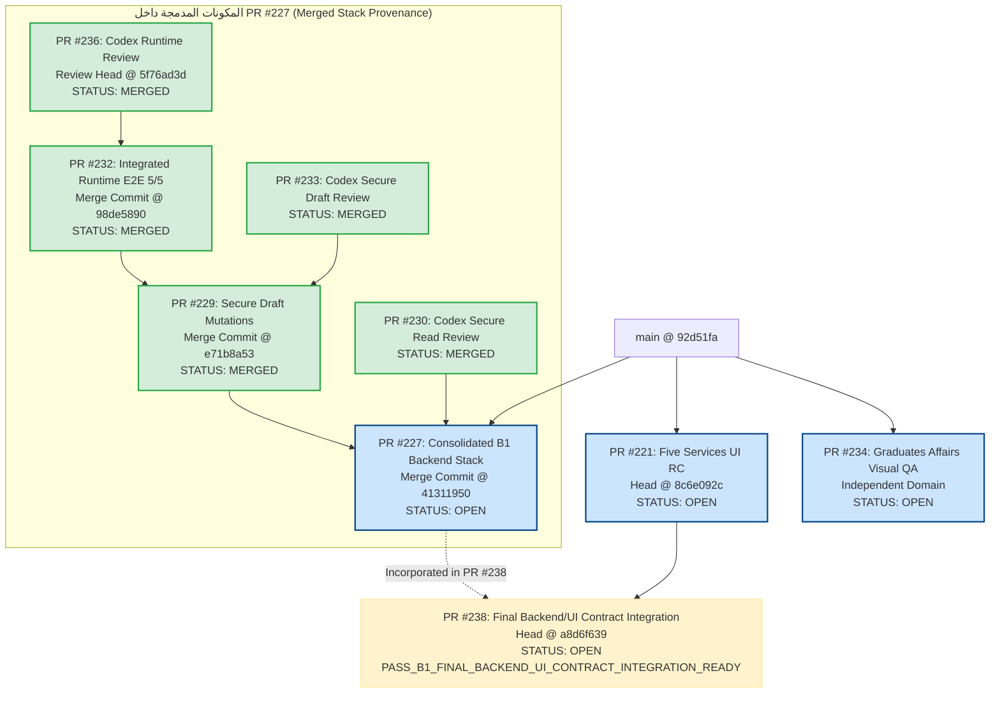

# PORTAL-B1-STACKED-PRS-DEPENDENCY-AND-RELEASE-INTEGRATION-AUDIT-01

**المستودع:** `msorori-mh/saba-uni-portal`
**تاريخ التدقيق وتحديث إثباتات الدمج الحية:** 25 يوليو 2026
**الدور:** `RELEASE_ARCHITECTURE_AND_INTEGRATION_AGENT`
**حالة التدقيق النهائية:** `PASS_PR235_MERGE_COMMIT_PROVENANCE_CORRECTED`
**حالة CI البعيد:** `HOLD_REMOTE_CI_BILLING_NO_JOB_STEPS`

---

## 1. ملخص تنفيذ التدقيق وتحديث السلسلة الحية (Executive Summary & Live Provenance)

تم إجراء تحديث حي ودقيق لاستخراج إثباتات الدمج (Merge Commit Provenance) واختبارات السلسلة المتممة للخدمات الطلابية الخمس (B1):
1. **طلب تأجيل الدراسة** (`enrollment_suspension`)
2. **طلب عذر عن عدم حضور مادة** (`excused_absence`)
3. **طلب التحويل بين الأقسام/الكليات** (`department_transfer`)
4. **طلب الفرصة الإضافية / الفرصة الأخيرة** (`final_chance`)
5. **طلب سحب الملف النهائي** (`file_withdrawal`)

### الإثباتات الحية لسلسلة الدمج التراكمي السفلي (Live Bottom-Up Merge Chain)

أثبتت الفحوصات الحية عبر GitHub API لسلسلة الخلفية المدمجة التسلسل التراكمي الآتي:

1. **دمج PR #236 في PR #232:**
   - **Review Head SHA:** `5f76ad3d7504de48423d11893824dd53fbee218f`
   - **Merge Commit SHA:** `98de5890c4e3a01ed845e771897a01b12946534e`
2. **دمج PR #232 في PR #229:**
   - **Final Merged Head SHA:** `98de5890c4e3a01ed845e771897a01b12946534e`
   - **Merge Commit SHA:** `e71b8a5363e2a0f7918deaf442606321723c8f20`
3. **دمج PR #229 في PR #227:**
   - **Final Merged Head SHA:** `e71b8a5363e2a0f7918deaf442606321723c8f20`
   - **Merge Commit SHA:** `41311950872672a8e326b1712dd1f16475cc4877`

أصبحت **PR #227** (`feat/b1-five-services-secure-read-contracts-01`) هي الحاوية الموحدة لجميع عقود الخلفية واختبارات E2E 5/5 ومراجعات Codex المعتمدة (`HEAD @ 41311950872672a8e326b1712dd1f16475cc4877`).

كما تم رصد وتدقيق **PR #238** المتراكبة فوق فرع الواجهات PR #221 للربط والتكامل النهائي مع الخلفية الموحدة.

---

## 2. حصر الـ PRs المفتوحة والمدمجة الحية (Live PR Inventory with Provenance)

| رقم الـ PR | العنوان | head branch | base branch | PR Head SHA | Base SHA | Merge Commit SHA | حالة الـ PR الحية | التوافق / الملاحظات |
|---|---|---|---|---|---|---|---|---|
| **#227** | `feat(b1): add secure read contracts for five student services` | `feat/b1-five-services-secure-read-contracts-01` | `main` | `ce0151836ee56bd43d85320749b79c4d6bb6090c` | `92d51faa9bcdc9fd99e89579f6a498b463264246` | `41311950872672a8e326b1712dd1f16475cc4877` | `OPEN` | `MERGEABLE` (الحاوية الموحدة؛ تضم #229 و #232 و #236 و #230 و #233) |
| **#229** | `feat(b1): add secure draft mutations for five student services` | `feat/b1-five-services-secure-draft-mutations-01` | `feat/b1-five-services-secure-read-contracts-01` (#227) | `b9d6acca7a36c1ca19365179740095cbedf0cd1e` | `ce0151836ee56bd43d85320749b79c4d6bb6090c` | `e71b8a5363e2a0f7918deaf442606321723c8f20` | `MERGED` | مدمجة كلياً داخل PR #227 |
| **#232** | `test(b1): verify integrated runtime for five student services` | `test/b1-five-services-integrated-runtime-e2e-01` | `feat/b1-five-services-secure-draft-mutations-01` (#229) | `a52ea121e2b0c43a9f93e439f3bc9f98566c6026` | `b9d6acca7a36c1ca19365179740095cbedf0cd1e` | `98de5890c4e3a01ed845e771897a01b12946534e` | `MERGED` | مدمجة كلياً داخل PR #229 (تضم #236) |
| **#236** | `test(b1): independently verify integrated runtime E2E remediations` | `review/pr232-independent-runtime-e2e-codex-01` | `test/b1-five-services-integrated-runtime-e2e-01` (#232) | `5f76ad3d7504de48423d11893824dd53fbee218f` | `9fba8b5b78bf9936a483aec690c27100261ed522` | `98de5890c4e3a01ed845e771897a01b12946534e` | `MERGED` | مدمجة كلياً داخل PR #232 |
| **#221** | `feat(student-requests): build five-service student and staff UI` | `feat/b1-five-services-ui-kimi-01` | `main` | `8c6e092c591be3d10bdfa159e86f61bc30ad0d05` | `92d51faa9bcdc9fd99e89579f6a498b463264246` | N/A (لم تُدمج) | `OPEN` | `MERGEABLE` (تنتظر دمج PR #238) |
| **#238** | `feat(b1-ui): integrate final secure read and draft contracts` | `integration/b1-final-backend-ui-contracts-01` | `feat/b1-five-services-ui-kimi-01` (#221) | `a8d6f639f3e89c70253d6fbd85561e5ea8563edd` | `8c6e092c591be3d10bdfa159e86f61bc30ad0d05` | N/A (لم تُدمج) | `OPEN` | `MERGEABLE` (`PASS_B1_FINAL_BACKEND_UI_CONTRACT_INTEGRATION_READY`) |
| **#234** | `fix(graduates-affairs): close visual privacy and accessibility findings` | `review/graduates-affairs-ui-visual-qa-01` | `main` | `9c036a787928d1676b6d56cea7d103459128e8cc` | `92d51faa9bcdc9fd99e89579f6a498b463264246` | N/A (لم تُدمج) | `OPEN` | `MERGEABLE` (مستقلة عن سلسلة B1) |
| **#235** | `docs(b1): audit stacked release dependencies and merge order` | `audit/b1-release-integration-gemini-01` | `main` | `321c12f225f07c07a15cf636f4094b2dd325a278` | `92d51faa9bcdc9fd99e89579f6a498b463264246` | N/A (لم تُدمج) | `OPEN` | `MERGEABLE` (تقرير التدقيق والتكامل الحالي) |

---

## 3. مخطط الاعتمادية الحي المتكامل (Live Dependency Graph)

### 3.1 المخطط النصي (Textual Dependency Graph)

```text
main (HEAD @ 92d51fa)
├── PR #227 — Consolidated B1 Backend Stack (Merge Commit @ 41311950)
│   ├── [MERGED] PR #229 (Secure Draft Mutations — Merge Commit @ e71b8a53)
│   │   └── [MERGED] PR #232 (Integrated Runtime E2E 5/5 — Merge Commit @ 98de5890)
│   │       └── [MERGED] PR #236 (Codex Independent Runtime Review — Review Head @ 5f76ad3d)
│   └── [MERGED] PR #230 (Codex Secure Read Review)
└── PR #221 — UI RC (Head @ 8c6e092c)
    └── PR #238 — Final Backend/UI Contract Integration (Head @ a8d6f639) [تضم Backend الموحد، لم تدمج بعد في #221]
```

### 3.2 مخطط Mermaid الحي (Live Mermaid Dependency Graph)



*ملاحظة توضيحية:* تضم PR #238 كود الـ Backend الموحد داخل فرع الـ UI، لكنها ما زالت مفتوحة ولم تُدمج بعد في PR #221.

---

## 4. تسلسل الهجرات الرسمي المحدد (Canonical Migration Sequence 21–25)

| Sequence Order (Manifest) | Migration File / Draft Target | المصدر المدمج | الوصف والنطاق |
|---|---|---|---|
| **21** | `supabase/migrations/20260725130000_b1_19_secure_read_contracts_01.sql` | PR #227 (مدمج) | عقود القراءة الآمنة لـ 5 خدمات طلابية |
| **22** | `supabase/migrations/20260725140000_b1_21_secure_draft_mutations_01.sql` | PR #229 (مدمج في #227) | إنشاء وتحديث مسودات الخدمة الحصري الآمن |
| **23** | `docs/migration-drafts/B1-TRANSFER-DEPARTMENT-SCOPE-POSITION-ASSIGNMENT-01.sql` | PR #232 (مدمج في #227) | إصلاح نطاق تعيينات قسم التحويل الإلكتروني |
| **24** | `docs/migration-drafts/B1-FILE-WITHDRAWAL-IMPACT-ACK-NULL-GUARD-01.sql` | PR #232 (مدمج في #227) | حماية الموافقة والإقرار بالانسحاب النهائي |
| **25** | **B1 Activation Gate** (Non-migration activation step) | - | بوابة تفعيل خدمات B1 التشغيلية |

---

## 5. شروط التوقف الإلزامية والحظر (HOLD Conditions)

يجب الالتزام التام بشروط التوقف والحظر التالية قبل دمج أي PR إلى `main`:

1. **حظر دمج PR #227 المنفرد:** يُمنع دمج PR #227 إلى `main` بشكل منفرد قبل اكتمال المراجعة النهائية واعتتماد تكامل الواجهات.
2. **حظر دمج PR #221 قبل PR #238:** يُمنع دمج PR #221 إلى `main` قبل مراجعة ودمج PR #238 في PR #221.
3. **انتظار مراجعة Codex النهائية:** انتظار المراجعة النهائية المعتمدة من Codex للرأس الخلفي الموحد (`41311950`).
4. **انتظار المراجعة المستقلة لـ PR #238:** انتظار الفحص والاعتماد المستقل لـ PR #238.
5. **عائق الفوترة الخارجي:** تظل مشكلة فوترة GitHub Actions CI عائقاً خارجياً محظور تجاوز حماية الفروع لأجله (`HOLD_REMOTE_CI_BILLING_NO_JOB_STEPS`).
6. **حظر العمليات الإنتاجية:** يمنع منعاً باتاً أي Production أو Staging أو migration apply أو Deploy أو Publish أو activation.

---

## 6. قائمة التحقق النهائية المحدثة (Updated Merge Checklist)

- [x] إثبات دمج PR #236 في PR #232 (Merge Commit `98de5890`).
- [x] إثبات دمج PR #232 في PR #229 (Merge Commit `e71b8a53`).
- [x] إثبات دمج PR #229 في PR #227 (Merge Commit `41311950`).
- [x] تثبيت الجاهزية التشغيلية لـ PR #238 (`PASS_B1_FINAL_BACKEND_UI_CONTRACT_INTEGRATION_READY`).
- [ ] إجراء المراجعة المستقلة لـ PR #238 ودمجها في PR #221.
- [ ] إبقاء حالة **HOLD** لدمج PR #227 و PR #221 إلى `main` لحين مراجعة Codex وحل الفوترة.

---

## 7. القرار النهائي المحدث (Updated Decision)

```text
PASS_PR235_MERGE_COMMIT_PROVENANCE_CORRECTED
```

**بيان القرار:**
تم تدقيق وتصحيح إثباتات الدمج الحية (Merge Commit Provenance) بالكامل لجميع فروع الخلفية والواجهات، وإضافة PR #238 بجاهزية تفويض كاملة مع تطبيق شروط التوقف والحظر الحازمة (HOLD) لحين الاعتماد النهائي.
