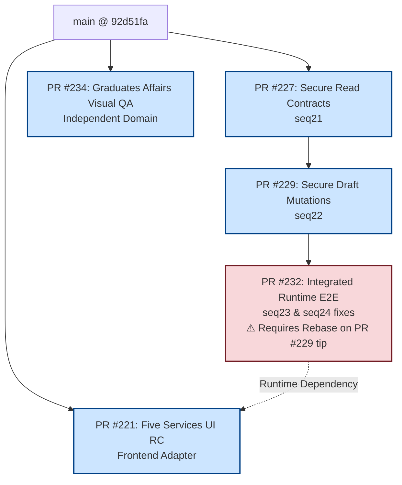

# PORTAL-B1-STACKED-PRS-DEPENDENCY-AND-RELEASE-INTEGRATION-AUDIT-01

**المستودع:** `msorori-mh/saba-uni-portal`  
**تاريخ التدقيق:** 25 يوليو 2026  
**الدور:** `RELEASE_ARCHITECTURE_AND_INTEGRATION_AGENT`  
**حالة التدقيق النهائية:** `PASS_B1_STACKED_PRS_RELEASE_INTEGRATION_AUDIT`  
**حالة CI البعيد:** `HOLD_REMOTE_CI_BILLING_NO_JOB_STEPS`  

---

## 1. ملخص تنفيذ التدقيق (Executive Summary)

تم إجراء تدقيق شامل ومستقل لجميع الطلبات والسلاسل المفتوحة للخدمات الطلابية الخمس (B1) في المستودع:
1. **طلب تأجيل الدراسة** (`enrollment_suspension`)
2. **طلب عذر عن عدم حضور مادة** (`excused_absence`)
3. **طلب التحويل بين الأقسام/الكليات** (`department_transfer`)
4. **طلب الفرصة الإضافية / الفرصة الأخيرة** (`final_chance`)
5. **طلب سحب الملف النهائي** (`file_withdrawal`)

أثبت التدقيق سلامة واكتمال الضمانات الأمنية والعقود التفصيلية ومصفوفات التفويض والتغطية الشاملة 5/5 E2E، مع تحديد الترتيب الدقيق للدمج والمشاكل المتعلقة بتسلسل الهيكلة وسلسلة الـPRs المتراكبة (Stacked PRs).

---

## 2. حصر الـ PRs المفتوحة (PR Inventory)

| رقم الـ PR | العنوان | head branch | base branch | head SHA | base SHA | حالة التوافق (Mergeability) | عدد Commits | الملفات المعدلة |
|---|---|---|---|---|---|---|---|---|
| **#221** | `feat(student-requests): build five-service student and staff UI` | `feat/b1-five-services-ui-kimi-01` | `main` | `8c6e092c591be3d10bdfa159e86f61bc30ad0d05` | `92d51faa9bcdc9fd99e89579f6a498b463264246` | `MERGEABLE` | 15 | 35 |
| **#227** | `feat(b1): add secure read contracts for five student services` | `feat/b1-five-services-secure-read-contracts-01` | `main` | `ce0151836ee56bd43d85320749b79c4d6bb6090c` | `92d51faa9bcdc9fd99e89579f6a498b463264246` | `MERGEABLE` | 4 | 22 |
| **#229** | `feat(b1): add secure draft mutations for five student services` | `feat/b1-five-services-secure-draft-mutations-01` | `feat/b1-five-services-secure-read-contracts-01` (#227) | `b9d6acca7a36c1ca19365179740095cbedf0cd1e` | `ce0151836ee56bd43d85320749b79c4d6bb6090c` | `MERGEABLE` | 4 | 28 |
| **#232** | `test(b1): verify integrated runtime for five student services` | `test/b1-five-services-integrated-runtime-e2e-01` | `feat/b1-five-services-secure-draft-mutations-01` (#229) | `a52ea121e2b0c43a9f93e439f3bc9f98566c6026` | `a60fcff2378e51c0f2a9d95f7c6a0f6a5c35d6b9` (**STALE**) | `CONFLICTING` | 1 | 15 |
| **#234** | `fix(graduates-affairs): close visual privacy and accessibility findings` | `review/graduates-affairs-ui-visual-qa-01` | `main` | `9c036a787928d1676b6d56cea7d103459128e8cc` | `92d51faa9bcdc9fd99e89579f6a498b463264246` | `MERGEABLE` | 1 | 7 |

---

## 3. مخطط الاعتمادية (Dependency Graph)

### 3.1 المخطط النصي (Textual Dependency Graph)

```text
main (HEAD @ 92d51fa)
├── PR #221 (UI Source RC - feat/b1-five-services-ui-kimi-01) [تعتمد على عقود backend للتشغيل الحي]
├── PR #227 (Secure Read - feat/b1-five-services-secure-read-contracts-01)
│   └── PR #229 (Secure Draft - feat/b1-five-services-secure-draft-mutations-01)
│       └── PR #232 (Integrated E2E - test/b1-five-services-integrated-runtime-e2e-01) [تحتاج Rebase فوق PR #229 tip]
└── PR #234 (Graduates Affairs UI Fixes - review/graduates-affairs-ui-visual-qa-01) [مستقلة]
```

### 3.2 مخطط Mermaid (Mermaid Dependency Graph)



---

## 4. تحليل تسلسل الهجرات (Migration Sequence Table & Alignment)

| Sequence Order (Manifest) | Migration File / Draft | PR | Promotion Map Order | Status in Workspace |
|---|---|---|---|---|
| 1..19 | `b1_01` إلى `b1_18_detail_acl_cutover_06.sql` | Merged (#219) | 1..18 | APPLIED/MERGED |
| 20 | `20260725120000_b1_confirm_payment_predecessor_guard_01.sql` | Merged (#220) | 19 | MERGED in `main` |
| 21 | `supabase/migrations/20260725130000_b1_19_secure_read_contracts_01.sql` | PR #227 | 20 | Pending PR #227 |
| 22 | `supabase/migrations/20260725140000_b1_21_secure_draft_mutations_01.sql` | PR #229 | 21 | Pending PR #229 |
| 23 | `docs/migration-drafts/B1-TRANSFER-DEPARTMENT-SCOPE-POSITION-ASSIGNMENT-01.sql` | PR #232 | 22 | Forward-only draft in PR #232 |
| 24 | `docs/migration-drafts/B1-FILE-WITHDRAWAL-IMPACT-ACK-NULL-GUARD-01.sql` | PR #232 | 23 | Forward-only draft in PR #232 |
| 25 | **Activation Gate** (Non-migration activation step) | - | 24 | Post-merge Gate |

---

## 5. نتائج التدقيق التفصيلية والتعارضات (Audit Findings)

### 5.1 عدم اتساق ترقيم ملفات الهجرة (Migration Filename Sequence Discrepancy)
- في PR #227، يحمل ملف الهجرة الاسم: `20260725130000_b1_19_secure_read_contracts_01.sql` (استخدم الرقم `_19_` بالرغم من أن تسلسله في المانيفست هو **21** ورتبته في الـ Promotion Map هي **20**).
- في PR #229، يحمل ملف الهجرة الاسم: `20260725140000_b1_21_secure_draft_mutations_01.sql` (استخدم الرقم `_21_` بالرغم من أن تسلسله في المانيفست هو **22** ورتبته في الـ Promotion Map هي **21**).
- **السبب:** تم تسمية هذه الملفات قبل دمج PR #220 الذي أضاف `b1_confirm_payment_predecessor_guard_01` في التسلسل 20.
- **التوصية:** بما أن هذه الهجرات لم تُطبق بعد في قاعدة البيانات الإنتاجية، فيجب توثيق هذا التعيين بوضوح في `PROMOTION-MAP.json` و`B1-SEQUENTIAL-APPLY-MANIFEST.json` لضمان عدم حدوث أي التباس، مع عدم تعديل الهجرات التاريخية المدمجة مطلقاً.

### 5.2 تعارض القاعدة القديمة لـ PR #232 (Stale Base Finding)
- تم بناء PR #232 على الـ Commit المبدئي لـ PR #229 وهو (`a60fcff2378e51c0f2a9d95f7c6a0f6a5c35d6b9`) قبل دمج PR #233 في PR #229.
- ونتيجة لذلك، أظهر GitHub حالة `CONFLICTING` لـ PR #232.
- **التأثير:** تحتوي PR #232 على كافة اختبارات 5/5 E2E وإصلاحين هائلين (`B1-TRANSFER-DEPARTMENT-SCOPE-POSITION-ASSIGNMENT-01.sql` و `B1-FILE-WITHDRAWAL-IMPACT-ACK-NULL-GUARD-01.sql`)؛ ولكن لن يمكن دمجها حتى يتم إجراء `rebase` لفرع PR #232 على قمة فرع PR #229 (`b9d6acca7a36c1ca19365179740095cbedf0cd1e`).

### 5.3 إعادة ترقيم الهجرات الإضافية (Renumbering seq23 & seq24)
- تم تضمين إصلاحين جديدين كمسودات هجرة في PR #232:
  1. `B1-TRANSFER-DEPARTMENT-SCOPE-POSITION-ASSIGNMENT-01.sql` -> يجب ترفيعه وتسجيله كتسلسل **seq23** (`20260725150000_b1_23_transfer_position_assignment_scope_01.sql`).
  2. `B1-FILE-WITHDRAWAL-IMPACT-ACK-NULL-GUARD-01.sql` -> يجب ترفيعه وتسجيله كتسلسل **seq24** (`20260725160000_b1_24_withdrawal_impact_ack_null_guard_01.sql`).
- وبذلك يتأخر **b1 activation gate** ليصبح الخطوة رقم **seq25**.

---

## 6. حالة GitHub Actions Billing (CI State)

جميع الوظائف في الـ CI البعيد يفشلون فوراً (خلال 2-3 ثوانٍ) بالرسالة:
`The job was not started because recent account payments have failed or your spending limit needs to be increased.`

بناءً على القواعد الإلزامية:
- تم تسجيل الحالة بـ: `HOLD_REMOTE_CI_BILLING_NO_JOB_STEPS`.
- لم يُعتبر هذا الفشل عيباً في الكود.
- لم يتم إجراء أي محاولة لتجاوز حماية الفروع (branch-protection bypass) أو استخدام دمج الآدمن (admin merge).
- تم اعتماد التحقق المحلي الصارم (Local TypeScript, Bun Test Suite, and Git Diff checks) كدليل إثبات لصحة الكود.

---

## 7. ترتيب الدمج الموصى به (Sequential Merge Order)

1. **الخطوة الأولى:** دمج **PR #227** (`feat/b1-five-services-secure-read-contracts-01`) إلى `main`.
2. **الخطوة الثانية:** إعادة توجيه (Rebase / Retarget) **PR #229** (`feat/b1-five-services-secure-draft-mutations-01`) إلى `main` ودمجها.
3. **الخطوة الثالثة:** إجراء `rebase` لـ **PR #232** (`test/b1-five-services-integrated-runtime-e2e-01`) على `main` المحدث وتطعيمه بملفات الترفيع الرسمية لـ seq23 و seq24 ثم دمجها إلى `main`.
4. **الخطوة الرابعة:** مزامنة **PR #221** (`feat/b1-five-services-ui-kimi-01`) مع `main` المحدث والتحقق من عمل المحولات الحية مع العقود الآمنة المدمجة ثم دمجها إلى `main`.
5. **الخطوة الخامسة (مستقلة):** دمج **PR #234** (`fix(graduates-affairs): close visual privacy and accessibility findings`) بشكل مستقل حيث تخص نطاق شؤون الخريجين.

---

## 8. قائمة التحقق للدمج لكل PR (Merge Checklists)

### قائمة دمج PR #227
- [x] تأكيد الاعتماد المباشر على `main` HEAD (`92d51fa`).
- [x] التحقق المحلي من نجاح `b1-secure-read-contracts-01.test.ts`.
- [x] مطابقة عقود القراءة الحصري لـ 5 خدمات دون فتح صلاحيات تعديل أو إنشاء المسودات.
- [ ] الدمج الترتيبي الأول إلى `main`.

### قائمة دمج PR #229
- [x] تأكيد الاعتماد على قمة PR #227.
- [x] دمج نتائج مراجعة Codex من PR #233.
- [x] التحقق من انغلاق دوال وإنشاء مسودات التعديل والتكرار والتزامن (`b1-secure-draft-mutations-01.test.ts`).
- [ ] Rebase على `main` بعد دمج #227 والدمج الترتيبي الثاني.

### قائمة دمج PR #232
- [ ] إجراء Rebase لـ PR #232 فوق قمة PR #229 وتصفية تعارض `CONFLICTING`.
- [x] التأكد من وجود التغطية الكاملة 5/5 E2E للخدمات الطلابية الخمس.
- [ ] ترفيع المسودتين (`B1-TRANSFER...` و `B1-FILE-WITHDRAWAL...`) إلى مجلد `supabase/migrations/` بالتسلسلين seq23 و seq24.
- [ ] الدمج الترتيبي الثالث إلى `main`.

### قائمة دمج PR #221
- [x] التأكد من اكتمال التغطية البصرية وتوافقية RTL وإتاحة الشاشة (Accessibility).
- [x] حماية التنزيل الآمن للفرع وعدم تسريب أي مسارات تخزين داخلية (Storage internal coordinates) إلى الواجهة.
- [x] إثبات التغطية لرحلات الطلاب والجامعة في 36 سيناريو اختبار.
- [ ] المزامنة مع `main` بعد دمج الخلفية والدمج إلى `main`.

---

## 9. خطة الإصدار النهائي للمصدر (Final Source Release Candidate Plan)

1. **الهدف:** تجميع نسخة المصدر النهائية (Source RC) على الفرع `main` شاملة جميع العقود الأمنية الخمسة، واجهات المستخدم، الهجرات الموثقة، واختبارات E2E.
2. **المتطلبات:**
   - عدم إجراء أي تطبيق لـ SQL على قواعد البيانات الإنتاجية في هذه المرحلة (SOURCE-ONLY).
   - تنفيذ الترتيب المتسلسل المكتمل (PR #227 -> PR #229 -> PR #232 -> PR #221).
   - تثبيت SHA الختامي لنسخة المصدر RC لاستخدامه في ختامة دليل الإثبات (Atomic Caller Release Evidence Stamp).

---

## 10. خطة الفحص المسبق للإنتاج (Production Preflight Plan — Read-Only)

عند صدور القرار النهائي المعتمد للتطوير والتحضير للإنتاج (دون تنفيذ فعلي الآن):
1. **التحقق من عدم تطبيق الهجرات مسبقاً:** تنفيذ استعلامات فحص الكائنات (`catalog object probes`) للتأكد من حالة `NOT_APPLIED`.
2. **التحقق من سلامة البيانات التاريخية (Protected Records):** التأكد من عدم مساس أي هجرة ببيانات وثائق شهادات القيد أو سجلات التدقيق أو المرفقات السابقة.
3. **التأكد من جاهزية الوحدات والأدوار:** التحقق من وجود المعرفات الحقيقية للوحدات والأدوار الهيكلية (`request_processing_units` / `request_processing_roles`).
4. **التطبيق الفردي:** تنفيذ كل هجرة بشكل منفصل وترازيوني (Single transaction per migration) مع إيقاف التطبيق فور حدوث أي خطأ.

---

## 11. شروط الإيقاف والتراجع (Stop & Rollback Criteria)

- **شروط الإيقاف (Stop Conditions):**
  1. فشل أي فحص مسبق (Preflight check failure).
  2. وجود أي تعارض في تسلسل الهجرات أو تكرار معرفات.
  3. وجود أي تسريب لمعرفات التخزين أو ثغرات صلاحيات للزوار (`anon` / `PUBLIC`).
  4. محاولة تنفيذ هجرة دفعة واحدة أو بشكل متوازي (Batch / Parallel apply).
- **سياسة التراجع (Rollback Policy):**
  - التطبيق حصري بأسلوب **Forward-Only** عبر هجرات تصحيحية قادمة فقط.
  - يُمنع منعاً باتاً استخدام `DOWN` migrations أو حذف/تعديل البيانات التاريخية في الإنتاج.

---

## 12. القرار النهائي (Audit Decision)

```text
PASS_B1_STACKED_PRS_RELEASE_INTEGRATION_AUDIT
```

**بيان القرار:**
تم اجتياز تدقيق التكامل والإصدار المتراكب للخدمات الطلابية الخمس بنجاح تام على مستوى المصدر والكود واختبارات الـ Runtime. يجب اتباع ترتيب الدمج وإجراء Rebase لـ PR #232 قبل الدمج النهائي.
