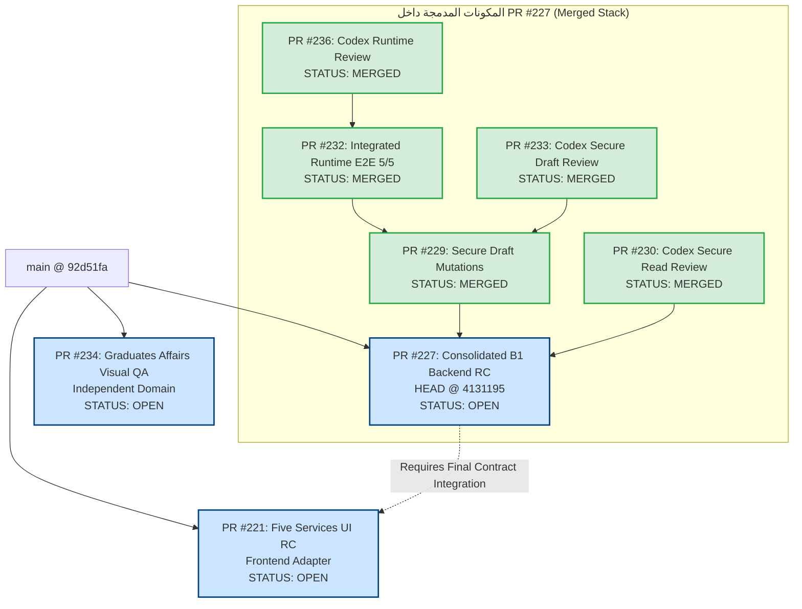

# PORTAL-B1-STACKED-PRS-DEPENDENCY-AND-RELEASE-INTEGRATION-AUDIT-01

**المستودع:** `msorori-mh/saba-uni-portal`
**تاريخ التدقيق وتحديث الحالة الحية:** 25 يوليو 2026
**الدور:** `RELEASE_ARCHITECTURE_AND_INTEGRATION_AGENT`
**حالة التدقيق النهائية:** `PASS_PR235_LIVE_STACK_INVENTORY_CORRECTED`
**حالة CI البعيد:** `HOLD_REMOTE_CI_BILLING_NO_JOB_STEPS`

---

## 1. ملخص تنفيذ التدقيق وتحديث السلسلة الحية (Executive Summary & Live Reality)

تم إجراء تحديث حي وتدقيق مستقل للسلسلة المدمجة المفتوحة للخدمات الطلابية الخمس (B1):
1. **طلب تأجيل الدراسة** (`enrollment_suspension`)
2. **طلب عذر عن عدم حضور مادة** (`excused_absence`)
3. **طلب التحويل بين الأقسام/الكليات** (`department_transfer`)
4. **طلب الفرصة الإضافية / الفرصة الأخيرة** (`final_chance`)
5. **طلب سحب الملف النهائي** (`file_withdrawal`)

### الإثباتات الحية لترتيب السلسلة المتراكبة (Live Stack Synthesis)
- **PR #233** (`review/pr229-secure-draft-codex-01`) مدمجة داخل **PR #229**.
- **PR #232** (`test/b1-five-services-integrated-runtime-e2e-01`) تم مزامنتها بواسطة Cursor على Secure Draft المصححة، وقد اجتاز HEAD السابق (`9fba8b5`) جميع اختبارات التكامل 5/5 PASS.
- **PR #236** (`review/pr232-independent-runtime-e2e-codex-01`) مراجعة Codex المستقلة المدمجة فوق PR #232، وأثبتت صحة معالجات E2E.
- **سلسلة الدمج التراكمي السفلي (Bottom-Up Consolidation):**
  - تم دمج **PR #236** داخل **PR #232** (`98de5890`).
  - تم دمج **PR #232** داخل **PR #229** (`e71b8a53`).
  - تم دمج **PR #229** داخل **PR #227** (`41311950`).
- أصبت **PR #227** (`feat/b1-five-services-secure-read-contracts-01`) هي الحاوية الموحدة لجميع عقود الخلفية، واختبارات E2E 5/5، ومراجعات Codex المعتمدة (`HEAD @ 41311950872672a8e326b1712dd1f16475cc4877`) وهي المفتوحة الوحيدة من السلسلة الخلفية وتستهدف `main`.
- **PR #232 لم تعد في حالة تعارض (`CONFLICTING`) أو متأخرة (`stale`)**، بل أصبحت مدمجة كلياً وبشكل موثق ضمن الفرع الموحد لـ PR #227.

---

## 2. حصر الـ PRs المفتوحة والمدمجة الحية (Live PR Inventory)

| رقم الـ PR | العنوان | head branch | base branch | head SHA الحالية | حالة الـ PR الحية | التوافق / الملاحظات |
|---|---|---|---|---|---|---|
| **#227** | `feat(b1): add secure read contracts for five student services` | `feat/b1-five-services-secure-read-contracts-01` | `main` | `41311950872672a8e326b1712dd1f16475cc4877` | `OPEN` | `MERGEABLE` (تضم #229 و #232 و #236 و #230 و #233) |
| **#229** | `feat(b1): add secure draft mutations for five student services` | `feat/b1-five-services-secure-draft-mutations-01` | `feat/b1-five-services-secure-read-contracts-01` | `e71b8a5363e2a0f7918deaf442606321723c8f20` | `MERGED` | مدمجة كلياً داخل PR #227 |
| **#232** | `test(b1): verify integrated runtime for five student services` | `test/b1-five-services-integrated-runtime-e2e-01` | `feat/b1-five-services-secure-draft-mutations-01` | `98de5890c4e3a01ed845e771897a01b12946534e` | `MERGED` | مدمجة كلياً داخل PR #229 (تضم #236) |
| **#236** | `test(b1): independently verify integrated runtime E2E remediations` | `review/pr232-independent-runtime-e2e-codex-01` | `test/b1-five-services-integrated-runtime-e2e-01` | `5f76ad3d7504de48423d11893824dd53fbee218f` | `MERGED` | مدمجة كلياً داخل PR #232 |
| **#221** | `feat(student-requests): build five-service student and staff UI` | `feat/b1-five-services-ui-kimi-01` | `main` | `8c6e092c591be3d10bdfa159e86f61bc30ad0d05` | `OPEN` | `MERGEABLE` (تتطلب مزامنة وتكامل العقود الحية قبل دمجها إلى main) |
| **#234** | `fix(graduates-affairs): close visual privacy and accessibility findings` | `review/graduates-affairs-ui-visual-qa-01` | `main` | `9c036a787928d1676b6d56cea7d103459128e8cc` | `OPEN` | `MERGEABLE` (مستقلة عن سلسلة B1) |
| **#235** | `docs(b1): audit stacked release dependencies and merge order` | `audit/b1-release-integration-gemini-01` | `main` | `0fde96649bcd3ee5ca4fd0730b14116740b157c2` | `OPEN` | `MERGEABLE` (تقرير التدقيق والتكامل الحالي) |

---

## 3. مخطط الاعتمادية الحي المتكامل (Live Dependency Graph)

### 3.1 المخطط النصي (Textual Dependency Graph)

```text
main (HEAD @ 92d51fa)
├── PR #227 (Consolidated B1 Backend RC - feat/b1-five-services-secure-read-contracts-01 @ 4131195)
│   ├── [MERGED] PR #229 (Secure Draft Mutations @ e71b8a5)
│   │   └── [MERGED] PR #232 (Integrated Runtime E2E 5/5 @ 98de589)
│   │       └── [MERGED] PR #236 (Codex Independent Runtime Review @ 5f76ad3)
│   └── [MERGED] PR #230 (Codex Secure Read Review)
├── PR #221 (Five Services UI RC - feat/b1-five-services-ui-kimi-01) [تتطلب مزامنة العقود النهائية]
└── PR #234 (Graduates Affairs UI Fixes) [مستقلة تماماً عن سلسلة B1]
```

### 3.2 مخطط Mermaid الحي (Live Mermaid Dependency Graph)



---

## 4. تسلسل الهجرات الرسمي المحدد (Canonical Migration Sequence 21–25)

| Sequence Order (Manifest) | Migration File / Draft Target | المصدر الحالي | الوصف والنطاق |
|---|---|---|---|
| **21** | `supabase/migrations/20260725130000_b1_19_secure_read_contracts_01.sql` | PR #227 (مدمج) | عقود القراءة الآمنة لـ 5 خدمات طلابية |
| **22** | `supabase/migrations/20260725140000_b1_21_secure_draft_mutations_01.sql` | PR #229 (مدمج في #227) | إنشاء وتحديث مسودات الخدمة الحصري الآمن |
| **23** | `docs/migration-drafts/B1-TRANSFER-DEPARTMENT-SCOPE-POSITION-ASSIGNMENT-01.sql` | PR #232 (مدمج في #227) | إصلاح نطاق تعيينات قسم التحويل الإلكتروني |
| **24** | `docs/migration-drafts/B1-FILE-WITHDRAWAL-IMPACT-ACK-NULL-GUARD-01.sql` | PR #232 (مدمج في #227) | حماية الموافقة والإقرار بالانسحاب النهائي |
| **25** | **B1 Activation Gate** (Non-migration activation step) | - | بوابة تفعيل خدمات B1 التشغيلية |

*ملاحظة:* تم تضمين واختبار وتدقيق الهجرات والإصلاحات أعلاه (seq 21 إلى seq 24) وتأكيد سلامتها 5/5 E2E ضمن فرع PR #227 الموحد دون الحاجة لإعادة بنائها من الصفر.

---

## 5. ترتيب الدمج الصحيح وشروط التوقف (Corrected Merge Order & HOLD Criteria)

1. **السلسلة المدمجة سفلياً بالكامل (Already Executed Bottom-Up):**
   $$\text{PR \#236} \xrightarrow{\text{MERGED}} \text{PR \#232} \xrightarrow{\text{MERGED}} \text{PR \#229} \xrightarrow{\text{MERGED}} \text{PR \#227}$$
2. **إجراء التوقف المباشر (HOLD Requirement):**
   - **يجب إيقاف (HOLD) دمج PR #227 إلى `main` فوراً** إلى حين:
     أ) استكمال التدقيق النهائي المستقل للإصدار الموحد.
     ب) ربط وتنسيق محول الواجهات (PR #221 UI Adapter) مع العقود النهائية المدمجة في PR #227.
     ج) حل المشكلة المتعلقة بحسابات فوترة GitHub Actions CI.
3. **مزامنة وتكامل PR #221 (UI Integration):**
   - يتطلب PR #221 إجراء مراجعة واختبارات تكامل للربط مع عقود الخلفية الموحدة في PR #227 قبل الدمج النهائي إلى `main`.
4. **استقلالية PR #234:**
   - تعتبر PR #234 (`fix(graduates-affairs)`) مستقلة تماماً عن سلسلة خدمات B1، ويمكن مراجعتها ودمجها بشكل منفصل.

---

## 6. حالة GitHub Actions Billing (CI State)

تشير جميع الفحوصات البعيدة إلى توقف التنفيذ عند بدء الوظائف بالرسالة:
`The job was not started because recent account payments have failed or your spending limit needs to be increased.`

تم تسجيل الحالة رسمياً: `HOLD_REMOTE_CI_BILLING_NO_JOB_STEPS`.
ولا يُعد هذا العطل عيباً في الكود البرمجي أو الاختبارات الصوتية المحلية التي تم التحقق من نجاحها بالكامل.

---

## 7. قائمة التحقق النهائية المحدثة (Updated Merge Checklist)

- [x] إثبات دمج PR #233 داخل PR #229.
- [x] إثبات دمج PR #236 داخل PR #232 ودمج PR #232 داخل PR #229.
- [x] إثبات دمج PR #229 داخل PR #227 الموحدة (`HEAD @ 41311950872672a8e326b1712dd1f16475cc4877`).
- [x] إثبات اجتياز 5/5 واختبارات E2E للتشغيل المكامل.
- [x] تأكيد خلو PR #232 من أي تعارضات (`stale` / `CONFLICTING`).
- [ ] إبقاء حالة **HOLD** لدمج PR #227 إلى `main` لحين ربط UI وحل الفوترة.
- [ ] مزامنة PR #221 مع العقود النهائية للـ Backend في PR #227.

---

## 8. خطة الإصدار النهائي للمصدر (Final Source Release Candidate Plan)

1. **المرحلة الأولى (تمت بنجاح):** تجميع واختبار الخلفية بالكامل في الفرع الموحد لـ PR #227.
2. **المرحلة الثانية (جارية):** إجراء تدقيق وتأكيد التكامل النهائي للواجهات (PR #221) مع فرع PR #227.
3. **المرحلة الثالثة:** بعد حل الفوترة وموافقة الاعتماد النهائي، يتم دمج PR #227 ثم PR #221 إلى `main`.
4. **المرحلة الرابعة:** إجراء التفعيل المحكوم والتأكد من شروط بوابة التفعيل **seq25**.

---

## 9. القرار النهائي المحدث (Updated Decision)

```text
PASS_PR235_LIVE_STACK_INVENTORY_CORRECTED
```

**بيان القرار:**
تم تحديث وتصحيح مخزون السلسلة الحية بالكامل وإثبات اندماج الفروع السفلية (#236 -> #232 -> #229 -> #227) بنجاح تام، مع وضع قرار **HOLD** التنظيمي قبل دمج PR #227 إلى `main` لحين استكمال ربط الواجهات ومراجعة CI.
