# Dependency Graph

```mermaid
flowchart TD
  Q[Dynamic queue activation] --> C[Integration audit]
  Q --> F[Flutter contract audit]
  C --> CT[Canonical current-term resolver]
  C --> B[Student-to-cohort binding audit]
  B --> R[Cohort current-term course read model]
  R --> E[Individual academic exceptions]
  CT --> R
  CT --> SF[Current-term schedule filters]
  C --> AH[Anonymous timetable read hardening]
  R --> U[Student current-term courses UI]
  R --> T[Timetable consumption]
  B --> M[Course-material audience]
  B --> MF[Materials fallback fail-closed]
  MF --> AM[Material authorization matrix]
  B --> MA[Atomic materials authorization and mutation]
  T --> L[Lecture execution monitoring]
  C --> S[Legacy section compatibility adapter]
  C --> GPA[Graduation projects MVP audit/design]
  B --> GPI[Graduation projects implementation gate]
  CT --> GPI
  GPA --> GPI
  STAFF[Stable faculty and departments] --> GPI
  SAFE[Secure attachments, notifications and authorization] --> GPI
  PMIG[Current priority migrations complete] --> GPI
  GAA[Graduates affairs MVP audit/design]
  GPI --> GAI[Graduates affairs implementation gate]
  GAA --> GAI
  GDEF[Approved graduate definition and final results] --> GAI
  GDOC[Graduation documents and transcript ready] --> GAI
  GACC[Post-graduation account continuity approved] --> GAI
  GAUTH[Graduates-affairs staff authorization approved] --> GAI
  F --> FB[Flutter backend consumption implementation tasks]
  FA[Locate Flutter client artifact] --> FB
  FB --> MC[Mobile compatibility matrix]
  FB --> MR[Student request mobile RPC cutover]
  FB --> MD[Mobile document read/download]

  W[B1 free workflows draft 08] --> PROMO[B1 five-services controlled promotion]
  PROMO --> REL[Reviewed atomic caller release evidence stamp]
  REL --> MIG[B1 sequential migrations]
  W --> MIG
  PROMO --> ACLSRC[ACL cutover source remediation]
  MIG --> ACL[B1 ACL cutover apply]
  ACLSRC --> ACL
  PROMO --> RPCM[B1 safe RPC matrix harness]
  RPCM -->|predecessor guard and full evidence must pass| MIG
  PROMO --> RPACK[Release and first-service preflight pack]
  RPACK --> MIG
  PROMO --> REPRO[B1 reproducible release build remediation]
  REPRO --> DEPLOYAUTH[Separate release deploy authorization]
  REPRO --> TREG[B1 stable TanStack Register augmentation]
  TREG --> DEPLOYAUTH
  DEPLOYAUTH -.->|does not authorize migration apply| MIG
  CHAIRS[Approved chair identity resolution] --> CPKG[Controlled chair fix package]
  CPKG -->|separate apply approval| MIG
  ACL --> VIS[Separate activation and student_visible]
  DEFER[Six deferred services lifecycle input] -.->|PHASE 2 only| PHASE2[Remaining student requests readiness]
```

Production nodes `REL`, `MIG`, `ACL`, and `VIS` remain fail-closed and require the
specific approvals and verification gates recorded in the project runbook.
`PROMO` is source-only and stops at the production apply gate.
`RPCM` is source-complete after predecessor remediation #169 and harness #166:
PostgreSQL 17 is 285/285 PASS and independent review is CRITICAL=0, HIGH=0,
MEDIUM=0. `RPACK` and `CPKG` are merged source packages and remain unapplied.
All three feed the separately approved production migration gate; none authorizes
SQL apply, visibility, workflow activation, deploy, or publish.
`DEFER` / `PHASE2` must not create Workflow/SQL/UI until the owner supplies
approved lifecycles.

Reconciled merge state: PRs #146-#148, #150-#154 and #156-#160 are merged with
CI PASS. PR #149 remains OPEN (review-complete audit artifact); PR #155 remains
OPEN and `COHORT-CURRENT-TERM-COURSE-READ-MODEL-01` is an architectural HOLD.
Merged migration drafts remain unapplied and do not satisfy `PMIG`, `MIG`, `ACL`
or `VIS`.

`GPA` and `GAA` are P2 design-only nodes and never displace eligible P0/P1 work.
`GPI` must precede `GAI`. All implementation-gate nodes remain blocked until their
incoming dependencies are complete and separately approved.
