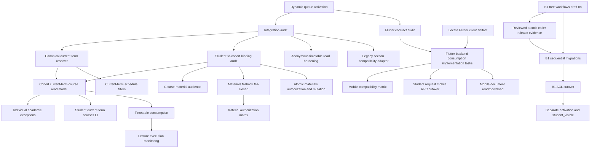

# Dependency Graph

```mermaid
flowchart TD
  Q[Dynamic queue activation] --> C[Integration audit]
  Q --> F[Flutter contract audit]
  C --> CT[Canonical current-term resolver]
  C --> B[Student-to-cohort binding audit]
  B --> R[Cohort current-term course read model]
  R --> E[Individual academic exceptions]
  CT --> R
  CT --> SF[Current-term schedule filters]
  C --> AH[Anonymous timetable read hardening]
  R --> U[Student current-term courses UI]
  R --> T[Timetable consumption]
  B --> M[Course-material audience]
  B --> MF[Materials fallback fail-closed]
  MF --> AM[Material authorization matrix]
  B --> MA[Atomic materials authorization and mutation]
  T --> L[Lecture execution monitoring]
  C --> S[Legacy section compatibility adapter]
  F --> FB[Flutter backend consumption implementation tasks]
  FA[Locate Flutter client artifact] --> FB
  FB --> MC[Mobile compatibility matrix]
  FB --> MR[Student request mobile RPC cutover]
  FB --> MD[Mobile document read/download]

  W[B1 free workflows draft 08] --> REL[Reviewed atomic caller release evidence]
  REL --> MIG[B1 sequential migrations]
  W --> MIG
  MIG --> ACL[B1 ACL cutover]
  ACL --> VIS[Separate activation and student_visible]
```

Production nodes `REL`, `MIG`, `ACL`, and `VIS` remain fail-closed and require the
specific approvals and verification gates recorded in the project runbook.
