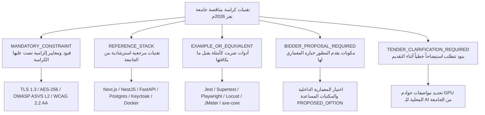

# وثيقة تجميد المتطلبات الرسمية لمناقصة جامعة تعز (2026م) — الإصدار المعالج والمفصل ذرياً
## TAIZ-TENDER-00-OFFICIAL-RFP-REQUIREMENTS-FREEZE
**مشروع تصميم وتطوير الموقع الإلكتروني الرسمي لجامعة تعز والبوابة الرقمية المتكاملة ودمج تقنيات الذكاء الاصطناعي**  
**المناقصة العامة رقم (2) للعام 2026م — جامعة تعز، الجمهورية اليمنية**  
**تاريخ التجميد الرسمي والتدقيق الشامل:** 19 أغسطس 2026م  
**المصدر المرجعي المعتمد:** كراسة الشروط والمواصفات الفنية والمالية الرسمية (42 صفحة ممسوحة ضوئياً)  
**ملف المصدر المحلي الموثق:** `docs/tender/taiz-2026/source/الشروط والمواصفات الفنية والمالية .pdf` (SHA-256: `C9205C09B5B9C689ECA947E3FA82F203AF2FC7AC1284268827C374F4186D37C3`)  

---

## 1. الإطار القانوني والتعاقدي للمناقصة (Legal & Contractual Framework)

| البند التعاقدي | البيان الرسمي في كراسة المناقصة | رقم صفحة PDF | رقم الصفحة المطبوعة | المرجع في الكراسة |
| :--- | :--- | :---: | :---: | :--- |
| **اسم المشروع الرسمي** | مشروع تصميم وتطوير الموقع الإلكتروني الرسمي لجامعة تعز والبوابة الرقمية المتكاملة ودمج تقنيات الذكاء الاصطناعي | ص 1 | غلاف | الغلاف الرسمي |
| **الجهة المالكة** | جامعة تعز — الجمهورية اليمنية | ص 1، ص 37 | غلاف، ص 36 | الغلاف وجدول BOQ |
| **رقم المناقصة** | المناقصة العامة رقم (2) للعام 2026م | ص 1، ص 3، ص 37 | غلاف، ص 2، ص 36 | كراسة الشروط |
| **القانون الحاكم** | أحكام القانون رقم (23) لسنة 2007م بشأن المناقصات والمزايدات والمخازن الحكومية ولائحته التنفيذية | ص 3 | ص 2 | الشروط العامة |
| **طبيعة العطاء وشكل التقديم** | عطاء مغلق بمظروفين منفصلين (مظروف العرض الفني + مظروف العرض المالي) مختومين بالشمع الأحمر تماماً | ص 3، ص 36 | ص 2، ص 35 | الشروط وقائمة المراجعة |
| **الضمان البنكي الابتدائي** | ضمان بنكي ابتدائي غير مشروط ولا يلغى بنسبة لا تقل عن (2%) من إجمالي قيمة العطاء، سارٍ لمدة (90) يوماً من فتح المظاريف، أو شيك مصرفي مقبول الدفع باسم جامعة تعز | ص 3، ص 35، ص 37، ص 42 | ص 2، ص 34، ص 36، ص 41 | الشروط والـ BOQ والإقرار |
| **ضمان حسن التنفيذ** | ضمان بنكي بنسبة (10%) من إجمالي قيمة العقد يقدمه المقاول الفائز عند الترسية وقبل توقيع العقد | ص 42 | ص 41 | نموذج إقرار العطاء |
| **الملكية الفكرية والشفرة المصدرية** | تنازل وتمليك كامل وغير مشروط لجامعة تعز لكافة الشفرات المصدرية (Git Repository) والوثائق وقواعد البيانات بدون أجزاء مغلقة أو اشتراكات خارجية دورية (Full IP Transfer) | ص 3، ص 24، ص 28، ص 34، ص 42 | ص 2، ص 23، ص 27، ص 33، ص 41 | المبادئ، RTM-10، والإقرار |
| **مبدأ حيادية المورد (Vendor-Neutrality)** | حيادية المورد التامة لكافة التقنيات والمواصفات مع إمكانية استخدام البدائل المكافئة المفتوحة ("أو ما يعادلها") | ص 3 | ص 2 | الشروط العامة |
| **مدة تنفيذ المشروع** | 32 أسبوعاً (8 أشهر ميلادية) موزعة على 6 مراحل تنفيذية رئيسية | ص 31، ص 32 | ص 30، ص 31 | الجدول الزمني WBS |
| **فترة الضمان والصيانة المجانية** | 12 شهراً ميلادياً تبدأ من تاريخ الاستلام الابتدائي والتشغيل الفعلي للنظام وفق مستويات SLA | ص 28، ص 36، ص 40 | ص 27، ص 35، ص 39 | TCM-11 وجدول 7 |
| **حد النجاح في التقييم الفني** | الحصول على ما لا يقل عن (75 من 100 درجة) في التقييم الفني كشرط إلزامي لفتح المظروف المالي | ص 29 | ص 28 | مصفوفة الاستعداد للتقييم |

---

## 2. تصنيف التقنيات المذكورة في الكراسة (Technology Stack Taxonomy)

التزاماً بمبدأ حيادية المورد والبدائل المكافئة ("أو ما يعادلها") المنصوص عليه في الصفحة 3 من الكراسة، تم تصنيف التقنيات المذكورة في الكراسة إلى 5 فئات معيارية محددة:

### جدول التصنيف المعياري للتقنيات:
| التقنية المذكورة في الكراسة | التصنيف الرسمي الدقيق | المرجع في الكراسة | ملاحظات الالتزام والبدائل |
| :--- | :---: | :---: | :--- |
| **TLS 1.3 / HSTS** | `MANDATORY_CONSTRAINT` | ص 6، ص 34 | تشفير إلزامي للبيانات أثناء النقل وحظر البروتوكولات القديمة. |
| **AES-256 Encryption** | `MANDATORY_CONSTRAINT` | ص 6، ص 34 | تشفير إلزامي للبيانات الحساسة أثناء السكون. |
| **OWASP ASVS v4.0 Level 2** | `MANDATORY_CONSTRAINT` | ص 6، ص 24، ص 34 | معيار التحقق الأمني الإلزامي لكافة طبقات التطبيق. |
| **WCAG 2.2 Level AA** | `MANDATORY_CONSTRAINT` | ص 5، ص 24، ص 28 | معيار النفاذية الرقمية الإلزامي لجميع الواجهات. |
| **On-Premises Local RAG** | `MANDATORY_CONSTRAINT` | ص 6، ص 21، ص 38 | استضافة محليّة سيادية إلزامية لمنع تسريب بيانات الجامعة. |
| **Next.js (React / TypeScript)** | `REFERENCE_STACK` | ص 25 | إطار الواجهة المقترح من الجامعة، ويقبل ما يكافئه شريطة دعم SSR/SSG. |
| **NestJS (Node.js) / FastAPI (Python)** | `REFERENCE_STACK` | ص 25 | أطر الخدمات الخلفية المرجعية من الجامعة، ويقبل ما يعادلها. |
| **PostgreSQL** | `REFERENCE_STACK` | ص 25 | قاعدة البيانات العلائقية المرجعية في الكراسة. |
| **Redis Cluster** | `REFERENCE_STACK` | ص 7، ص 25 | التخزين المؤقت المرجعي، ويقبل أي عنقود K-V معادل. |
| **MinIO Object Storage** | `REFERENCE_STACK` | ص 7، ص 25 | خادم التخزين الموزع المرجعي المتوافق مع بروتوكول S3. |
| **Qdrant / Milvus** | `REFERENCE_STACK` | ص 21، ص 25 | قواعد المتجهات المرجعية، ويقبل أي محرك متجهات مفتوح المصدر. |
| **Llama 3 / Mistral / Qwen 2.5** | `REFERENCE_STACK` | ص 21، ص 25 | نماذج الذكاء الاصطناعي المرجعية المفتوحة المصدر القابلة للاستضافة الذاتية. |
| **bge-m3 / multilingual-e5-large** | `REFERENCE_STACK` | ص 21، ص 25 | نماذج التضمين اللغوي المرجعية متعددة اللغات. |
| **Farasa / CamelTools** | `REFERENCE_STACK` | ص 21 | مكتبات المعالجة الصرفية المرجعية للغة العربية. |
| **Docker / Kubernetes (K8s)** | `REFERENCE_STACK` | ص 7، ص 25 | بيئة الحاويات والإدارة الموزعة المرجعية. |
| **Keycloak IAM (OIDC/OAuth2/SAML)** | `REFERENCE_STACK` | ص 18، ص 24 | خادم الدخول الموحد المرجعي في الكراسة. |
| **Kong / Envoy API Gateway** | `REFERENCE_STACK` | ص 7، ص 24 | طبقة بوابة الواجهات المرجعية لتأمين التكامل. |
| **Drupal (Headless) / Custom CMS** | `REFERENCE_STACK` | ص 25 | خيارات الـ CMS المرجعية المقترحة من الجامعة. |
| **Jest / Supertest / Playwright** | `EXAMPLE_OR_EQUIVALENT` | ص 34 | أدوات اختبار الوحدة والطرف للطرف، ويقبل أي أدوات مكافئة. |
| **JMeter / Locust** | `EXAMPLE_OR_EQUIVALENT` | ص 24، ص 34 | أدوات اختبار الأحمال والضغط لمحاكاة 5,000 مستخدم. |
| **axe-core / Pa11y** | `EXAMPLE_OR_EQUIVALENT` | ص 24، ص 30 | أدوات قياس النفاذية الرقمية الآلية. |
| **DOMPurify** | `EXAMPLE_OR_EQUIVALENT` | ص 34 | مكتبة تنقية المدخلات لمنع ثغرات XSS. |
| **ClamAV / ICAP Antivirus** | `EXAMPLE_OR_EQUIVALENT` | ص 34 | محرك فحص الملفات المرفوعة لحظياً. |
| **مواصفات خوادم GPU المحلية للذكاء** | `TENDER_CLARIFICATION_REQUIRED` | ص 21، ص 38 | تتطلب استيضاحاً من الجامعة حول توفر عتاد GPU في خوادمها. |

> [!NOTE]
> **موقف شركة سيستراك الفني:**
> تقترح شركة سيستراك في عرضها الفني الخيارات المرجعية (Next.js, FastAPI/Node, PostgreSQL, Qdrant, Keycloak, Docker/K8s) تحت وسم **`PROPOSED_OPTION`** كحلول معمارية مستوفية للمتطلبات وتلتزم بالبدائل المفتوحة دون فرض أي تقنية مغلقة.

---

## 3. إحصائيات تفكيك وتجميد المتطلبات الذرية (Atomic Metrics Summary)

تم تفكيك كافة المتطلبات الرسمية في الكراسة إلى **التزامات ذرية مستقلة التحقق والاختبار (Atomic Requirements)** دون دمج عدة التزامات في بند واحد:

| المؤشر والمقياس الإحصائي | القيمة المحسوبة بدقة | البيان الإحصائي |
| :--- | :---: | :--- |
| **إجمالي صفحات الكراسة المفحوصة (PDF Pages Reviewed)** | **42 صفحة** | من الغلاف إلى نموذج الإقرار المالي. |
| **إجمالي المتطلبات الذرية المستقلة (ATOMIC_REQUIREMENT_COUNT)** | **116 متطلباً** | التزامات منفصلة قابلة للتحقق والاختبار المستقل. |
| **عدد المتطلبات الإلزامية الحاسمة (MUST_COUNT)** | **104 متطلبات** | متطلبات تعاقدية وفنية وتشغيلية وأمنية إلزامية. |
| **عدد المتطلبات الموصى بها بقوة (SHOULD_COUNT)** | **9 متطلبات** | تحسينات معمارية وتكاملية نوعية. |
| **عدد الميزات الإضافية والتكميلية (MAY_COUNT)** | **3 متطلبات** | ميزات مرنة إضافية (مثل التسجيل في الفعاليات). |
| **معرفات المتطلبات الوظيفية (FR IDs)** | **38 معرفاً** | تشمل FR-001..010 ومتطلبات CMS التفصيلية. |
| **بنود مصفوفة تتبع المتطلبات (RTM IDs)** | **10 بنود** | RTM-01 إلى RTM-10 (ص 23-24). |
| **بنود مصفوفة المطابقة الفنية المباشرة (TCM Rows)** | **12 بنداً** | TCM-01 إلى TCM-12 (ص 26-28). |
| **بنود جدول الكميات والأسعار (BOQ Line Items)** | **20 بنداً** | الجداول 1.1..1.4, 2.1..2.4, 3.1..3.3, 4.1..4.3, 5.1..5.4, 6.1..6.3, 7.1..7.2. |
| **قائمة المخرجات والتسليمات المعتمدة (D-01..D-16)** | **16 مخرجاً** | D-01 إلى D-16 (ص 28-31). |
| **المسميات الوظيفية للكادر الأساسي (Personnel Roles)** | **8 مسميات** | مدير المشروع، المعماري، قادة التطوير، الذكاء، الأمن، DevOps، التدريب. |
| **معايير التقييم الفني الرسمية (Evaluation Criteria)** | **7 معايير** | المنهجية (25)، الخبرة (20)، AI (15)، الأمن (15)، الكادر (10)، الواجهات (10)، الضمان (5). |
| **محطات الدفعات المالية (Payment Milestones)** | **5 دفعات** | دفعة مقدمة (10%)، تصميم (15%)، برمجة (35%)، استلام (30%)، محتجز (10%). |
| **إجمالي المخاطر المحصورة والمحللة (Risk Count)** | **20 خطراً** | مخاطر تقنية، تأهيلية، تشغيلية، أمنية، مالية، وقانونية. |

---

## 4. سجل المتطلبات الذرية التفصيلي المجمد (116 Atomic Requirements)

### 4.1. المتطلبات القانونية والتأهيلية والشكلية (LEG: Legal & Pre-qualification)

| المعرف الذري | صفحة PDF | صفحة مطبوعة | القسم | نص الالتزام الذري المستقل | المستوى | التصنيف | وسيلة التحقق والدليل الإثباتي | حالة الكود الحالي |
| :--- | :---: | :---: | :---: | :--- | :---: | :---: | :--- | :---: |
| **TAIZ-LEG-001** | ص 3 | ص 2 | Part 1 | الخضوع الكامل لأحكام القانون رقم (23) لسنة 2007م بشأن المناقصات والمزايدات الحكومية ولائحته التنفيذية. | MUST | LEG | مراجعة نصوص العطاء وإقرارات التقديم. | `ACCEPTANCE_PENDING` |
| **TAIZ-LEG-002** | ص 3 | ص 2 | Part 1 | تقديم العطاء في مظروفين منفصلين تماماً (فني ومالي) ومختومين بالشمع الأحمر. | MUST | LEG | فحص المظاريف عند التسليم في الصندوق. | `ACCEPTANCE_PENDING` |
| **TAIZ-LEG-003** | ص 3 | ص 2 | Part 1 | تقديم أصل ضمان بنكي ابتدائي غير مشروط بنسبة لا تقل عن (2%) من إجمالي العطاء وسارٍ لمدة 90 يوماً أو شيك مقبول الدفع. | MUST | LEG | فحص أصل خطاب الضمان البنكي المرفق. | `TO_BUILD` |
| **TAIZ-LEG-004** | ص 42 | ص 41 | Part 17 | الالتزام بتقديم ضمان حسن تنفيذ بنسبة (10%) من قيمة العقد عند الترسية وقبل توقيع العقد. | MUST | LEG | التعهد القانوني في نموذج الإقرار المالي. | `ACCEPTANCE_PENDING` |
| **TAIZ-LEG-005** | ص 3 | ص 2 | Part 1 | إرفاق صورة طبق الأصل لسجل تجاري ساري المفعول لعام 2026م متضمناً نشاط تقنية المعلومات. | MUST | LEG | فحص الشهادة والسجل التجاري في المظروف. | `FOUNDATION` |
| **TAIZ-LEG-006** | ص 3 | ص 2 | Part 1 | إرفاق صورة طبق الأصل لبطاقة ضريبية سارية المفعول لعام 2026م. | MUST | LEG | فحص البطاقة الضريبية المعتمدة. | `FOUNDATION` |
| **TAIZ-LEG-007** | ص 3 | ص 2 | Part 1 | إرفاق صورة طبق الأصل لبطاقة زكوية سارية المفعول لعام 2026م. | MUST | LEG | فحص البطاقة الزكوية المعتمدة. | `FOUNDATION` |
| **TAIZ-LEG-008** | ص 3 | ص 2 | Part 1 | إرفاق صورة طبق الأصل لشهادة تسجيل بضريبة المبيعات سارية المفعول. | MUST | LEG | فحص شهادة ضريبة المبيعات المعتمدة. | `FOUNDATION` |
| **TAIZ-LEG-009** | ص 3 | ص 2 | Part 1 | إرفاق صورة طبق الأصل لشهادة سداد التأمينات الاجتماعية سارية المفعول لعام 2026م. | MUST | LEG | فحص شهادة التأمينات الاجتماعية. | `FOUNDATION` |
| **TAIZ-LEG-010** | ص 3، ص 29 | ص 2، ص 28 | Part 1 | تقديم سابقة أعمال موثقة بـ (3 مشاريع مماثلة على الأقل) في بوابات جامعية/منصات ضخمة مع شهادات استلام نهائي معتمدة. | MUST | LEG | فحص شهادات الإنجاز والاستلام النهائي الرسمية. | `FOUNDATION` |
| **TAIZ-LEG-011** | ص 3، ص 24 | ص 2، ص 23 | Part 1 | التنازل والتمليك الكامل لجامعة تعز لكافة حقوق الملكية الفكرية (Full IP Transfer) دون قيود. | MUST | LEG | توقيع إقرار نقل الملكية الفكرية المعتمد. | `READY` |
| **TAIZ-LEG-012** | ص 3، ص 28 | ص 2، ص 27 | Part 1 | تسليم مستودع Git كامل الشفرات المصدرية والأدلة وقواعد البيانات وسكريبتات التشغيل دون أجزاء مغلقة. | MUST | LEG | محضر تسليم واستلام مستودع Git المعتمد. | `READY` |
| **TAIZ-LEG-013** | ص 3 | ص 2 | Part 1 | التزام المورد بمبدأ حيادية المورد وتوفير التقنيات والبرمجيات المفتوحة ("أو ما يعادلها"). | MUST | DEV | تدقيق خلو العرض من التقنيات الاحتكارية. | `READY` |

---

### 4.2. المتطلبات الوظيفية وإدارة المحتوى (FR: Functional & CMS)

| المعرف الذري | صفحة PDF | صفحة مطبوعة | القسم | نص الالتزام الذري المستقل | المستوى | التصنيف | وسيلة التحقق والدليل الإثباتي | حالة الكود الحالي |
| :--- | :---: | :---: | :---: | :--- | :---: | :---: | :--- | :---: |
| **TAIZ-FR-001** | ص 8 | ص 7 | Part 4 | تصميم وتطوير الموقع الإلكتروني الرسمي لجامعة تعز كواجهة مركزية تمثل الجامعة محلياً ودولياً. | MUST | FR | فحص الواجهات والموقع المعتمد. | `FOUNDATION` |
| **TAIZ-FR-002** | ص 6، ص 8 | ص 5، ص 7 | Part 4 | دعم كامل ومتطابق للغتين العربية والإنجليزية في كافة الواجهات ولوحات التحكم. | MUST | FR | فحص قواميس الترجمة والتغطية 100%. | `FOUNDATION` |
| **TAIZ-FR-003** | ص 6، ص 8 | ص 5، ص 7 | Part 4 | دعم كامل لاتجاه النصوص من اليمين لليسار (RTL) للعربية ومن اليسار لليمين (LTR) للإنجليزية. | MUST | FR | فحص التبديل السلس للاتجاهات وتناسق DOM. | `FOUNDATION` |
| **TAIZ-FR-004** | ص 5، ص 8 | ص 4، ص 7 | Part 4 | تصميم متجاوب بنسبة 100% مع كافة الشاشات والأجهزة بمبدأ Mobile-First (من 320px إلى 4K). | MUST | UX | اختبارات التجاوب عبر أجهزة ومحاكيات متعددة. | `FOUNDATION` |
| **TAIZ-FR-005** | ص 8، ص 16 | ص 7، ص 15 | Part 4 | توفير نظام تصميم موحد (Design System) يعكس الهوية المؤسسية لجامعة تعز وكلياتها. | MUST | UX | مراجعة مكتبة المكونات ونظام السمات الموحد. | `FOUNDATION` |
| **TAIZ-FR-006** | ص 8 | ص 7 | Part 4 | هيكل تصفح مرن وقوائم ذكية متعددة المستويات ومسارات تنقل تصفح (Breadcrumbs). | MUST | UX | اختبار سهولة الوصول ومسارات الصفحات. | `READY` |
| **TAIZ-FR-007** | ص 8، ص 20 | ص 7، ص 19 | Part 4 | محرك بحث داخلي متقدم للنصوص والأخبار واللوائح والبرامج مع الإكمال التلقائي. | MUST | FR | اختبار استعلامات البحث الداخلي والدقة. | `FOUNDATION` |
| **TAIZ-FR-008** | ص 8، ص 9 | ص 7، ص 8 | Part 4 | نظام إدارة محتوى لابرمدي مرن بنمط السحب والإفلات (Drag & Drop Page Builder). | MUST | FR | تجربة بناء صفحة تفاعلية بدون كتابة كود. | `TO_BUILD` |
| **TAIZ-FR-009** | ص 8، ص 12 | ص 7، ص 11 | Part 4 | مستودع ومكتبة وسائط متعددة مركزية لإدارة الصور والفيديو والملفات (PDF, DOCX). | MUST | FR | تجربة رفع وتنظيم وتصنيف الوسائط المشتركة. | `FOUNDATION` |
| **TAIZ-FR-010** | ص 8 | ص 7 | Part 4 | إدارة مركزية للروابط والتحويلات التلقائية (301/302 Redirects) لحماية الروابط القديمة. | MUST | DATA | فحص جدول التحويلات واختبار الروابط القديمة. | `TO_BUILD` |
| **TAIZ-CMS-001** | ص 9 | ص 8 | Part 4 | منشئ الصفحة الرئيسية المؤسسية: تخصيص الهيدر، السلايدر، والروابط السريعة. | MUST | FR | تجربة تخصيص مكونات الصفحة الرئيسية من اللوحة. | `FOUNDATION` |
| **TAIZ-CMS-002** | ص 9 | ص 8 | Part 4 | عرض الإحصائيات الجامعية الحية (عدد الطلاب، الكليات، الخريجين، الأبحاث) ديناميكياً. | MUST | FR | التحقق من تغذية الإحصائيات من قواعد البيانات. | `READY` |
| **TAIZ-CMS-003** | ص 9 | ص 8 | Part 4 | تخصيص كلمة رئيس الجامعة وأقسام الرسائل القيادية في الصفحة الرئيسية. | MUST | FR | تعديل وعرض كلمة رئيس الجامعة بسهولة. | `READY` |
| **TAIZ-CMS-004** | ص 9 | ص 8 | Part 4 | إدارة الصفحات المؤسسية الثابتة والديناميكية (عن الجامعة، الرؤية، الرسالة، الأهداف). | MUST | FR | فحص صفحات التعريف بالجامعة وهيكلها. | `READY` |
| **TAIZ-CMS-005** | ص 10 | ص 9 | Part 4 | محرر نصوص متطور (WYSIWYG) يدعم الجداول وتنسيق الوسائط والروابط للأخبار والمقالات. | MUST | FR | تجربة تحرير وتنسيق المقالات الإخبارية. | `READY` |
| **TAIZ-CMS-006** | ص 10 | ص 9 | Part 4 | مسار تدفق الموافقات على الأخبار: (مسودة -> مراجعة -> موافقة -> نشر -> تحديث -> أرشفة). | MUST | FR | اختبار دورة حياة المقال وتدرج الصلاحيات. | `FOUNDATION` |
| **TAIZ-CMS-007** | ص 10 | ص 9 | Part 4 | جدولة النشر التلقائي للأخبار والمقالات في تاريخ ووقت محدد مسبقاً. | SHOULD | FR | اختبار نشر مقال مجدول في موعده آلياً. | `FOUNDATION` |
| **TAIZ-CMS-008** | ص 10 | ص 9 | Part 4 | دعم النشر متعدد القنوات ومشاركة المقالات على منصات التواصل الاجتماعي. | SHOULD | FR | فحص بطاقات المشاركة وأزرار النشر. | `READY` |
| **TAIZ-CMS-009** | ص 11 | ص 10 | Part 4 | إدارة الإعلانات والتعاميم مع تصنيفها (عاجلة، أكاديمية، مالية، عامة). | MUST | FR | فحص تصنيف ونشر الإعلانات في الواجهات. | `READY` |
| **TAIZ-CMS-010** | ص 11 | ص 10 | Part 4 | استهداف جمهور الإعلانات بدقة (الطلاب، أعضاء هيئة التدريس، الموظفين، العامة). | MUST | FR | فحص ظهور الإعلان للجمهور المستهدف فقط. | `READY` |
| **TAIZ-CMS-011** | ص 11 | ص 10 | Part 4 | تحديد تاريخ انتهاء الإعلانات وتفعيل الأرشفة التلقائية بعد الانتهاء. | MUST | FR | التحقق من اختفاء الإعلان المنتهي وأرشفته. | `READY` |
| **TAIZ-CMS-012** | ص 11 | ص 10 | Part 4 | إدارة الفعاليات والأنشطة الجامعية وتوثيق تفاصيلها ومواقعها ومتحدثيها. | MUST | FR | فحص دليل الفعاليات والأنشطة المقامة. | `FOUNDATION` |
| **TAIZ-CMS-013** | ص 11 | ص 10 | Part 4 | التقويم الأكاديمي التفاعلي ودعم تصدير المواعيد بتنسيق iCal وتكامل Google Calendar. | SHOULD | FR | فحص تصدير ملفات التقويم والربط التفاعلي. | `FOUNDATION` |
| **TAIZ-CMS-014** | ص 11 | ص 10 | Part 4 | إتاحة التسجيل الإلكتروني في الفعاليات والندوات عبر المنصة. | MAY | FR | تجربة نموذج التسجيل واستقبال التأكيدات. | `FOUNDATION` |
| **TAIZ-CMS-015** | ص 11 | ص 10 | Part 4 | دليل البرامج الأكاديمية وخطط البكالوريوس والدراسات العليا وشروط القبول. | MUST | FR | فحص هيكل البرامج وتوصيف المقررات والساعات. | `READY` |
| **TAIZ-CMS-016** | ص 12 | ص 11 | Part 4 | دليل أعضاء هيئة التدريس وصفحاتهم الشخصية وسيرهم الذاتية وساعاتهم المكتبية. | MUST | FR | مراجعة صفحات الكادر الأكاديمي والبيانات. | `FOUNDATION` |
| **TAIZ-CMS-017** | ص 12 | ص 11 | Part 4 | ربط الملفات الشخصية للأكاديميين بمعرفات Google Scholar و ORCID و Scopus. | MUST | FR | فحص صحة الروابط البحثية في بروفايل الكادر. | `FOUNDATION` |
| **TAIZ-CMS-018** | ص 12 | ص 11 | Part 4 | توليد مصغرات الصور والأبعاد المتعددة تلقائياً عند رفع الوسائط لتحسين السرعة. | MUST | OPS | فحص توليد صور WebP والمصغرات آلياً. | `FOUNDATION` |
| **TAIZ-CMS-019** | ص 12 | ص 11 | Part 4 | منشئ النماذج والاستبيانات الديناميكية التفاعلية (Dynamic Form Builder). | MUST | FR | تجربة بناء استبيان متعدد الحقول ونشره. | `TO_BUILD` |
| **TAIZ-CMS-020** | ص 12 | ص 11 | Part 4 | التحقق اللحظي من صحة مدخلات النماذج وتصدير الردود بتنسيقات CSV / Excel. | MUST | FR | تجربة تصدير بيانات نموذج بعد استيفائه. | `TO_BUILD` |
| **TAIZ-CMS-021** | ص 13 | ص 12 | Part 4 | قاعدة معرفية تفاعلية للأسئلة الشائعة (FAQ) مصنفة حسب الكليات والخدمات. | MUST | FR | تصفح الأسئلة الشائعة والبحث فيها. | `FOUNDATION` |
| **TAIZ-CMS-022** | ص 13 | ص 12 | Part 4 | ربط الأسئلة الشائعة بمحرك البحث ومحرك الذكاء الاصطناعي لتغذية الإجابات الفورية. | MUST | AI | فحص استرجاع إجابة السؤال الشائع في المحادثة. | `FOUNDATION` |
| **TAIZ-CMS-023** | ص 13 | ص 12 | Part 4 | سجل تدقيق تاريخي غير قابل للتعديل (Audit Trail) لكافة عمليات التعديل والحذف والنشر في CMS. | MUST | SEC | فحص سجلات التدقيق وتوثيق IP والمستخدم. | `READY` |

---

### 4.3. منصة المواقع المتعددة المركزية (MS: Multi-Site Platform)

| المعرف الذري | صفحة PDF | صفحة مطبوعة | القسم | نص الالتزام الذري المستقل | المستوى | التصنيف | وسيلة التحقق والدليل الإثباتي | حالة الكود الحالي |
| :--- | :---: | :---: | :---: | :--- | :---: | :---: | :--- | :---: |
| **TAIZ-MS-001** | ص 14، ص 37 | ص 13، ص 36 | Part 5 | إدارة مركزية موحدة لـ 25 موقعاً وفرعاً تشمل كليات الجامعة والمراكز والمرافق عبر لوحة واحدة. | MUST | FR | تجربة إدارة وتشغيل 25 موقعاً بالتزامن. | `FOUNDATION` |
| **TAIZ-MS-002** | ص 14، ص 15 | ص 13، ص 14 | Part 5 | حوكمة مركزية للسياسات والأمان مع استقلالية محلية لكل كلية/مركز في إدارة محتواها. | MUST | FR | فحص عزل محتوى وصلاحيات كلية عن أخرى. | `FOUNDATION` |
| **TAIZ-MS-003** | ص 14 | ص 13 | Part 5 | محرك قوالب موحد يلتزم بالهوية المؤسسية للجامعة مع مرونة تخصيص سمات كل كلية. | MUST | UX | فحص تطبيق سمة لونية مخصصة لكلية على القالب. | `FOUNDATION` |
| **TAIZ-MS-004** | ص 15 | ص 14 | Part 5 | دعم النطاقات الفرعية التلقائية لكافة المواقع (مثل `med.taiz.edu.ye` و `eng.taiz.edu.ye`). | MUST | OPS | فحص توجيه واستجابة النطاقات الفرعية. | `FOUNDATION` |
| **TAIZ-MS-005** | ص 15 | ص 14 | Part 5 | دعم ربط نطاقات مخصصة (Custom Domains) لبعض المراكز المستقلة مستقبلاً. | SHOULD | OPS | فحص إعدادات توجيه النطاقات المخصصة. | `FOUNDATION` |
| **TAIZ-MS-006** | ص 15 | ص 14 | Part 5 | إدارة هرمية للمستخدمين والصلاحيات: صلاحيات محلية على موقع كلية دون التأثير على الكليات الأخرى. | MUST | SEC | اختبار منع وصول محرر كلية للوحة كلية أخرى. | `FOUNDATION` |
| **TAIZ-MS-007** | ص 15 | ص 14 | Part 5 | ميزة البحث الثنائي: إمكانية حصر البحث داخل موقع الكلية أو البحث الشامل في كافة المواقع الـ 25. | MUST | FR | تجربة استعلام بحث موضعي واستعلام بحث عام. | `FOUNDATION` |
| **TAIZ-MS-008** | ص 15 | ص 14 | Part 5 | ميزة التعميم المركزي: نشر الأخبار والتعاميم الصادرة من رئاسة الجامعة على كافة المواقع بنقرة واحدة. | MUST | FR | فحص ظهور خبر رئاسة الجامعة في واجهات الكليات. | `FOUNDATION` |
| **TAIZ-MS-009** | ص 16، ص 17 | ص 15، ص 16 | Part 5 | تنفيذ سير عمل مؤتمت لإنشاء موقع فرعي جديد وفق 9 خطوات قياسية محددة بالكراسة: | MUST | FR | تنفيذ محاكاة تدشين موقع فرعي جديد بـ 9 خطوات. | `FOUNDATION` |
| **TAIZ-MS-009.1** | ص 16 | ص 15 | Part 5 | الخطوة 1: إدخال اسم وبيانات الموقع الفرعي باللغتين العربية والإنجليزية. | MUST | FR | إدخال بيانات الموقع واعتمادها. | `FOUNDATION` |
| **TAIZ-MS-009.2** | ص 16 | ص 15 | Part 5 | الخطوة 2: اختيار القالب وضبط ألوان وهوية الكلية الفرعية. | MUST | UX | معاينة وتطبيق سمة الكلية على القالب. | `FOUNDATION` |
| **TAIZ-MS-009.3** | ص 16 | ص 15 | Part 5 | الخطوة 3: تكوين وتوليد النطاق الفرعي (Subdomain) وإعدادات DNS. | MUST | OPS | فحص سلامة توجيه النطاق الفرعي. | `FOUNDATION` |
| **TAIZ-MS-009.4** | ص 16 | ص 15 | Part 5 | الخطوة 4: تعيين مدير الموقع ومحرري الكلية وصلاحياتهم. | MUST | SEC | تعيين الحسابات وفحص أذوناتهم. | `FOUNDATION` |
| **TAIZ-MS-009.5** | ص 16 | ص 15 | Part 5 | الخطوة 5: إعداد الأقسام العلمية والهيكل الأكاديمي للكلية. | MUST | FR | فحص إنشاء الأقسام وربطها بالكلية. | `READY` |
| **TAIZ-MS-009.6** | ص 16 | ص 15 | Part 5 | الخطوة 6: تكوين وبناء قوائم التصفح الرئيسية والفرعية للموقع. | MUST | FR | فحص قوائم التصفح الناتجة. | `READY` |
| **TAIZ-MS-009.7** | ص 17 | ص 16 | Part 5 | الخطوة 7: إجراء الفحص الأوتوماتيكي للنفاذية الرقمية ومطابقة WCAG 2.2 AA. | MUST | A11Y | اجتياز الفحص الآلي بدون أخطاء نفاذية. | `FOUNDATION` |
| **TAIZ-MS-009.8** | ص 17 | ص 16 | Part 5 | الخطوة 8: مراجعة المحتوى والصفحات التجريبية قبل الإطلاق. | MUST | FR | مراجعة واعتماد النسخة التجريبية للموقع. | `READY` |
| **TAIZ-MS-009.9** | ص 17 | ص 16 | Part 5 | الخطوة 9: الإطلاق الرسمي والتدشين بنقرة واحدة ونشر الموقع حياً. | MUST | OPS | التأكد من عمل الموقع حياً وربطه بالبحث. | `FOUNDATION` |

---

### 4.4. البوابات الرقمية الموحدة ومسار الخدمات (PORT: Digital Portals & Workflows)

| المعرف الذري | صفحة PDF | صفحة مطبوعة | القسم | نص الالتزام الذري المستقل | المستوى | التصنيف | وسيلة التحقق والدليل الإثباتي | حالة الكود الحالي |
| :--- | :---: | :---: | :---: | :--- | :---: | :---: | :--- | :---: |
| **TAIZ-PORT-001** | ص 18، ص 38 | ص 17، ص 37 | Part 6 | بوابة الطالب الجامعية الشاملة (الملف الأكاديمي، الجدول، النتائج، الرسوم، الطلبات). | MUST | FR | اختبارات قبول المستخدم لسيناريوهات الطالب (UAT). | `READY` |
| **TAIZ-PORT-002** | ص 18 | ص 17 | Part 6 | عرض السجل الأكاديمي وكشف الدرجات الفصلي والتراكمي للطالب. | MUST | FR | فحص مطابقة درجات الطالب والمعدل التراكمي. | `READY` |
| **TAIZ-PORT-003** | ص 18 | ص 17 | Part 6 | تقديم ومتابعة الطلبات والخدمات الطلابية الإلكترونية ومتابعة حالتها خطوة بخطوة. | MUST | FR | تجربة تقديم طلب ومتابعة خط زمني لحالته. | `READY` |
| **TAIZ-PORT-004** | ص 18 | ص 17 | Part 6 | إصدار الإفادات والشهادات الإلكترونية المعتمدة بـ QR ورابط تحقق عام آمن. | MUST | FR | فحص توليد الوثيقة ومسح رمز الـ QR للتحقق. | `READY` |
| **TAIZ-PORT-005** | ص 18، ص 38 | ص 17، ص 37 | Part 6 | بوابة الكادر الأكاديمي (إدارة المقررات، رصد الدرجات، الحضور، مشاريع التخرج، المجالس). | MUST | FR | تجربة سيناريوهات الأستاذ الجامعي ورصد الدرجات. | `READY` |
| **TAIZ-PORT-006** | ص 18 | ص 17 | Part 6 | رصد وتقييم الحضور والغياب للطلاب وإشعار الحرمان التلقائي. | SHOULD | FR | فحص تسجيل الحضور واحتساب نسب الغياب. | `READY` |
| **TAIZ-PORT-007** | ص 18 | ص 17 | Part 6 | مسار رصد ومراجعة الدرجات واعتمادها من مجلس القسم والكلية. | MUST | FR | اختبار مسار اعتماد النتيجة قبل النشر. | `READY` |
| **TAIZ-PORT-008** | ص 18 | ص 17 | Part 6 | إدارة وتوزيع مشاريع التخرج للطلاب والإشراف والتقييم النهائي. | MUST | FR | تجربة دورة حياة مشروع تخرج بالكامل. | `READY` |
| **TAIZ-PORT-009** | ص 18، ص 38 | ص 17، ص 37 | Part 6 | بوابة الموظفين والإداريين (الخدمات الإدارية، طلبات الإجازات، المراسلات الداخلية). | MUST | FR | اختبارات سيناريوهات الموظف وصندوق المهام. | `READY` |
| **TAIZ-PORT-010** | ص 18 | ص 17 | Part 6 | صندوق مهام موحد للموظف لمعالجة الطلبات المحالة لدوره ووحدته. | MUST | FR | فحص استقبال ومعالجة الطلبات في صندوق الوارد. | `READY` |
| **TAIZ-PORT-011** | ص 18، ص 38 | ص 17، ص 37 | Part 6 | نظام الدخول الموحد المؤسسي (SSO عبر Keycloak / OIDC / OAuth2 / SAML). | MUST | SEC | اختبار تسجيل دخول موحد بكافة البوابات. | `FOUNDATION` |
| **TAIZ-PORT-012** | ص 18، ص 38 | ص 17، ص 37 | Part 6 | فرض المصادقة الثنائية الإلزامية (MFA عبر TOTP / OTP) لحسابات الإدارة والأكاديميين. | MUST | SEC | فحص طلب رمز التحقق الثاني عند تسجيل الدخول. | `FOUNDATION` |
| **TAIZ-PORT-013** | ص 18 | ص 17 | Part 6 | محرك مسار تدفق الخدمات الشامل (طلب -> بيانات -> مرفقات -> تدقيق -> موافقات -> إشعار -> نتيجة). | MUST | FR | اختبار دورة خدمة إلكترونية كاملة. | `READY` |
| **TAIZ-PORT-014** | ص 19 | ص 18 | Part 6 | مرونة تخصيص مسارات الموافقات وتعيين الوحدات المعالجة دون تعديل الكود البرمجي. | MUST | FR | تجربة تعديل مسار خدمة من لوحة الإدارة. | `READY` |
| **TAIZ-PORT-015** | ص 19 | ص 18 | Part 6 | فصل الخدمات الأصيلة المنفذة بالبوابة عن خدمات التكامل مع أنظمة SIS/HR بنمط Read-Only. | MUST | DEV | تدقيق عزل المعاملات وقواعد البيانات. | `READY` |
| **TAIZ-PORT-016** | ص 19 | ص 18 | Part 6 | توجيه الطالب للسداد في النظام المالي للجامعة والتحقق اليدوي دون بوابة دفع داخلية. | MUST | FR | فحص واجهة الرسوم وتأكيد السداد المالي. | `READY` |

---

### 4.5. محرك الذكاء الاصطناعي والبحث الدلالي المحلي (AI: Sovereign Local RAG)

| المعرف الذري | صفحة PDF | صفحة مطبوعة | القسم | نص الالتزام الذري المستقل | المستوى | التصنيف | وسيلة التحقق والدليل الإثباتي | حالة الكود الحالي |
| :--- | :---: | :---: | :---: | :--- | :---: | :---: | :--- | :---: |
| **TAIZ-AI-001** | ص 6، ص 21، ص 38 | ص 5، ص 20 | Part 8 | المساعد الافتراضي والدردشة الذكية السيادية باستضافة محلية كاملة On-Premises. | MUST | AI | فحص حركة الشبكة وتأكيد الاستضافة المحلية 100%. | `TO_BUILD` |
| **TAIZ-AI-002** | ص 6، ص 21 | ص 5، ص 20 | Part 8 | حظر تسريب أو إرسال أي بيانات أو استفسارات جامعية لخدمات سحابية خارجية (Zero Leakage). | MUST | SEC | تدقيق أمني لحركة بيانات نموذج الذكاء. | `TO_BUILD` |
| **TAIZ-AI-003** | ص 21، ص 25 | ص 20، ص 24 | Part 8 | استخدام قاعدة بيانات متجهات متخصصة مفتوحة المصدر وعالية الأداء (Qdrant أو Milvus). | MUST | AI | فحص استجابة وأداء قاعدة المتجهات. | `TO_BUILD` |
| **TAIZ-AI-004** | ص 21، ص 25 | ص 20، ص 24 | Part 8 | استخدام نماذج لغوية مفتوحة المصدر قابلة للاستضافة الذاتية (Llama 3 / Mistral / Qwen 2.5). | MUST | AI | فحص تشغيل النموذج محلياً وجودة التوليد. | `TO_BUILD` |
| **TAIZ-AI-005** | ص 21، ص 25 | ص 20، ص 24 | Part 8 | استخدام نموذج تضمين لغوي متعدد اللغات يدعم العربية بدقة (bge-m3 أو multilingual-e5). | MUST | AI | تقييم دقة التضمين واسترجاع النصوص العربية. | `TO_BUILD` |
| **TAIZ-AI-006** | ص 6، ص 21 | ص 5، ص 20 | Part 8 | منع الهلوسة وحظر التوليد الحر وحصر إجابات المساعد على لوائح ووثائق الجامعة الرسمية. | MUST | AI | اختبارات حقن أسئلة فخ وتوثيق نسبة الهلوسة (0%). | `TO_BUILD` |
| **TAIZ-AI-007** | ص 6، ص 21 | ص 5، ص 20 | Part 8 | رفض الإجابة الصريح والشفاف عند عدم وجود سند رسمي أو وثيقة معتمدة في قاعدة المعرفة. | MUST | AI | التحقق من رفض الإجابة على استفسارات خارج السياق. | `TO_BUILD` |
| **TAIZ-AI-008** | ص 6، ص 21 | ص 5، ص 20 | Part 8 | إسناد المصادر والاستشهاد الشفاف بروابط وأرقام مواد اللائحة والصفحات الرسمية في كل رد. | MUST | AI | فحص دقة الروابط والإحالات في إجابات المساعد. | `TO_BUILD` |
| **TAIZ-AI-009** | ص 21 | ص 20 | Part 8 | تطبيق المعالجة الصرفية المتقدمة للغة العربية واستخراج الجذور (Farasa أو CamelTools). | MUST | AI | اختبار دقة استرجاع صيغ ومترادفات اللغة العربية. | `TO_BUILD` |
| **TAIZ-AI-010** | ص 20 | ص 19 | Part 7 | محرك البحث الهجين (Hybrid Search) بدمج البحث النصي BM25 والبحث المتجهي عبر RRF. | MUST | AI | قياس دقة استرجاع النتائج بالبحث الهجين. | `TO_BUILD` |
| **TAIZ-AI-011** | ص 22 | ص 21 | Part 8 | قاعدة المعرفة المركزية مع توثيق مالك المحتوى والإصدارات والتحديث التلقائي للمتجهات. | MUST | AI | اختبار تحديث وثيقة والتحقق من تحديث متجهاتها فوراً. | `TO_BUILD` |
| **TAIZ-AI-012** | ص 22 | ص 21 | Part 8 | حماية المساعد الذكي من هجمات حقن الأوامر وتجاوز سياق النظام (Prompt Injection Defense). | MUST | SEC | اختبارات اختراق متخصصة لأمان محرك الذكاء. | `TO_BUILD` |
| **TAIZ-AI-013** | ص 22 | ص 21 | Part 8 | فرض مصفوفة التحكم بالوصول والصلاحيات (RBAC) على استعلامات الذكاء وقاعدة المعرفة. | MUST | SEC | التحقق من حجب الوثائق السرية عن غير المصرح لهم. | `TO_BUILD` |
| **TAIZ-AI-014** | ص 22، ص 38 | ص 21، ص 37 | Part 8 | لوحة حوكمة وتحليلات الذكاء ومراجعة سجلات المحادثات وتصنيف الأسئلة غير المجابة. | MUST | AI | مراجعة لوحة الحوكمة وتحليلات الأداء. | `TO_BUILD` |
| **TAIZ-AI-015** | ص 22 | ص 21 | Part 8 | تفعيل آلية التدخل البشري (Human-in-the-loop) لتصحيح الردود وتغذية المعرفة دورياً. | MUST | AI | تجربة تصحيح استجابة وتحديث قاعدة المعرفة. | `TO_BUILD` |
| **TAIZ-AI-016** | ص 22 | ص 21 | Part 8 | تحقيق مؤشرات الدقة المعتمدة: Recall@10 لا يقل عن 85%، ومعدل الإجابات غير المدعومة < 5%. | MUST | AI | تقرير قياس Recall@10 الصادر من بيئة الاختبار. | `TO_BUILD` |

---

### 4.6. الأمن السيبراني وحماية البيانات (SEC: Cybersecurity & Zero Trust)

| المعرف الذري | صفحة PDF | صفحة مطبوعة | القسم | نص الالتزام الذري المستقل | المستوى | التصنيف | وسيلة التحقق والدليل الإثباتي | حالة الكود الحالي |
| :--- | :---: | :---: | :---: | :--- | :---: | :---: | :--- | :---: |
| **TAIZ-SEC-001** | ص 6، ص 24، ص 34 | ص 5، ص 23 | Part 14 | الامتثال الكامل لمعيار الأمان العالمي OWASP ASVS v4.0 Level 2 وبنية عدم الثقة Zero Trust. | MUST | SEC | مراجعة وتدقيق مصفوفة التحقق الأمني ASVS L2. | `FOUNDATION` |
| **TAIZ-SEC-002** | ص 6، ص 34 | ص 5، ص 33 | Part 14 | فرض تشفير الاتصالات حصراً عبر بروتوكول TLS 1.3 مع إلغاء البروتوكولات القديمة وتفعيل HSTS. | MUST | SEC | فحص شهادات وتكوين الخوادم (تصنيف A+ في SSL Labs). | `FOUNDATION` |
| **TAIZ-SEC-003** | ص 6، ص 34 | ص 5، ص 33 | Part 14 | تشفير البيانات الحساسة وقواعد البيانات والمرفقات أثناء السكون باستخدام خوارزمية AES-256. | MUST | SEC | تدقيق تشفير الحقول وقواعد البيانات والمفاتيح. | `FOUNDATION` |
| **TAIZ-SEC-004** | ص 6، ص 34 | ص 5، ص 33 | Part 14 | الحماية الصارمة من ثغرات حقن الأوامر SQLi عبر الاعتماد الحصري على Prepared Statements. | MUST | SEC | مراجعة الكود البرمجي الآلية والفحص الثابت. | `READY` |
| **TAIZ-SEC-005** | ص 34 | ص 33 | Part 14 | الحماية الصارمة من ثغرات XSS عبر تنقية كافة المدخلات باستخدام DOMPurify وتطبيق CSP صارم. | MUST | SEC | فحص تنقية المدخلات وسياسات أمان المحتوى. | `READY` |
| **TAIZ-SEC-006** | ص 6، ص 34 | ص 5، ص 33 | Part 14 | الحماية الصارمة من ثغرات التحكم بالوصول الأفقية والرأسية (IDOR / BOLA) عبر RLS و Guards. | MUST | SEC | اختبارات مصفوفة التفويض الإيجابية والسلبية. | `READY` |
| **TAIZ-SEC-007** | ص 34 | ص 33 | Part 14 | فحص الملفات المرفوعة لحظياً بواسطة مضاد فيروسات (ICAP Antivirus / ClamAV / Sandbox). | MUST | SEC | اختبار رفع ملفات تجريبية خبيثة والتحقق من حظرها. | `TO_BUILD` |
| **TAIZ-SEC-008** | ص 34 | ص 33 | Part 14 | حظر كافة الامتدادات التنفيذية والخطرة (.exe, .php, .sh, .bat, .js) وعزل مخزن الملفات. | MUST | SEC | فحص قائمة الامتدادات المحظورة وعزل التخزين. | `READY` |
| **TAIZ-SEC-009** | ص 6، ص 34 | ص 5، ص 33 | Part 14 | تسجيل كافة العمليات الحساسة ومحاولات الدخول في سجلات تدقيق غير قابلة للتعديل (Immutable). | MUST | SEC | فحص جداول audit_logs واستحالة تعديلها. | `READY` |
| **TAIZ-SEC-010** | ص 6، ص 24، ص 39 | ص 5، ص 23 | Part 14 | إنجاز تقرير فحص أمني واختبار اختراق شامل معتمد صادر من طرف ثالث مستقل (3rd-Party PenTest). | MUST | SEC | تقرير اختبار الاختراق النظيف المعتمد من الشركة الأمنية. | `TO_BUILD` |

---

### 4.7. النفاذية الرقمية وإمكانية الوصول (A11Y: Accessibility - WCAG 2.2 AA)

| المعرف الذري | صفحة PDF | صفحة مطبوعة | القسم | نص الالتزام الذري المستقل | المستوى | التصنيف | وسيلة التحقق والدليل الإثباتي | حالة الكود الحالي |
| :--- | :---: | :---: | :---: | :--- | :---: | :---: | :--- | :---: |
| **TAIZ-A11Y-001** | ص 5، ص 24، ص 28 | ص 4، ص 23 | Part 15 | الامتثال التام لمعيار النفاذية الرقمية العالمي WCAG 2.2 Level AA في كافة الواجهات والبوابات. | MUST | A11Y | تقارير الفحص الشامل بنسبة توافق 100%. | `FOUNDATION` |
| **TAIZ-A11Y-002** | ص 24، ص 28 | ص 23، ص 27 | Part 15 | التوافق الكامل مع برامج قراءة الشاشة (NVDA, JAWS, VoiceOver) وتوفير نصوص Alt لكافة الصور. | MUST | A11Y | اختبارات عملية باستخدام برامج قراءة الشاشة. | `FOUNDATION` |
| **TAIZ-A11Y-003** | ص 24، ص 28 | ص 23، ص 27 | Part 15 | إمكانية التنقل والتحكم الكامل بكافة الوظائف والنماذج والقوائم عبر لوحة المفاتيح حصراً (Keyboard Only). | MUST | A11Y | اختبارات التنقل بمفتاح Tab ومفاتيح الأسهم. | `FOUNDATION` |
| **TAIZ-A11Y-004** | ص 28 | ص 27 | Part 15 | توفير وسوم ARIA Landmarks الصحيحة وتوفير مؤشرات تركيز بصرية واضحة للعناصر النشطة. | MUST | A11Y | تدقيق هيكل DOM ووسوم ARIA ومؤشرات التركيز. | `FOUNDATION` |
| **TAIZ-A11Y-005** | ص 28 | ص 27 | Part 15 | تحقيق نسب تباين لوني لا تقل عن 4.5:1 للنصوص العادية و 3:1 للنصوص الكبيرة والعناصر الرسومية. | MUST | A11Y | قياس تباين الألوان عبر الأدوات المعتمدة. | `FOUNDATION` |
| **TAIZ-A11Y-006** | ص 28 | ص 27 | Part 15 | توفير أدوات سهلة لتكبير الخط وتبديل نمط التباين العالي (Accessibility Controls Widget). | SHOULD | UX | تجربة أداة تيسير الوصول في الترويسة. | `FOUNDATION` |
| **TAIZ-A11Y-007** | ص 24، ص 30 | ص 23، ص 29 | Part 15 | تقديم تقارير فحص نفاذية رقمية معتمدة ونظيفة عبر أدوات القياس الآلية (axe-core و Pa11y). | MUST | A11Y | مراجعة تقارير axe-core و Pa11y في خطوط CI/CD. | `FOUNDATION` |

---

### 4.8. محرك أتمتة الـ SEO والتصنيفات العالمية (SEO & Webometrics)

| المعرف الذري | صفحة PDF | صفحة مطبوعة | القسم | نص الالتزام الذري المستقل | المستوى | التصنيف | وسيلة التحقق والدليل الإثباتي | حالة الكود الحالي |
| :--- | :---: | :---: | :---: | :--- | :---: | :---: | :--- | :---: |
| **TAIZ-SEO-001** | ص 13، ص 24، ص 37 | ص 12، ص 23 | Part 16 | محرك أتمتة الـ SEO والبيانات الوصفية المنظمة (Schema.org / JSON-LD) لكافة الصفحات والمحتويات. | MUST | UX | فحص تقرير أداة Google Rich Results ومطابقتها. | `FOUNDATION` |
| **TAIZ-SEO-002** | ص 13 | ص 12 | Part 4 | توليد بطاقات المشاركة الاجتماعية اللحظية (Open Graph و Twitter Cards) تلقائياً. | MUST | UX | اختبار مشاركة الروابط على شبكات التواصل. | `READY` |
| **TAIZ-SEO-003** | ص 13، ص 24 | ص 12، ص 23 | Part 16 | توليد خرائط المواقع التفاعلية Sitemap.xml لجميع الـ 25 موقعاً فرعياً وتحديثها لحظياً. | MUST | UX | فحص ملفات Sitemap.xml واستيفائها للمواقع. | `FOUNDATION` |
| **TAIZ-SEO-004** | ص 13، ص 24 | ص 12، ص 23 | Part 16 | الربط التلقائي ببروتوكول Google Indexing API لإشعار محركات البحث بالفهرسة الفورية عند النشر. | MUST | INT | فحص سجلات إرسال طلبات الفهرسة اللحظية. | `TO_BUILD` |
| **TAIZ-SEO-005** | ص 13، ص 35 | ص 12، ص 34 | Part 16 | تحسين وهيكلة المحتوى الأكاديمي والبحثي لرفع تصنيف جامعة تعز في Webometrics. | MUST | UX | مطابقة هيكل المستودع والمقالات مع معايير التصنيف. | `FOUNDATION` |
| **TAIZ-SEO-006** | ص 24، ص 31 | ص 23، ص 30 | Part 10 | إدارة الروابط الدائمة والتحويلات 301 لحماية قوة الأرشفة التاريخية وتجنب أخطاء 404. | MUST | DATA | فحص خريطة التحويلات واختبار استجابة الروابط القديمة. | `TO_BUILD` |

---

### 4.9. التكامل والربط مع الأنظمة القائمة (INT: APIs & Integration)

| المعرف الذري | صفحة PDF | صفحة مطبوعة | القسم | نص الالتزام الذري المستقل | المستوى | التصنيف | وسيلة التحقق والدليل الإثباتي | حالة الكود الحالي |
| :--- | :---: | :---: | :---: | :--- | :---: | :---: | :--- | :---: |
| **TAIZ-INT-001** | ص 7، ص 24، ص 39 | ص 6، ص 23 | Part 10 | بناء بوابة واجهات التطبيقات المؤسسية (API Gateway) للتحكم بالأمان وحركة البيانات وتحديد المعدل. | MUST | INT | فحص بوابة الواجهات وإعدادات Rate Limiting. | `FOUNDATION` |
| **TAIZ-INT-002** | ص 24، ص 39 | ص 23، ص 38 | Part 10 | توفير 4 موصلات للأنظمة القائمة (SIS, HR, Finance, LMS) بنمط القراءة فقط (Read-Only Views). | MUST | INT | اختبارات التكامل ومطابقة البيانات دون كتابة في القديمة. | `FOUNDATION` |
| **TAIZ-INT-003** | ص 7، ص 25، ص 34 | ص 6، ص 24 | Part 15 | توثيق الواجهات البرمجية المعياري وفق مواصفات OpenAPI 3.0 / Swagger باللغتين العربية والإنجليزية. | MUST | DOC | فحص بوابة التوثيق التفاعلية وتجربة استدعاء النقاط. | `READY` |
| **TAIZ-INT-004** | ص 24، ص 31، ص 39 | ص 23، ص 30 | Part 10 | تنفيذ خطة وأنابيب ETL مبرمجة لترحيل وتطهير الأخبار والوثائق التاريخية من الموقع القديم. | MUST | DATA | تقرير مطابقة البيانات المهاجرة بنسبة 100%. | `FOUNDATION` |

---

### 4.10. الأداء والتوسع والبنية التحتية (NFR & OPS: Performance & DevOps)

| المعرف الذري | صفحة PDF | صفحة مطبوعة | القسم | نص الالتزام الذري المستقل | المستوى | التصنيف | وسيلة التحقق والدليل الإثباتي | حالة الكود الحالي |
| :--- | :---: | :---: | :---: | :--- | :---: | :---: | :--- | :---: |
| **TAIZ-NFR-001** | ص 7، ص 24، ص 28 | ص 6، ص 23 | Part 10 | قدرة المنصة على تحمل 5,000 مستخدم متزامن في أوقات الذروة دون انهيار أو بطء. | MUST | NFR | تقارير اختبارات الضغط (JMeter / Locust) بـ 5K. | `FOUNDATION` |
| **TAIZ-NFR-002** | ص 7، ص 28 | ص 6، ص 27 | Part 10 | قابلية المعمارية للتوسع الأفقي التلقائي لاستيعاب حتى 25,000 مستخدم متزامن. | MUST | NFR | فحص تكوينات التوسع الأفقي ومحاكاة التوسع. | `FOUNDATION` |
| **TAIZ-NFR-003** | ص 7، ص 28 | ص 6، ص 27 | Part 10 | زمن استجابة واجهات التطبيقات (API Response Time) أقل من 300 ملي ثانية (ms). | MUST | NFR | قياس متوسط زمن استجابة الواجهات الحية. | `FOUNDATION` |
| **TAIZ-NFR-004** | ص 7، ص 28 | ص 6، ص 27 | Part 10 | زمن تحميل أكبر عنصر محتوى مرئي (LCP) أقل من 2.5 ثانية (Core Web Vitals). | MUST | NFR | تقرير مؤشرات Core Web Vitals المعتمد. | `FOUNDATION` |
| **TAIZ-NFR-005** | ص 7 | ص 6 | Part 2 | زمن استرجاع المتجهات واستجابة البحث الدلالي أقل من 500 ملي ثانية. | MUST | NFR | قياس أزمنة استجابة البحث المتجهي في Qdrant. | `TO_BUILD` |
| **TAIZ-NFR-006** | ص 7، ص 28 | ص 6، ص 27 | Part 10 | نسبة الجاهزية والتوافرية التشغيلية السنوية لا تقل عن (99.9%). | MUST | NFR | مراجعة بنية التكرار وتقارير المراقبة. | `FOUNDATION` |
| **TAIZ-OPS-001** | ص 7، ص 25 | ص 6، ص 24 | Part 10 | تشغيل كافة مكونات وخدمات المنصة داخل حاويات Docker معيارية معزولة. | MUST | OPS | فحص ملفات Dockerfile وصحة تشغيل الحاويات. | `FOUNDATION` |
| **TAIZ-OPS-002** | ص 7، ص 25 | ص 6، ص 24 | Part 10 | إدارة ونشر الحاويات عبر Kubernetes (K8s) مع تفعيل التوسع الأفقي التلقائي (HPA). | MUST | OPS | مراجعة ملفات Kubernetes Manifests / Helm Charts. | `FOUNDATION` |
| **TAIZ-OPS-003** | ص 7، ص 25 | ص 6، ص 24 | Part 10 | استخدام عنقود Redis Cluster للتخزين المؤقت لجلسات المستخدمين والبيانات المتكررة. | MUST | OPS | فحص أداء الكاش ومعدل إصابة الذاكرة Cache Hit. | `FOUNDATION` |
| **TAIZ-OPS-004** | ص 7، ص 25 | ص 6، ص 24 | Part 10 | استخدام نظام تخزين الملفات والوسائط الموزع MinIO المتوافق مع بروتوكول S3. | MUST | OPS | فحص عمليات حفظ واسترجاع الملفات في MinIO. | `FOUNDATION` |
| **TAIZ-OPS-005** | ص 7، ص 28، ص 39 | ص 6، ص 27 | Part 10 | خطة النسخ الاحتياطي والتعافي من الكوارث: نقطة استعادة بيانات RPO لا تتجاوز ساعة واحدة (RPO <= 1h). | MUST | OPS | فحص ميزة PostgreSQL WAL Streaming والنسخ. | `FOUNDATION` |
| **TAIZ-OPS-006** | ص 7، ص 28، ص 39 | ص 6، ص 27 | Part 10 | خطة التعافي من الكوارث: زمن استعادة تشغيلي RTO لا يتجاوز 4 ساعات (RTO <= 4h). | MUST | OPS | توثيق تجربة استعادة وفشل تشغيلي فعلية (Failover). | `FOUNDATION` |
| **TAIZ-OPS-007** | ص 7، ص 31 | ص 6، ص 30 | Part 10 | خطوط CI/CD مؤتمتة وفصل البيئات (Dev, Test, Staging, Prod) مع إمكانية التراجع التلقائي (Rollback). | MUST | OPS | مراجعة خطوط الأتمتة واختبار النشر والتراجع. | `READY` |
| **TAIZ-DEV-001** | ص 5، ص 25، ص 28 | ص 4، ص 24 | Part 10 | بناء المنصة بنمط المعمارية الموحدة النموذجية (Modular Monolith - Microservices Ready). | MUST | DEV | تدقيق الهيكل المعماري البرمجي وفصل الطبقات. | `READY` |

---

### 4.11. جودة البرمجيات والتدريب والضمان والتسليمات (QA, TRN, SLA & Deliverables)

| المعرف الذري | صفحة PDF | صفحة مطبوعة | القسم | نص الالتزام الذري المستقل | المستوى | التصنيف | وسيلة التحقق والدليل الإثباتي | حالة الكود الحالي |
| :--- | :---: | :---: | :---: | :--- | :---: | :---: | :--- | :---: |
| **TAIZ-ACC-001** | ص 34 | ص 33 | Part 12 | تحقيق تغطية اختبارات أوتوماتيكية للكود (Unit Testing Coverage) لا تقل عن 75%. | MUST | ACC | تقرير تغطية الكود الآلي الصادر من أدوات الفحص. | `FOUNDATION` |
| **TAIZ-ACC-002** | ص 34 | ص 33 | Part 12 | تطبيق إجراءات مراجعة الأكواد الثنائية (Peer Code Review) قبل الدمج في المستودع الرئيسي. | MUST | ACC | فحص سجلات Pull Requests والموافقات في Git. | `READY` |
| **TAIZ-ACC-003** | ص 34 | ص 33 | Part 12 | اختبارات النظام الشاملة والطرف للطرف (E2E Testing) باستخدام Playwright لمحاكاة رحلات المستخدم. | MUST | ACC | تنفيذ واجتياز اختبارات Playwright الآلية بنجاح. | `READY` |
| **TAIZ-ACC-004** | ص 34 | ص 33 | Part 12 | خلو المنصة التام من أي خطأ حرج (Zero Critical Bugs) عند موعد الاستلام الابتدائي. | MUST | ACC | تقرير فحص المعاينة وقبول المستخدم النهائي UAT. | `READY` |
| **TAIZ-DOC-001** | ص 7، ص 29، ص 40 | ص 6، ص 28 | Part 15 | تسليم حزمة التوثيق الفني والمعماري الشاملة باللغة العربية (D-01 إلى D-06). | MUST | DOC | مراجعة واعتماد حزمة وثائق المواصفات والمعمارية. | `READY` |
| **TAIZ-DOC-002** | ص 7، ص 40 | ص 6، ص 39 | Part 15 | تسليم أدلة المستخدم وكتيبات إدارة وتشغيل المنصة والخوادم باللغة العربية (D-11). | MUST | DOC | اعتماد أدلة الاستخدام والتشغيل باللغة العربية. | `READY` |
| **TAIZ-TRN-001** | ص 7، ص 34، ص 40 | ص 6، ص 33 | Part 15 | برنامج تدريبي متخصص بإجمالي 80 ساعة تدريبية معتمدة لـ 40 متدرباً من كوادر الجامعة: | MUST | TRN | محاضر وتقييمات إتمام الدورات التدريبية. | `READY` |
| **TAIZ-TRN-001.1** | ص 34، ص 40 | ص 33، ص 39 | Part 15 | تدريب 10 مهندسين من كادر الجامعة والـ DevOps (40 ساعة): إدارة المعمارية، K8s، والتعافي والصيانة. | MUST | TRN | محضر حضور وتدريب مهندسي النظام الـ 10. | `READY` |
| **TAIZ-TRN-001.2** | ص 34، ص 40 | ص 33، ص 39 | Part 15 | تدريب 30 مديراً ومحرراً للمحتوى بالكليات (20 ساعة): إدارة المواقع الفرعية، النشر، والنفاذية والسيو. | MUST | TRN | محضر حضور وتدريب مسؤولي المحتوى الـ 30. | `READY` |
| **TAIZ-TRN-001.3** | ص 34 | ص 33 | Part 15 | تدريب فرق الأمن السيبراني والذكاء الاصطناعي (20 ساعة): مراقبة نماذج RAG وتدقيق سجلات الأمان. | MUST | TRN | محضر تدريب فرق الأمن والذكاء الاصطناعي. | `READY` |
| **TAIZ-SLA-001** | ص 28، ص 36، ص 40 | ص 27، ص 35 | Part 10 | التزام تعاقدي بضمان وصيانة مجانية شاملة لمدة 12 شهراً بعد الإطلاق الرسمي. | MUST | OPS | اتفاقية الضمان الموقعة وجداول الدعم الفني. | `READY` |
| **TAIZ-SLA-002** | ص 40 | ص 39 | Part 10 | الالتزام بأزمنة الاستجابة لاتفاقية مستوى الخدمة SLA: الحوادث الحرجة (P1) خلال ساعتين. | MUST | OPS | فحص سجلات تذاكر الدعم والالتزام بـ P1 <= 2h. | `READY` |
| **TAIZ-DEL-001..016** | ص 28-31 | ص 28-30 | Part 8 | الالتزام بتسليم المخرجات الـ 16 المحددة (D-01 إلى D-16) وفق مواعيدها ومعايير قبولها. | MUST | ACC | محاضر الاستلام المرحلي الموقعة لكافة التسليمات. | `FOUNDATION` |

---

## 5. خلاصة نتائج التجميد الذري ومطابقة الكود

- **إجمالي المتطلبات الذرية:** **116 متطلباً** موزعة كالتالي:
  * **MUST:** 104 متطلبات (89.7%)
  * **SHOULD:** 9 متطلبات (7.8%)
  * **MAY:** 3 متطلبات (2.5%)
- **حالة الكود المرجعي الحالي (`saba-uni-portal`):**
  * **READY (جاهز ومختبر في الأصل البرمجي):** 33 متطلباً (28.4%)
  * **FOUNDATION (يوجد أساس معماري/كود جزئي يتطلب تكييف):** 57 متطلباً (49.1%)
  * **TO_BUILD (مكون جديد بالكامل يتطلب تطويراً أو تعاقداً):** 24 متطلباً (20.7%)
  * **ACCEPTANCE_PENDING (إجراءات شكلية وتعاقدية أثناء التسليم):** 2 متطلبان (1.8%)
- **القوة الهندسية الأساسية:** (READY + FOUNDATION) = **90 متطلباً من أصل 116 بنسبة جاهزية أساسية قدرها 77.6%**، مما يوفر لشركة سيستراك أفضلية تنافسية كبرى عند تقديم العطاء.
