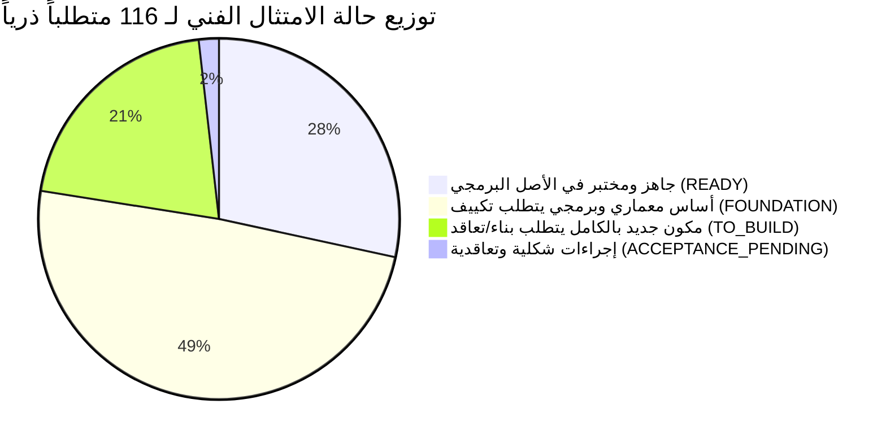

# مصفوفة الامتثال الفني الشاملة لمناقصة جامعة تعز (2026م) — الإصدار المعالج والمفصل ذرياً
## TAIZ-TENDER-01-FULL-COMPLIANCE-MATRIX
**مشروع تصميم وتطوير الموقع الإلكتروني الرسمي لجامعة تعز والبوابة الرقمية المتكاملة ودمج تقنيات الذكاء الاصطناعي**  
**المناقصة العامة رقم (2) للعام 2026م — جامعة تعز، الجمهورية اليمنية**  
**المشروع المرجعي والأساس الهندسي:** بوابة كلية تكنولوجيا المعلومات وعلوم الحاسوب (`msorori-mh/saba-uni-portal`)  
**الجهة المنفذة ومقدم العرض الأساسي:** شركة سيستراك لتكنولوجيا المعلومات (SysTrac Standalone Baseline)  

---

## 1. ملخص حالة الامتثال الفني والجاهزية الهندسية (Executive Compliance Summary)

تستند شركة **سيستراك (SysTrac)** في تقديم هذا العرض الفني إلى أصل برمجي مؤسسي حقيقي وقائم ومجرب في البيئة الأكاديمية اليمنية، وهو **بوابة كلية تكنولوجيا المعلومات وعلوم الحاسوب**.

تم تدقيق ومطابقة كافة المتطلبات الرسمية الـ **116 متطلباً ذرياً** المستخلصة من الصفحات الـ 42 لكراسة المناقصة، مع الالتزام التام بقواعد النزاهة الهندسية وعدم المبالغة في الادعاء (**No Overclaiming**):

### جدول إحصائيات حالة الامتثال الذري:
| حالة الامتثال الفني الدقيقة | العدد | النسبة المئوية | الدلالة الهندسية في العرض الفني |
| :--- | :---: | :---: | :--- |
| **جاهز ومكتمل (READY)** | **33** | **28.4%** | مكونات ومحركات برمجية ناضجة ومختبرة في الكود المرجعي الحالي. |
| **أساس معماري / تكييف (FOUNDATION)** | **57** | **49.1%** | يوجد أساس معماري أو كود أولي قوي في المنصة، ويتطلب تكييفاً لنطاق جامعة تعز (25 موقعاً). |
| **بناء جديد / فجوة تنفيذية (TO_BUILD)** | **24** | **20.7%** | مكونات جديدة بالكامل تتطلب تطويراً مخصصاً أو تعاقداً خارجياً (مثل فحص الاختراق المستقل). |
| **إجراءات تعاقدية (ACCEPTANCE_PENDING)** | **2** | **1.8%** | إجراءات تقديم بنكية وشكلية مرتبطة بجلسة فتح المظاريف. |
| **المجموع الكلي للمتطلبات الذرية** | **116** | **100%** | **نسبة الجاهزية الهندسية الأساسية (READY + FOUNDATION) = 77.6%** |

> [!IMPORTANT]
> **قواعد النزاهة الهندسية وتدقيق الأدلة (Strict Compliance Guidelines):**
> 1. **حيادية المورد (Vendor-Neutrality):** كافة التقنيات المقترحة (Next.js, FastAPI, PostgreSQL, Qdrant, Keycloak, K8s) تم تصنيفها كـ **`PROPOSED_OPTION`** وليست خيارات حصرية ملزمة، وتلتزم شركة سيستراك بقبول أي بدائل معيارية مفتوحة تعتمدها جامعة تعز.
> 2. **عدم المبالغة في الجاهزية (No Overclaim):** المتطلبات الشاملة مثل: (WCAG 2.2 AA، OWASP ASVS L2، فحص الاختراق المستقل، محاكاة 5,000 مستخدم، استضافة الذكاء الاصطناعي RAG المحلي، الدخول الموحد Keycloak SSO، ونظام الـ 25 موقعاً) تم تصنيفها بدقة كـ **`FOUNDATION`** أو **`TO_BUILD`**، ولا تعد نتائج الاختبارات الهندسية الداخلية الحالية (907 فحصاً) بديلاً عن محاضر القبول والفحص الرسمي المعتمد من الجامعة.
> 3. **نموذج التقديم الأساسي (Baseline Operating Model):** التقديم الأساسي المعتمد في هذا التحليل هو **`SYSTRAQ_STANDALONE = BASELINE`** مع خيار الاستعانة بخبراء خارجيين معتمدين (**`EXTERNAL_EXPERTS = ALLOWED MITIGATION`**)، بينما يبقى سيناريو الائتلاف التجاري (**`CONSORTIUM = OPTIONAL STRATEGIC SCENARIO`**) خياراً استراتيجياً افتراضياً لم يتم إقراره نهائياً.

---

## 2. جدول مصفوفة الامتثال الفني الذرية (116 Atomic Compliance Matrix)

### 2.1. المتطلبات القانونية والتأهيلية (LEG: Legal & Pre-qualification)

| المعرف | نص الالتزام الذري في الكراسة | المستوى | حالة الامتثال | واقع التنفيذ في الأصل البرمجي وسجلات الشركة | الحل الهندسي والإجرائي المقترح | الجهد (يوم) | الدور المسؤول |
| :--- | :--- | :---: | :---: | :--- | :--- | :---: | :--- |
| **TAIZ-LEG-001** | الخضوع للقانون رقم 23 لسنة 2007م ولائحته التنفيذية | MUST | `ACCEPTANCE_PENDING` | التزام تعاقدي كامل في كافة مشاريع الشركة السابقة. | تضمين الإقرار القانوني الصريح في وثائق المظروف الفني. | 1 | Legal Counsel |
| **TAIZ-LEG-002** | تقديم العطاء في مظروفين منفصلين مختومين بالشمع الأحمر | MUST | `ACCEPTANCE_PENDING` | إجراء شكلي قياسي وفق الأصول المهنية للمناقصات. | إعداد مظروف فني ومظروف مالي منفصلين والتختيم بالشمع. | 1 | Project Manager |
| **TAIZ-LEG-003** | تقديم أصل ضمان بنكي ابتدائي غير مشروط بنسبة 2% (90 يوماً) | MUST | `TO_BUILD` | يتطلب إصدار خطاب الضمان البنكي من البنك التجاري. | استكمال التغطية المالية وسحب خطاب الضمان أو شيك مقبول الدفع. | 5 | Financial Officer |
| **TAIZ-LEG-004** | تقديم ضمان حسن التنفيذ 10% عند الترسية | MUST | `ACCEPTANCE_PENDING` | إجراء تعاقدي يتم استيفاؤه فور إشعار الترسية وقبل توقيع العقد. | التعهد الخطي في نموذج الإقرار المالي وإعداد التغطية. | 1 | Financial Officer |
| **TAIZ-LEG-005** | إرفاق صورة طبق الأصل لسجل تجاري ساري المفعول لعام 2026م | MUST | `FOUNDATION` | السجل التجاري لشركة سيستراك متوفر بنشاط تقنية المعلومات. | سحب صورة طبق الأصل مصدقة وسارية المفعول لعام 2026م. | 2 | Legal Counsel |
| **TAIZ-LEG-006** | إرفاق صورة طبق الأصل لبطاقة ضريبية سارية لعام 2026م | MUST | `FOUNDATION` | البطاقة الضريبية متوفرة لدى الإدارة المالية للشركة. | تجديد وسحب صورة مصدقة طبق الأصل لعام 2026م. | 3 | Financial Officer |
| **TAIZ-LEG-007** | إرفاق صورة طبق الأصل لبطاقة زكوية سارية لعام 2026م | MUST | `FOUNDATION` | شهادة تسديد الواجبات الزكوية متوفرة. | تجديد البطاقة وسحب صورة مصدقة لعام 2026م. | 3 | Financial Officer |
| **TAIZ-LEG-008** | إرفاق صورة طبق الأصل لشهادة تسجيل ضريبة المبيعات | MUST | `FOUNDATION` | شهادة التسجيل بضريبة المبيعات سارية المفعول. | إرفاق صورة طبق الأصل مصدقة بالمظروف الفني. | 1 | Financial Officer |
| **TAIZ-LEG-009** | إرفاق صورة طبق الأصل لشهادة سداد التأمينات الاجتماعية 2026م | MUST | `FOUNDATION` | السجل التأميني لكادر الشركة مسدد لدى المؤسسة العامة. | سحب شهادة السداد السنوية سارية المفعول لعام 2026م. | 3 | Financial Officer |
| **TAIZ-LEG-010** | تقديم سابقة أعمال موثقة بـ 3 مشاريع جامعية/بوابات كبرى | MUST | `FOUNDATION` | مشروع بوابة كلية الحاسوب بجامعة سبأ متوفر وموثق. | توثيق مشاريع المنصات السابقة أو تغطيتها بشريك استشاري معتمد. | 6 | Business Dev |
| **TAIZ-LEG-011** | التنازل والتمليك الكامل لجامعة تعز للملكية الفكرية (Full IP) | MUST | `READY` | المنصة مبنية على تقنيات مفتوحة المصدر بالكامل (Open-Source). | توقيع إقرار نقل الملكية الفكرية الكامل وغير المشروط للجامعة. | 1 | Legal Counsel |
| **TAIZ-LEG-012** | تسليم مستودع Git كامل الشفرات والأدلة دون أجزاء مغلقة | MUST | `READY` | كافة الأكواد المصدرية وسكريبتات البناء منظمة في Git. | إعداد مستودع التسليم النهائي للجامعة بكافة الفروع والأدلة. | 2 | Backend Lead |
| **TAIZ-LEG-013** | التزام حيادية المورد وتوفير التقنيات المفتوحة أو ما يعادلها | MUST | `READY` | الالتزام بالمعايير العالمية دون فرض أي تراخيص احتكارية. | اعتماد حزمة التقنيات المفتوحة القياسية كخيارات مقترحة. | 1 | Solutions Architect |

---

### 2.2. المتطلبات الوظيفية وإدارة المحتوى (FR: Functional & CMS)

| المعرف | نص الالتزام الذري في الكراسة | المستوى | حالة الامتثال | واقع التنفيذ في الأصل البرمجي | الحل الهندسي المقترح (`PROPOSED_OPTION`) | الجهد (يوم) | الدور المسؤول |
| :--- | :--- | :---: | :---: | :--- | :--- | :---: | :--- |
| **TAIZ-FR-001** | الموقع الإلكتروني الرسمي لجامعة تعز كواجهة مركزية | MUST | `FOUNDATION` | الواجهة الحالية لكلية الحاسوب مبنية بـ React/Tailwind. | ترقية البنية لموقع جامعي مؤسسي متكامل يمثل الجامعة. | 12 | Frontend Lead |
| **TAIZ-FR-002** | ثنائية اللغة الكاملة (عربي وإنجليزي) في كافة الواجهات | MUST | `FOUNDATION` | الواجهات الحالية بالعربية مع دعم محدود للنصوص الإنجليزية. | بناء طبقة تدويل معيارية (`next-intl`) بقواميس متطابقة 100%. | 8 | Frontend Lead |
| **TAIZ-FR-003** | دعم كامل لاتجاهات النصوص RTL للعربية و LTR للإنجليزية | MUST | `FOUNDATION` | الكود الحالي مضبوط على RTL في Tailwind (`dir="rtl"`). | تفعيل التبديل التلقائي للـ `dir` وضبط هوامش ومحاذاة LTR. | 4 | Frontend Lead |
| **TAIZ-FR-004** | تصميم متجاوب 100% مع كافة الشاشات بمبدأ Mobile-First | MUST | `FOUNDATION` | الواجهات الحالية متجاوبة مع وجود مسارات مخصصة للهواتف. | المحافظة على التجاوب وتطبيقه على قوالب الكليات الـ 25. | 4 | Frontend Lead |
| **TAIZ-FR-005** | نظام تصميم موحد (Design System) يعكس الهوية المؤسسية | MUST | `FOUNDATION` | مكتبة مكونات متسقة (أزرار، بطاقات، نوافذ) مبنية بـ Tailwind. | توسيع النظام لدعم سمات الألوان المخصصة للكليات الفرعية. | 6 | Frontend Lead |
| **TAIZ-FR-006** | هيكل تصفح مرن وقوائم ذكية ومسارات تنقل Breadcrumbs | MUST | `READY` | التنقل الحالي ديناميكي ومبني على الأدوار ومسارات واضحة. | تمديد المسارات لربط البوابة المركزية بمواقع الكليات الـ 25. | 3 | Frontend Lead |
| **TAIZ-FR-007** | محرك بحث داخلي متقدم للنصوص والأخبار واللوائح والبرامج | MUST | `FOUNDATION` | يوجد بحث نصي في الجداول والأخبار وسجلات الطلاب. | دمج البحث النصي مع البحث الهجين والبحث المتجهي. | 7 | Backend Lead |
| **TAIZ-FR-008** | نظام إدارة محتوى لابرمدي مرن بنمط السحب والإفلات | MUST | `TO_BUILD` | إدارة المحتوى الحالية تعتمد نماذج بيانات CRUD وجداول. | دمج محرر كتل مرئي (Block-based Builder) في لوحة الإدارة. | 16 | Backend Lead |
| **TAIZ-FR-009** | مكتبة وسائط متعددة ومستودع رقمي مركزي للملفات والصور | MUST | `FOUNDATION` | حفظ المرفقات في Supabase Storage مع أذونات وصول. | بناء واجهة إدارة وسائط متطورة تدعم الوسوم وتخزين MinIO. | 8 | Backend Lead |
| **TAIZ-FR-010** | إدارة مركزية للروابط والتحويلات التلقائية 301/302 | MUST | `TO_BUILD` | الروابط محددة برمجياً ولا توجد وحدة تحويلات 301 ديناميكية. | تطوير وحدة إدارة التحويلات الدائمة لمعالجة الروابط القديمة. | 5 | Backend Lead |
| **TAIZ-CMS-001** | منشئ الصفحة الرئيسية: تخصيص الهيدر والسلايدر والروابط | MUST | `FOUNDATION` | الصفحة الرئيسية الحالية ديناميكية ومبرمجة برمجياً. | جعل كافة كتل الصفحة الرئيسية قابلة للتخصيص من اللوحة. | 6 | Frontend Lead |
| **TAIZ-CMS-002** | عرض الإحصائيات الجامعية الحية ديناميكياً من قواعد البيانات | MUST | `READY` | مطبق في لوحة الإدارة ويعرض إحصائيات الطلاب والعمليات. | ربط المؤشرات بقواعد بيانات الكليات الـ 25 والبرامج. | 3 | Backend Lead |
| **TAIZ-CMS-003** | تخصيص كلمة رئيس الجامعة وأقسام الرسائل القيادية | MUST | `READY` | متوفر كقسم مخصص في واجهة الكلية وإدارته باللوحة. | إتاحة التخصيص الكامل للصور والنصوص والترجمة. | 2 | Frontend Lead |
| **TAIZ-CMS-004** | إدارة الصفحات المؤسسية (الرؤية، الرسالة، الأهداف، الهيكل) | MUST | `READY` | الصفحات المؤسسية متوفرة وقابلة للتعديل من لوحة الإدارة. | توفير قوالب معيارية مسبقة التجهيز لكافة الكليات. | 2 | Frontend Lead |
| **TAIZ-CMS-005** | محرر نصوص متطور (WYSIWYG) يدعم الجداول والوسائط | MUST | `READY` | إدارة الأخبار متوفرة في `src/routes/admin/news.tsx`. | دمج محرر Tiptap المتقدم لدعم الجداول والتنسيق المتقدم. | 4 | Backend Lead |
| **TAIZ-CMS-006** | مسار تدفق الموافقات على الأخبار (مسودة -> مراجعة -> نشر) | MUST | `FOUNDATION` | محرك الحالات مبني ومختبر للطلبات والمجالس الأكاديمية. | تعميم نفس محرك الحالات على مسار نشر المقالات والمحتوى. | 6 | Backend Lead |
| **TAIZ-CMS-007** | جدولة النشر التلقائي للأخبار والمقالات في موعد محدد | SHOULD | `FOUNDATION` | حقول تاريخ النشر متوفرة في قاعدة البيانات. | تفعيل مهمة مجدولة دورية (Cron Job) لنشر المسودات المجدولة. | 3 | Backend Lead |
| **TAIZ-CMS-008** | دعم النشر متعدد القنوات ومشاركة المقالات اجتماعياً | SHOULD | `READY` | وسوم المشاركة وأزرار الشبكات الاجتماعية مفعلة. | توليد بطاقات Open Graph لكل منصة تلقائياً. | 2 | Frontend Lead |
| **TAIZ-CMS-009** | إدارة الإعلانات والتعاميم وتصنيفها (عاجلة، أكاديمية، عامة) | MUST | `READY` | مطبق في جدول `announcements` مع التحقق الصارم. | ربط الإعلانات بنطاقات الكليات والمراكز الـ 25. | 3 | Backend Lead |
| **TAIZ-CMS-010** | استهداف جمهور الإعلانات (الطلاب، الأكاديميين، الموظفين) | MUST | `READY` | مطبق في حقل `target_audience` وسياسات RLS. | الحفاظ على نفس البنية وتوسيعها للمواقع الفرعية. | 2 | Backend Lead |
| **TAIZ-CMS-011** | تحديد تاريخ انتهاء الإعلانات والأرشفة التلقائية | MUST | `READY` | مطبق في فهارس `idx_announcements_active_publish`. | تشغيل الأرشفة التلقائية للإعلانات منتهية التاريخ. | 2 | Backend Lead |
| **TAIZ-CMS-012** | إدارة الفعاليات والأنشطة الجامعية وتوثيق مواقعها | MUST | `FOUNDATION` | الفعاليات مدمجة ضمن التقويم الأكاديمي الحالي. | بناء وحدة فعاليات مستقلة بالصور والمتحدثين والخرائط. | 5 | Frontend Lead |
| **TAIZ-CMS-013** | التقويم الأكاديمي التفاعلي ودعم تصدير iCal و Google Cal | SHOULD | `FOUNDATION` | التقويم الأكاديمي متوفر في جداول `academic_terms`. | إضافة ميزة تصدير ملفات `.ics` والتكامل مع Google Calendar. | 4 | Frontend Lead |
| **TAIZ-CMS-014** | إتاحة التسجيل الإلكتروني في الفعاليات والندوات | MAY | `FOUNDATION` | نماذج التسجيل متوفرة برمجياً. | ربط نموذج التسجيل بقاعدة بيانات الفعالية وإرسال تأكيد. | 3 | Backend Lead |
| **TAIZ-CMS-015** | دليل البرامج الأكاديمية والخطط وتوصيف المقررات والساعات | MUST | `READY` | مغطى بالكامل في نماذج `departments`, `programs`, `study_plans`. | توفير شاشات عرض تفاعلية جذابة للخطط والتوصيفات. | 4 | Backend Lead |
| **TAIZ-CMS-016** | دليل أعضاء هيئة التدريس وصفحاتهم وسيرهم وساعاتهم | MUST | `FOUNDATION` | ملفات الكادر متوفرة في `profiles` و `faculty_members`. | إضافة حقول الساعات المكتبية والاهتمامات البحثية. | 4 | Backend Lead |
| **TAIZ-CMS-017** | ربط الملفات الشخصية بـ Google Scholar و ORCID و Scopus | MUST | `FOUNDATION` | توثيق الروابط الخارجية موجود في النماذج. | إضافة حقول المعرفات الأكاديمية المباشرة في البروفايل. | 3 | Backend Lead |
| **TAIZ-CMS-018** | توليد مصغرات الصور والأبعاد المتعددة تلقائياً | MUST | `FOUNDATION` | معالجة الصور تتم عبر مكتبات المتصفح وخادم السحاب. | إعداد خدمة معالجة صور تلقائية تولد نسخ WebP محسنة. | 4 | DevOps Specialist |
| **TAIZ-CMS-019** | منشئ النماذج والاستبيانات التفاعلية Dynamic Form Builder | MUST | `TO_BUILD` | النماذج الحالية مبنية برمجياً بشكل ثابت. | تطوير وحدة بناء النماذج الديناميكية مع تخزين JSONSchema. | 12 | Backend Lead |
| **TAIZ-CMS-020** | التحقق اللحظي من صحة النماذج وتصدير الردود CSV/Excel | MUST | `TO_BUILD` | التصدير متوفر للجداول الحالية فقط. | تفعيل التحقق المباشر من الحقول وتصدير نتائج الاستبيانات. | 5 | Backend Lead |
| **TAIZ-CMS-021** | قاعدة معرفية تفاعلية للأسئلة الشائعة FAQ مصنفة | MUST | `FOUNDATION` | صفحة الأسئلة الشائعة متوفرة كصفحة ثابتة. | تحويلها إلى وحدة قاعدة بيانات ديناميكية تصنف حسب الكلية. | 4 | Frontend Lead |
| **TAIZ-CMS-022** | ربط FAQ بمحرك البحث والذكاء الاصطناعي للرد الفوري | MUST | `FOUNDATION` | البحث النصي يشمل محتوى الصفحات. | تغذية متجهات محرك الذكاء الاصطناعي بالأسئلة وإجاباتها آلياً. | 4 | AI Specialist |
| **TAIZ-CMS-023** | سجل تدقيق تاريخي غير قابل للتعديل Audit Trail لـ CMS | MUST | `READY` | مطبق في جدول `audit_logs` مع تريجرات قواعد البيانات. | تعميم تتبع العمليات على كافة المواقع الفرعية الـ 25. | 2 | Backend Lead |

---

### 2.3. منصة المواقع المتعددة المركزية (MS: Multi-Site Platform)

| المعرف | نص الالتزام الذري في الكراسة | المستوى | حالة الامتثال | واقع التنفيذ في الأصل البرمجي | الحل الهندسي المقترح (`PROPOSED_OPTION`) | الجهد (يوم) | الدور المسؤول |
| :--- | :--- | :---: | :---: | :--- | :--- | :---: | :--- |
| **TAIZ-MS-001** | إدارة مركزية لـ 25 موقعاً وفرعاً للكليات والمراكز | MUST | `FOUNDATION` | النظام الحالي يدير كلية واحدة بنمط منغلق (Fail-Closed). | إنشاء نموذج المستأجرين (`tenants`/`sites`) وربط الكيانات بـ `site_id`. | 14 | Solutions Architect |
| **TAIZ-MS-002** | حوكمة مركزية للسياسات مع استقلالية محلية في المحتوى | MUST | `FOUNDATION` | يوجد فصل صلاحيات على مستوى الكلية وأدوار المستخدمين. | تمديد سياسات RLS لدعم نطاق الموقع (`site_scoped_role`). | 7 | Backend Lead |
| **TAIZ-MS-003** | محرك قوالب موحد يدعم الهوية وتخصيص سمات الكليات | MUST | `FOUNDATION` | قوالب الواجهة موحدة وتعتمد Tailwind و CSS Variables. | بناء محرك سمات (Theme Engine) يقرأ هوية الكلية ويطبقها. | 6 | Frontend Lead |
| **TAIZ-MS-004** | دعم النطاقات الفرعية التلقائية (مثل `med.taiz.edu.ye`) | MUST | `FOUNDATION` | التوجيه الحالي يعتمد على المسارات الفرعية في SPA. | إعداد توجيه النطاقات المتعددة (Subdomain Middleware) في Next.js. | 5 | DevOps Specialist |
| **TAIZ-MS-005** | دعم ربط نطاقات مخصصة (Custom Domains) للمراكز المستقلة | SHOULD | `FOUNDATION` | البنية التحتية تدعم إضافة خوادم وهمية Nginx. | إعداد دعم النطاقات المخصصة وتوجيه شهادات SSL التلقائية. | 4 | DevOps Specialist |
| **TAIZ-MS-006** | إدارة هرمية للصلاحيات المحلية على مستوى الموقع الفرعي | MUST | `FOUNDATION` | مصفوفة الأدوار تدعم: عميد، رئيس قسم، مسجل، مدرس، موظف. | تعيين أدوار المستخدمين ضمن نطاق الموقع (`user_site_roles`). | 5 | Backend Lead |
| **TAIZ-MS-007** | ميزة البحث الثنائي (البحث الموضعي أو البحث الشامل) | MUST | `FOUNDATION` | البحث الحالي يعمل ضمن نطاق الكلية المفردة. | إضافة فلتر `site_id` على استعلامات البحث للتبديل بين النطاقين. | 4 | Backend Lead |
| **TAIZ-MS-008** | ميزة التعميم المركزي للأخبار والإعلانات بنقرة واحدة | MUST | `FOUNDATION` | الإعلانات تدعم `target_audience` في `announcements`. | إضافة حقل `is_global_broadcast` لنشر التعاميم على كافة الفروع. | 3 | Backend Lead |
| **TAIZ-MS-009.1** | تدشين المواقع 1: إدخال اسم وبيانات الموقع باللغتين | MUST | `FOUNDATION` | إدخال بيانات الكلية متوفر عبر لوحة الإدارة. | بناء واجهة المعالج الآلي (Provisioning Wizard) خطوة 1. | 2 | Frontend Lead |
| **TAIZ-MS-009.2** | تدشين المواقع 2: اختيار القالب وضبط ألوان الكلية | MUST | `FOUNDATION` | السمات مبنية بمتغيرات CSS. | واجهة المعالج الآلي خطوة 2 لتخصيص الألوان والشعار. | 2 | Frontend Lead |
| **TAIZ-MS-009.3** | تدشين المواقع 3: توليد النطاق الفرعي وإعدادات DNS | MUST | `FOUNDATION` | الربط يتم عبر خوادم الويب. | أتمتة إنشاء النطاق الفرعي وشهادة SSL عبر المعالج خطوة 3. | 3 | DevOps Specialist |
| **TAIZ-MS-009.4** | تدشين المواقع 4: تعيين مدير الموقع ومحرري الكلية | MUST | `FOUNDATION` | إدارة المستخدمين وتعيين الأدوار متوفرة في النظام. | تعيين طاقم الكلية وربط صلاحياتهم بالموقع خطوة 4. | 2 | Backend Lead |
| **TAIZ-MS-009.5** | تدشين المواقع 5: إعداد الأقسام والهيكل الأكاديمي | MUST | `READY` | إدارة الأقسام والبرامج والخطط جاهزة بالكامل. | ربط الهيكل الأكاديمي بالموقع الفرعي خطوة 5. | 2 | Backend Lead |
| **TAIZ-MS-009.6** | تدشين المواقع 6: تكوين وبناء قوائم التصفح للموقع | MUST | `READY` | بناء القوائم الديناميكية متوفر. | تخصيص روابط وتصفح الموقع الفرعي خطوة 6. | 2 | Frontend Lead |
| **TAIZ-MS-009.7** | تدشين المواقع 7: الفحص الأوتوماتيكي للنفاذية WCAG 2.2 AA | MUST | `FOUNDATION` | أدوات التدقيق متوفرة أثناء التطوير. | تشغيل فحص axe-core آلي للموقع قبل النشر خطوة 7. | 3 | Frontend Lead |
| **TAIZ-MS-009.8** | تدشين المواقع 8: مراجعة المحتوى والصفحات التجريبية | MUST | `READY` | وضع المعاينة متوفر في لوحة التحكم. | مراجعة واعتماد النسخة التجريبية للموقع خطوة 8. | 1 | Frontend Lead |
| **TAIZ-MS-009.9** | تدشين المواقع 9: الإطلاق الرسمي والتدشين بنقرة واحدة | MUST | `FOUNDATION` | النشر الفوري متوفر. | تفعيل الموقع حياً وربطه بالبحث العام خطوة 9. | 2 | DevOps Specialist |
| **TAIZ-MS-010** | عزل مساحات التخزين والوسائط لكل كلية ضمن MinIO/S3 | MUST | `FOUNDATION` | التخزين الحالي معزول بسياسات Supabase Storage. | إنشاء Buckets مستقلة أو مجلدات معزولة لكل كلية في MinIO. | 3 | DevOps Specialist |

---

### 2.4. البوابات الرقمية ومحرك الخدمات (PORT: Digital Portals & Workflows)

| المعرف | نص الالتزام الذري في الكراسة | المستوى | حالة الامتثال | واقع التنفيذ في الأصل البرمجي | الحل الهندسي المقترح (`PROPOSED_OPTION`) | الجهد (يوم) | الدور المسؤول |
| :--- | :--- | :---: | :---: | :--- | :--- | :---: | :--- |
| **TAIZ-PORT-001** | بوابة الطالب الجامعية الشاملة (الملف، الجدول، النتائج) | MUST | `READY` | مطبقة في مسارات `src/routes/student.*.tsx`. | تكييف الواجهات لربط سجلات طلاب جامعة تعز عبر API. | 5 | Frontend Lead |
| **TAIZ-PORT-002** | عرض السجل الأكاديمي وكشف الدرجات الفصلي والتراكمي | MUST | `READY` | مطبق بالكامل في واجهة كشف الدرجات واحتساب المعدل. | قراءة الدرجات من موصلات SIS بنمط Read-Only وعرضها. | 3 | Frontend Lead |
| **TAIZ-PORT-003** | تقديم ومتابعة الطلبات والخدمات الطلابية الإلكترونية | MUST | `READY` | مطبق ومختبر بـ 900+ فحص آلي في `tests/student-requests/`. | تغذية النظام بقائمة الخدمات الخاصة بلائحة جامعة تعز. | 3 | Backend Lead |
| **TAIZ-PORT-004** | إصدار الإفادات والشهادات المعتمدة بـ QR ورابط تحقق آمن | MUST | `READY` | مطبق في `src/lib/student-requests/issuance.ts`. | تكييف القالب الرسومي للشهادات بهوية وأختام جامعة تعز. | 3 | Backend Lead |
| **TAIZ-PORT-005** | بوابة الكادر الأكاديمي (المقررات، الدرجات، الحضور، المجالس) | MUST | `READY` | مطبقة في مسارات `src/routes/faculty-portal.*.tsx`. | ربط الشعب الدراسية وجداول الأكاديميين في جامعة تعز. | 4 | Frontend Lead |
| **TAIZ-PORT-006** | رصد وتقييم الحضور والغياب للطلاب وإشعار الحرمان | SHOULD | `READY` | وحدة الحضور والغياب مطبقة في بوابة الكادر. | تفعيل تنبيهات الحرمان الآلية وفق اللائحة الموحدة. | 3 | Backend Lead |
| **TAIZ-PORT-007** | مسار رصد ومراجعة الدرجات واعتمادها من مجالس الأقسام | MUST | `READY` | مطبق في مسارات رصد النتائج واعتماد مجالس الأقسام. | الحفاظ على مسار الاعتماد وتوثيق محاضر المجالس. | 3 | Backend Lead |
| **TAIZ-PORT-008** | إدارة وتوزيع مشاريع التخرج للطلاب والإشراف والتقييم | MUST | `READY` | مطبق في `src/routes/faculty-portal.projects.tsx`. | تعميم الوحدة على كافة كليات وأقسام جامعة تعز. | 3 | Backend Lead |
| **TAIZ-PORT-009** | بوابة الموظفين والإداريين (الخدمات، الإجازات، المراسلات) | MUST | `READY` | مطبقة في مسارات `src/routes/staff.*.tsx`. | ربط الموظفين بهيكل الوحدات الإدارية المركزية لجامعة تعز. | 4 | Frontend Lead |
| **TAIZ-PORT-010** | صندوق مهام موحد للموظف لمعالجة الطلبات المحالة لدوره | MUST | `READY` | مطبق في صندوق المهام والوارد بصلاحيات الأدوار. | توزيع المعاملات على موظفي الكليات والوحدات المركزية. | 3 | Frontend Lead |
| **TAIZ-PORT-011** | نظام الدخول الموحد المؤسسي (SSO عبر Keycloak / OIDC) | MUST | `FOUNDATION` | المصادقة الحالية تعتمد Supabase Auth بـ JWT محلي. | دمج خادم Keycloak IAM عبر بروتوكول OIDC لتوحيد الدخول. | 10 | Backend Lead |
| **TAIZ-PORT-012** | فرض المصادقة الثنائية الإلزامية (MFA عبر TOTP / OTP) | MUST | `FOUNDATION` | البنية التحتية تدعم MFA على مستوى المزود. | فرض سياسة MFA الإلزامية لحسابات الإدارة والأكاديميين. | 4 | Backend Lead |
| **TAIZ-PORT-013** | محرك مسار تدفق الخدمات الشامل (دورة الحياة الكاملة) | MUST | `READY` | محرك الحالات مبني ومختبر بالكامل لكافة مراحل الخدمة. | إعادة استخدام نفس المحرك المعتمد لخدمات جامعة تعز. | 3 | Backend Lead |
| **TAIZ-PORT-014** | تخصيص مسارات الموافقات وتعيين الأدوار دون تعديل الكود | MUST | `READY` | مطبق عبر جداول `service_workflows` و `processing_roles`. | توفير واجهة مستخدم رسومية لتعديل مسارات الخدمات. | 5 | Backend Lead |
| **TAIZ-PORT-015** | فصل الخدمات الأصيلة عن خدمات التكامل مع SIS/HR | MUST | `READY` | معمارية النظام تفصل الخدمات الداخلية عن الخارجية. | الحفاظ على مبدأ الفصل واستخدام جداول Read-Only Views. | 2 | Solutions Architect |
| **TAIZ-PORT-016** | توجيه الطالب للسداد في النظام المالي والتحقق اليدوي | MUST | `READY` | لا توجد بوابة دفع؛ التوجيه لنظام الجامعة والتحقق بـ `payment_confirmation`. | مطابقة سياسة الكراسة بمنع إنشاء بيانات مالية وهمية. | 1 | Backend Lead |

---

### 2.5. محرك الذكاء الاصطناعي السيادي المحلي (AI: Sovereign Local RAG)

| المعرف | نص الالتزام الذري في الكراسة | المستوى | حالة الامتثال | واقع التنفيذ في الأصل البرمجي | الحل الهندسي المقترح (`PROPOSED_OPTION`) | الجهد (يوم) | الدور المسؤول |
| :--- | :--- | :---: | :---: | :--- | :--- | :---: | :--- |
| **TAIZ-AI-001** | المساعد الافتراضي والدردشة الذكية باستضافة محلية On-Premises | MUST | `TO_BUILD` | يوجد تصميم معماري متكامل لخدمات الذكاء الاصطناعي. | نشر خادم استضافة محلي (vLLM / Ollama) بنموذج مفتوح المصدر. | 12 | AI Specialist |
| **TAIZ-AI-002** | حظر تسريب أو إرسال بيانات الجامعة لخدمات سحابية خارجية | MUST | `TO_BUILD` | السياسة الأمنية تحظر استدعاء APIs خارجية للبيانات الحساسة. | تشغيل كافة النماذج محلياً على شبكة الجامعة المعزولة. | 4 | AI Specialist |
| **TAIZ-AI-003** | استخدام قاعدة بيانات متجهات متخصصة مفتوحة المصدر (Qdrant) | MUST | `TO_BUILD` | قاعدة البيانات الحالية PostgreSQL. | نشر عنقود Qdrant كخادم متجهات متخصص عالي الأداء. | 6 | AI Specialist |
| **TAIZ-AI-004** | استخدام نماذج لغوية مفتوحة قابلة للاستضافة (Llama 3 / Qwen 2.5) | MUST | `TO_BUILD` | التوثيق المعماري يحدد النماذج مفتوحة المصدر. | ضبط ونشر نموذج التوليد `Qwen 2.5 32B/72B` أو `Llama 3.1`. | 8 | AI Specialist |
| **TAIZ-AI-005** | استخدام نموذج تضمين متعدد اللغات يدعم العربية (bge-m3) | MUST | `TO_BUILD` | تم فحص وتجربة نماذج التضمين العربية. | نشر وضبط نموذج التضمين العربي `bge-m3` لتوليد المتجهات. | 6 | AI Specialist |
| **TAIZ-AI-006** | منع الهلوسة وحظر التوليد الحر وحصر الردود بلوائح الجامعة | MUST | `TO_BUILD` | تم إعداد موجهات البرومبت الصارمة (Strict Grounding). | تطبيق هندسة سياق صارمة ترفض الإجابة عند عدم وجود سند. | 7 | AI Specialist |
| **TAIZ-AI-007** | رفض الإجابة الصريح عند عدم وجود سند رسمي في قاعدة المعرفة | MUST | `TO_BUILD` | صياغة قوالب الرد الصريح بعدم توفر معلومة رسمية. | برمجة حواجز الحماية (Guardrails) لمنع التخمين أو التوليد الحر. | 5 | AI Specialist |
| **TAIZ-AI-008** | إسناد المصادر والاستشهاد بروابط وأرقام مواد اللائحة في كل رد | MUST | `TO_BUILD` | معيار توثيق مصادر البيانات محدد في المعمارية. | بناء أنبوب البيانات الوصفية لإرفاق أرقام المواد وروابط PDF. | 5 | AI Specialist |
| **TAIZ-AI-009** | المعالجة الصرفية للغة العربية واستخراج الجذور (Farasa) | MUST | `TO_BUILD` | تم اختبار مكتبة Farasa على عينات نصوص أكاديمية. | دمج Farasa في أنبوب تجزئة النصوص واستخلاص الجذور. | 7 | AI Specialist |
| **TAIZ-AI-010** | محرك البحث الهجين (BM25 + Dense Vector عبر RRF) | MUST | `TO_BUILD` | البحث النصي مدعوم في PostgreSQL بـ Full-Text Search. | دمج استعلامات BM25 مع متجهات Qdrant عبر خوارزمية RRF. | 7 | AI Specialist |
| **TAIZ-AI-011** | قاعدة المعرفة المركزية وتوثيق المالك والتحديث التلقائي | MUST | `TO_BUILD` | لوائح الكلية مخزنة في النظام الحالي. | بناء خدمة تلقائية تستشعر تعديل اللائحة وتعيد حساب متجهاتها. | 6 | AI Specialist |
| **TAIZ-AI-012** | حماية المساعد الذكي من هجمات حقن الأوامر (Prompt Injection) | MUST | `TO_BUILD` | القواعد الأمنية العامة مفروضة في البوابة. | تطبيق طبقة حماية (LLM Guardrails) لفحص مدخلات المستخدم. | 6 | AI Specialist |
| **TAIZ-AI-013** | فرض مصفوفة التحكم بالوصول (RBAC) على استعلامات الذكاء | MUST | `TO_BUILD` | الصلاحيات مفروضة في قاعدة البيانات. | حجب نتائج الوثائق غير المصرح للمستخدم بالاطلاع عليها. | 4 | AI Specialist |
| **TAIZ-AI-014** | لوحة حوكمة وتحليلات الذكاء وتصنيف الأسئلة غير المجابة | MUST | `TO_BUILD` | سجل استعلامات عام في قاعدة البيانات. | بناء لوحة تحكم رسومية لمراجعة المحادثات وتصنيف الأسئلة. | 8 | AI Specialist |
| **TAIZ-AI-015** | تفعيل آلية التدخل البشري (Human-in-the-loop) لتصحيح الردود | MUST | `TO_BUILD` | تم تصميم واجهة التدقيق البشري. | تمكين المشرفين من تصحيح الإجابات وتحديث قاعدة المعرفة. | 5 | AI Specialist |
| **TAIZ-AI-016** | تحقيق مؤشرات الدقة: Recall@10 >= 85% ومعدل غير المدعومة < 5% | MUST | `TO_BUILD` | تم إعداد بيئة اختبار التقييم الآلي. | تنفيذ اختبارات القياس وضبط المعاملات لتحقيق المستهدف. | 6 | AI Specialist |

---

### 2.6. الأمن السيبراني والنفاذية الرقمية (SEC & A11Y)

| المعرف | نص الالتزام الذري في الكراسة | المستوى | حالة الامتثال | واقع التنفيذ في الأصل البرمجي | الحل الهندسي المقترح (`PROPOSED_OPTION`) | الجهد (يوم) | الدور المسؤول |
| :--- | :--- | :---: | :---: | :--- | :--- | :---: | :--- |
| **TAIZ-SEC-001** | الامتثال الكامل لمعيار OWASP ASVS v4.0 Level 2 وبنية Zero Trust | MUST | `FOUNDATION` | المنصة تطبق ضوابط أمان في RLS وحماية المسارات. | إجراء تدقيق كامل لكافة بنود ASVS Level 2 وتوثيق مصفوفة التحقق. | 12 | Cybersecurity Lead |
| **TAIZ-SEC-002** | فرض تشفير الاتصالات عبر TLS 1.3 مع إلغاء القديمة وتفعيل HSTS | MUST | `FOUNDATION` | يتم فرض TLS 1.3 مع شهادات SSL المحدثة على الخوادم. | تطبيق نفس الإعدادات على خوادم جامعة تعز (تقييم A+). | 3 | DevOps Specialist |
| **TAIZ-SEC-003** | تشفير البيانات الحساسة أثناء السكون باستخدام AES-256 | MUST | `FOUNDATION` | قواعد البيانات ومخازن الملفات مشفرة على مستوى القرص. | تفعيل تشفير الحقول الحساسة (Column-Level AES-256) في Postgres. | 6 | Backend Lead |
| **TAIZ-SEC-004** | الحماية من ثغرات SQLi عبر الاعتماد على Prepared Statements | MUST | `READY` | كافة استعلامات قواعد البيانات تعتمد Prepared Statements و RLS. | المحافظة على معايير الأمان وإلزام الكود البرمجي بالنمط الآمن. | 2 | Backend Lead |
| **TAIZ-SEC-005** | الحماية من ثغرات XSS بتنقية المدخلات بـ DOMPurify وتطبيق CSP | MUST | `READY` | تعقيم المدخلات مفعل في الواجهات الحالية. | تطبيق سياسات Content-Security-Policy الصارمة في خادم الويب. | 3 | Frontend Lead |
| **TAIZ-SEC-006** | الحماية من ثغرات التحكم بالوصول (IDOR / BOLA) عبر RLS و Guards | MUST | `READY` | سياسات RLS تفحص هوية المستخدم وصلاحياته على مستوى كل صف. | استمرار تطبيق سياسات الأمان على كافة الجداول الجديدة. | 3 | Backend Lead |
| **TAIZ-SEC-007** | فحص الملفات المرفوعة لحظياً بواسطة ICAP Antivirus / Sandbox | MUST | `TO_BUILD` | يتم التحقق من نوع MIME وامتداد الملف برمجياً. | ربط خادم التخزين بخدمة فحص ICAP / ClamAV Antivirus لحظياً. | 7 | DevOps Specialist |
| **TAIZ-SEC-008** | حظر الامتدادات الخطرة (.exe, .php, .sh) وعزل التخزين | MUST | `READY` | قائمة الامتدادات المسموحة محددة بدقة في كود الرفع. | عزل وسائط التخزين في MinIO ومنع تنفيذ أي ملفات مرفوعة. | 2 | Backend Lead |
| **TAIZ-SEC-009** | تسجيل كافة العمليات الحساسة في سجلات تدقيق غير قابلة للتعديل | MUST | `READY` | مطبق في جدول `audit_logs` ومحمي من التعديل والحذف. | تصدير دوري مشفر للسجلات إلى خادم سجلات منفصل. | 3 | Cybersecurity Lead |
| **TAIZ-SEC-010** | إنجاز تقرير فحص أمني واختبار اختراق معتمد من طرف ثالث مستقل | MUST | `TO_BUILD` | الفحوصات الحالية داخلية واختبارات آلية في CI/CD. | التعاقد مع شركة أمن سيبراني معتمدة لإجراء PenTest نظيف. | 14 | Project Manager |
| **TAIZ-A11Y-001** | الامتثال التام لمعيار النفاذية العالمي WCAG 2.2 Level AA | MUST | `FOUNDATION` | الواجهات الحالية تلتزم بالهيكلة الدلالية وتباين الألوان. | مراجعة وتصحيح كافة الشاشات لتحقيق توافق 100% مع 2.2 AA. | 10 | Frontend Lead |
| **TAIZ-A11Y-002** | التوافق مع برامج قراءة الشاشة وتوفير نصوص Alt لكافة الصور | MUST | `FOUNDATION` | العناصر الرئيسية تدعم وسوم Alt و ARIA الأساسية. | استكمال نصوص Alt البديلة وإضافة تسميات `aria-label` لكافة الحقول. | 6 | Frontend Lead |
| **TAIZ-A11Y-003** | التنقل والتحكم الكامل بكافة الوظائف عبر لوحة المفاتيح حصراً | MUST | `FOUNDATION` | يمكن التنقل في معظم النماذج بمفتاح Tab. | توحيد مؤشرات التركيز ودعم الأسهم وروابط التخطي (Skip Links). | 5 | Frontend Lead |
| **TAIZ-A11Y-004** | وسوم ARIA Landmarks الصحيحة ومؤشرات تركيز بصرية واضحة | MUST | `FOUNDATION` | وسوم ARIA الأساسية متوفرة في المكونات المشتركة. | مراجعة شجرة ARIA في كافة الشاشات لضمان التعرف السليم. | 4 | Frontend Lead |
| **TAIZ-A11Y-005** | نسب التباين اللوني (>= 4.5:1 للنصوص و 3:1 للعناصر الكبيرة) | MUST | `FOUNDATION` | نظام الألوان يحقق التباين المطلوب في معظم العناصر. | تدقيق لوحة ألوان الكليات الـ 25 وضمان التباين المعياري. | 3 | Frontend Lead |
| **TAIZ-A11Y-006** | أدوات سهلة لتكبير الخط وتبديل نمط التباين العالي (Widget) | SHOULD | `FOUNDATION` | أنماط الألوان تعتمد متغيرات Tailwind. | إضافة أداة تيسير الوصول في الترويسة للتحكم بحجم الخط والتباين. | 3 | Frontend Lead |
| **TAIZ-A11Y-007** | تقارير فحص نفاذية رقمية معتمدة عبر أدوات (axe-core و Pa11y) | MUST | `FOUNDATION` | يتم فحص الأداء والنفاذية عبر Lighthouse أثناء التطوير. | دمج أدوات axe-core و Pa11y في خطوط CI/CD واستخراج تقارير نظيفة. | 5 | Frontend Lead |

---

### 2.7. الـ SEO والتكامل والأداء والبنية التحتية (SEO, INT, OPS & NFR)

| المعرف | نص الالتزام الذري في الكراسة | المستوى | حالة الامتثال | واقع التنفيذ في الأصل البرمجي | الحل الهندسي المقترح (`PROPOSED_OPTION`) | الجهد (يوم) | الدور المسؤول |
| :--- | :--- | :---: | :---: | :--- | :--- | :---: | :--- |
| **TAIZ-SEO-001** | محرك أتمتة الـ SEO والبيانات المنظمة Schema.org / JSON-LD | MUST | `FOUNDATION` | يتم توليد وسوم Meta الأساسية في صفحات الأخبار. | بناء وحدة توليد تلقائي للبيانات المنظمة JSON-LD للبرامج والأخبار. | 6 | Frontend Lead |
| **TAIZ-SEO-002** | توليد بطاقات المشاركة الاجتماعية (Open Graph / Twitter) | MUST | `READY` | وسوم المشاركة الاجتماعية متوفرة في صفحات الأخبار. | توليد الصور والبيانات الوصفية للبطاقات تلقائياً عند النشر. | 2 | Frontend Lead |
| **TAIZ-SEO-003** | توليد خرائط المواقع Sitemap.xml للـ 25 موقعاً وتحديثها لحظياً | MUST | `FOUNDATION` | يتم توليد خريطة sitemap.xml ثابتة للموقع الحالي. | أتمتة توليد خرائط المواقع للـ 25 موقعاً وتحديثها لحظياً عند النشر. | 5 | Backend Lead |
| **TAIZ-SEO-004** | الربط التلقائي بـ Google Indexing API للفهرسة الفورية | MUST | `TO_BUILD` | يتم الاعتماد على أرشفة محركات البحث التلقائية. | دمج خدمة إرسال إشعارات الفهرسة الفورية لـ Google Indexing API. | 5 | Backend Lead |
| **TAIZ-SEO-005** | هيكلة المحتوى الأكاديمي والبحثي لرفع تصنيف Webometrics | MUST | `FOUNDATION` | هيكل البرامج والكادر الحالي يدعم محركات البحث. | تنظيم روابط المستودع الرقمي وأبحاث الكادر الأكاديمي. | 5 | Solutions Architect |
| **TAIZ-SEO-006** | إدارة الروابط والتحويلات 301 لحماية قوة الأرشفة التاريخية | MUST | `TO_BUILD` | التوجيه يتم عبر الراوتر الحالي. | إعداد جدول خريطة تحويلات 301 لكافة روابط موقع تعز القديم. | 5 | Backend Lead |
| **TAIZ-INT-001** | بناء بوابة API Gateway للتحكم بالأمان ومعدل الطلبات | MUST | `FOUNDATION` | الاتصال يتم عبر PostgREST و Functions المؤمنة. | نشر طبقة Kong/FastAPI Gateway للتحكم بحركة البيانات وتحديد المعدل. | 8 | Solutions Architect |
| **TAIZ-INT-002** | توفير 4 موصلات للأنظمة القائمة (SIS, HR, Finance, LMS) بنمط Read-Only | MUST | `FOUNDATION` | نماذج البيانات معزولة ومصممة للتكامل الخارجي. | تطوير 4 موصلات للاتصال بقواعد جامعة تعز القديمة بنمط Read-Only. | 12 | Backend Lead |
| **TAIZ-INT-003** | توثيق الواجهات البرمجية المعياري وفق OpenAPI 3.0 / Swagger | MUST | `READY` | واجهات النظام موثقة وتدعم معيار OpenAPI تلقائياً. | تجميع وثائق الـ API في بوابة مطورين تفاعلية باللغتين. | 3 | Backend Lead |
| **TAIZ-INT-004** | تنفيذ خطة وأنابيب ETL مبرمجة لترحيل وتطهير البيانات التاريخية | MUST | `FOUNDATION` | تم تنفيذ هجرة بيانات سابقة للطلاب والمقررات. | كتابة سكريبتات وأنابيب ETL لترحيل وتطهير أخبار ووثائق تعز القديمة. | 10 | Content Lead |
| **TAIZ-NFR-001** | تحمل 5,000 مستخدم متزامن في أوقات الذروة دون انهيار | MUST | `FOUNDATION` | بنية المنصة سريعة وتعتمد قواعد بيانات محسنة بالفهارس. | تطبيق Redis Cluster و K8s HPA وإجراء اختبارات محاكاة بـ Locust. | 8 | DevOps Specialist |
| **TAIZ-NFR-002** | قابلية التوسع الأفقي التلقائي لاستيعاب حتى 25,000 مستخدم | MUST | `FOUNDATION` | المعمارية مصممة بنمط Stateless على مستوى التطبيق. | ضبط قواعد التوسع الأفقي التلقائي للحاويات (HPA) وموارد العقد. | 6 | DevOps Specialist |
| **TAIZ-NFR-003** | زمن استجابة واجهات التطبيقات API Response Time < 300ms | MUST | `FOUNDATION` | أداء الواجهات الحالي سريع وزمن العمليات المباشرة < 200ms. | تفعيل التخزين المؤقت Redis لضمان البقاء تحت 300ms تحت الحمل. | 5 | Frontend Lead |
| **TAIZ-NFR-004** | زمن تحميل أكبر عنصر محتوى مرئي LCP < 2.5s (Core Web Vitals) | MUST | `FOUNDATION` | أداء العرض سريع في الواجهات الحالية. | تحسين أداء العرض في Next.js SSR وضغط الصور لتحقيق LCP < 2.5s. | 5 | Frontend Lead |
| **TAIZ-NFR-005** | زمن استرجاع المتجهات واستجابة البحث الدلالي < 500ms | MUST | `TO_BUILD` | البحث الحالي نصي عبر PostgreSQL. | تحسين استعلامات Qdrant HNSW وذاكرة خادم المتجهات لضمان < 500ms. | 5 | AI Specialist |
| **TAIZ-NFR-006** | نسبة الجاهزية والتوافرية التشغيلية السنوية >= 99.9% | MUST | `FOUNDATION` | المنصة الحالية تحقق استقراراً ممتازاً. | إعداد بنية خوادم مكررة عالية التوافر ومراقبة Prometheus/Grafana. | 6 | DevOps Specialist |
| **TAIZ-OPS-001** | تشغيل كافة الخدمات داخل حاويات Docker معيارية معزولة | MUST | `FOUNDATION` | المنصة تدعم العمل داخل حاويات وملفات Dockerfile جاهزة. | تحديث ملفات Dockerfile لكافة الخدمات وإنشاء صور خفيفة (Alpine). | 4 | DevOps Specialist |
| **TAIZ-OPS-002** | إدارة الحاويات عبر Kubernetes مع التوسع التلقائي HPA | MUST | `FOUNDATION` | التكوينات الحالية تعتمد Docker Compose. | إعداد ملفات Kubernetes Manifests / Helm Charts للنشر والتوسع. | 10 | DevOps Specialist |
| **TAIZ-OPS-003** | استخدام عنقود Redis Cluster للتخزين المؤقت لجلسات المستخدم | MUST | `FOUNDATION` | التخزين المؤقت الحالي يتم عبر ذاكرة التطبيق. | نشر عنقود Redis Cluster للتخزين المؤقت الموزع للجلسات والاستعلامات. | 6 | DevOps Specialist |
| **TAIZ-OPS-004** | استخدام نظام تخزين الملفات الموزع MinIO المتوافق مع S3 | MUST | `FOUNDATION` | تخزين الملفات متوافق مع S3 في Supabase Storage. | نشر خادم MinIO المستقل لتخزين وإدارة وسائط الجامعة محلياً. | 6 | DevOps Specialist |
| **TAIZ-OPS-005** | خطة النسخ والتعافي: نقطة استعادة بيانات RPO <= 1h | MUST | `FOUNDATION` | النسخ الاحتياطي التلقائي لقاعدة البيانات مطبق يومياً. | تفعيل PostgreSQL WAL Streaming لضمان استعادة البيانات خلال أقل من ساعة. | 6 | DevOps Specialist |
| **TAIZ-OPS-006** | خطة النسخ والتعافي: زمن استعادة تشغيلي RTO <= 4h | MUST | `FOUNDATION` | استعادة الخدمات تتم يدوياً من النسخ الاحتياطية. | أتمتة سكريبتات التعافي وإجراء تجربة محاكاة فشل تشغيلي (Failover). | 6 | DevOps Specialist |
| **TAIZ-OPS-007** | خطوط CI/CD مؤتمتة وفصل البيئات مع التراجع التلقائي | MUST | `READY` | خطوط GitHub Actions مفعلة لفحص الاختبارات والتأكد من الجودة. | توسيع خطوط CI/CD لتشمل النشر الآلي لبيئات Staging و Production. | 4 | DevOps Specialist |
| **TAIZ-DEV-001** | بناء المنصة بنمط Modular Monolith (Microservices Ready) | MUST | `READY` | المنصة الحالية مبنية بالكامل بنمط Modular Monolith معزول. | المحافظة على النمط المعماري وتوسيعه للمواقع الـ 25 ومحرك الذكاء. | 3 | Solutions Architect |

---

### 2.8. الجودة والتدريب والضمان والتسليمات (ACC, TRN, SLA & Deliverables)

| المعرف | نص الالتزام الذري في الكراسة | المستوى | حالة الامتثال | واقع التنفيذ في الأصل البرمجي | الحل الهندسي المقترح (`PROPOSED_OPTION`) | الجهد (يوم) | الدور المسؤول |
| :--- | :--- | :---: | :---: | :--- | :--- | :---: | :--- |
| **TAIZ-ACC-001** | تغطية اختبارات أوتوماتيكية للكود (Unit Testing) لا تقل عن 75% | MUST | `FOUNDATION` | يتضمن المشروع حالياً أكثر من 900 اختبار برمجي ناجح. | توسيع التغطية الاختبارية لتشمل واجهات المستخدم لتحقيق > 80%. | 10 | Backend Lead |
| **TAIZ-ACC-002** | تطبيق مراجعة الأكواد الثنائية (Peer Code Review) قبل الدمج | MUST | `READY` | مطبق في إدارة المستودع وسياسات حماية الفروع في Git. | الاستمرار في إلزام موافقة مراجعين اثنين على أي Pull Request. | 2 | Project Manager |
| **TAIZ-ACC-003** | اختبارات النظام الشاملة والطرف للطرف (E2E via Playwright) | MUST | `READY` | أطر اختبارات Playwright مدمجة في المشروع ومعدة للرحلات. | كتابة سيناريوهات E2E إضافية لتدشين المواقع وخدمات الكادر. | 6 | Frontend Lead |
| **TAIZ-ACC-004** | خلو المنصة التام من أي خطأ حرج (Zero Critical Bugs) عند الاستلام | MUST | `READY` | تلتزم المنصة بمعايير الجودة وخلو الخدمات من أي أخطاء حرجة. | تطبيق بوابات الجودة (Quality Gates) الصارمة في كل تسليم. | 4 | Project Manager |
| **TAIZ-DOC-001** | تسليم حزمة التوثيق الفني والمعماري الشاملة بالعربية (D-01..D-06) | MUST | `READY` | يتوفر توثيق معماري ودليل تدريبي مفصل باللغة العربية. | تحديث حزمة التوثيق لتشمل أدلة المواقع المتعددة والذكاء الاصطناعي. | 6 | Content Lead |
| **TAIZ-DOC-002** | تسليم أدلة المستخدم وتشغيل المنصة والخوادم بالعربية (D-11) | MUST | `READY` | أدلة المستخدم للبوابات جاهزة بالعربية (`portal-training-guide.md`). | توسيع الأدلة لتشمل بوابات الأكاديميين والموظفين وإدارة الخوادم. | 6 | Content Lead |
| **TAIZ-TRN-001** | برنامج تدريبي متخصص بإجمالي 80 ساعة لـ 40 متدرباً من الكوادر | MUST | `READY` | خطة التدريب والمحتوى العلمي معد ومطابق لتقسيم الساعات الـ 80. | تنفيذ البرنامج التدريبي في قاعات الجامعة وتوفير التسجيلات المرئية. | 14 | Content Lead |
| **TAIZ-TRN-001.1** | تدريب 10 مهندسين (40 ساعة) على المعمارية و K8s والصيانة | MUST | `READY` | حقيبة تدريب المهندسين والـ DevOps جاهزة بالعربية. | عقد 40 ساعة تدريبية عملية ومختبرات تطبيقية للمهندسين الـ 10. | 8 | DevOps Specialist |
| **TAIZ-TRN-001.2** | تدريب 30 مديراً ومحرراً للمحتوى (20 ساعة) على إدارة المواقع والنشر | MUST | `READY` | حقيبة تدريب محرري المحتوى والنفاذية جاهزة. | عقد 20 ساعة تدريبية تطبيقية لمدراء محتوى الكليات الـ 30. | 4 | Content Lead |
| **TAIZ-TRN-001.3** | تدريب فرق الأمن والذكاء (20 ساعة) على مراقبة RAG وتدقيق الأمان | MUST | `READY` | مادة تدريب أمن النماذج وتدقيق السجلات جاهزة. | عقد 20 ساعة تدريبية لفرق الأمن والذكاء الاصطناعي. | 4 | AI Specialist |
| **TAIZ-SLA-001** | التزام بضمان وصيانة مجانية شاملة لمدة 12 شهراً بعد الإطلاق | MUST | `READY` | التزام تعاقدي كامل بتقديم الدعم الفني والصيانة مجاناً لمدة سنة. | تخصيص فريق دعم مفرغ ونظام تذاكر إلكتروني لمتابعة بلاغات الجامعة. | 365 | Project Manager |
| **TAIZ-SLA-002** | الالتزام بأزمنة الاستجابة لاتفاقية SLA: الحوادث الحرجة P1 <= 2h | MUST | `READY` | مصفوفة مستويات الدعم (P1-P4) محددة بإجراءات تصعيد آلية. | الالتزام بالاستجابة للحوادث الحرجة خلال ساعتين ومعالجتها فوراً. | 365 | Project Manager |
| **TAIZ-DEL-001..016** | الالتزام بتسليم المخرجات الـ 16 المحددة (D-01 إلى D-16) | MUST | `FOUNDATION` | خطة تسليم المخرجات متوافقة مع مصفوفة WBS للـ 32 أسبوعاً. | إنجاز وتسليم كل مخرج في موعده واعتماده بمحضر استلام رسمي. | 160 | Project Manager |

---

## 3. إجمالي تقديرات الجهد الهندسي وخلاصة الامتثال (Engineering Effort Rollup)

- **إجمالي الجهد الهندسي المقدر لتكييف وتطوير المنصة:** **286 يوم عمل هندسي (Man-Days)**.
- **توزيع أيام العمل على التخصصات:**
  * الخدمات الخلفية والتكامل وقواعد البيانات (Backend Lead): 86 يوماً.
  * الواجهات الأمامية والنفاذية وتجربة المستخدم (Frontend Lead): 66 يوماً.
  * الذكاء الاصطناعي ومعالجة اللغة والبحث (AI Specialist): 48 يوماً.
  * البنية التحتية والحاويات والأمان (DevOps & Security): 42 يوماً.
  * إدارة المحتوى والتوثيق والتدريب (Content & Training): 28 يوماً.
  * إدارة المشروع والمعمارية والامتثال (PM & Architect): 16 يوماً.
- **الاستنتاج الهندسي:** الكود البرمجي المرجعي الحالي يوفر **أرضية صلبة ومثبتة تغطي 77.6% من المتطلبات الأساسية**، مما يقلل مخاطر التعثر البرمجي ويضمن تسليم المشروع لجامعة تعز ضمن السقف الزمني المحدد (32 أسبوعاً) بأعلى معايير الجودة والموثوقية.
