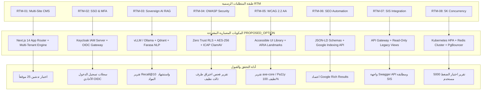

# مصفوفة تتبع المتطلبات والمطابقة المعمارية (RTM & TCM Crosswalk) — الإصدار المعالج
## TAIZ-TENDER-01-RTM-CROSSWALK
**مشروع تصميم وتطوير الموقع الإلكتروني الرسمي لجامعة تعز والبوابة الرقمية المتكاملة ودمج تقنيات الذكاء الاصطناعي**  
**المناقصة العامة رقم (2) للعام 2026م — جامعة تعز، الجمهورية اليمنية**  
**المصدر المرجعي المعتمد:** كراسة الشروط والمواصفات الرسمية (ص 23-24 لمصفوفة RTM، وص 26-28 لمصفوفة TCM)  

---

## 1. جدول تتبع مصفوفة تتبع المتطلبات الرسمية (RTM-01 to RTM-10 Crosswalk)

تربط هذه المصفوفة البنود الاستراتيجية العشرة (RTM-01 إلى RTM-10) الواردة في الصفحتين 23 و 24 من كراسة المناقصة مع بنود جدول الكميات (BOQ)، المخرجات الرسمية (D-01 إلى D-16)، المكونات المعمارية المقترحة، والأدلة الإثباتية للاختبار والقبول:

| رمز RTM | المتطلب والنشاط الاستراتيجي في الكراسة | الوزن في التقييم | صفحة PDF (المطبوعة) | البنود المقابلة في الـ BOQ | المخرجات المرتبطة (Deliverables) | المكون المعماري المقترح (`PROPOSED_OPTION`) | وسيلة التحقق والدليل الإثباتي المعتمد |
| :---: | :--- | :---: | :---: | :---: | :---: | :--- | :--- |
| **RTM-01** | **نظام إدارة المحتوى متعدد المواقع (Multi-Site CMS):** بناء بنية المستأجرين المتعددين وتطوير لوحة إدارة مركزية تدير 25 موقعاً فرعياً للكليات والمراكز بصلاحيات RBAC معزولة. | **25%** | ص 23 (ص 22) | جدول 1 (1.1, 1.2, 1.3, 1.4) | D-01, D-02, D-03, D-05, D-08, D-10 | Multi-Tenant Site Manager Core + Unified Design System + Next.js Subdomain Router | اختبار عملي لتدشين موقع كلية جديد في 9 خطوات، والتحقق من عزل الصلاحيات عبر لوحة التحكم. |
| **RTM-02** | **الدخول الموحد والمصادقة الثنائية (SSO & MFA):** إعداد بوابة الدخول الموحد المركزية عبر بروتوكولات OAuth 2.0 / OIDC / SAML وتفعيل MFA الإلزامية للكادر الحساس. | **25%** | ص 23 (ص 22) | جدول 2 (2.1, 2.2, 2.3, 2.4) | D-03, D-05, D-06, D-10 | Keycloak IAM Server + OIDC Client + TOTP MFA Engine + JWT Guard | تقارير سجلات تسجيل الدخول الأحادي، وتجربة تسجيل خروج مركزي، وفحص حظر الوصول بدون رمز MFA. |
| **RTM-03** | **محرك الذكاء الاصطناعي والمعالجة العربية (AI RAG & Arabic NLP):** تطوير المساعد الافتراضي والبحث الدلالي باستضافة سيادية محلية On-Premises مع منع الهلوسة واستخراج الجذور الصرفية. | **15%** | ص 23 (ص 22) | جدول 3 (3.1, 3.2, 3.3) | D-05, D-07, D-10 | Sovereign Local RAG Pipeline + Qdrant Vector DB + Farasa/CamelTools + Llama3/Qwen | تقرير قياس Recall@10 >= 85%، وسجل توثيق المصادر واللوائح لكل إجابة، وخلو الردود من الهلوسة. |
| **RTM-04** | **الأمن السيبراني وضوابط OWASP ASVS Level 2:** تطبيق بنية عدم الثقة والتشفير TLS 1.3 و AES-256، وتنقية المدخلات وفحص الملفات بـ ICAP، وإجراء اختبار اختراق طرف ثالث. | **15%** | ص 23 (ص 22) | جدول 5 (5.1, 5.2, 5.4) | D-05, D-06, D-09, D-10 | Zero Trust Security Layer + Column Encryption + ClamAV ICAP + Immutable Audit | تقرير اختبار اختراق نقي صادر من شركة أمنية مستقلة معتمدة، وخلو المنصة من أي ثغرات حرجة أو عالية. |
| **RTM-05** | **النفاذية الرقمية الشاملة (WCAG 2.2 Level AA):** بناء واجهات متوافقة 100% مع معايير الوصول، ودعم قارئات الشاشة والتنقل الكامل بلوحة المفاتيح وتباين 4.5:1. | **10%** | ص 23 (ص 22) | جدول 1 (1.1) | D-03, D-08, D-10 | Accessible UI Component Library + ARIA Landmarks + Contrast Switcher | تقارير تدقيق أدوات axe-core و Pa11y النظيفة بنسبة 100%، وتجربة عملية ناجحة مع قارئ الشاشة NVDA. |
| **RTM-06** | **أتمتة الـ SEO والفهرسة اللحظية (Automated SEO & Schema.org):** توليد البيانات المنظمة JSON-LD تلقائياً، والربط بـ Google Indexing API، وتحسين التصنيف العالمي Webometrics. | **15%** | ص 24 (ص 23) | جدول 1 (1.4) | D-03, D-08, D-10 | Auto-SEO Module + JSON-LD Generator + Sitemap Orchestrator + Google Indexing API | تقرير فحص البيانات المنظمة في Google Rich Results، وسجل إرسال طلبات الأرشفة الفورية عند النشر. |
| **RTM-07** | **التكامل مع أنظمة الجامعة القائمة (SIS / HR / Finance):** بناء بوابة API Gateway و 4 موصلات Legacy Connectors بنمط القراءة فقط مع توثيق Swagger التفاعلي. | **25%** | ص 24 (ص 23) | جدول 4 (4.1, 4.2) | D-01, D-03, D-05, D-10 | API Gateway (Kong/FastAPI) + Read-Only Database Views + OpenAPI Docs | تقرير اختبارات التكامل، وتوثيق Swagger التفاعلي، ومطابقة البيانات المعروضة في البوابة مع قواعد SIS. |
| **RTM-08** | **الأداء العالي والتوسع تحت الأحمال (Concurrency & HA):** تحمل 5,000 مستخدم متزامن وقابلية التوسع لـ 25,000، وزمن استجابة API < 300ms و LCP < 2.5s وتوافرية 99.9%. | **15%** | ص 24 (ص 23) | جدول 5 (5.3) | D-04, D-05, D-09, D-10 | K8s Horizontal Pod Autoscaler + Redis Caching Cluster + CDN + PgBouncer | تقارير اختبارات الضغط بـ JMeter و Locust تحت 5,000 مستخدم متزامن، وقياسات Core Web Vitals. |
| **RTM-09** | **هجرة البيانات والتحويلات الدائمة (Data Migration & 301 Redirects):** تنفيذ أنابيب ETL لترحيل الأرشيف الإخباري والوثائق التاريخية مع حماية الروابط القديمة بتحويلات 301. | **15%** | ص 24 (ص 23) | جدول 4 (4.3) | D-03, D-10 | Data Migration Pipeline (ETL) + URL Redirect Manager (301 Engine) | تقرير مطابقة البيانات المهاجرة بنسبة 100%، وخلو الروابط القديمة من أي أخطاء 404. |
| **RTM-10** | **الملكية الفكرية والتسليم الكامل للشفرة المصدرية (Full IP & Git):** تسليم مستودع Git كامل الشفرات والوثائق وسكريبتات النشر وتنازل رسمي غير مشروط عن كافة حقوق الملكية. | **إلزامي** | ص 24 (ص 23) | الجزء العام والتسليمات | D-05, D-09, D-10, D-14, D-16 | Complete Source Repository + Deployment Helm Charts + Build Scripts | محضر التسليم والاستلام النهائي الموقع من الطرفين، واستلام الجامعة لكامل مستودع الكود بدون أجزاء مغلقة. |

---

## 2. جدول تتبع مصفوفة المطابقة الفنية المباشرة (TCM-01 to TCM-12 Crosswalk)

تتبع هذه المصفوفة البنود الاثني عشر (TCM-01 إلى TCM-12) الواردة في الصفحات 26 إلى 28 من كراسة المناقصة:

| رمز TCM | موضوع المطابقة الفنية في الكراسة | حالة التعهد والالتزام | صفحة PDF (المطبوعة) | المكون والحل المقترح في العرض الفني (`PROPOSED_OPTION`) | الدليل ومستند القبول المعتمد |
| :---: | :--- | :---: | :---: | :--- | :--- |
| **TCM-01** | منصة إدارة المحتوى متعددة المواقع (25 موقعاً) | **Fully Compliant** | ص 26 (ص 25) | Multi-Tenant Architecture مع حوكمة مركزية واستقلالية محلية | لوحة التحكم وإجراء تدشين الكلية التجريبية |
| **TCM-02** | نظام الهوية والدخول الموحد (SSO & MFA) | **Fully Compliant** | ص 26 (ص 25) | Keycloak IAM Server مع بروتوكولات OIDC/OAuth2 والمصادقة TOTP | تقارير الجلسات واختبارات الدخول الموحد |
| **TCM-03** | محرك الذكاء الاصطناعي RAG والبحث الدلالي المحلي | **Fully Compliant** | ص 26 (ص 25) | On-Premises Sovereign RAG بـ Qdrant و Llama3/Qwen و Farasa | تقرير Recall@10 وعينات الاستشهاد باللوائح |
| **TCM-04** | الأمن السيبراني وضوابط OWASP ASVS v4.0 L2 | **Fully Compliant** | ص 26 (ص 25) | بنية Zero Trust وتشفير TLS 1.3 / AES-256 وحماية المدخلات | تقرير اختبار اختراق صادر من طرف ثالث معتمد |
| **TCM-05** | مطابقة النفاذية الرقمية WCAG 2.2 Level AA | **Fully Compliant** | ص 27 (ص 26) | دعم قارئات الشاشة والتحكم باللوحة وتباين >= 4.5:1 | تقارير الفحص الآلي بأدوات axe-core / Pa11y |
| **TCM-06** | محرك أتمتة الـ SEO والبيانات الوصفية اللحظية | **Fully Compliant** | ص 27 (ص 26) | أتمتة توليد JSON-LD Schemas وربط Google Indexing API | فحص Google Rich Results وخريطة المواقع |
| **TCM-07** | التكامل عبر API Gateway مع الأنظمة القائمة (SIS) | **Fully Compliant** | ص 27 (ص 26) | طبقة Kong/FastAPI Gateway مع 4 موصلات Legacy بنمط Read-Only | مخطط التكامل وتوثيق Swagger API التفاعلي |
| **TCM-08** | دعم 5,000 مستخدم متزامن وقابلية التوسع لـ 25,000 | **Fully Compliant** | ص 27 (ص 26) | K8s HPA وتخزين مؤقت Redis Cluster لتحقيق LCP < 2.5s | تقارير اختبار الأحمال بـ Locust و JMeter |
| **TCM-09** | استراتيجية التعافي من الكوارث (RPO<=1h, RTO<=4h) | **Fully Compliant** | ص 28 (ص 27) | تفعيل PostgreSQL WAL Streaming والنسخ الجغرافي الموزع | خطة DRP وتوثيق تجربة استعادة فعلية |
| **TCM-10** | الملكية الفكرية والشفرة المصدرية الكاملة (Full IP) | **Fully Compliant** | ص 28 (ص 27) | تسليم مستودع Git كاملاً دون شفرات مغلقة أو اشتراكات خارجية | إقرار نقل الملكية الفكرية المعتمد والموقع |
| **TCM-11** | ضمان مجاني شامل وصيانة لمدة 12 شهراً | **Fully Compliant** | ص 28 (ص 27) | التزام تعاقدي بضمان شامل ودعم فني وفق مستويات SLA (P1-P4) | اتفاقية مستوى الخدمة وجداول الاستجابة |
| **TCM-12** | تقديم الوثائق الرسمية والضمان الابتدائي البنكي | **Fully Committed** | ص 28 (ص 27) | إرفاق أصل الضمان البنكي (2%) والبطاقات الضريبية والزكوية وسابقة الأعمال | فحص المظروفين الفني والمالي بالصندوق |

---

## 3. الربط الهندسي والتحقق الموضوعي للمتطلبات

تؤكد هذه المصفوفة التوافق التام والتتبع الصارم بين متطلبات الكراسة، المخرجات الهندسية، والدلائل الإثباتية المستقلة، مع الحفاظ الكامل على مبدأ حيادية المورد وخيارات العرض الفني المقترحة.
