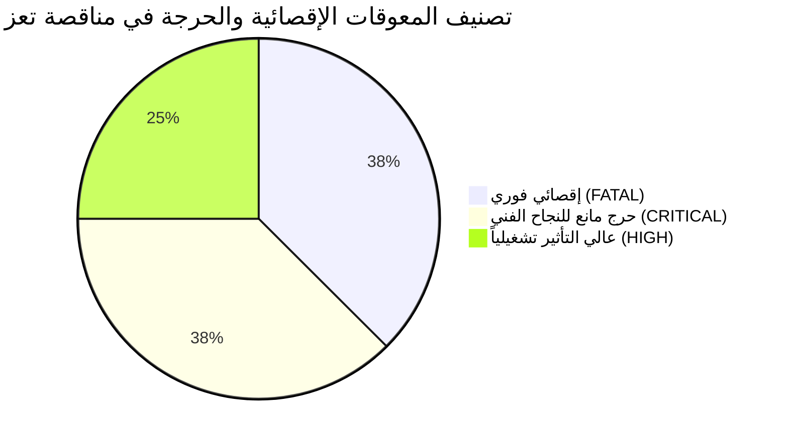
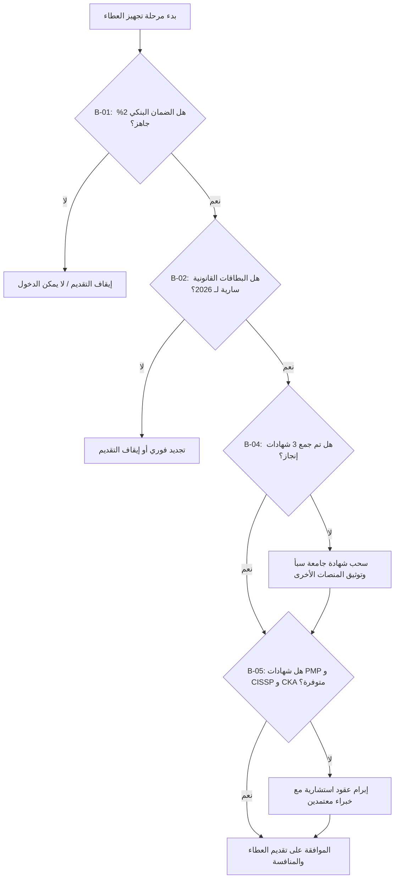

# سجل المعوقات الحرجة والمخاطر الإقصائية للمناقصة (Bid Blockers & Fatal Disqualifiers) — الإصدار المعالج
## TAIZ-TENDER-02-BID-BLOCKERS
**مشروع تصميم وتطوير الموقع الإلكتروني الرسمي لجامعة تعز والبوابة الرقمية المتكاملة ودمج تقنيات الذكاء الاصطناعي**  
**المناقصة العامة رقم (2) للعام 2026م — جامعة تعز، الجمهورية اليمنية**  
**المصدر المرجعي المعتمد:** كراسة الشروط والمواصفات الرسمية (ص 3، ص 29، ص 34، ص 35، ص 36، ص 37، ص 42)  

---

## 1. تحليل المعوقات الإقصائية والمخاطر الحرجة (Fatal Disqualifiers & Red Flags)

حددت كراسة مناقصة جامعة تعز 2026م والقانون اليمني للمناقصات رقم (23) لسنة 2007م مجموعة من الاشتراطات الصارمة التي يعتبر الإخلال بأي منها **سبباً مباشراً لإلغاء واستبعاد العطاء فوراً (Disqualification)** في جلسة فتح المظاريف أو أثناء التقييم الفني:

- **`FATAL` (إقصائي فوري):** يترتب عليه رفض فتح المظروف واستبعاد العطاء في الجلسة العلنية مباشرة.
- **`CRITICAL` (حرج مانع للنجاح):** يؤدي لخصم درجات يهبط بالتقييم الفني تحت حد النجاح (أقل من 75/100).
- **`HIGH` (عالي التأثير تشغيلياً):** يؤثر جوهرياً في التقييم والترتيب التنافسي للعطاء.

---

## 2. جدول حصر وتصنيف المعوقات وخطة المعالجة الإلزامية (Blockers Action Matrix)

| # | المعوق / الشرط الإقصائي في الكراسة | التصنيف | الخطورة | الاحتمالية | الأثر المترتب عند الإخلال | خطة المعالجة الإلزامية والمسار التنفيذي (Resolution Path) | المسؤول (Owner) | الموعد الحاسم |
| :---: | :--- | :---: | :---: | :---: | :--- | :--- | :--- | :--- |
| **B-01** | **الضمان البنكي الابتدائي (2%) غير مشروط وسارٍ لمدة 90 يوماً** | مالي / قانوني | **`FATAL`** | متوسطة | **استبعاد العطاء فوراً** في جلسة فتح المظاريف ورفض المظروف الفني والمالي (ص 35). | التنسيق المبكر مع البنك التجاري لإصدار خطاب الضمان الابتدائي (بقيمة تقريبية $1,000 - $1,500) أو شيك مقبول الدفع باسم جامعة تعز. | المدير المالي | قبل تسليم العطاء بـ 5 أيام |
| **B-02** | **اكتمال وسريان الوثائق القانونية لعام 2026م (ضرائب، زكاة، تأمينات، سجل)** | قانوني | **`FATAL`** | منخفضة | **رفض فتح المظاريف** واعتبار العرض غير مؤهل قانونياً وفق القانون اليمني (ص 3). | استخراج وتجديد البطاقة الضريبية والزكوية وشهادة التأمينات الاجتماعية والسجل التجاري والتأكد من سريانها لعام 2026م. | المستشار القانوني | قبل تسليم العطاء بـ 7 أيام |
| **B-03** | **فصل المظروفين الفني والمالي والتختيم بالشمع الأحمر** | إجرائي / شكلي | **`FATAL`** | منخفضة | **بطلان العطاء شكلياً** ورفضه في جلسة الفتح (ص 36). | إعداد مظروفين منفصلين تماماً، وختمهما بالشمع الأحمر وتوقيعهما، والتأكد من عدم وجود أي إشارة للأسعار داخل المظروف الفني. | مدير المشروع | يوم تسليم العطاء |
| **B-04** | **إرفاق 3 شهادات إنجاز لمشاريع مماثلة (جامعية / بوابات ضخمة)** | تأهيلي / فني | **`CRITICAL`** | مرتفعة | خصم درجات قد يهبط بالتقييم الفني تحت حد النجاح (75/100) أو الإقصاء (ص 34). | سحب شهادة إنجاز رسمية لبوابة كلية الحاسوب بجامعة سبأ، وتوثيق شهادتين إضافيتين لمنصات مؤسسية (أو تفعيل خيار الائتلاف التجاري). | مدير تطوير الأعمال | قبل تجهيز المظروف الفني |
| **B-05** | **إرفاق الشهادات المهنية الدولية للكادر (PMP/PRINCE2, TOGAF/AWS, CISSP/CEH, CKA/DCA)** | كادر بشري | **`CRITICAL`** | مرتفعة | خصم درجات الكادر البشري (10%) وحظر الكوادر غير المؤيدة بشهادات (ص 34). | إبرام عقود استشارية وتوفير السير الذاتية وصور الشهادات المهنية المعتمدة للخبراء الـ 4 المطلوبين. | مسؤول الموارد البشرية | قبل تجهيز المظروف الفني |
| **B-06** | **التعهد الصريح بنقل الملكية الفكرية والشفرة المصدرية كاملة (Full IP)** | تعاقدي | **`CRITICAL`** | منخفضة | رفض العرض لعدم الالتزام بشرط التسليم الكامل لمستودع Git والتنازل (ص 24، 28). | إرفاق إقرار قانوني رسمي موقع ومختوم بالتنازل والتمليك الكامل لجامعة تعز لجميع الأكواد المصدرية والمستودعات والتراخيص. | المستشار القانوني | مرحلة إعداد العرض |
| **B-07** | **توفير بيئة وخوادم استضافة محلية للذكاء الاصطناعي (GPU/Local Servers)** | فني / بنية | **`HIGH`** | متوسطة | تعثر تشغيل نماذج RAG محلياً واجتياز فحص المعاينة في المرحلة 3 (ص 21، 41). | تقديم طلب استيضاح خطي للجامعة حول مواصفات خوادم GPU المحلية المتوفرة، أو تقديم عروض نماذج مكممة عالية الكفاءة (Qwen Quantized). | مهندس الذكاء الاصطناعي | فترة الاستيضاحات الرسمية |
| **B-08** | **الالتزام بالضمان المجاني الشامل واتفاقية SLA لمدة 12 شهراً** | تعاقدي / فني | **`HIGH`** | منخفضة | استبعاد العرض الفني في حال محاولة فرض تكاليف صيانة خلال السنة الأولى (ص 28، 40). | تضمين إقرار صريح بالالتزام بالضمان المجاني الكامل لمدة 12 شهراً وتقديم خطة الدعم الفني وجداول الاستجابة للحوادث P1-P4 مجاناً. | مدير المشروع | مرحلة إعداد العرض |

---

## 3. بوابات اتخاذ القرار الإجرائي للجاهزية (Bid Clearance Gates)

> [!IMPORTANT]
> **التوصية الإجرائية لشركة سيستراك:**
> يُعد استيفاء الضمان البنكي الابتدائي (B-01) وجمع الشهادات المهنية للكادر (B-05) وشهادات سابقة الأعمال (B-04) الشروط الإلزامية الثلاثة التي يجب إغلاقها بالكامل قبل إغلاق وتشميع المظروفين.
