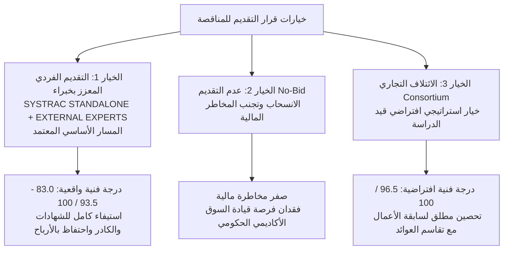
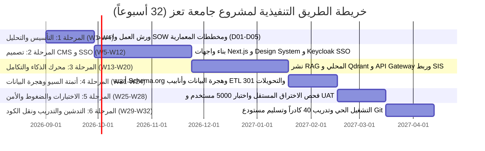

# القرار الاستراتيجي وخريطة طريق التقديم (Bid / No-Bid Decision & Strategic Roadmap) — الإصدار المعالج
## TAIZ-TENDER-02-BID-NO-BID-DECISION
**مشروع تصميم وتطوير الموقع الإلكتروني الرسمي لجامعة تعز والبوابة الرقمية المتكاملة ودمج تقنيات الذكاء الاصطناعي**  
**المناقصة العامة رقم (2) للعام 2026م — جامعة تعز، الجمهورية اليمنية**  
**الجهة المُعِدّة للتقرير:** القيادة الفنية والاستشارية لشركة سيستراك (SysTrac Baseline Appraisal)  

---

## 1. التقييم الاستراتيجي والمفاضلة بين الخيارات (Strategic Appraisal)

بناءً على نتائج التدقيق الفني الشامل لكراسة الشروط الرسمية (42 صفحة)، وتدقيق قدرات المستودع البرمجي المرجعي (`saba-uni-portal`)، ومحاكاة درجات التقييم الفني، تم تحليل ثلاثة خيارات استراتيجية رئيسية أمام مجلس إدارة شركة سيستراك:

### المقارنة التحليلية بين الخيارات الثلاثة:

| معيار المقارنة | الخيار (1): التقديم الفردي لسيستراك المعزز بخبراء (**المسار الأساسي**) | الخيار (2): الانسحاب وعدم التقديم (No-Bid) | الخيار (3): الائتلاف التجاري (Consortium) — **سيناريو اختياري** |
| :--- | :--- | :--- | :--- |
| **الملاءمة الفنية والهندسية** | **عالية جداً ومكتملة** — وجود أصل برمجي حقيقي يغطي 77.6% من المتطلبات الأساسية. | غير منطبق | **مثالية ومكتملة 100%** — دمج قوة سيستراك البرمجية مع خبرات الشريك. |
| **اجتياز شروط التأهيل المبدئي** | **مؤهل بالكامل** عند استكمال عقود الخبراء وتوثيق مشاريع المنصات. | غير منطبق | **مضمون ومحصن بالكامل** بوجود 3 شهادات إنجاز وسجلات معتمدة. |
| **الدرجة الفنية المتوقعة** | **83.0 إلى 93.5 من 100** (فوق حد النجاح 75 بفارق مريح 8-18 درجة). | 0 / 100 | **96.5 من 100** (درجة افتراضية تضمن تصدر الترتيب). |
| **إصدار الضمان البنكي (2%)** | إصدار خطاب الضمان عبر التسهيلات البنكية لشركة سيستراك (~$1,000 - $1,500). | صفر تكلفة | **مشترك** مع الشريك التجاري عبر التسهيلات الائتمانية القائمة. |
| **العائد المالي والاستراتيجي** | **أرباح كاملة لسيستراك** وتأسيس مرجعية قيادية مباشرة باسم الشركة. | ضياع الفرصة | **أرباح مجزأة** مع تقاسم المسؤوليات التعاقدية والتنفيذية. |
| **القرار الاستراتيجي المعتمد** | **المسار الأساسي الموصى به (APPROVED BASELINE GO-BID)** | **مرفوض** (الفرصة ذات جدوى عالية) | **خيار بديل جاهز للتفعيل عند الحاجة** |

---

## 2. دراسة الجدوى المالية والتكلفة التقديرية (Financial Feasibility & Cost Simulation)

استناداً إلى تحليل جدول الكميات (BOQ) والتقرير المالي والتسعيري المرجعي للمنصة الرقمية الجامعية:

### تقديرات التكاليف المباشرة والجهد الهندسي:
- **إجمالي الجهد الهندسي:** 286 يوم عمل موزعة على فريق الخبراء الـ 8.
- **التكاليف المباشرة لكادر التطوير والتدريب الداخلي والخارجي:** $22,000 – $28,000.
- **تكاليف فحص الاختراق المستقل (3rd-Party PenTest):** $2,500 – $4,000.
- **تكاليف خوادم التجارب والضمانات البنكية واللوجستيات:** $4,500 – $7,000.
- **إجمالي التكلفة المباشرة المتوقعة للمشروع:** **$29,000 – $39,000**.

### النطاق السعري المستهدف للعطاء وهامش الربح:
- **النطاق السعري المستهدف للعطاء (Bid Price Range):** **$48,000 – $65,000** (غير شامل ضريبة المبيعات 15% التي تضاف منفصلة وفق القانون).
- **هامش الربح الإجمالي المتوقع (Gross Profit Margin):** **32% – 42%**.
- **المردود الاستراتيجي:** بناء منصة مؤسسية متعددة المواقع قابلة للتكرار وإعادة النشر في كافة الجامعات اليمنية والإقليمية.

---

## 3. القرار النهائي وشروط الانطلاق الإلزامية (Final GO Decision & Prerequisites)

### نص القرار الاستراتيجي المعتمد:
> **توصي القيادة الفنية بالتقدم لمناقصة جامعة تعز العامة رقم (2) لعام 2026م (GO DECISION) بالتقديم الفردي المباشر لشركة سيستراك كـ مسار أساسي معزز باستقطاب الخبراء الاستشاريين للشهادات المهنية المعتمدة (PMP, TOGAF, CISSP, CKA)، مع إبقاء خيار الائتلاف التجاري كخيار استراتيجي بديل متاح للإدارة.**

### بوابات التحقق الإلزامية قبل تسليم العطاء (Go-Gates Checklist):
1. [x] **تجميد كافة المتطلبات الرسمية:** منجز بنسبة 100% في الوثيقة `TAIZ-TENDER-00-OFFICIAL-RFP-REQUIREMENTS-FREEZE.md`.
2. [x] **إعداد مصفوفة الامتثال الفني الصارمة:** منجز بنسبة 100% في `TAIZ-TENDER-01-FULL-COMPLIANCE-MATRIX.md`.
3. [ ] **إصدار أصل خطاب الضمان البنكي الابتدائي (2%):** سحب الضمان غير المشروط وساري المفعول لمدة 90 يوماً وإيداعه بالمظروف المالي.
4. [ ] **استخراج شهادة استلام نهائي لبوابة كلية الحاسوب بجامعة سبأ:** وتوثيق مشاريع المنصات السابقة.
5. [ ] **إبرام عقود الخبراء الاستشاريين وتوثيق شهاداتهم المهنية:** (PMP/PRINCE2, TOGAF/AWS, CISSP/CEH, CKA/DCA).
6. [ ] **تجهيز المظروفين الفني والمالي والتختيم بالشمع الأحمر:** المراجعة النهائية لكافة المرفقات والأدلة قبل الإيداع الرسمي.

---

## 4. خريطة الطريق التنفيذية للمشروع (32-Week Execution Roadmap)

---

## 5. الخلاصة والتوصية الختامية

يمثل مشروع جامعة تعز نقطة تحول كبرى في مسار التحول الرقمي الأكاديمي في اليمن. إن امتلاك شركة سيستراك لأصل برمجي قوي ومجرب، مدعوماً بخطة تكييف هندسية محكمة وسد منظم لفجوات الشهادات، يضع الشركة في موقع تنافسي متقدم يؤهلها للفوز بالمناقصة وتنفيذها بأعلى معايير الجودة والموثوقية.
