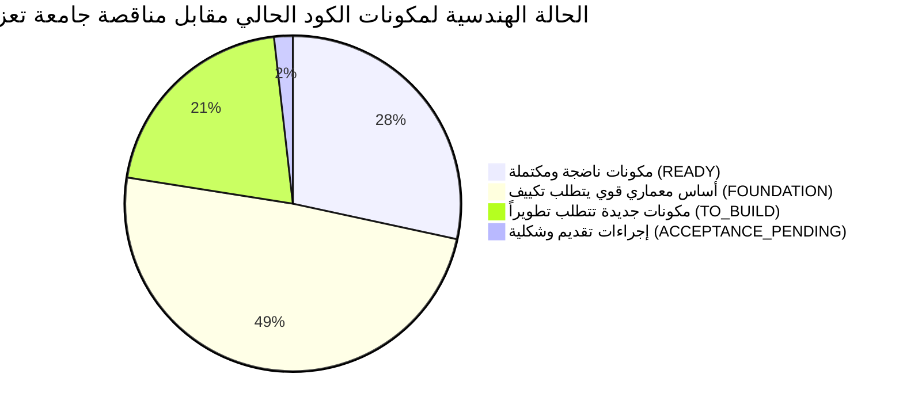

# تدقيق قدرات المستودع البرمجي المرجعي ومطابقتها لمناقصة تعز — الإصدار المعالج
## TAIZ-TENDER-02-CURRENT-PORTAL-CAPABILITY-AUDIT
**المستودع المرجعي المفحوص:** `msorori-mh/saba-uni-portal` (بوابة كلية تكنولوجيا المعلومات وعلوم الحاسوب — جامعة سبأ)  
**طبيعة التدقيق:** فحص برمجي موضوعي وصارم للشفرة المصدرية والمخططات وقواعد البيانات والاختبارات الآلية  
**الهدف:** تحديد الوضع الحقيقي الدقيق لكود المنصة الحالية، وتحديد المكونات الجاهزة وتلك التي تتطلب تكييفاً أو بناءً جديداً لمناقصة جامعة تعز 2026م  

---

## 1. ملخص نتائج التدقيق المعماري والبرمجي (Executive Audit Summary)

### خلاصة التدقيق بالأرقام والأدلة:
- **إجمالي الملفات والاختبارات البرمجية:** يحتوي المستودع على **907 اختبارات آلية ناجحة** في مسار `tests/student-requests/`، وتغطي دورات حياة الخدمات الطلابية وإصدار الشهادات والتحقق والتقارير.
- **طبيعة المعمارية الحالية:** صُمم المستودع الحالي كنظام مغلق على مستوى كلية واحدة (**Single-College Fail-Closed Architecture**) مخصص لكلية الحاسوب وتكنولوجيا المعلومات.
- **التوثيق الصريح في الكود:** جاء في ملفات الكود المصدري المعتمدة `src/lib/reports/scope/org-identity.ts` و `src/lib/admin-reports.functions.ts` التعليق الهندسي الصريح:
  > `// Fail-closed: current schema has no college_id. Never run university-wide.`
  مما يؤكد هندسياً الحاجة إلى إضافة طبقة المستأجرين المتعددين (`tenants`/`sites`) لربط الـ 25 موقعاً فرعياً المطلوبين لجامعة تعز.

---

## 2. جدول الفحص والتدقيق التفصيلي لمكونات الكود المصدري (Detailed Codebase Audit)

| المكون والوحدة في الكود الحالي | المسار الفعلي في المستودع (`msorori-mh/saba-uni-portal`) | الحالة الهندسية الدقيقة | الأدلة والنتائج البرمجية المثبتة | الفجوة المعمارية ومتطلبات مناقصة تعز 2026م |
| :--- | :--- | :---: | :--- | :--- |
| **محرك مسار تدفق الخدمات الأكاديمية** | `src/lib/student-requests/` `tests/student-requests/` | **`READY`** | محرك حالات متطور يغطي كامل دورة حياة الطلب (تقديم -> مراجعة -> موافقة -> إصدار) ومختبر بـ **907 فحوصات آلية ناجحة**. | يحتاج فقط ربط مسميات الخدمات والوحدات المعالجة بلائحة جامعة تعز. |
| **إصدار الوثائق وتدقيق QR الآمن** | `src/lib/student-requests/issuance.ts` `src/routes/verify.document.$id.tsx` | **`READY`** | نظام توليد وثائق PDF الرسمية وتضمين رمز الاستجابة السريعة (QR Code) مع رابط تحقق عام آمن ومشفر. | تكييف القالب البصري لشعار وأختام وتوقيعات عمداء جامعة تعز. |
| **بوابة الطالب وعرض السجل الأكاديمي** | `src/routes/student.academic-records.tsx` `src/routes/student.dashboard.tsx` | **`READY`** | واجهات تفاعلية متجاوبة تعرض المقررات والدرجات الفصيلة والمعدل التراكمي وجداول المحاضرات. | ربط عرض السجلات بموصلات أنظمة شؤون الطلاب (SIS) لجامعة تعز عبر API. |
| **بوابة الكادر الأكاديمي ورصد الدرجات** | `src/routes/faculty-portal.*.tsx` `src/routes/faculty-portal.grades.tsx` | **`READY`** | رصد الدرجات، تسجيل الحضور، الإشراف على مشاريع التخرج، ومحاضر اجتماعات مجالس الأقسام. | تعميم الوحدة وربطها بهيكل الأقسام والشعب الدراسية لكليات تعز. |
| **بوابة الموظفين وصندوق المهام** | `src/routes/staff.inbox.tsx` `src/routes/staff.requests.tsx` | **`READY`** | صندوق مهام موحد للموظفين يوزع الطلبات حسب الدور والوحدة الإدارية. | توسيع صندوق الوارد ليشمل موظفي الكليات والوحدات المركزية. |
| **سجلات التدقيق الأمني غير القابلة للتعديل** | `public.audit_logs` `supabase/migrations/20260602183614_*.sql` | **`READY`** | تريجرات قواعد بيانات على مستوى الجداول الحساسة توثق عمليات التعديل و IP وتمنع التلاعب. | تعميم تتبع العمليات على كافة الجداول والمواقع الفرعية الـ 25. |
| **نظام إدارة المحتوى والأخبار (CMS)** | `src/routes/admin/news.tsx` `src/routes/admin/announcements.tsx` | **`FOUNDATION`** | جداول ونماذج CRUD للأخبار والإعلانات المستهدفة وجدولة النشر. | يحتاج محرر كتل مرئي (Page Builder) ومسار موافقات نشر متعدد المستويات. |
| **معمارية المواقع المتعددة (Multi-Site)** | `src/lib/reports/scope/org-identity.ts` | **`FOUNDATION`** | البنية الحالية مصممة لكلية واحدة (Single College Fail-Closed). | **تطوير أساسي مطلوب:** إضافة جدول `sites` وحقل `site_id` في الجداول لإدارة 25 موقعاً. |
| **الهوية والتسجيل الموحد (SSO & MFA)** | `src/lib/auth.ts` Supabase Auth (Local JWT) | **`FOUNDATION`** | مصادقة تعتمد Supabase Auth و JWT المحلي وجلسات الكوكيز الآمنة. | **تطوير مطلوب:** دمج خادم Keycloak IAM عبر OIDC وتفعيل MFA الإلزامية للكادر. |
| **النفاذية الرقمية (WCAG 2.2 Level AA)** | كافة ملفات `src/routes/` و Tailwind | **`FOUNDATION`** | هيكلة دلالية متسقة وتباين جيد في معظم الشاشات، مدعوم باختبارات داخلية. | تدقيق شامل لجميع الشاشات بـ axe-core و Pa11y لضمان خلوها من أي مخالفة. |
| **الأداء والتوسع (5,000 مستخدم متزامن)** | Vite SPA + PostgreSQL + Docker Compose | **`FOUNDATION`** | أداء سريع في البيئة الفردية مع استعلامات مفهرسة بعناية. | الترقية إلى Next.js 14 SSR/SSG ونشر عنقود Redis Cluster و K8s HPA. |
| **الذكاء الاصطناعي السيادي المحلي (RAG)** | لا يوجد كود RAG (يعتمد PostgreSQL FTS) | **`TO_BUILD`** | البحث الحالي نصي عبر PostgreSQL Full-Text Search. | **بناء جديد كامل:** نشر خادم vLLM/Ollama محلي + قاعدة Qdrant + Farasa + bge-m3. |
| **فحص الاختراق المستقل (3rd-Party PenTest)** | اختبارات أمان داخلية و RLS | **`TO_BUILD`** | يتم تطبيق ضوابط الأمان الداخلية في الشيفرة وقواعد البيانات. | **تعاقد خارجي مطلوب:** التعاقد مع شركة أمن سيبراني معتمدة لإصدار تقرير رسمي. |
| **أنابيب ترحيل البيانات القديمة (ETL)** | لا توجد أنابيب لموقع تعز القديم | **`TO_BUILD`** | توجد تجارب سابقة لترحيل بيانات شؤون الطلاب. | **بناء مطلوب:** كتابة سكريبتات ETL لسحب أرشيف أخبار تعز وإعداد خريطة 301. |

---

## 3. التقييم الهندسي والتحذير المعماري الصريح (Architectural Boundaries)

> [!CAUTION]
> **التحذير المعماري الصريح من واقع الكود:**
> 1. **بنية الكلية المفردة:** يؤكد الكود المصدري الحالي أن تشغيل المنصة على مستوى جامعة متعددة الكليات دون إضافة طبقة `sites` وحقل `site_id` عبر كافة الجداول التشغيلية سيؤدي إلى خلط البيانات أو إخفاق الاستعلامات المنغلقة. لذلك، فإن تكييف معمارية Multi-Site يمثل أولوية هندسية عليا في المرحلة الأولى (Weeks 1-4).
> 2. **قيمة الاختبارات الحالية (907 Tests):** تعد الاختبارات البرمجية الحالية دليلاً هندسياً قاطعاً على نضج محرك الخدمات ودقة المعالجة الحسابية والمنطقية، ولكنها **ليست بديلاً عن اختبارات القبول والاستلام الميدانية (UAT)** المشروطة في كراسة جامعة تعز.
