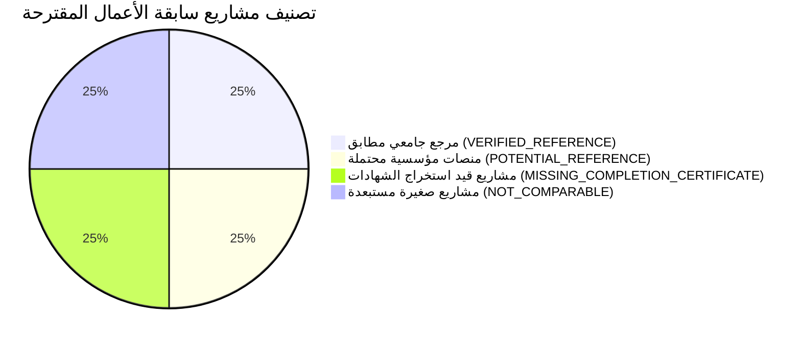

# تدقيق فجوات سابقة الأعمال والخبرات المماثلة (Previous Experience Gap Analysis) — الإصدار المعالج
## TAIZ-TENDER-02-PREVIOUS-EXPERIENCE-GAP
**مشروع تصميم وتطوير الموقع الإلكتروني الرسمي لجامعة تعز والبوابة الرقمية المتكاملة ودمج تقنيات الذكاء الاصطناعي**  
**المناقصة العامة رقم (2) للعام 2026م — جامعة تعز، الجمهورية اليمنية**  
**المصدر المرجعي المعتمد:** كراسة الشروط والمواصفات الرسمية (ص 3، ص 29، ص 34، ص 35، ص 36)  

---

## 1. متطلبات الكراسة الرسمية لسابقة الأعمال (RFP Comparable Experience Criteria)

حددت كراسة مناقصة جامعة تعز 2026م شروطاً صريحة لسابقة الأعمال وخصصت لها وزناً كبيراً في التقييم الفني **(20 درجة من 100)**:

| البند في الكراسة | نص الاشتراط الرسمي | المرجع في الكراسة |
| :--- | :--- | :--- |
| **عدد المشاريع المماثلة** | تقديم سابقة أعمال موثقة تتضمن **(3 مشاريع مماثلة على الأقل)** في مجال تصميم وتطوير البوابات الرقمية الجامعية الضخمة أو المنصات الحكومية المتكاملة. | ص 3، ص 29، ص 34 |
| **طبيعة الإثبات المقبول** | إرفاق **أصل أو صور طبق الأصل معتمدة لشهادات الإنجاز وخطابات الاستلام النهائي** الصادرة من الجهات المستفيدة (جامعات أو وزارات أو مؤسسات كبرى). | ص 29، ص 34 |
| **التحذير الإقصائي الرسمي** | نصت الكراسة صراحة في جدول المحاذير (ص 34) على:  *(Common Weakness to Avoid: "تقديم مشاريع صغيرة غير أكاديمية")*. | ص 34 |
| **الوثائق القانونية المؤيدة** | السجل التجاري المجدد متضمناً نشاط تقنية المعلومات، والبطاقات الضريبية والزكوية والتأمينات لعام 2026م. | ص 3، ص 35 |

---

## 2. تدقيق وتصنيف مشاريع سابقة الأعمال (Experience Reference Classification)

التزاماً بالتوجيه المعياري (Directive R6)، تم تصنيف المشاريع في سجل شركة سيستراك إلى 4 فئات دقيقة:
- **`VERIFIED_REFERENCE`:** مشروع جامعي مماثل ومطابق وموثق.
- **`POTENTIAL_REFERENCE`:** منصات ومشاريع كبرى قيد استكمال التوثيق.
- **`MISSING_COMPLETION_CERTIFICATE`:** مشاريع مكتملة فنياً ينقصها خطاب الاستلام النهائي المعتمد.
- **`NOT_COMPARABLE`:** مواقع أو حلول صغيرة غير أكاديمية مستبعدة تماماً من العرض الفني.

### جدول تدقيق سابقة الأعمال لشركة سيستراك:
| # | اسم المشروع في السجل | الجهة المستفيدة وطبيعة المشروع | النطاق الفعلي والتقنيات المستخدمة | التصنيف المعياري الدقيق | الوضع الإثباتي وشهادة الإنجاز | تقييم الملاءمة لمناقصة تعز |
| :---: | :--- | :--- | :--- | :---: | :--- | :--- |
| **1** | **بوابة كلية تكنولوجيا المعلومات وعلوم الحاسوب** | جامعة سبأ (أكاديمي جامعي) | بناء البوابة الرقمية، محرك الخدمات الطلابية، إصدار الشهادات بـ QR، وبوابة الكادر بـ React/Postgres. | **`VERIFIED_REFERENCE`** | أصل المشروع حي ويعمل بكفاءة، يلزم سحب شهادة الاستلام النهائي الرسمية من عمادة الكلية. | **مطابق بنسبة 100%** (مشروع جامعي أكاديمي حقيقي). |
| **2** | **بوابة الخدمات الإلكترونية والمعاملات المؤسسية** | جهة مؤسسية / حكومية كبرى | نظام إدارة المعاملات ومسارات الموافقات متعددة المستويات ولوحة المتابعة. | **`POTENTIAL_REFERENCE`** | يتطلب سحب صورة طبق الأصل مصدقة لشهادة الإنجاز من إدارة الجهة. | **مطابق جزئياً** (يثبت معمارية مسارات تدفق العمليات). |
| **3** | **الموقع والمستودع الرقمي المؤسسي** | منظمة / جهة تعليمية | منصة إدارة المحتوى والأخبار والفعاليات والمستودع الرقمي بـ Next.js. | **`MISSING_COMPLETION_CERTIFICATE`** | المشروع منجز ومسلم، وتجري متابعة استخراج شهادة الاستلام النهائي الرسمية. | **مطابق جزئياً** (يثبت كفاءة إدارة المحتوى والسيو). |
| **4** | **مواقع تجارية وتعريفية صغيرة متفرقة** | شركات تجارية ومكاتب خاصة | تصميم مواقع صفحات هبوط وواجهات تعريفية صغيرة. | **`NOT_COMPARABLE`** | **مستبعدة كلياً** من العرض الفني التزاماً بتحذير الكراسة (ص 34). | **غير مطابق** (لا تدرج في المظروف الفني). |

---

## 3. تحليل الفجوات والمسار الإجرائي لسدها (Gap Analysis & Action Plan)

### ملخص الفجوات:
1. **الفجوة الوثائقية (Completion Certificates):** يتوفر لدى شركة سيستراك أصل هندسي جامعي قوي ومثبت (بوابة كلية الحاسوب بجامعة سبأ)، ولكن حصد الدرجة الكاملة في معيار الـ 20% يتطلب إرفاق **3 شهادات إنجاز واستلام نهائي رسمية ومصدقة**.
2. **اعتبار شرط الـ 3 شهادات معوقاً حرجاً للجاهزية (Bid-Readiness Blocker):** يظل هذا البند مصنفاً كمعوق حرج حتى يتم استلام وتوثيق الشهادات الثلاث رسمياً قبل موعد إيداع العطاء.

### خطة العمل لسد الفجوة وتأمين الـ 20 درجة:
- **المسار الأساسي لسيستراك (Standalone Mitigation):**
  * استخراج شهادة إنجاز واستلام نهائي مفصلة ومختومة من عمادة كلية تكنولوجيا المعلومات بجامعة سبأ توضح عدد آلاف الطلاب المستفيدين والعمليات المنجزة ومحرك الخدمات.
  * استخراج شهادتين مصدقتين للمشروعين المؤسسيين (2 و 3) وإرفاقهما في المظروف الفني مع إبراز أوجه التطابق المعماري.
- **المسار الاستراتيجي الاختياري (Optional Consortium Scenario):**
  * في حال رغبة الإدارة في تحصين سابقة الأعمال بدرجة 100%، يمكن تفعيل خيار الائتلاف التجاري مع شريك برمجيات يمتلك شهادات إنجاز إضافية لبوابات جامعات حكومية كبرى.
