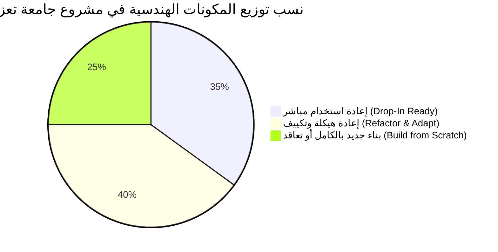

# حدود إعادة الاستخدام والتكييف المعماري (Reuse Boundary & Refactoring Scope) — الإصدار المعالج
## TAIZ-TENDER-02-REUSE-BOUNDARY
**مشروع تصميم وتطوير الموقع الإلكتروني الرسمي لجامعة تعز والبوابة الرقمية المتكاملة ودمج تقنيات الذكاء الاصطناعي**  
**المناقصة العامة رقم (2) للعام 2026م — جامعة تعز، الجمهورية اليمنية**  
**المشروع المرجعي والأساس الهندسي:** مستودع بوابة كلية تكنولوجيا المعلومات وعلوم الحاسوب (`msorori-mh/saba-uni-portal`)  

---

## 1. ملخص تصنيف الحدود الهندسية لإعادة الاستخدام (Reuse Breakdown)

يوضح هذا التحليل الحدود المعمارية الصارمة بين الأصول البرمجية القابلة للإسقاط المباشر، وتلك التي تتطلب تكييفاً وإعادة هيكلة، والمكونات الجديدة بالكامل التي يلزم بناؤها أو التعاقد عليها:

---

## 2. جدول تصنيف المكونات البرمجية والحدود المعمارية (Detailed Boundary Classification)

| الفئة المعمارية | المكون البرمجي في المشروع | المسار في المستودع الحالي | النسبة | الجهد المقدر | المبرر الهندسي والخطوات المطلوبة لمشروع تعز |
| :--- | :--- | :--- | :---: | :---: | :--- |
| **الفئة (1):** **إعادة الاستخدام المباشر** *(Drop-In Ready)* | **محرك دورة حياة الخدمات الطلابية** | `src/lib/student-requests/` `tests/student-requests/` | 35% | 15 يوماً | منطق الأعمال (State Machine) ومصفوفة الصلاحيات والتفويض ومسارات المعالجة جاهزة بنسبة 100% ومختبرة بـ 907 فحوصات. يتطلب فقط تغذية أسماء الخدمات الجديدة. |
|  | **إصدار الوثائق والشهادات بـ QR** | `src/lib/student-requests/issuance.ts` `src/routes/verify.document.$id.tsx` |  |  | نظام توليد ملفات PDF الآمن وتضمين رمز QR المشفر وصفحة التحقق العامة جاهز بالكامل. يحتاج فقط استبدال القالب البصري لشعار وأختام تعز. |
|  | **سجلات التدقيق الأمني غير القابلة للتعديل** | `public.audit_logs` Migrations Triggers |  |  | تريجرات قواعد البيانات وتوثيق العمليات الحساسة و IP والمستخدم معزولة وتعمل بكفاءة مطلقة. |
|  | **نماذج الهيكل الأكاديمي الأساسية** | `src/types/database.ts` |  |  | جداول الأقسام، الخطط الدراسية، البرامج، الساعات المعتمدة، والسجلات الأكاديمية مطابقة لمعايير التعليم العالي. |
| **الفئة (2):** **إعادة الهيكلة والتكييف** *(Refactor & Adapt)* | **تحويل قاعدة البيانات إلى Multi-Site** | Schema & Migrations | 40% | 125 يوماً | إضافة جداول `sites` وحقل `site_id` عبر كافة الجداول وتعديل سياسات RLS لعزل كليات ومراكز تعز الـ 25 مع دعم الحوكمة المركزية. |
|  | **ترقية الواجهات الأمامية إلى Next.js 14** | `src/routes/` -> Next.js App Router |  |  | نقل الواجهات من Vite SPA إلى Next.js لدعم الرندرة من جانب الخادم (SSR/SSG)، والنطاقات الفرعية، والتوافق مع محركات البحث LCP < 2.5s. |
|  | **ترقية طبقة المصادقة إلى Keycloak SSO** | `src/lib/auth.ts` -> OIDC Client |  |  | استبدال Supabase Auth المحلي بالربط مع خادم Keycloak IAM وتفعيل المصادقة الثنائية الإلزامية (MFA) لحسابات الكادر. |
|  | **بوابة واجهات التطبيقات (API Gateway)** | طبقة الربط الخلفية |  |  | بناء طبقة Kong/FastAPI Gateway وتطوير 4 موصلات Legacy بنمط Read-Only لقراءة بيانات أنظمة شؤون الطلاب (SIS) القديمة. |
|  | **تكييف واجهات المستخدم وهوية الكليات** | UI Components & Theme Engine |  |  | بناء محرك سمات (Theme Engine) يطبق ألوان وشعارات كليات تعز الـ 25 ديناميكياً مع الالتزام بـ WCAG 2.2 AA. |
| **الفئة (3):** **بناء جديد أو تعاقد** *(Build from Scratch / Procure)* | **محرك الذكاء الاصطناعي السيادي RAG** | محرك AI الجديد محلياً | 25% | 146 يوماً | بناء خدمة ذكاء محلي كاملة (vLLM/Ollama + Qdrant + Farasa Arabic NLP + bge-m3) مع حواجز منع الهلوسة وحصر الردود باللوائح. |
|  | **منشئ الصفحات والنماذج التفاعلية** | Visual Block & Form Builder |  |  | تطوير محرر كتل بصري بالسحب والإفلات ومنشئ استبيانات تفاعلي مع حفظ JSONSchema وتصدير CSV/Excel. |
|  | **محرك أتمتة الـ SEO والفهرسة الفورية** | SEO & Schema Engine |  |  | تطوير وحدة توليد JSON-LD Schemas تلقائياً وربط Google Indexing API وإدارة خرائط Sitemap لـ 25 موقعاً. |
|  | **فحص الملفات بمضاد الفيروسات ICAP** | خادم التخزين والوسائط |  |  | دمج خدمة ICAP Antivirus (ClamAV) لفحص الملفات والمرفقات المرفوعة لحظياً قبل التخزين في MinIO. |
|  | **أنابيب ترحيل البيانات القديمة وخريطة 301** | ETL Pipeline |  |  | كتابة واختبار أنابيب سحب الأرشيف الإخباري لجامعة تعز وإعداد خريطة تحويلات 301 الدائمة. |
|  | **فحص الاختراق الخارجي المستقل (PenTest)** | تدقيق أمني طرف ثالث |  |  | التعاقد مع شركة أمن سيبراني معتمدة لتنفيذ فحص اختراق شامل وتقديم تقرير خلو من الثغرات. |

---

## 3. الأثر الهندسي على خطة التنفيذ وتكلفة المشروع (Impact on Delivery & Budget)

1. **تقليص المخاطر الهندسية:** الاستفادة من الـ **35% الجاهزة** يلغي مخاطر إعادة بناء محركات سير العمل الحساسة والتحقق من الشهادات، ويسمح بتركيز الجهد الهندسي على المكونات الاستراتيجية المضافة (الذكاء الاصطناعي، ومواقع الكليات، و SSO).
2. **التحكم في الجدول الزمني (32 أسبوعاً):** يضمن هذا التقسيم إنجاز أعمال التكييف (المرحلة 2 و 3) والبناء الجديد ضمن المسار الحرج دون أي تأخير، مع تخصيص الـ 8 أسابيع الأخيرة بالكامل للاختبارات وفحص الاختراق والتدريب.
