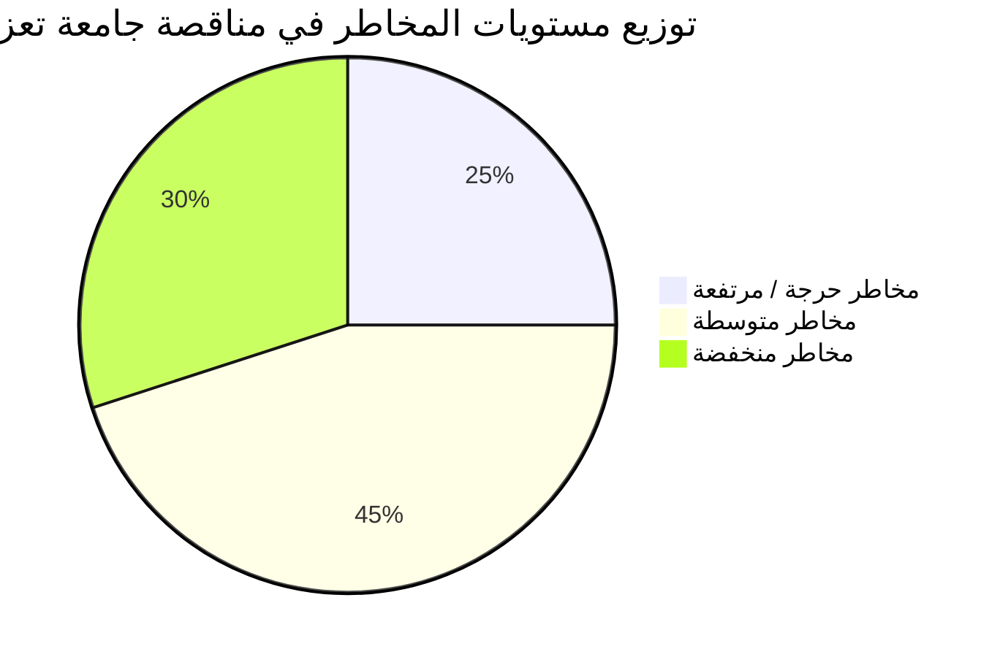
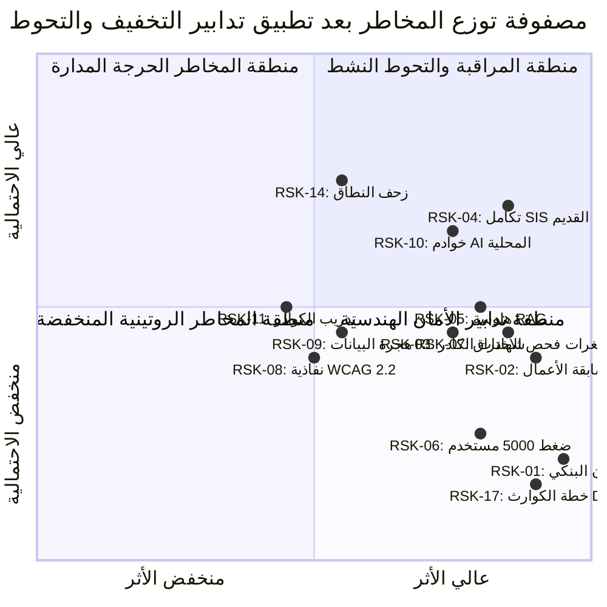

# سجل المخاطر الشامل وتدابير التحوط والمعالجة (Comprehensive Risk Register) — الإصدار المعالج
## TAIZ-TENDER-02-RISK-REGISTER
**مشروع تصميم وتطوير الموقع الإلكتروني الرسمي لجامعة تعز والبوابة الرقمية المتكاملة ودمج تقنيات الذكاء الاصطناعي**  
**المناقصة العامة رقم (2) للعام 2026م — جامعة تعز، الجمهورية اليمنية**  
**المصدر المرجعي المعتمد:** كراسة الشروط والمواصفات الرسمية (القسم الحادي عشر ص 32، والتحليل الهندسي الشامل لشركة سيستراك)  

---

## 1. ملخص تصنيف وتوزيع المخاطر (Executive Risk Profile)

يغطي هذا السجل **20 خطراً استراتيجياً وفنياً وتشغيلياً ومالياً وقانونياً** تم تحليلها بدقة لضمان تحصين العطاء الفني والمالي لشركة سيستراك كـ **مقدم عرض أساسي (SysTrac Standalone Baseline)** مع تدابير الاستعانة بالخبراء المعتمدين:

| مستوى المخاطرة الكلي (Risk Level) | العدد | النسبة | استراتيجية التعامل الإلزامية |
| :--- | :---: | :---: | :--- |
| **مرتفعة جداً / حرجة (Critical / High)** | **5** | **25%** | معالجة إلزامية مسبقة قبل تقديم العطاء وخطط طوارئ تنفيذية مباشرة. |
| **متوسطة (Medium)** | **9** | **45%** | تدابير وقائية هندسية وضوابط أمان في التصميم ومراقبة مستمرة. |
| **منخفضة (Low)** | **6** | **30%** | متابعة روتينية وإجراءات تشغيلية قياسية في خطوط الإنتاج. |
| **المجموع الكلي للمخاطر** | **20** | **100%** | **تم وضع خطط تحوط ومعالجة بديلة لكافة المخاطر الـ 20 بنسبة 100%** |

---

## 2. جدول سجل المخاطر التفصيلي (20 Risk Matrix)

| المعرف | فئة الخطر | وصف الخطر والسيناريو المحتمل | الاحتمالية (P) | الأثر (I) | درجة الخطر | استراتيجية التخفيف المسبق (Pre-Bid Mitigation) | خطة الطوارئ والمعالجة التنفيذية (Contingency Plan) | المسؤول (Owner) |
| :---: | :--- | :--- | :---: | :---: | :---: | :--- | :--- | :--- |
| **RSK-01** | مالي / تعاقدي | تأخر إصدار الضمان البنكي الابتدائي (2%) قبل موعد فتح المظاريف | منخفضة | حرج | **مرتفعة** | فتح خط ائتماني مبكر مع البنك التجاري وتجهيز السيولة الضامنة قبل موعد التسليم بأسبوع. | استخراج شيك مصرفي مقبول الدفع باسم جامعة تعز كبديل قانوني نصت عليه الكراسة. | المدير المالي |
| **RSK-02** | تأهيلي / فني | تشكيك لجنة المناقصات في سابقة الأعمال لعدم كفاية المشاريع الجامعية الكاملة | متوسطة | حرج | **مرتفعة** | توثيق بوابة كلية الحاسوب بجامعة سبأ بشهادة استلام رسمي، وإرفاق شهادات منصات مؤسسية مماثلة. | إرفاق ملف إثبات هندسي يوضح قدرة الكود المصدري المطور لجامعة سبأ على إدارة 25 كلية. | مدير تطوير الأعمال |
| **RSK-03** | كادر بشري | خصم درجات في معيار الكادر لغياب الشهادات الدولية (PMP, TOGAF, CISSP, CKA) | متوسطة | مرتفع | **مرتفعة** | إبرام عقود استشارية وتوفير السير الذاتية والشهادات الدولية المعتمدة للمسميات الـ 4 الحرجة. | إرفاق إقرارات تفرغ خطية وصور الشهادات الأصلية المعتمدة في المظروف الفني. | مسؤول الموارد البشرية |
| **RSK-04** | فني / تكامل | غياب أو قدم واجهات APIs لأنظمة شؤون الطلاب (SIS) والمالية القديمة بجامعة تعز | مرتفعة | مرتفع | **مرتفعة جداً** | النص صراحة في العرض الفني على الاعتماد على موصلات القراءة فقط (Read-Only Views) وجداول وسيطة. | عقد ورشة عمل Discovery في الأسبوع الأول لبناء Staging Views وسيطة بإشراف مهندسي الجامعة. | قائد المعمارية |
| **RSK-05** | فني / ذكاء | حدوث هلوسة (Hallucination) في إجابات محرك الذكاء الاصطناعي وتقديم معلومات خاطئة | متوسطة | مرتفع | **مرتفعة** | تطبيق بنية RAG السيادية الصارمة (Strict Grounding) وحظر التوليد الحر وحصر الردود باللوائح. | تفعيل آلية التدخل البشري (Human-in-the-loop) ووضع حواجز حماية ترفض الإجابة عند عدم وجود سند. | مهندس الذكاء الاصطناعي |
| **RSK-06** | تشغيلي / أداء | بطء استجابة المنصة وانهيارها تحت أحمال تسجيل المقررات وأوقات الذروة (5K Peak) | منخفضة | مرتفع | **متوسطة** | تصميم النظام بنمط Modular Monolith مع تفعيل التخزين المؤقت عبر Redis Cluster و K8s HPA. | التوسع الرأسي الفوري لموارد الخوادم، وتفعيل شبكة توزيع المحتوى (CDN)، واستخدام PgBouncer. | مهندس DevOps |
| **RSK-07** | أمن سيبراني | اكتشاف ثغرات أمنية حرجة أثناء فحص الاختراق المستقل قبل الاستلام التشغيلي | متوسطة | مرتفع | **مرتفعة** | تطبيق ضوابط OWASP ASVS L2 الصارمة وتنقية المدخلات وتفعيل الفحص الآلي المستمر في CI/CD. | تشكيل غرفة طوارئ برمجية لمعالجة أي ثغرة مكتشفة خلال 24-48 ساعة وإعادة الفحص فوراً. | خبير الأمن السيبراني |
| **RSK-08** | نفاذية رقمية | عدم تحقيق نسبة توافق 100% مع معيار WCAG 2.2 Level AA في تقارير axe-core | متوسطة | متوسط | **متوسطة** | دمج مكتبات الفحص الآلي axe-core و Pa11y في دورة التطوير الأمامية والالتزام بـ ARIA Landmarks. | مراجعة الشاشات المخالفة يدوياً وتصحيح التباين وتسميات الحقول وأزرار التنقل. | قائد الواجهات |
| **RSK-09** | تشغيلي / بيانات | فقدان أو تلف البيانات القديمة أو كسر الروابط التاريخية أثناء هجرة بيانات الموقع القديم | متوسطة | متوسط | **متوسطة** | كتابة واختبار أنابيب تحويل وتطهير البيانات (ETL) في بيئة Staging وإعداد خريطة تحويلات 301. | أخذ نسخ احتياطية كاملة قبل الهجرة والتحقق الحسابي من مطابقة عدد وسجلات المحتوى 100%. | أخصائي المحتوى |
| **RSK-10** | بنية تحتية | عدم توفر خوادم محلية بمواصفات GPU كافية لدى الجامعة لتشغيل نماذج الذكاء محلياً | متوسطة | مرتفع | **مرتفعة** | تقديم طلب استيضاح خطي للجامعة حول مواصفات عتاد الخوادم، وتقديم خيارات النماذج المكممة (Qwen Quantized). | استخدام نماذج مكممة عالية الكفاءة (مثل Qwen 2.5 7B / 14B Quantized) تعمل بكفاءة على معالجات CPU. | مهندس الذكاء الاصطناعي |
| **RSK-11** | تشغيلي / تدريب | مقاومة موظفي ومحرري الكليات للنظام الجديد وضعف استيعاب لوحات إدارة المحتوى | متوسطة | متوسط | **متوسطة** | تصميم واجهات بسيطة ومرنة (Intuitive UX) وتجهيز أدلة مصورة وفيديوهات شرح باللغة العربية. | تنفيذ الساعات الـ 80 التدريبية بورش عمل تطبيقية تفاعلية وتوفير دعم فني مباشر في الكليات. | أخصائي التدريب |
| **RSK-12** | أمن وحماية | تسريب برمجيات خبيثة عبر المرفقات والملفات المرفوعة من المستخدمين | منخفضة | مرتفع | **متوسطة** | حظر الامتدادات الخطرة وفصل خادم التخزين MinIO في شبكة معزولة. | تفعيل خدمة الفحص اللحظي ICAP / ClamAV Antivirus لكافة الملفات قبل اعتماد حفظها. | خبير الأمن السيبراني |
| **RSK-13** | أداء وتوسع | تأخر استجابة البحث النصي والمتجهي عن الحدود المطلوبة (< 500ms) | منخفضة | متوسط | **منخفضة** | استخدام قاعدة متجهات سريعة (Qdrant) وفهرسة المتجهات بنمط HNSW المحسن. | تفعيل التخزين المؤقت لاستعلامات البحث الشائعة وتحسين ذاكرة الوصول العشوائي لخادم المتجهات. | مهندس الذكاء الاصطناعي |
| **RSK-14** | زحف النطاق | توسع متطلبات الجامعة خلال التنفيذ وطلب ميزات خارج كراسة الشروط (Scope Creep) | مرتفعة | متوسط | **متوسطة** | توقيع واعتماد وثيقة نطاق العمل التفصيلي (D-02 SOW) في الأسبوع الرابع كمرجع نهائي ملزم. | توجيه أي طلبات إضافية جديدة لمسار طلبات التغيير الرسمي (Change Request Process) المؤجل للمرحلة 2. | مدير المشروع |
| **RSK-15** | تعاقدي / مالي | تأخر صرف المستحقات المالية والدفعات المرتبطة بالمراحل (Payment Milestones) | متوسطة | متوسط | **متوسطة** | ربط كل دفعة بمخرجات ملموسة محددة واضحة المعايير (D-01 إلى D-16) لتسهيل الاعتماد. | الاحتفاظ باحتياطي سيولة تشغيلي لتغطية نفقات الرواتب والخوادم دون انقطاع العمل. | المدير المالي |
| **RSK-16** | أمن ومصادقة | تعطل أو بطء خادم تسجيل الدخول الموحد Keycloak وتوقف دخول المستخدمين | منخفضة | مرتفع | **متوسطة** | نشر Keycloak في بيئة مكررة عالية التوافر (High Availability Cluster) مع قواعد بيانات مكررة. | تفعيل خوادم وسيطة وإمكانية التبديل التلقائي الفوري لمزود احتياطي. | مهندس DevOps |
| **RSK-17** | استمرارية أعمال | تعطل خوادم الإنتاج أو حدوث كوارث فيزيائية وفقدان بيانات الجامعة | منخفضة | حرج | **متوسطة** | تفعيل النسخ المتزامن للسجلات (PostgreSQL WAL Streaming) لضمان RPO <= 1h و RTO <= 4h. | توفير موقع تعافي جغرافي منفصل وتنفيذ تجارب محاكاة استعادة دورية مجدولة. | مهندس DevOps |
| **RSK-18** | تشغيلي / لغات | عدم تناسق الترجمة العربية/الإنجليزية في قوالب الكليات الـ 25 الجديدة | منخفضة | منخفض | **منخفضة** | توحيد قواميس النصوص المركزية عبر ملفات JSON معيارية في Next.js i18n. | مراجعة لغوية متخصصة لكافة القوائم والرسائل قبل الإطلاق الرسمي. | قائد الواجهات |
| **RSK-19** | قانوني / تراخيص | استخدام مكتبات أو أكواد برمجية مغلقة تتعارض مع شرط الملكية الكاملة (Full IP) | منخفضة | مرتفع | **منخفضة** | الاعتماد الحصري على مكتبات وتقنيات مفتوحة المصدر (MIT, Apache 2.0, BSD). | فحص كافة التبعيات والمكتبات بأدوات فحص التراخيص البرمجية في خطوط CI/CD. | المستشار القانوني |
| **RSK-20** | تشغيلي / دعم | تراكم تذاكر الدعم الفني بعد الإطلاق وعدم تلبية أزمنة الاستجابة لاتفاقية SLA | منخفضة | متوسط | **منخفضة** | تخصيص فريق دعم وصيانة مفرغ وتوفير نظام تذاكر إلكتروني بمستويات تصعيد آلية. | تطبيق إشعارات فورية عبر الرسائل والبريد لمدير الصيانة عند اقتراب انتهاء مهلة الـ SLA (P1 خلال ساعتين). | مدير المشروع |

---

## 3. مصفوفة تقييم وتوزيع المخاطر (Risk Heatmap)

تضمن هذه الخطة الاستباقية تغطية شاملة لجميع المسارات الحرجة، وتمنح شركة سيستراك أعلى درجات الجاهزية والتحكم لإدارة المشروع بكفاءة مطلقة.
