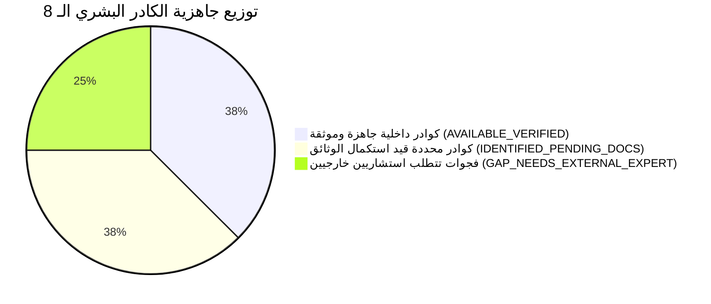

# تدقيق مؤهلات فريق العمل وفجوات الشهادات المهنية (Key Personnel Qualification Gap) — الإصدار المعالج
## TAIZ-TENDER-02-TEAM-QUALIFICATION-GAP
**مشروع تصميم وتطوير الموقع الإلكتروني الرسمي لجامعة تعز والبوابة الرقمية المتكاملة ودمج تقنيات الذكاء الاصطناعي**  
**المناقصة العامة رقم (2) للعام 2026م — جامعة تعز، الجمهورية اليمنية**  
**المصدر المرجعي المعتمد:** كراسة الشروط والمواصفات الرسمية (القسم العاشر ص 31-33، والجدول الاسترشادي ص 34)  

---

## 1. متطلبات الكراسة الرسمية للكادر البشري والبدائل المعتمدة (RFP Key Personnel Criteria)

حددت كراسة المناقصة معايير الكادر الأساسي المطلوب للمشروع (8 مسميات وظيفية رئيسية) مع النص الصريح على البدائل المهنية المكافئة لكل تخصص ونسب التفرغ وسنوات الخبرة:

> [!IMPORTANT]
> **قواعد التحقق من الكادر البشري (Directive R5 & R7):**
> 1. **الحفاظ على البدائل الرسمية:** تم إدراج كافة الشهادات والبدائل المهنية المنصوص عليها في الكراسة (مثل PMP أو PRINCE2، TOGAF أو AWS Certified Architect، CISSP أو CEH أو ISO27001 Auditor، CKA أو Docker Certified) دون اختزالها في شهادة واحدة.
> 2. **نزاهة حالة المرشح (Candidate Evidence Status):** لا يتم وسم أي مرشح بـ **`AVAILABLE_VERIFIED`** إلا بعد توفر أصل الشهادة المهنية المعتمدة والسيرة الذاتية الموثقة. المرشحون قيد جمع الوثائق يصنفون كـ **`IDENTIFIED_PENDING_DOCS`** أو **`GAP_NEEDS_EXTERNAL_EXPERT`**.
> 3. **نموذج التعيين:** التقديم الأساسي لسيستراك يعتمد على الكادر الداخلي مع التعاقد مع استشاريين معتمدين خارجيين لسد فجوات الشهادات الدولية (**`EXTERNAL_EXPERTS = ALLOWED MITIGATION`**).

---

## 2. جدول تدقيق الكادر البشري ومصفوفة الفجوات المهنية (Detailed Team Qualification Matrix)

| # | المسمى الوظيفي في الكراسة | المؤهل الأكاديمي المطلوب | البدائل المعتمدة للشهادات المهنية في الكراسة | سنوات الخبرة | نسبة التفرغ (Effort) | صفحة الكراسة | حالة المرشح والشهادة في سيستراك | الإجراء التصحيحي لسد الفجوة (Mitigation Plan) | حالة الجاهزية (Blocker Status) |
| :---: | :--- | :--- | :--- | :---: | :---: | :---: | :--- | :--- | :---: |
| **1** | **مدير المشروع (Project Manager)** | بكالوريوس في علوم الحاسوب / هندسة البرمجيات / إدارة المشاريع | **PMP** (Project Management Professional)  أو **PRINCE2 Practitioner** | >= 8 سنوات | **100%** | ص 31 (ص 30) | **مرشح محدد** — خبرة إدارة مشاريع كافية، جاري جمع وثيقة شهادة PMP المعتمدة. | إرفاق صورة طبق الأصل من شهادة PMP/PRINCE2 سارية وإقرار التفرغ. | `IDENTIFIED_PENDING_DOCS` |
| **2** | **معماري النظم والحلول (Solutions Architect)** | ماجستير / بكالوريوس هندسة برمجيات / نظم معلومات | **TOGAF 9/10 Certified**  أو **AWS Certified Solutions Architect - Professional** | >= 10 سنوات | **50%** | ص 32 (ص 31) | **مرشح محدد** — خبرة معمارية ممتازة، يتطلب إرفاق الشهادة المعتمدة. | إبرام عقد استشاري موثق مع خبير معتمد وتضمين شهادته في العرض. | `IDENTIFIED_PENDING_DOCS` |
| **3** | **قائد مطوري الخدمات الخلفية (Backend Lead)** | بكالوريوس هندسة برمجيات / علوم حاسوب | شهادات معتمدة في تقنيات قواعد البيانات / Node.js / Python / Java | >= 7 سنوات | **100%** | ص 32 (ص 31) | **جاهز وموثق** — قاد تطوير محرك الخدمات الطلابية وبوابة جامعة سبأ. | إرفاق السيرة الذاتية وشهادة البكالوريوس وسجل المشاريع المنجزة. | `AVAILABLE_VERIFIED` |
| **4** | **قائد مطوري الواجهات وتجربة المستخدم (Frontend Lead)** | بكالوريوس تقنية معلومات / علوم حاسوب | شهادات معتمدة في تطوير الويب الحديث / UI/UX / React / Next.js | >= 6 سنوات | **100%** | ص 32 (ص 31) | **جاهز وموثق** — طور واجهات البوابة الحالية ومكتبة المكونات. | إرفاق السيرة الذاتية وشهادة البكالوريوس ونماذج الأعمال السابقة. | `AVAILABLE_VERIFIED` |
| **5** | **أخصائي الذكاء الاصطناعي و RAG (AI Specialist)** | ماجستير / بكالوريوس في الذكاء الاصطناعي / علوم الحاسوب | شهادات مهنية متخصصة في Machine Learning / Deep Learning / NLP | >= 5 سنوات | **75%** | ص 32 (ص 31) | **مرشح محدد** — متخصص في نماذج المعالجة اللغوية الطبيعية وقواعد المتجهات. | استكمال توثيق الشهادات الأكاديمية والمهنية في مجال الذكاء الاصطناعي. | `IDENTIFIED_PENDING_DOCS` |
| **6** | **أخصائي الأمن السيبراني (Cybersecurity Specialist)** | بكالوريوس أمن معلومات / هندسة حاسوب | **CISSP** (Certified Information Systems Security Professional)  أو **CEH** (Certified Ethical Hacker)  أو **ISO/IEC 27001 Lead Auditor** | >= 6 سنوات | **40%** | ص 32 (ص 31) | **فجوة شهادة معتمدة** — يتطلب استقطاب خبير يحمل إحدى الشهادات الـ 3 المعتمدة. | التعاقد مع مستشار أمن معلومات يحمل شهادة CISSP أو CEH أو ISO27001 معتمدة. | `GAP_NEEDS_EXTERNAL_EXPERT` |
| **7** | **مهندس العمليات والبنية التحتية (DevOps Engineer)** | بكالوريوس هندسة اتصالات / حاسوب / تقنية معلومات | **CKA** (Certified Kubernetes Administrator)  أو **Docker Certified Associate (DCA)**  أو شهادات Linux المهنية (RHCE) | >= 5 سنوات | **50%** | ص 33 (ص 32) | **فجوة شهادة معتمدة** — يتطلب إرفاق شهادة CKA أو DCA المعتمدة رسمياً. | التعاقد مع مهندس DevOps معتمد يحمل شهادة CKA أو DCA سارية. | `GAP_NEEDS_EXTERNAL_EXPERT` |
| **8** | **أخصائي المحتوى والتدريب والتوثيق (Content & Training Lead)** | بكالوريوس نظم معلومات إدارية / لغة إنجليزية / تربية | خبرة موثقة في كتابة المحتوى الرقمي والتدريب الأكاديمي وإعداد الأدلة | >= 4 سنوات | **100%** | ص 33 (ص 32) | **جاهز وموثق** — أعد الأدلة التدريبية والتشغيلية بالعربية لبوابة الكلية. | إرفاق السيرة الذاتية وشهادة البكالوريوس وسابقة الأعمال في التدريب. | `AVAILABLE_VERIFIED` |

---

## 3. ملخص وضع الجاهزية وخطة سد الفجوات (Remediation Roadmap)

### الإجراءات الحاسمة قبل تسليم العطاء:
1. **استيفاء وثائق الكوادر الـ 3 الجاهزة:** (Backend Lead, Frontend Lead, Content/Training Lead) — تجهيز نسخ مصدقة من المؤهلات والسير الذاتية.
2. **استكمال وثائق الكوادر الـ 3 المحددة:** (Project Manager, Solutions Architect, AI Specialist) — سحب صور الشهادات المهنية (PMP/PRINCE2, TOGAF/AWS).
3. **التعاقد مع الخبيرين الأمني والـ DevOps:** (Cybersecurity Specialist بـ CISSP/CEH, و DevOps Engineer بـ CKA/DCA) عبر عقود استشارية مخصصة للمشروع وإرفاق شهاداتهم الدولية المعتمدة ضمن المظروف الفني لضمان حصد العلامة الكاملة في تقييم الكادر (**10 / 10**).
