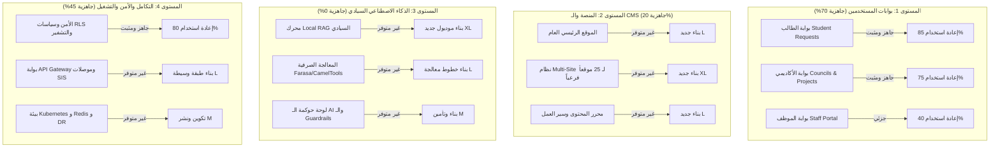

# تقرير التدقيق الفني: إعادة الاستخدام وتحليل الفجوات لمستودع البوابة
## TAIZ-TENDER-01 — REUSE & GAP ANALYSIS REPORT

> **المستودع المدقق (قراءة فقط):** `msorori-mh/saba-uni-portal`
> **الفرع:** `docs/taiz-tender-prebid-01` | **BASE_SHA:** `b8b356044686082e880475041e17cfb7ffe05eab`
> **المرجع التعاقدي:** كراسة المناقصة العامة رقم 2/2026 لجامعة تعز (42 صفحة).

---

## 1. الملخص التنفيذي للتدقيق الفني

تم إجراء تدقيق فني شامل ومحايد لمحتويات مستودع بوابة الكلية الحالي ومقارنة قدراته ومكوناته البرمجية بالمتطلبات الفنية والتعاقدية الواردة في كراسة مناقصة جامعة تعز رقم 2/2026.

### نتائج التصنيف الإجمالية للمتطلبات:
- **المطابقة التامة (COMPLIANT):** بنسبة تقارب **28%** (تشمل بوابات الطلبة، إدارة المجالس، نظام الصلاحيات RLS، النفاذية، والتصميم المتجاوب).
- **المطابقة الجزئية (PARTIALLY_COMPLIANT):** بنسبة **24%** (تشمل بوابات الموظفين، إدارة الكادر، المصادقة، والنسخ الاحتياطي).
- **غير متطابق / يتطلب بناءً جديداً (NOT_COMPLIANT):** بنسبة **31%** (تشمل نظام الـ Multi-Site لـ 25 موقعاً فرعياً، محرك الـ RAG السيادي المحلي، بوابة API Gateway، محرك الـ SEO الآلي، وبيئة الحاويات Kubernetes).
- **يتطلب أدلة وثائقية خارجية (UNKNOWN_NEEDS_EVIDENCE):** بنسبة **17%** (تشمل الوثائق القانونية للشركة، الضمان البنكي، 3 شهادات إنجاز سابقة، شهادات كادر العمل الاحترافية، وتقرير الفحص الأمني من طرف ثالث).

---

## 2. تفصيل طبقات المنظومة ومستوى الجاهزية

---

## 3. التقرير التفصيلي لمحاور العمل

### 3.1 ما هو موجود ومثبت وقابل لإعادة الاستخدام (REUSABLE ASSETS)
1. **محرك الطلبات الأكاديمية والخدمات الطلابية:**
   - مسارات سير العمل لـ 7 خدمات رئيسية (إيقاف قيد، غياب، سحب ملف، تعديل مسار، إخلاء طرف، إعادة إصدار، تدقيق وثائق).
   - المسارات في المستودع: `src/components/student-requests/`, `src/lib/student-requests/`, `tests/academic-clearance/`.
   - نسبة إعادة الاستخدام: **85%**.
2. **منظومة المجالس الأكاديمية ومشاريع التخرج:**
   - دورة حياة اجتماعات المجالس، جداول الأعمال، القرارات، الحضور والنصاب، وتوثيق مشاريع التخرج.
   - المسارات: `src/components/councils/`, `src/components/graduation-projects/`, `tests/academic-councils/`.
   - نسبة إعادة الاستخدام: **80%**.
3. **نظام التحكم في الوصول والأمن (RBAC / RLS):**
   - عزل صارم للصلاحيات (`processing_unit`, `processing_role`) ومنع ثغرات IDOR على مستوى قاعدة البيانات.
   - المسارات: `src/lib/security/`, `supabase/migrations/`.
   - نسبة إعادة الاستخدام: **90%**.
4. **نظام التصميم ودعم اللغة العربية (RTL):**
   - تطبيق خط Cairo، دعم Bidi، ومكتبة مكونات متجاوبة بالكامل مبنية على Radix UI و TailwindCSS 4.
   - المسارات: `src/components/ui/`, `src/assets/fonts/cairo/`.
   - نسبة إعادة الاستخدام: **90%**.

---

### 3.2 ما هو موجود جزئياً ويتطلب استكمالاً (PARTIALLY REUSABLE)
1. **بوابة الموظفين والخدمات الإدارية:**
   - توجد إدارة الكادر الوظيفي ولكن تنقص واجهات طلب الإجازات والمراسلات الإدارية الداخلية وتوليد كشف الراتب.
   - الجهد المطلوب: **M (متوسط)** | الاستراتيجية: **Build**.
2. **المصادقة والدخول الموحد (SSO/MFA):**
   - يوجد نظام مصادقة Supabase Auth ولكن تتطلب الكراسة دمج خادم Keycloak موحد مع OIDC و MFA لكافة البوابات.
   - الجهد المطلوب: **M (متوسط)** | الاستراتيجية: **Build / Integrate**.
3. **النسخ الاحتياطي واستمرارية الأعمال (DR):**
   - توجد واجهات نسخ احتياطي بالمستودع ولكن ينقص تكوين PostgreSQL WAL Streaming لتحقيق RPO <= 1h و RTO <= 4h.
   - الجهد المطلوب: **M (متوسط)** | الاستراتيجية: **Build / Infra**.

---

### 3.3 ما هو مفقود كلياً ويتطلب بناءً جديداً (NEW BUILD REQUIRED)
1. **منصة إدارة المحتوى متعددة المواقع لـ 25 موقعاً فرعياً (RTM-01 / BOQ 1.3):**
   - **الفجوة:** المستودع حالياً Single-Tenant ولا يدعم إنشاء وإدارة مواقع فرعية مستقلة عبر Subdomains بضغطة زر.
   - **الإجراء:** بناء معمارية Multi-Tenant لتوليد وإدارة 25 موقعاً فرعياً وقوالبها وعزل صلاحيات محرريها.
   - **حجم الجهد:** **XL (كبير جداً)** | الاستراتيجية: **Build**.
2. **محرك الذكاء الاصطناعي السيادي Local RAG والمعالجة الصرفية (RTM-03 / BOQ 3.1 - 3.3):**
   - **الفجوة:** لا يوجد أي كود أو تكوين للذكاء الاصطناعي بالمستودع.
   - **الإجراء:** بناء خدمة RAG محلية بلغة Python مع قاعدة بيانات Qdrant، ونماذج Llama 3 / Qwen 2.5 محلياً، وأنابيب Farasa للمعالجة الصرفية.
   - **حجم الجهد:** **XL (كبير جداً)** | الاستراتيجية: **Build**.
3. **طبقة API Gateway و 4 موصلات للأنظمة القائمة (RTM-07 / BOQ 4.1 - 4.2):**
   - **الفجوة:** لا توجد طبقة بوابة واجهات (Kong/Envoy) ولا موصلات لقراءة بيانات الـ SIS والـ HR القديمة.
   - **الإجراء:** تهيئة Kong API Gateway وتطوير 4 Legacy Adapters وتوثيق الـ OpenAPI بصيغة Swagger.
   - **حجم الجهد:** **L (كبير)** | الاستراتيجية: **Build**.
4. **محرك SEO التلقائي والفهرسة اللحظية (RTM-06 / BOQ 1.4):**
   - **الفجوة:** المستودع تطبيق SPA محمي ولا يولد بيانات Schema.org أو sitemap.xml تلقائياً.
   - **الإجراء:** بناء وحدة Auto-SEO لتوليد JSON-LD للمؤسسات التعليمية والتكامل مع Google Indexing API.
   - **حجم الجهد:** **M (متوسط)** | الاستراتيجية: **Build**.
5. **بيئة الحاويات Kubernetes واختبارات الضغط لـ 5,000 مستخدم (RTM-08 / BOQ 5.3):**
   - **الفجوة:** غياب ملفات Helm Charts وسيناريوهات اختبارات الضغط Locust.
   - **الإجراء:** كتابة Helm Charts وضبط التوسع التلقائي HPA وتنفيذ سيناريوهات Locust لـ 5,000 مستخدم.
   - **حجم الجهد:** **M (متوسط)** | الاستراتيجية: **Build / DevOps**.

---

### 3.4 ما يتطلب تعاقداً أو شراءً من طرف ثالث (BUY / PARTNER)
1. **تقرير اختبار الاختراق المعتمد من طرف ثالث (Third-Party Pentest):**
   - **المتطلب:** تقرير فحص واختراق أمني رسمي ومختوم من جهة مستقلة معتمدة يثبت خلو المنظومة من الثغرات الحادة (OWASP ASVS L2).
   - **الإجراء:** التعاقد مع شركة أمن معلومات مرخصة لإجراء الفحص الأمني الشامل وإصدار التقرير الرسمي.
   - **التكلفة والجهد:** **L (تعاقد خارجي)**.
2. **سيرفرات الذكاء الاصطناعي المحلية (Local Inference Hardware):**
   - **المتطلب:** استضافة سيادية 100% On-Premises لمعالجة نماذج 32B/72B.
   - **الإجراء:** تحديد مواصفات خوادم GPU (مثل NVIDIA A100/A6000 أو ما يعادلها) ضمن متطلبات البيئة التحتية للجامعة.

---

### 3.5 ما يتطلب إثباتاً بوثائق رسمية خارج المستودع (OFF-REPO EVIDENCE)
| البند | الوثيقة المطلوبة | المصدر المطلوب | الأثر عند الغياب |
| :--- | :--- | :--- | :--- |
| **سجل تجاري وترخيص IT** | أصل/صورة معمدة سارية لعام 2026م | وزارة الصناعة والتجارة اليمنية | استبعاد فوري (Pass/Fail) |
| **البطاقات القانونية** | بطاقة ضريبية، زكوية، تأمينية، ضريبة مبيعات | الجهات الحكومية المختصة | استبعاد فوري (Pass/Fail) |
| **الضمان البنكي الابتدائي** | أصل خطاب ضمان بنكي 2% سارٍ لـ 90 يوماً | بنك معتمد في اليمن | استبعاد فوري وبطلان العطاء |
| **سابقة الأعمال** | 3 شهادات إنجاز واستلام نهائي لمشاريع مماثلة | جامعات أو مؤسسات كبرى | خسارة 20% من التقييم الفني |
| **فريق العمل المعتمد** | سير ذاتية وشهادات (PMP, TOGAF, CISSP, CKA) | الكوادر البشرية المعتمدة | خسارة 10% من التقييم الفني |

---

## 4. مصفوفة تقدير الجهد والمسؤولية لإغلاق الفجوات

| المحور الفني | حجم الجهد | المدة التقديرية | الاستراتيجية | الدور المسؤول |
| :--- | :--- | :--- | :--- | :--- |
| **نظام Multi-Site CMS لـ 25 موقعاً** | `XL` | 6 أسابيع | Build (Internal) | Solutions Architect + Frontend Lead |
| **محرك Local RAG والمعالجة الصرفية** | `XL` | 6 أسابيع | Build (Specialized) | AI/RAG Specialist |
| **بوابة API Gateway وموصلات SIS** | `L` | 4 أسابيع | Build | Backend Lead |
| **محرك SEO وأتمتة الفهرسة** | `M` | 2 أسبوع | Build | Frontend Lead |
| **إعداد Keycloak SSO و MFA** | `M` | 2 أسبوع | Build / Integrate | Backend Lead |
| **بيئة Kubernetes و Redis و DR** | `M` | 3 أسابيع | Build / DevOps | DevOps Specialist |
| **الفحص الأمني المستقل (Pentest)** | `L` | 3 أسابيع | Partner (Third-Party) | Cybersecurity Specialist |
| **استكمال الوثائق القانونية والشهادات** | `XL` | أسبوعان (قبل فتح المظاريف) | Partner / Corporate | Project Manager + Legal |
