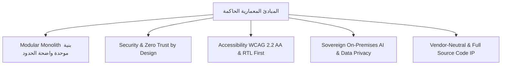

# الملخص التنفيذي للمنتج والمعمارية المستهدفة
## TAIZ-TENDER-03 — TARGET ARCHITECTURE EXECUTIVE SUMMARY

> **المرجع التعاقدي:** كراسة مناقصة جامعة تعز رقم 2/2026، وسجل المتطلبات المجمد (`TAIZ_TENDER_00_REQUIREMENTS_REGISTER.md`)، ومصفوفة التتبع (`TAIZ_TENDER_00_RTM.csv`).
> **طبيعة الوثيقة:** تصميم معماري هندسي تفصيلي وتوثيق دفاعي موجه للجنة التحكيم الفنية بالجامعة (SOURCE-ONLY Architectural Blueprint).

---

## 1. الرؤية الهندسية ونطاق الحل

تهدف المعمارية المستهدفة إلى بناء **منظومة رقمية جامعية سيادية، موحدة، عالية الأداء، وقابلة للتوسع** لجامعة تعز، تشمل:
1. **الموقع المؤسسي المركزي** ومحرك إدارة محتوى متعدد المواقع (**Multi-Site CMS**) يدير 25 موقعاً فرعياً للكليات والمراكز عبر نطاقات فرعية مستقلة (`*.taiz.edu.ye`).
2. **البوابات الرقمية الموحدة** للطلاب وأعضاء هيئة التدريس والموظفين مع خادم هويات ومصادقة موحدة (**SSO / MFA / RBAC**).
3. **محرك ذكاء اصطناعي وبحث دلالي سيادي محلي الاستضافة 100% On-Premises (**Local Sovereign RAG Engine**) يستند إلى المعالجة الصرفية للغة العربية وقواعد البيانات المتجهية لحماية سرية بيانات الجامعة وتقليل معدل الهلوسة دون 2% عبر الاستشهاد الحصري باللوائح المعتمدة [TARGET_TO_BE_VALIDATED].
4. **بوابة تكامل مؤسسية (API Gateway)** و 4 موصلات آمنة مع الأنظمة الجامعية القائمة (نظام الطلاب SIS، ونظام الموارد البشرية، والمالية).
5. **بيئة تشغيل موثوقة ومؤتمتة** تدعم معايير الأمان العالمية **OWASP ASVS v4.0 Level 2**، وتوافق النفاذية **WCAG 2.2 Level AA**، مع سعة استيعاب 5,000 مستخدم متزامن تتوسع إلى 25,000 مستخدم، وخطة استمرارية أعمال وتعافٍ من الكوارث (**DRP**) بأهداف استعادة صارمة (RPO <= 1h, RTO <= 4h).

---

## 2. المبادئ المعمارية الحاكمة والقيود التعاقدية

---

## 2.1 جدول تصنيف التقنيات والبدائل المعمارية المحايدة (Vendor-Neutral Technology Matrix)

| التقنية / الأداة المرجعية | تصنيف المتطلب بالكراسة | البدائل المعتمدة المتاحة | معايير الاختيار والمفاضلة |
| :--- | :--- | :--- | :--- |
| **Kubernetes (K8s)** | `EXPLICIT_TENDER_REQUIREMENT` (ص 6، 25، 33) | Vanilla K8s / OKD / RKE2 | التوافق مع معايير CNCF، خفة الاستهلاك في On-Premises |
| **PostgreSQL 16 & WAL** | `EXPLICIT_TENDER_REQUIREMENT` (ص 6، 7، 25، 39) | PostgreSQL Enterprise / Patroni HA | دعم RLS الأصيل، كفاءة الـ Streaming Replication |
| **التشفير TLS 1.3 / AES-256** | `EXPLICIT_TENDER_REQUIREMENT` (ص 6، 7، 27، 34) | OpenSSL FIPS 140-3 Modules | مطابقة معايير NIST، إلغاء الشفرات القديمة |
| **خادم Keycloak IAM** | `TENDER_EXAMPLE_OR_EQUIVALENT` (ص 18، 26) | Authentik / Ory Kratos / FreeIPA | دعم OIDC / SAML 2.0، إدارة MFA، ودعم الـ Federation |
| **بوابة Kong API Gateway** | `TENDER_EXAMPLE_OR_EQUIVALENT` (ص 6، 25، 39) | Envoy Gateway / Apache APISIX / Traefik | كفاءة Rate Limiting، دعم Plugins، وخفة استهلاك الموارد |
| **قاعدة Qdrant المتجهية** | `TENDER_EXAMPLE_OR_EQUIVALENT` (ص 6، 25، 38) | Milvus / pgvector / Weaviate | كفاءة الـ Hybrid Search، أداء الـ Cosine Similarity |
| **المعالجة الصرفية Farasa** | `TENDER_EXAMPLE_OR_EQUIVALENT` (ص 20، 27) | CamelTools / PyArabic / Tashaphyne | دقة تجذير النصوص القانونية والأكاديمية العربية |
| **نماذج Llama 3.1 / Qwen 2.5** | `TENDER_EXAMPLE_OR_EQUIVALENT` (ص 6، 25) | Mistral-Large / Command R / Gemma 2 | دقة التوليد بالعربية، دعم الاستضافة المحلية على GPU |
| **حزم Helm Charts** | `PROPOSED_REFERENCE_IMPLEMENTATION` | Kustomize / Ansible K8s | معيارية الحزم وقابلية إعادة الإنتاج والـ Rollback |
| **أدوات Locust / JMeter** | `TENDER_EXAMPLE_OR_EQUIVALENT` (ص 34، 39) | Playwright / k6 / Gatling | محاكاة 5,000 مستخدم متزامن وقياس زمن الاستجابة |
| **Google Indexing / IndexNow**| `PROPOSED_REFERENCE_IMPLEMENTATION` | Dynamic Sitemaps / RSS Indexing | يقتصر على المحتوى العام فقط مع حظر البيانات الحساسة |

### التمييز الصارم بين الالتزامات والاختيارات الهندسية:
1. **المتطلبات الصريحة في المناقصة (Explicit Requirements):**
   - نمط المعمارية: Modular Monolith (ص 6، 25).
   - تسليم كامل الشفرة المصدرية غير المغلقة مع نقل الملكية الفكرية للجامعة (ص 3، 23، 42).
   - استضافة الذكاء الاصطناعي محلياً بالكامل On-Premises دون استدعاء أي سحابة خارجية (ص 6، 20، 25).
   - التوافق مع معيار OWASP ASVS L2 والتشفير TLS 1.3 و AES-256 (ص 6، 7، 34).
   - دعم 5,000 مستخدم متزامن والتوسع لـ 25,000 مع زمن استجابة API < 300ms و LCP < 2.5s (ص 6، 24، 30).
2. **القرارات المعمارية المقترحة (Proposed Architectural Decisions):**
   - استخدام Next.js (SSR/ISR) للواجهات مع React 19 و Tailwind CSS 4.
   - استخدام NestJS (Node.js/TypeScript) للخدمات الخلفية مع محرك أحداث داخلي (In-Process Event Bus).
   - استخدام PostgreSQL 16 لقواعد البيانات مع عزل البيانات بواسطة Row Level Security (RLS) ومخططات Multi-Tenancy.
3. **أمثلة وبدائل تقنية محايدة (Vendor-Neutral Technology Examples):**
   - لإدارة الهويات: Keycloak أو ما يعادله مفتوح المصدر المتوافق مع OIDC / SAML 2.0.
   - لبوابة الواجهات: Kong API Gateway أو Envoy أو Traefik.
   - لقواعد البيانات المتجهية: Qdrant أو Milvus أو pgvector.
   - لنماذج اللغة المحلية: Llama 3.1 / Qwen 2.5 / Mistral مع نماذج التضمين bge-m3.
4. **عناصر تتطلب استيضاحاً من الجامعة (Clarifications Required):**
   - طبيعة واجهات وقواعد بيانات الأنظمة القائمة (SIS / HR / Finance) وبروتوكولات الربط المتاحة.
   - المواصفات الدقيقة لسيرفرات الاستضافة المحلية المتاحة (CPU, RAM, GPU) في مركز بيانات الجامعة.

---

## 3. لماذا يعتبر نمط Modular Monolith الخيار الأمثل للمشروع؟

1. **كفاءة استهلاك الموارد في البيئة المحلية (On-Premises Efficiency):**
   - يُقدَّر نمط Modular Monolith بتوفير ~30% إلى 40% من استهلاك المعالجات والذاكرة [DESIGN_ASSUMPTION] مقارنة بالـ Microservices المشتتة، مما يجعله مثالياً للاستضافة على سيرفرات الجامعة المحلية.
2. **أداء وسرعة استجابة فائقة (Ultra-Low Latency):**
   - التواصل بين الوحدات يتم محلياً في الذاكرة (In-Process Calls) عبر واجهات وعقود برمجية محكمة، متجنباً تأخير الشبكة والـ Serialization Overhead مع استهداف زمن استجابة داخلي للـ API أقل من 300ms [TARGET_TO_BE_VALIDATED عبر اختبارات الضغط في المرحلة 5].
3. **سلامة واتساق المعاملات الأكاديمية (Transactional Integrity):**
   - ضمان الاتساق الصارم (ACID Transactions) لعمليات تسجيل الطلاب ورصد الدرجات دون الحاجة لبروتوكولات Distributed Sagas المعقدة.
4. **سهولة الصيانة والتشغيل (Maintainability & Single Deployment Unit):**
   - نشر المنظومة كوحدة متكاملة ومترابطة يسهل على كادر الجامعة التقني تشغيلها ومراقبتها واستكشاف الأخطاء وإصلاحها.
5. **القابلية للتحول المستقبلي المنظم (Future Decomposability):**
   - تم تصميم كل موديول بحدود واضحة (Module Boundaries) وملكية مستقلة لجداول البيانات، مما يسمح بفصل أي موديول (مثل محرك الـ AI أو بوابات الطلبة) إلى Microservice مستقل في المستقبل بضغطة زر عند الحاجة دون المساس بالنواة.

---

## 4. حدود إعادة استخدام مستودع بوابة الكلية (Reuse Boundary)

| المحور البرمجي | مستوى إعادة الاستخدام | المكونات المعتمدة من المستودع الحالي |
| :--- | :--- | :--- |
| **محرك الطلبات الطلابية** | **REFACTOR_AND_REUSE (85%)** | آلات الحالات لسير عمل 7 خدمات أكاديمية (إيقاف القيد، الغياب، سحب الملف، إخلاء الطرف) |
| **المجالس الأكاديمية والتخرج** | **REFACTOR_AND_REUSE (80%)** | دورة حياة الاجتماعات، جداول الأعمال، القرارات، الحضور، ومشاريع التخرج |
| **ضوابط الأمان والصلاحيات** | **REUSE_AS_IS / REFACTOR (90%)** | مصفوفة التحقق، سياسات RLS، تطهير المدخلات، وسجلات التدقيق |
| **نظام التصميم ودعم الـ RTL** | **REUSE_AS_IS (90%)** | مكتبة المكونات 46 مكوناً، تكامل خط Cairo، وتنسيقات الـ RTL |
| **المواقع المتعددة 25 موقعاً** | **REBUILD (0% بالمستودع)** | بناء محرك Multi-Site Tenant Manager و Subdomain Routing من الصفر |
| **الذكاء الاصطناعي السيادي** | **REBUILD (0% بالمستودع)** | بناء خط أنابيب Local RAG، وتكامل Qdrant، وأنابيب Farasa الصرفية من الصفر |
| **بوابة التكامل API Gateway** | **REBUILD (0% بالمستودع)** | تهيئة Kong API Gateway و 4 موصلات للأنظمة القائمة |

---

## 5. الجدوى الزمنية ودعم خطة التنفيذ خلال 32 أسبوعاً

تمت هندسة المعمارية المستهدفة لتدعم تماماً الجدول الزمني المعتمد في الكراسة (32 أسبوعاً موزعة على 6 مراحل):
- **المرحلة 1 (الأسابيع 1-4):** اعتماد وثائق المعمارية التفصيلية D-01 و D-02 و D-05.
- **المرحلة 2 (الأسابيع 5-12):** تطوير نواة الـ Modular Monolith، ونظام Multi-Site CMS، وتكامل Keycloak SSO.
- **المرحلة 3 (الأسابيع 13-20):** بناء محرك Local RAG، وقاعدة Qdrant، وبوابة API Gateway مع موصلات SIS.
- **المرحلة 4 (الأسابيع 21-24):** محرك SEO، وهجرة البيانات التاريخية (ETL)، وتكوين بيئة Kubernetes و DRP.
- **المرحلة 5 (الأسابيع 25-28):** اختبارات الضغط (5,000 مستخدم)، واختبار الاختراق المستقل (ASVS L2)، واختبار UAT.
- **المرحلة 6 (الأسابيع 29-32):** التدريب المعتمد لـ 40 كادراً (80 ساعة)، والنشر التشغيلي، وتسليم الشفرة المصدرية.
