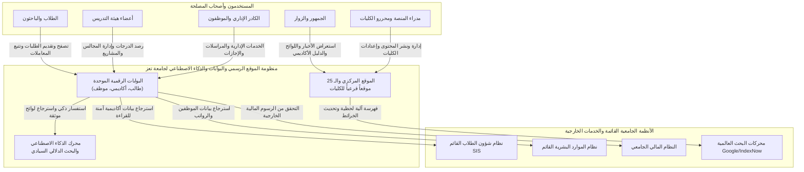
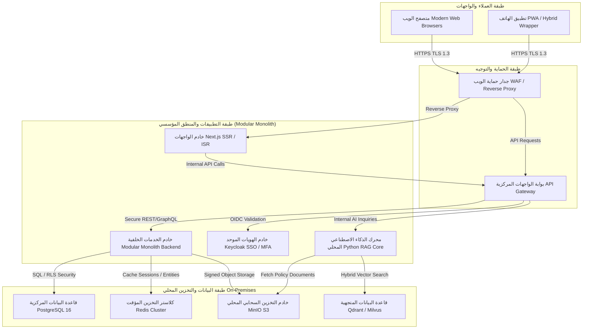
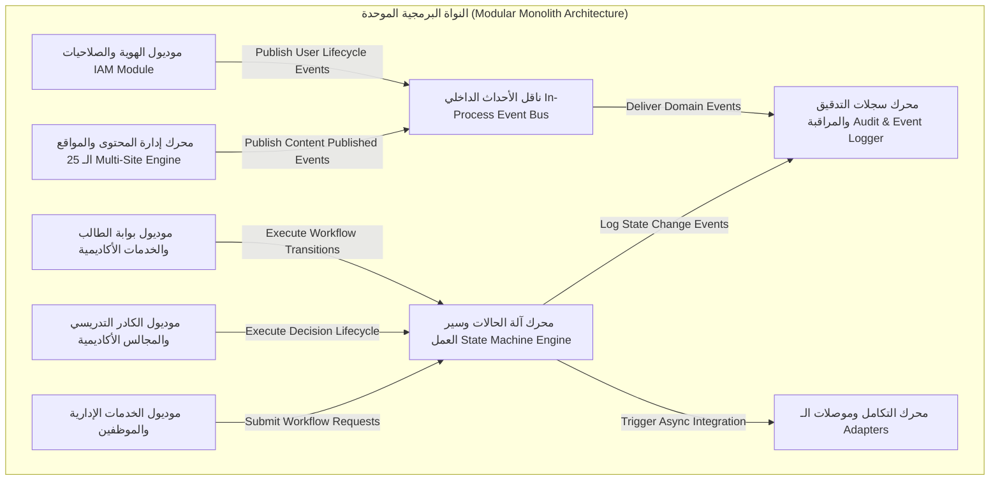
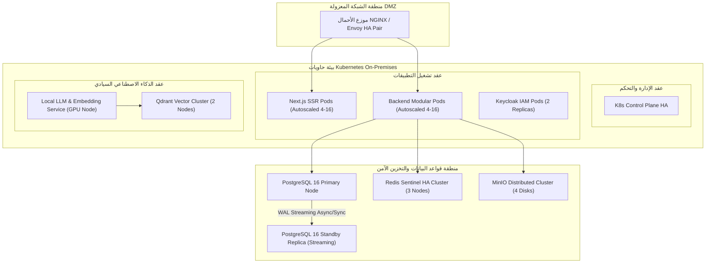
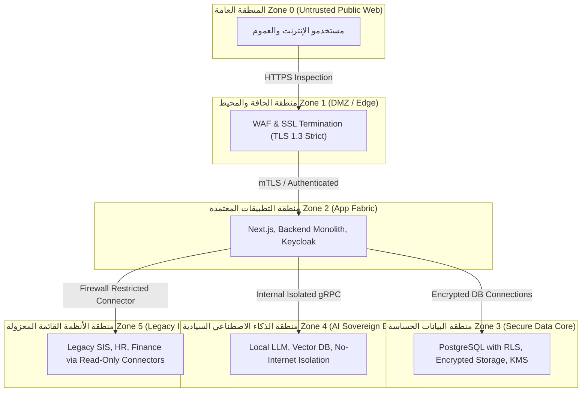
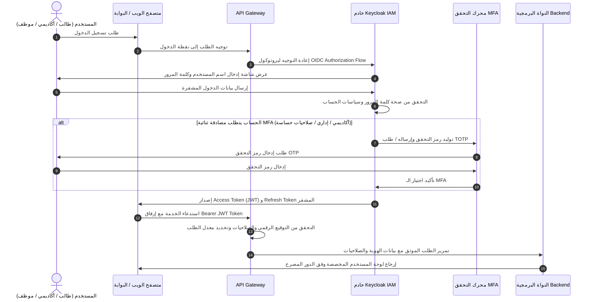
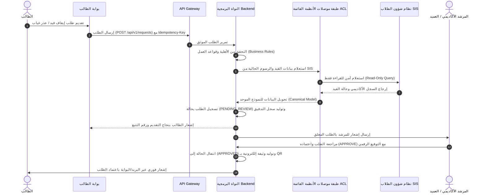
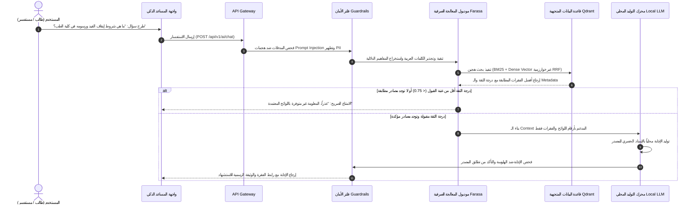

# معمارية C4 التفصيلية ومخططات تدفق البيانات
## TAIZ-TENDER-03 — C4 ARCHITECTURAL MODEL & INTERACTION FLOWS

> **المواصفة:** مخططات C4 Architecture كاملة بصيغة Mermaid متوافقة 100% مع معايير العرض على GitHub دون استخدام أي وسوم HTML داخل المخططات.

---

## 1. المستوى 1: مخطط سياق المنظومة (System Context Diagram)

---

## 2. المستوى 2: معمارية الحاويات (Container Architecture Diagram)

---

## 3. المستوى 3: معمارية المكونات الداخلية (Component Architecture)

---

## 4. المستوى 4: معمارية النشر والبنية التشغيلية (Deployment Diagram)

---

## 5. حدود الثقة ونطاقات الأمان (Trust Boundaries)

---

## 6. مخططات تدفق العمليات الحساسة (Interaction Flows)

### 6.1 تدفق تسجيل الدخول الموحد والمصادقة الثنائية (SSO / MFA Login Flow)

---

### 6.2 تدفق تقديم واعتماد خدمة أكاديمية عبر بوابة التكامل (Academic Workflow Flow)

---

### 6.3 تدفق استعلام المساعد الذكي مع الاستشهاد ومنع الهلوسة (Sovereign RAG Flow)

