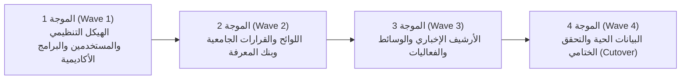

# خطة ترحيل البيانات، الأرشفة، والتكاملية البيانية
## TAIZ-TENDER-03 — DATA MIGRATION & INTEROPERABILITY SPECIFICATION

> **المرجع التعاقدي:** كراسة المناقصة رقم 2/2026 — الجزء الثالث: البيانات والترحيل (ص 7)، بند RTM-09 (ص 24)، والجدول 4 في الـ BOQ (ص 39).

---

## 1. استكشاف مصادر البيانات وتصنيفها (Source Systems Discovery)

| مصدر البيانات | طبيعة البيانات | الحجم التقديري | تنسيق المصدر | استراتيجية الترحيل |
| :--- | :--- | :--- | :--- | :--- |
| **الموقع الإلكتروني القديم** | الأخبار التاريخية، المقالات، والبيانات الصحفية | 5,000+ مقال | MySQL / WordPress / HTML | أنابيب ETL مؤتمتة وسحب عبر REST/Scraping |
| **دليل الكليات والبرامج** | الخطط الدراسية وتوصيف البرامج الأكاديمية | 150+ برنامج | PDF / Word / Excel | استخراج وتنقية وإعادة هيكلة في جداول الـ CMS |
| **أرشيف أعضاء هيئة التدريس** | السير الذاتية والأبحاث المنشورة | 1,200+ أستاذ | Word / Excel / Google Scholar | استيراد موحد مع ربط الأبحاث بمستودع DSpace |
| **مكتبة اللوائح والقرارات** | اللوائح الجامعية والقرارات الرسمية | 300+ لائحة وقرار | PDF ممسوح ضوئياً | معالجة OCR وتوليد المتجهات لـ Qdrant |
| **الوسائط والملفات القديمة** | صور ووثائق وفيديوهات الفعاليات | 50+ GB | ملفات على الخادم القديم | نقل مشفر ومجدول إلى مستودع MinIO S3 |

---

## 2. مراحل وموجات الترحيل الأربع (Migration Waves)

---

## 3. خطة الحفاظ على الأرشفة والـ 301 Redirects (SEO Preservation)

1. **مصفوفة خرائط التحويل الدائمة (Redirect Map):**
   - استخراج وتوثيق كافة روابط المقالات والأخبار القديمة ذات الترتيب العالي في محركات البحث.
   - إنشاء جدول تحويل دائم بـ NGINX / Next.js يوجه أي طلب لرابط قديم (مثل: `/news.php?id=450`) إلى الرابط الجديد المكافئ (`/news/2024/cardiology-symposium`) برمز الحالة **301 Moved Permanently**.
2. **الحفاظ على الترتيب في Webometrics:**
   - الحفاظ على الروابط الأكاديمية والمجلات والصفحات الموثقة لتجنب أخطاء 404 التي تخفض تقييم الجامعة الدولي.

---

## 4. التحقق، المطابقة، وخطة التراجع (Reconciliation & Rollback)

1. **التدقيق والمطابقة الآلية (Checksum & Count Verification):**
   - مطابقة أعداد السجلات المنقولة بنسبة 100%، واستخدام خوارزميات التجزئة (SHA-256 Checksums) لمطابقة سلامة الملفات والوسائط المنقولة.
2. **استراتيجية الإطلاق بأقل زمن توقف (Zero-Downtime Cutover):**
   - تشغيل الموقع الجديد بنظام المزامنة المتوازية (Parallel Run) لمدة 7 أيام قبل التحويل النهائي لـ DNS.
3. **خطة التراجع عند الطوارئ (Rollback Plan):**
   - الاحتفاظ ببيئة الموقع القديم وقاعدة بياناته تعمل بوضع القراءة فقط لمدة 30 يوماً بعد الإطلاق، مع إمكانية استعادة التوجيه خلال أقل من 15 دقيقة في حال حدوث أي طارئ حرج.
