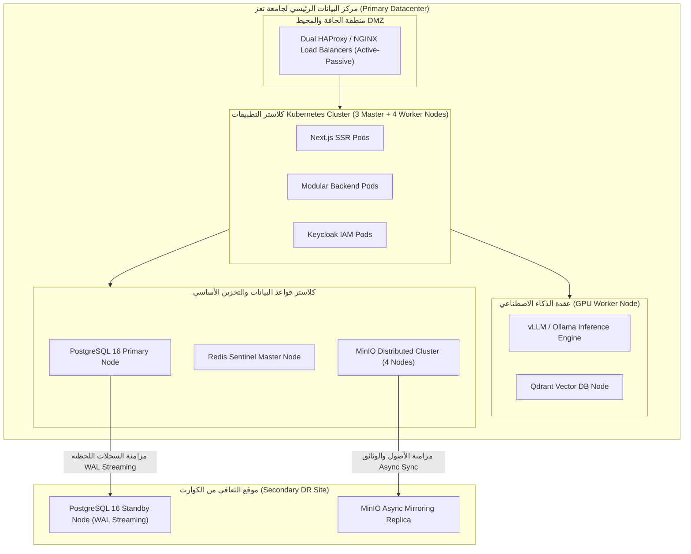

# معمارية البنية التحتية، حساب السعة، والتعافي من الكوارث
## TAIZ-TENDER-03 — INFRASTRUCTURE, CAPACITY PLANNING & DISASTER RECOVERY

> **المرجع التعاقدي:** كراسة المناقصة رقم 2/2026 — الجزء الثالث: الاستضافة والتشغيل (ص 6-7)، بند RTM-08 (ص 24)، والجدول 5 في الـ BOQ (ص 39).

---

## 1. نموذج النشر والبنية التشغيلية المحلية (On-Premises / Private Cloud)

---

## 2. معادلات حساب السعة والأحمال (5,000 إلى 25,000 مستخدم متزامن)

### 2.1 افتراضات ونموذج حركة المرور (Traffic Model):
- **المستخدمون المتزامنون الأساسيون:** 5,000 مستخدم متزامن (Concurrent Active Sessions).
- **معدل الطلبات لكل مستخدم:** طلب واحد كل 5 ثوانٍ (0.2 RPS لكل مستخدم).
- **إجمالي الطلبات في الثانية (Throughput Baseline):**
  $$	ext{RPS}_{	ext{base}} = 5,000 	imes 0.2 = 1,000 	ext{ Requests/sec}$$
- **ذروة الامتداد والتوسع (Peak Capacity 25,000 users):**
  $$	ext{RPS}_{	ext{peak}} = 25,000 	imes 0.2 = 5,000 	ext{ Requests/sec}$$
- **نسبة التخزين المؤقت (Cache Hit Ratio):** 85% للواجهات والمحتوى العام، 15% تصل لقاعدة البيانات.

### 2.2 مواصفات العتاد والخوادم الموصى بها في مركز بيانات الجامعة:

| المكون التشغيلي | العدد | المواصفات المقترحة لكل خادم (Vendor-Neutral) |
| :--- | :--- | :--- |
| **خوادم التحكم K8s Master Nodes** | 3 | 8 vCPU, 16 GB RAM, 100 GB NVMe SSD |
| **خوادم تشغيل التطبيقات K8s Worker** | 4 | 16 vCPU, 32 GB RAM, 250 GB NVMe SSD |
| **خادم الذكاء الاصطناعي GPU Worker Node** | 1 | 16 vCPU, 64 GB RAM, 1x NVIDIA A100/A6000 (48-80GB VRAM) |
| **خوادم قواعد البيانات PostgreSQL HA** | 2 | 16 vCPU, 64 GB RAM, 1 TB NVMe SSD (Enterprise RAID 10) |
| **خوادم التخزين السحابي MinIO Cluster** | 4 | 8 vCPU, 16 GB RAM, 4x 4TB Enterprise SATA/SAS Storage |

---

## 3. موازنة الأداء والجاهزية (Performance & Availability Budgets)

1. **موازنة الجاهزية (Availability Budget):**
   - الجاهزية المستهدفة: **99.9% Uptime** (أقل من 8.76 ساعة توقف غير مجدول سنوياً).
2. **موازنة زمن الاستجابة (Performance Budgets):**
   - زمن استجابة الـ API الداخلي: **< 300ms** للعمليات الأكاديمية العادية.
   - مؤشر تحميل الصفحة الأكبر (LCP): **< 2.5 ثانية** على شبكات الاتصال العادية.
   - زمن توليد واسترجاع المساعد الذكي: **< 2.5 ثانية**.

---

## 4. استراتيجية التعافي من الكوارث (Disaster Recovery Plan - DRP)

1. **الأهداف التعاقدية الصارمة:**
   - **هدف نقطة الاستعادة (RPO):** لا يتجاوز **ساعة واحدة** (RPO <= 1h).
   - **هدف زمن الاستعادة (RTO):** لا يتجاوز **4 ساعات** (RTO <= 4h).
2. **آلية المزامنة والنسخ المستمر:**
   - تطبيق `PostgreSQL WAL Streaming Replication` لنقل سجلات العمليات لحظياً إلى السيرفر الاحتياطي بموقع الـ DR.
   - مزامنة الأصول الرقمية والملفات في MinIO بشكل دوري مؤتمت كل 15 دقيقة.
3. **دليل إجراءات الانتقال التلقائي (Failover Runbook):**
   - فحص نبضات الحياة (Heartbeat) كل 10 ثوانٍ.
   - عند انقطاع السيرفر الرئيسي لمدة 60 ثانية، يقوم نظام المراقبة بتوجيه حركة المرور إلى السيرفر الاحتياطي وترقيته إلى Primary وتعديل سجلات الـ DNS آلياً.
