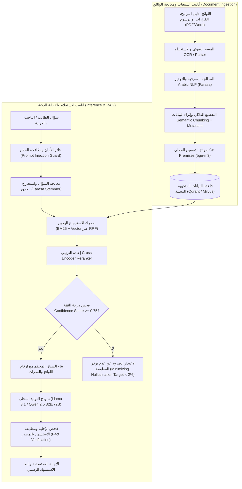

# معمارية محرك الذكاء الاصطناعي السيادي والبحث الدلالي
## TAIZ-TENDER-03 — LOCAL SOVEREIGN RAG & ARABIC NLP ARCHITECTURE

> **المرجع التعاقدي:** كراسة المناقصة رقم 2/2026 — الجزء الثامن: الذكاء الاصطناعي والمساعد الجامعي الذكي (ص 20-22)، بند RTM-03 (ص 23)، والجدول 3 في الـ BOQ (ص 38).
> **الشرط الحاكم:** **استضافة سيادية محلية 100% On-Premises** لكافة نماذج اللغة والمعالجة المتجهية داخل مركز بيانات جامعة تعز، مع حظر كامل لأي اتصال أو تصدير لبيانات الجامعة إلى واجهات خارجية (Zero External Cloud API Calls).

---

## 1. معمارية خط أنابيب الذكاء الاصطناعي المحلي (Sovereign RAG Pipeline)

---

## 2. محاور المعالجة اللغوية والصرفية العربية (Arabic NLP)

1. **أدوات المعالجة الصرفية (Farasa / CamelTools):**
   - إزالة التشكيل، تنقية الحروف، وتجريد الزوائد الصرفية واللواصق (Affixes/Clitics).
   - استخراج الجذور اللغوية (Root Extraction) لمطابقة المفردات الأكاديمية مثل: (استيفاء، مستوفٍ، إيفاء -> وفى).
2. **البحث الهجين وخوارزمية الدمج (Hybrid Search via RRF):**
   - دمج نتائج البحث اللفظي المعجمي (BM25) مع البحث المتجهي الدلالي (Dense Vector Cosine Similarity) باستخدام خوارزمية **Reciprocal Rank Fusion (RRF)** لتحقيق أعلى دقة استرجاع ممكنة للمصطلحات الإدارية والقانونية.

---

## 3. سياسات منع الهلوسة والاستشهاد الحصري بالمصادر (Groundedness & Citations)

1. **التقييد الصارم بالسياق (Strict Context-Only Prompting):**
   - توجيه نموذج الـ LLM بتعليمات نظام غير قابلة للتجاوز تحظر الإجابة بناءً على المعرفة العامة المجردة، وتلزمه بصياغة الإجابة حصرياً من الفقرات المسترجعة المرفقة في السياق.
2. **الامتناع الذكي عند ضعف الأدلة (Abstention Policy):**
   - إذا كانت درجة تشابه الفقرات المسترجعة أقل من عتبة الثقة المقترحة (0.75) [PROPOSED_BENCHMARK خاضع للمعايرة والتحسين أثناء مرحلة الـ PoC والتحليل] أو لم يتم العثور على نص لائحي مطابق، يمتنع النظام فوراً ويجيب بالصيغة القياسية: *"عذراً، هذه المعلومة غير متوفرة في اللوائح والوثائق الرسمية المعتمدة لجامعة تعز المتاحة حالياً"*.
3. **الإسناد الدقيق والروابط المباشرة (Deep Citations):**
   - تتضمن كل إجابة روابط استشهاد مفصلة: (اسم الوثيقة، رقم اللائحة، رقم المادة، ورقم الصفحة) مع إمكانية عرض الفقرة الأصلية للمستخدم للتأكد.

---

## 4. حوكمة الذكاء الاصطناعي والتدخل البشري (AI Governance & HITL)

1. **لوحة حوكمة مصادر المعرفة:**
   - لا يتم تضمين أي وثيقة أو قرار جامعي في قاعدة المعرفة إلا بعد اعتماده وتوقيعه إلكترونياً من مدير محتوى الجامعة (Human-in-the-Loop).
2. **سجلات المراقبة وتقييم الجودة:**
   - تسجيل كافة الاستفسارات وإجابات المساعد ومؤشرات الثقة في سجل تدقيق منفصل لمراجعتها وتدقيق الحالات التي تتطلب تحسين صياغة الوثائق.
3. **حماية الخصوصية وتطهير البيانات الحساسة (PII Masking):**
   - عزل بيانات الطلاب الشخصية والمالية ومنع إدخالها في نصوص الاستعلامات العامة للذكاء الاصطناعي.

---

## 5. مصفوفة تقييم ومؤشرات أداء الذكاء الاصطناعي (Evaluation Suite)

| مؤشر الأداء (Metric) | المستهدف بالكراسة | آلية القياس والتحقق |
| :--- | :--- | :--- |
| **دقة الاسترجاع (Recall@10)** | **> 95%** | فحص بنك أسئلة جامعية معد مسبقاً (100+ سؤال معياري) |
| **متوسط الترتيب المتبادل (MRR)** | **> 0.85** | قياس ظهور الفقرة الصحيحة في الترتيب الأول أو الثاني |
| **معدل الهلوسة (Hallucination Rate)** | **< 2%** | فحص تطابق الإجابات مع النصوص المصدرية بنسبة 100% |
| **زمن الاستجابة الكلي (Latency)** | **< 2.5 ثانية** | قياس زمن المعالجة الصرفية والاسترجاع والتوليد المحلي |
