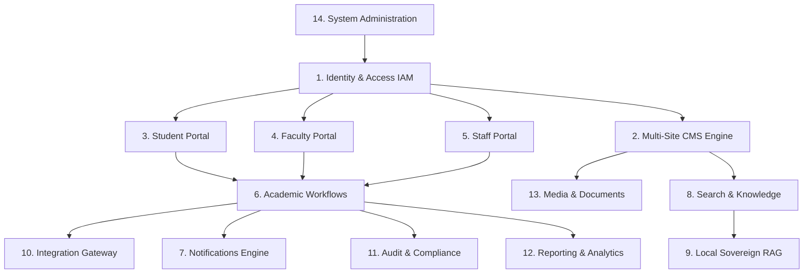

# حدود الموديولات البرمجية، ملكية البيانات، والعقود
## TAIZ-TENDER-03 — MODULE BOUNDARIES & CONTRACT SPECIFICATIONS

> **المبدأ الهندسي:** تصميم Modular Monolith صارم الحدود يمنع التداخل العشوائي بين الوحدات ويضمن الاستقلالية التامة للبيانات، مما يسهل التطوير المتوازي والصيانة وإمكانية الفصل إلى Microservices مستقبلاً.

---

## 1. مصفوفة الموديولات الأساسية الـ 14 وتفاصيلها

---

## 2. التوصيف الهيكلي التفصيلي لكل موديول

### 2.1 موديول الهوية والتحكم بالوصول (Identity and Access - IAM)
- **المسؤوليات:** إدارة المستخدمين، المصادقة المركزية عبر OIDC/SAML، فرض المصادقة الثنائية MFA، إدارة الجلسات وتجديد التوكنز، ومصفوفة الصلاحيات الهرمية RBAC.
- **البيانات المملوكة (Owned Schemas):** `iam_users`, `iam_roles`, `iam_permissions`, `iam_user_roles`, `iam_sessions`, `iam_mfa_devices`.
- **الواجهات والعقود المصدرة (Exported Contracts):**
  - `authenticateUser(credentials)`
  - `validateToken(jwt)`
  - `checkPermission(userId, permission, context)`
  - `enforceMfa(userId)`
- **الأحداث المصدرة (Domain Events):** `UserLoggedIn`, `UserLoggedOut`, `UserLockedOut`, `RoleAssigned`.
- **الاعتماديات المسموحة:** `Audit and Compliance` فقط.
- **الاعتماديات الممنوعة:** أي اعتمادية على بوابات الطلاب أو الـ CMS أو الـ Workflows.
- **قابلية الفصل المستقبلي (Extractability):** `HIGH (10/10)` — يمكن تشغيله كخدمة هويات مستقلة تماماً (Keycloak Architecture).

---

### 2.2 موديول محرك إدارة المحتوى والمواقع المتعددة (Website & Multi-Site CMS)
- **المسؤوليات:** إدارة الموقع المركزي و 25 موقعاً فرعياً للكليات، توجيه الـ Subdomains، دورة حياة المحتوى (Draft -> Review -> Publish -> Archive)، إدارة القوالب، وتوليد الـ SEO والـ Sitemap.
- **البيانات المملوكة:** `cms_sites`, `cms_pages`, `cms_posts`, `cms_categories`, `cms_menus`, `cms_templates`, `cms_revisions`, `cms_redirects`.
- **الواجهات والعقود المصدرة:**
  - `getSiteContext(subdomain)`
  - `renderPage(siteId, slug, lang)`
  - `publishContent(contentId, authorId)`
  - `generateSitemap(siteId)`
- **الأحداث المصدرة:** `ContentCreated`, `ContentPublished`, `ContentArchived`, `SiteProvisioned`.
- **الاعتماديات المسموحة:** `IAM`, `Media and Documents`, `Search`, `Audit and Compliance`.
- **قابلية الفصل المستقبلي:** `HIGH (9/10)` — جاهز للعمل كـ Headless CMS مستقل.

---

### 2.3 موديول بوابة الطالب (Student Portal - STU)
- **المسؤوليات:** عرض الملف الأكاديمي، كشف الدرجات، الجدول الدراسي، تقديم طلبات الخدمات والعرائض وتتبع حالتها، وتلقي التنبيهات.
- **البيانات المملوكة:** `stu_profiles`, `stu_academic_records_cache`, `stu_requests`, `stu_request_timeline`.
- **الواجهات والعقود المصدرة:**
  - `getStudentDashboard(studentId)`
  - `submitAcademicRequest(studentId, requestType, payload)`
  - `trackRequestStatus(requestId)`
- **الأحداث المصدرة:** `StudentRequestSubmitted`, `StudentRequestCancelled`.
- **الاعتماديات المسموحة:** `IAM`, `Academic Workflows`, `Notifications`, `Media and Documents`.
- **قابلية الفصل المستقبلي:** `MEDIUM (8/10)` — يعتمد على محرك الـ Workflows.

---

### 2.4 موديول بوابة عضو هيئة التدريس (Faculty Portal - FAC)
- **المسؤوليات:** إدارة المقررات والعبء التدريسي، رصد الدرجات، تسجيل الحضور، إدارة جلسات المجالس الأكاديمية وقراراتها، والإشراف على مشاريع التخرج.
- **البيانات المملوكة:** `fac_profiles`, `fac_courses`, `fac_councils`, `fac_council_topics`, `fac_council_decisions`, `fac_projects`.
- **الواجهات والعقود المصدرة:**
  - `getFacultyDashboard(facultyId)`
  - `submitGradesBatch(courseId, gradesPayload)`
  - `recordCouncilDecision(meetingId, topicId, decision)`
- **الأحداث المصدرة:** `GradesSubmitted`, `CouncilDecisionRecorded`, `ProjectSupervised`.
- **الاعتماديات المسموحة:** `IAM`, `Academic Workflows`, `Notifications`, `Integration Gateway`.
- **قابلية الفصل المستقبلي:** `MEDIUM (8/10)`.

---

### 2.5 موديول بوابة الموظفين (Staff Portal - STF)
- **المسؤوليات:** الخدمات الإدارية للموظفين، طلبات الإجازات والمغادرات، استعراض كشف الراتب، نظام المراسلات والتعاميم الداخلية، ومتابعة العهد.
- **البيانات المملوكة:** `stf_profiles`, `stf_leave_requests`, `stf_internal_memos`, `stf_payroll_cache`.
- **الواجهات والعقود المصدرة:**
  - `getStaffDashboard(staffId)`
  - `submitLeaveRequest(staffId, leaveDetails)`
  - `sendInternalMemo(memoPayload)`
- **الأحداث المصدرة:** `LeaveRequestSubmitted`, `InternalMemoDispatched`.
- **الاعتماديات المسموحة:** `IAM`, `Academic Workflows`, `Notifications`.
- **قابلية الفصل المستقبلي:** `HIGH (9/10)`.

---

### 2.6 موديول آلة الحالات وسير العمل الأكاديمي (Academic Workflows - WFK)
- **المسؤوليات:** إدارة دورات حياة الطلبات الأكاديمية والقرارات الإدارية، تطبيق مصفوفة الموافقات متعددة المستويات، وقواعد الانتقال بين الحالات.
- **البيانات المملوكة:** `wfk_definitions`, `wfk_instances`, `wfk_steps`, `wfk_approvers`, `wfk_history`.
- **الواجهات والعقود المصدرة:**
  - `startWorkflow(type, entityId, requesterId)`
  - `executeTransition(instanceId, action, actorId, comments)`
  - `getPendingApprovals(actorId, role)`
- **الأحداث المصدرة:** `WorkflowStarted`, `WorkflowStepApproved`, `WorkflowStepRejected`, `WorkflowCompleted`.
- **الاعتماديات المسموحة:** `IAM`, `Notifications`, `Audit and Compliance`.
- **قابلية الفصل المستقبلي:** `HIGH (9/10)` — محرك قواعد وحالات عام قابل للاستخدام المستقل.

---

### 2.7 موديول الإشعارات والمراسلات (Notifications - NOTIF)
- **المسؤوليات:** إرسال التنبيهات الفورية داخل البوابة، والبريد الإلكتروني، والرسائل القصيرة SMS، وإدارة قوالب الرسائل وتفضيلات المستخدمين.
- **البيانات المملوكة:** `notif_inbox`, `notif_templates`, `notif_dispatch_logs`, `notif_preferences`.
- **الواجهات والعقود المصدرة:**
  - `dispatchNotification(recipientId, channel, templateId, data)`
  - `getUserNotifications(userId, unreadOnly)`
  - `markAsRead(notificationId)`
- **الأحداث المصدرة:** `NotificationDispatched`, `NotificationFailed`.
- **الاعتماديات المسموحة:** `IAM`.
- **قابلية الفصل المستقبلي:** `HIGH (10/10)` — خدمة إرسال وتنبيهات مستقلة كلياً.

---

### 2.8 موديول البحث المؤسسي وقاعدة المعرفة (Search & Knowledge Base - SCH)
- **المسؤوليات:** فهرسة محتوى كافة المواقع والبوابات واللوائح والقرارات، البحث متعدد المواقع، والبحث الهجين (BM25 + Semantic).
- **البيانات المملوكة:** `sch_indices`, `sch_search_logs`, `sch_synonyms`, `sch_knowledge_corpus`.
- **الواجهات والعقود المصدرة:**
  - `executeSearch(query, siteFilter, categoryFilter, page)`
  - `indexDocument(documentPayload)`
  - `deleteFromIndex(documentId)`
- **الأحداث المصدرة:** `SearchExecuted`, `IndexUpdated`.
- **الاعتماديات المسموحة:** `CMS`, `Media and Documents`, `AI / RAG`.
- **قابلية الفصل المستقبلي:** `HIGH (9/10)`.

---

### 2.9 موديول الذكاء الاصطناعي السيادي (Local Sovereign RAG - AI)
- **المسؤوليات:** معالجة اللغة العربية الصرفية (Farasa)، التضمين المتجهي (Embeddings)، الاسترجاع الهجين، التوليد المقيد باللوائح، منع الهلوسة، وفلترة الاختراق.
- **البيانات المملوكة:** `ai_chunks`, `ai_conversations`, `ai_feedback_logs`, `ai_guardrail_rules`.
- **الواجهات والعقود المصدرة:**
  - `queryAssistant(question, conversationId, userContext)`
  - `ingestPolicyDocument(fileId, metadata)`
  - `evaluateAnswerQuality(qaPair)`
- **الأحداث المصدرة:** `QueryAnswered`, `HallucinationBlocked`, `InjectionAttemptPrevented`.
- **الاعتماديات المسموحة:** `Search`, `Media and Documents`, `Audit and Compliance`.
- **قابلية الفصل المستقبلي:** `HIGH (10/10)` — يعمل كـ AI Microservice معزول على خوادم GPU.

---

### 2.10 موديول بوابة التكامل والموصلات (Integration Gateway - INT)
- **المسؤوليات:** الربط الآمن مع أنظمة الجامعة القائمة (SIS / HR / Finance)، تطبيق الـ Anti-Corruption Layer، إدارة محددات السرعة، وإعادة المحاولة.
- **البيانات المملوكة:** `int_connectors_config`, `int_sync_logs`, `int_idempotency_keys`, `int_circuit_state`.
- **الواجهات والعقود المصدرة:**
  - `fetchLegacyData(system, endpoint, params)`
  - `verifyStudentFinancialStatus(studentId)`
  - `executeHealthCheck(system)`
- **الأحداث المصدرة:** `LegacySyncCompleted`, `CircuitBreakerTripped`.
- **الاعتماديات المسموحة:** `Audit and Compliance`.
- **قابلية الفصل المستقبلي:** `HIGH (10/10)`.

---

### 2.11 موديول سجلات التدقيق والامتثال (Audit and Compliance - AUD)
- **المسؤوليات:** تسجيل كافة العمليات الإدارية الحساسة ومحاولات الدخول، توثيق مسار التدقيق غير القابل للتعديل (Immutable Audit Log)، وتتبع الـ Correlation IDs.
- **البيانات المملوكة:** `aud_immutable_logs`, `aud_security_events`, `aud_compliance_reports`.
- **الواجهات والعقود المصدرة:**
  - `logSecurityEvent(eventPayload)`
  - `queryAuditLogs(filters, timeRange)`
  - `verifyLogIntegrity(logId)`
- **الأحداث المصدرة:** `AuditLogCreated`, `IntegrityViolationDetected`.
- **الاعتماديات المسموحة:** لا يعتمد على أي موديول تجنباً للدوران (Zero Dependencies).
- **قابلية الفصل المستقبلي:** `HIGH (10/10)`.

---

### 2.12 موديول التقارير والتحليلات (Reporting & Analytics - REP)
- **المسؤوليات:** توليد التقارير الإحصائية الأكاديمية والإدارية، مؤشرات الأداء KPIs، وتصدير البيانات بصيغ Excel و PDF.
- **البيانات المملوكة:** `rep_definitions`, `rep_schedules`, `rep_generated_cache`.
- **الواجهات والعقود المصدرة:**
  - `generateReport(reportId, params)`
  - `scheduleRecurringReport(config)`
- **الأحداث المصدرة:** `ReportGenerated`.
- **الاعتماديات المسموحة:** قراءة فقط من جداول الموديولات عبر Views مخصصة.
- **قابلية الفصل المستقبلي:** `HIGH (9/10)`.

---

### 2.13 موديول إدارة الوسائط والوثائق (Media & Documents - DOC)
- **المسؤوليات:** رفع وإدارة وتشفير الملفات والوسائط، توليد شهادات الـ PDF المشفرة مع QR Code، فحص الفيروسات عبر ICAP/Antivirus، وإدارة الـ S3 Buckets.
- **البيانات المملوكة:** `doc_assets`, `doc_metadata`, `doc_signed_urls`, `doc_quarantine`.
- **الواجهات والعقود المصدرة:**
  - `uploadSecureAsset(fileStream, metadata)`
  - `generateVerifiablePdf(template, data)`
  - `verifyQrCode(payload)`
- **الأحداث المصدرة:** `AssetUploaded`, `AssetQuarantined`, `DocumentIssued`.
- **الاعتماديات المسموحة:** `Audit and Compliance`.
- **قابلية الفصل المستقبلي:** `HIGH (10/10)`.

---

### 2.14 موديول الإدارة العامة والتشغيل (System Administration - ADM)
- **المسؤوليات:** الإعدادات العامة للنظام، إدارة بيئة التشغيل، إعدادات النسخ الاحتياطي DRP، ومراقبة صحة الخدمات.
- **البيانات المملوكة:** `adm_settings`, `adm_system_health`, `adm_maintenance_windows`.
- **الواجهات والعقود المصدرة:**
  - `getSystemSettings()`
  - `updateSetting(key, value)`
  - `triggerBackup()`
- **الأحداث المصدرة:** `SettingUpdated`, `MaintenanceModeToggled`.
- **الاعتماديات المسموحة:** `IAM`, `Audit and Compliance`.
- **قابلية الفصل المستقبلي:** `MEDIUM (8/10)`.
