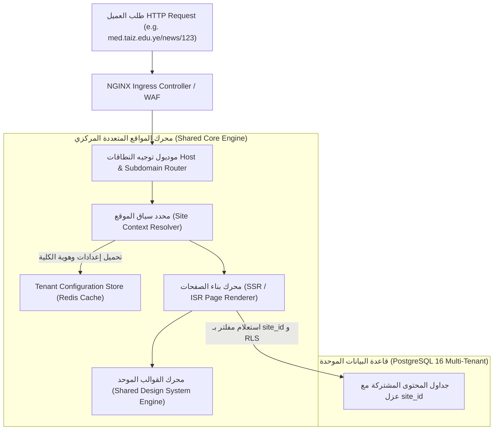
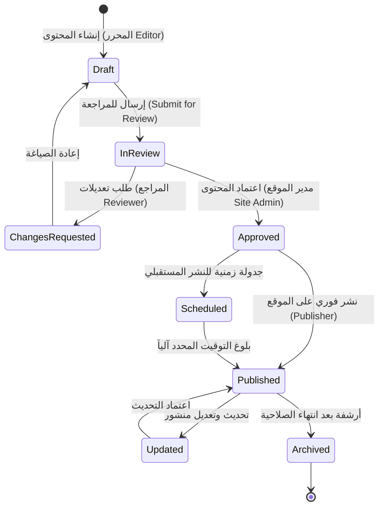

# معمارية منصة إدارة المحتوى متعددة المواقع
## TAIZ-TENDER-03 — MULTI-SITE CMS ARCHITECTURE (25 SUBDOMAINS)

> **المرجع التعاقدي:** كراسة المناقصة رقم 2/2026 — الجزء الخامس: منصة المواقع المتعددة وإدارة المواقع الجامعية (ص 14-17)، بند RTM-01 (ص 23)، والجدول 1 في الـ BOQ (ص 37).
> **المبدأ الهندسي الأساسي:** بناء **نواة برمجية مركزية موحدة (Single Codebase Multi-Tenant Core)** تدير الموقع الرئيسي و 25 موقعاً فرعياً للكليات والمراكز عبر Subdomains مستقلة مع عزل البيانات والصلاحيات، وليس 25 نسخة مشتتة.

---

## 1. المعمارية الهيكلية للمواقع المتعددة (Multi-Tenant Architecture)

---

## 2. جدول المواقع الفرعية الـ 25 المستهدفة (Subdomain Registry)

| # | الكلية / المركز / المنشأة | النطاق الفرعي (Subdomain) | نوع الموقع | استقلالية التحرير | القالب المعتمد |
| :--- | :--- | :--- | :--- | :--- | :--- |
| **1** | **الموقع المؤسسي المركزي لجامعة تعز** | `www.taiz.edu.ye` / `taiz.edu.ye` | Main Portal | إدارة الإعلام والتوثيق | القالب المؤسسي العام |
| **2** | **كلية الطب والعلوم الصحية** | `med.taiz.edu.ye` | College Site | محرر ومراجع الكلية | قالب الكليات الطبية |
| **3** | **كلية الهندسة وتكنولوجيا المعلومات** | `eng.taiz.edu.ye` | College Site | محرر ومراجع الكلية | قالب الكليات الهندسية |
| **4** | **كلية العلوم التطبيقية** | `sci.taiz.edu.ye` | College Site | محرر ومراجع الكلية | قالب الكليات العلمية |
| **5** | **كلية العلوم الإدارية** | `admin-sci.taiz.edu.ye` | College Site | محرر ومراجع الكلية | قالب الكليات الإدارية |
| **6** | **كلية الآداب والعلوم الإنسانية** | `arts.taiz.edu.ye` | College Site | محرر ومراجع الكلية | قالب الكليات الإنسانية |
| **7** | **كلية التربية - تعز** | `edu.taiz.edu.ye` | College Site | محرر ومراجع الكلية | قالب كليات التربية |
| **8** | **كلية التربية والعلوم - التربة** | `turba.taiz.edu.ye` | Branch Campus | محرر فرع التربة | قالب الفروع الإقليمية |
| **9** | **كلية الحقوق والعلوم القانونية** | `law.taiz.edu.ye` | College Site | محرر ومراجع الكلية | قالب الكليات القانونية |
| **10**| **كلية الصيدلة** | `pharm.taiz.edu.ye` | College Site | محرر ومراجع الكلية | قالب الكليات الطبية |
| **11**| **كلية طب الأسنان** | `dent.taiz.edu.ye` | College Site | محرر ومراجع الكلية | قالب الكليات الطبية |
| **12**| **كلية التمريض** | `nurs.taiz.edu.ye` | College Site | محرر ومراجع الكلية | قالب الكليات الطبية |
| **13**| **نيابة الدراسات العليا والبحث العلمي** | `postgrad.taiz.edu.ye` | Academic Center | إدارة الدراسات العليا | قالب المراكز البحثية |
| **14**| **نيابة شؤون الطلاب** | `students.taiz.edu.ye` | Administrative | إدارة شؤون الطلاب | قالب الخدمات العامة |
| **15**| **مركز التطوير الأكاديمي وضمان الجودة** | `cadqa.taiz.edu.ye` | Quality Center | إدارة الجودة والاعتماد | قالب مراكز الجودة |
| **16**| **مركز الحاسوب وتقنية المعلومات** | `cit.taiz.edu.ye` | Tech Center | إدارة مركز الحاسوب | قالب المراكز التقنية |
| **17**| **مركز اللغات والترجمة** | `languages.taiz.edu.ye` | Language Center | إدارة مركز اللغات | قالب المراكز التدريبية |
| **18**| **مركز التعليم المستمر وخدمة المجتمع** | `continuing.taiz.edu.ye` | Community Center | إدارة التعليم المستمر | قالب المراكز التدريبية |
| **19**| **مركز أبحاث البيئة والطاقة المتجددة** | `erc.taiz.edu.ye` | Research Center | إدارة مركز البيئة | قالب المراكز البحثية |
| **20**| **مركز التأهيل والتطوير التربوي** | `etdc.taiz.edu.ye` | Training Center | إدارة مركز التأهيل | قالب المراكز التدريبية |
| **21**| **مركز المرأة والبحوث والدراسات** | `wsrc.taiz.edu.ye` | Research Center | إدارة مركز المرأة | قالب المراكز البحثية |
| **22**| **المجلة العلمية لجامعة تعز** | `journal.taiz.edu.ye` | Publications | هيئة تحرير المجلات | قالب النشر الأكاديمي |
| **23**| **المكتبة المركزية والمستودع الرقمي** | `library.taiz.edu.ye` | Library / DSpace | إدارة المكتبات | قالب المكتبات الرقمية |
| **24**| **مركز التدريب والاستشارات الهندسية** | `etc.taiz.edu.ye` | Consultancy | إدارة المركز الهندسي | قالب المراكز الاستشارية |
| **25**| **مركز ريادة الأعمال وحاضنات الأعمال** | `ec.taiz.edu.ye` | Innovation Center | إدارة ريادة الأعمال | قالب حاضنات الأعمال |

---

## 3. دورة حياة المحتوى والنشر وحوكمة التحرير

---

## 4. نظام التصميم والقوالب المشتركة (Shared Design System)

1. **الهوية الموحدة مع مساحة التخصيص المنضبطة:**
   - **العناصر الثابتة المشتركة:** الترويسة الرئيسية (Master Header) بشعار جامعة تعز، شريط التنقل الموحد، نمط الخط المؤسسي (Cairo)، معايير النفاذية، والتذييل الرسمي الموحد (Master Footer).
   - **العناصر القابلة للتخصيص لكل كلية:** لون الهوية الفرعي (Primary Accent Color)، شعار الكلية الفرعي، بانر الغلاف (Cover Hero Banner)، روابط القائمة الفرعية، ومكونات الصفحة الرئيسية المخصصة.
2. **محرر الصفحات المرئي (Visual Block Editor):**
   - محرر يعتمد على المكونات المعيارية (Hero Block, News Slider, Academic Programs Grid, Faculty Profiles, Events Calendar, Form Embed, FAQ Accordion, Document Downloads).
   - يدعم السحب والإفلات الكامل دون الحاجة لكتابة أي كود برمجي من محرري الكليات.

---

## 5. محرك الـ SEO الآلي والفهرسة اللحظية (Automated SEO Engine)

1. **البيانات المنظمة (Structured Data / Schema.org JSON-LD):**
   - توليد تلقائي لبيانات Schema الخاصة بالمؤسسات التعليمية: `EducationalOrganization`, `Course`, `NewsArticle`, `Event`, `Person` (Faculty Profiles), `FAQPage`.
2. **خرائط المواقع والأرشفة (Sitemap & Robots):**
   - توليد خرائط `sitemap.xml` ديناميكية منفصلة لكل موقع فرعي (`med.taiz.edu.ye/sitemap.xml`) ومجمعة للموقع الرئيسي.
   - ملف `robots.txt` ديناميكي يوجه محركات البحث بدقة.
3. **الفهرسة اللحظية (Instant Indexing APIs):**
   - استدعاء مؤتمت لواجهات `Google Indexing API` و `IndexNow` فور اعتماد ونشر أي خبر أو برنامج أكاديمي جديد.
4. **الحفاظ على الأرشفة التاريخية (301 Permanent Redirects):**
   - إدارة مركزية لجدول التحويلات 301 للروابط التاريخية لضمان عدم فقدان ترتيب جامعة تعز في تصنيف Webometrics ومحركات البحث.

---

## 6. الصلاحيات وإدارة المستخدمين على مستوى المواقع (Site-Level RBAC)

| الدور الوظيفي | النطاق والصلاحيات |
| :--- | :--- |
| **مدير المنصة العام (Platform Admin)** | تحكم كامل بجميع المواقع الـ 25، إنشاء مواقع جديدة، إدارة النطاقات والشهادات، وتعيين مدراء المواقع. |
| **مدير محتوى الجامعة (University Content Admin)** | نشر الأخبار والإعلانات المركزية التي تعمم إجبارياً على كافة المواقع الفرعية، وإدارة القوالب العامة. |
| **مدير الموقع الفرعي (Site Admin)** | إدارة كاملة للموقع الفرعي للكلية، وتعيين محرري ومراجعي الكلية، واعتماد ونشر الصفحات. |
| **محرر الكلية (Editor)** | إنشاء وتعديل المسودات ورفع الوسائط الخاصة بالكلية دون صلاحية النشر المباشر. |
| **مراجع الكلية (Reviewer)** | مراجعة مسودات المحررين وتدقيقها لغوياً ومعلوماتياً والتوصية بالنشر أو طلب التعديل. |
| **ناشر الكلية (Publisher)** | الصلاحية النهائية لاعتماد ونشر المحتوى وإلغاء نشره وأرشفته. |

---

## 7. آلية إبطال التخزين المؤقت والبحث متعدد المواقع (Cache & Search)

1. **إبطال الكاش المعتمد على الوسوم (Tag-Based Cache Invalidation):**
   - عند تعديل خبر في كلية الهندسة، يرسل النظام إشعاراً لإبطال كاش الوسم `site:eng:news` فقط في Redis و NGINX دون التأثير على كاش بقية المواقع الـ 24.
2. **البحث الموحد والبحث المخصص للكلية (Scoped & Cross-Site Search):**
   - يتيح محرك البحث للزائر البحث داخل محتوى الكلية المحددة افتراضياً، مع خيار التوسع للبحث الشامل عبر كامل شبكة مواقع جامعة تعز.
