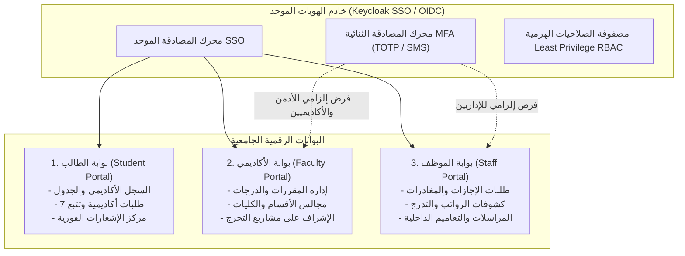
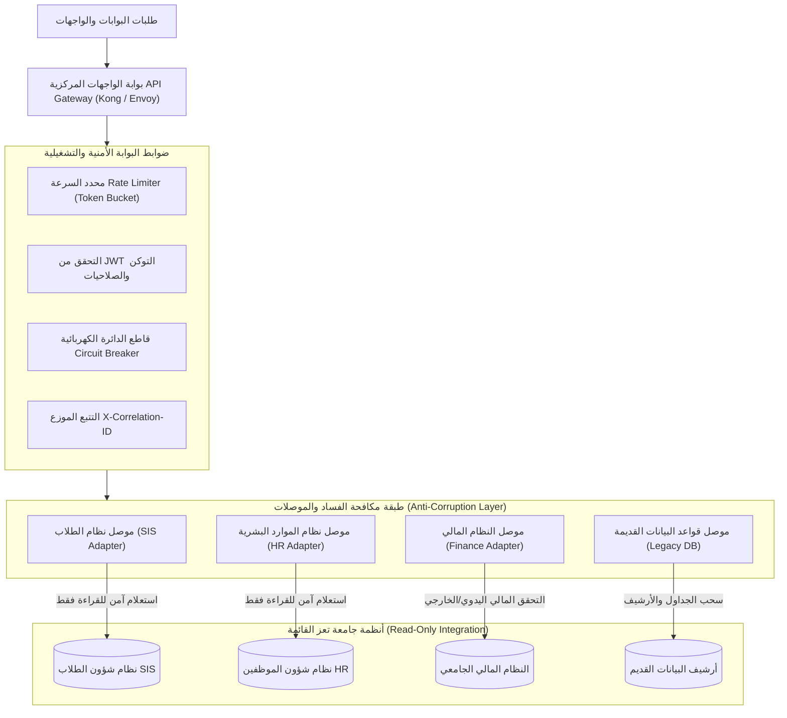

# معمارية البوابات الموحدة، الدخول الموحد، وطبقة التكامل
## TAIZ-TENDER-03 — UNIFIED PORTALS, SSO & INTEGRATION GATEWAY ARCHITECTURE

> **المرجع التعاقدي:** كراسة المناقصة رقم 2/2026 — الجزء السادس: البوابة الرقمية والخدمات الإلكترونية (ص 18-19)، القسم الخامس (ص 26-27)، وبند RTM-02 و RTM-07 (ص 23-24).

---

## 1. المعمارية الموحدة للبوابات الثلاث (Unified Portals Suite)

---

## 2. إدارة الجلسات والمصادقة متعددة المستويات (Session & Step-Up Auth)

1. **دورة حياة الجلسة وإدارة الـ Tokens:**
   - إصدار `Access Token` مشفر بصيغة JWT مع صلاحية قصيرة (15 دقيقة) لتقليل نافذة التعرض للاختراق.
   - إصدار `Refresh Token` في كوكيز آمنة (`HttpOnly; Secure; SameSite=Strict`) مع صلاحية ممتدة (8 ساعات) وخاصية الدوران التلقائي (Refresh Token Rotation).
2. **المصادقة المشددة للعمليات الحساسة (Step-Up Authentication):**
   - عند قيام عضو هيئة التدريس باعتماد درجات نهائية أو قيام الموظف بتحويل مالي أو تعديل صلاحيات، يطلب النظام تأكيد الهوية بـ MFA فوري (Re-Authentication / OTP) قبل تنفيذ العملية.

---

## 3. معمارية بوابة التكامل والواجهات (API Gateway & Connectors)

---

---

## 3.1 جدول تفصيل موصلات الأنظمة القائمة وأنماط الوصول (Connector Access Modes Matrix)

| الموصل والنظام القائم | نمط الوصول الفعلي (Access Mode) | حالة الجاهزية والاعتمادية | حالات الاستخدام (Use Cases) |
| :--- | :--- | :--- | :--- |
| **نظام شؤون الطلاب (SIS Connector)** | `READ` (قراءة واستعلام)  `UNKNOWN_NEEDS_DISCOVERY` (للتحديث) | يتطلب جلسة استكشاف فني مع مدراء الـ SIS | استرجاع السجل الأكاديمي والجدول الدراسي والتحقق من حالة القيد. تحديث حالة الطلبات المعتمدة خاضع لنتائج الـ Discovery. |
| **نظام الموارد البشرية (HR Connector)** | `READ` (قراءة الدليل الوظيفي)  `UNKNOWN_NEEDS_DISCOVERY` (للإجازات) | يتطلب تدقيق واجهات نظام الـ HR | استعراض السير الذاتية وبيانات الكادر ورصيد الإجازات. اعتماد طلبات الإجازات في النظام القديم يتطلب موافقة فنية. |
| **النظام المالي الجامعي (Finance Connector)** | `READ` (تحقق يدوي/سندات)  `OUTSIDE_PORTAL_SCOPE` (للدفع) | مطابق لسياسة الكراسة (لا توجد بوابة دفع داخلية) | استعراض حالة سداد الرسوم عبر السندات المعتمدة. دفع الرسوم يتم خارج المنصة عبر القنوات البنكية للجامعة. |
| **أرشيف البيانات القديم (Legacy DB Connector)** | `READ` (ترحيل ومزامنة تاريخية) | جاهز للتنفيذ عبر أنابيب ETL | سحب الأرشيف الإخباري والمقالات واللوائح القديمة بنمط القراءة لمرة واحدة أو على دفعات. |

---

## 3.2 سياسة حظر تسريب البيانات وبوابات الخروج الآمن (External Data Egress Policy)

1. **حظر تام لبيانات المستخدمين والجامعة السرية (Zero Confidential Data Egress):**
   - يُحظر حظراً مطلقاً إرسال أي بيانات شخصية (PII)، سجلات أكاديمية، كشوفات رواتب، أو قرارات إدارية سرية لأي طرف خارجي أو خدمة سحابية عامة.
2. **قصر واجهات الأرشفة (Google Indexing / IndexNow) على المحتوى العام فقط:**
   - تقتصر استدعاءات واجهات محركات البحث العالمية حصرياً على **المحتوى المؤسسي المنشور للعموم** (مثل الأخبار الرسمية، دليل البرامج الأكاديمية العام، الفعاليات العامة) وفور اعتماده ونشره رسمياً.
3. **الخضوع لبوابات فحص البيانات وموافقة الجامعة (Gated by University Content Approval):**
   - لا يتم إطلاق أي استدعاء خارجي إلا من خلال فلتر أمني (Egress Gateway Filter) يتحقق من خلو الـ Payload من أي بيانات حساسة بموافقة سياسات الحوكمة بالجامعة.

## 4. المبادئ الهندسية لموصلات الأنظمة القائمة (Legacy Connectors)

1. **سياسة عدم استبدال أو تعديل الأنظمة القائمة (Non-Destructive Integration):**
   - تعمل كافة الموصلات بوضع **القراءة والعرض فقط (Read-Only)** دون كتابة أو تعديل مباشر على قواعد بيانات الأنظمة القديمة تجنباً لأي تعارض بياني أو خلل تشغيلي.
2. **طبقة مكافحة الفساد (Anti-Corruption Layer - ACL):**
   - عزل النواة البرمجية الجديدة عن تشوهات النماذج القديمة، وتحويل البيانات المسحوبة فوراً إلى النموذج القانوني المعياري (Canonical Data Model).
3. **المرونة والتعامل مع الأعطال (Fault Tolerance & Resilience):**
   - **قاطع الدائرة (Circuit Breaker):** فتح الدائرة وعزل النظام القديم تلقائياً في حال بطء الاستجابة أو فشل 5 طلبات متتالية لمنع انهيار البوابة.
   - **إعادة المحاولة مع التراجع الأسي (Exponential Backoff Retry):** 3 محاولات بفاصل زمني مضاعف قبل الإعلان عن تعذر الوصول للنظام القديم.
   - **مفاتيح تفادي التكرار (Idempotency Keys):** فرض مفتاح فريد لكل طلب لمنع تكرار العمليات الأكاديمية أو الإدارية.
4. **تتبع العمليات الموزع (Distributed Tracing & Correlation IDs):**
   - توليد معرف تتبع فريد `X-Correlation-ID` لكل طلب يمر عبر الـ Gateway وتمريره عبر كافة الطبقات والسجلات لتسهيل التدقيق والتشخيص السريع للأخطاء.
