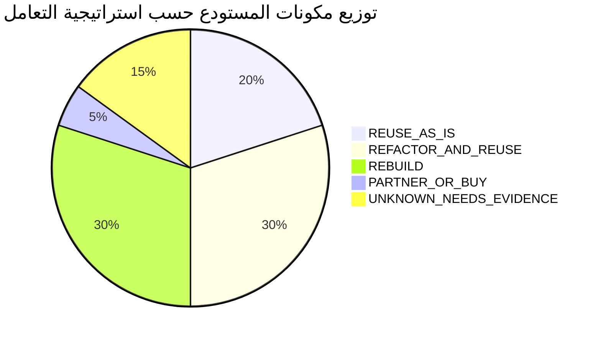

# خطة الانتقال وإعادة استخدام أصول المستودع الحالي
## TAIZ-TENDER-03 — CODEBASE REUSE & TRANSITION PLAN

> **المرجع التعاقدي:** مصفوفة الامتثال (`TAIZ_TENDER_01_COMPLIANCE_MATRIX.csv`) وتقرير إعادة الاستخدام (`TAIZ_TENDER_01_REUSE_AND_GAP_REPORT.md`).
> **القاعدة الحاكمة:** التدقيق الموضوعي دون افتراض أن وجود واجهة أو نموذج أولي يعني جاهزية مؤسسية كاملة.

---

## 1. تصنيف مكونات مستودع بوابة الكلية الحالي

---

## 2. جدول تفصيل المكونات وإجراءات الانتقال

| المكون البرمجي في المستودع | التصنيف المعتمد | المسار في المستودع | الدليل الفني وحجم العمل | الإجراء الهندسي للانتقال |
| :--- | :--- | :--- | :--- | :--- |
| **مكتبة المكونات والتصميم (UI)** | `REUSE_AS_IS` | `src/components/ui/` | 46 مكوناً جاهزاً بـ Radix UI + TailwindCSS 4 | نقل المكونات كما هي إلى حزمة Design System المشتركة. |
| **خط Cairo ودعم الـ RTL** | `REUSE_AS_IS` | `src/assets/fonts/cairo/` | خطوط وأصول وتكوين bidi-js جاهز | اعتمادها كمعيار موحد للواجهات في Next.js. |
| **مولد وموثق الوثائق والـ QR** | `REUSE_AS_IS` | `src/lib/documents/` | محرك توليد PDF المشفر والتحقق بالـ QR | دمجه في موديول Media & Documents المركزي. |
| **مسارات الطلبات الطلابية الـ 7** | `REFACTOR_AND_REUSE` | `src/lib/student-requests/` | آلات حالات مختبرة للطلبات الأكاديمية | إعادة هيكلة الخدمات لتعمل مع خادم Keycloak و API Gateway. |
| **منظومة المجالس الأكاديمية** | `REFACTOR_AND_REUSE` | `src/components/councils/` | دورة حياة الاجتماعات والقرارات والقرعة | تكييف الواجهات وإضافة ميزات الربط مع أرشيف الكليات. |
| **سياسات الحماية و RLS** | `REFACTOR_AND_REUSE` | `src/lib/security/`, `supabase/` | سياسات عزل الصلاحيات وحماية المدخلات | تحويل السياسات إلى PostgreSQL 16 Enterprise Schemas. |
| **بوابة الموظفين الإدارية** | `REFACTOR_AND_REUSE` | `src/components/admin/` | إدارة الموظفين والأدوار الإدارية | إضافة نماذج الإجازات والمراسلات وتوليد كشف الراتب. |
| **محرك المواقع المتعددة 25 موقعاً** | `REBUILD` | N/A (غير موجود بالمستودع) | يتطلب بناء Multi-Tenant Engine من الصفر | بناء محرك الـ Tenant Manager وتوجيه الـ Subdomains. |
| **محرك الذكاء الاصطناعي السيادي** | `REBUILD` | N/A (غير موجود بالمستودع) | يتطلب بناء RAG محلي وقاعدة Qdrant | تطوير خدمة RAG بلغة Python مع Farasa و Qdrant. |
| **بوابة التكامل API Gateway** | `REBUILD` | N/A (غير موجود بالمستودع) | يتطلب تهيئة Kong و 4 موصلات | تهيئة بوابة Kong وتطوير موصلات الـ SIS والـ HR. |
| **محرك الـ SEO الآلي** | `REBUILD` | N/A (غير موجود بالمستودع) | يتطلب توليد JSON-LD و Sitemap تلقائياً | تطوير موديول Auto-SEO والتكامل مع Google Indexing. |
| **اختبار الاختراق المستقل (Pentest)** | `PARTNER_OR_BUY` | N/A (يتطلب شهادة طرف ثالث) | اشتراط تعاقدي لتقرير فحص معتمد | التعاقد مع شركة أمن معلومات مستقلة لإصدار التقرير. |
| **خادم الذكاء الاصطناعي (GPU)** | `PARTNER_OR_BUY` | N/A (عتاد محلي في الداتاسنتر) | خادم GPU لتشغيل نماذج 32B/72B | موافاة الجامعة بالمواصفات الفنية لتوفير السيرفر محلياً. |
| **الوثائق القانونية والضمان والشهادات**| `UNKNOWN_NEEDS_EVIDENCE` | N/A (وثائق ورقية خارج المستودع) | بطاقات قانونية، ضمان 2%، 3 شهادات | استخراج وتجديد الوثائق الرسمية قبل فتح المظاريف. |
