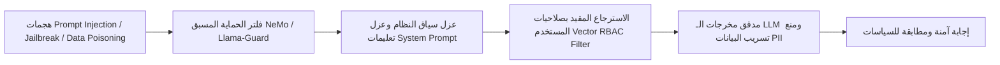

# نموذج التهديدات الأمنية، الخصوصية، والامتثال
## TAIZ-TENDER-03 — SECURITY, PRIVACY & STRIDE THREAT MODEL (OWASP ASVS L2)

> **المرجع التعاقدي:** كراسة المناقصة رقم 2/2026 — الجزء الثالث: الأمن السيبراني (ص 7)، القسم الرابع عشر (ص 34)، وبند RTM-04 (ص 23).

---

## 1. نموذج نمذجة التهديدات STRIDE عبر حدود الثقة

| فئة التهديد (STRIDE) | التهديد المحتمل في منظومة الجامعة | الضابط المعماري والوقائي المعتمد | مستهدف الامتثال [TARGET_TO_BE_VALIDATED] |
| :--- | :--- | :--- | :--- |
| **Spoofing (انتحال الهوية)** | انتحال حساب طالب أو أستاذ جامعي لتعديل الدرجات أو تقديم طلبات وهمية | خادم Keycloak OIDC، فرض MFA لكافة الحسابات الإدارية والأكاديمية، وربط الجلسة بـ Fingerprint مشفر. | OWASP ASVS V2 |
| **Tampering (التلاعب بالبيانات)** | التلاعب بالقرارات الإدارية، نتائج الطلاب، أو سجلات التدقيق | تشفير قاعدة البيانات، توقيع الوثائق بـ HMAC/SHA-256، وجداول تدقيق Append-Only غير قابلة للحذف. | OWASP ASVS V8 |
| **Repudiation (الإنكار)** | إنكار عضو هيئة تدريس لرصد درجة أو إنكار مسؤول لاعتماد طلب إيقاف قيد | سجلات تدقيق غير قابلة للتعديل (Immutable Audit Log) مع تسجيل المعرف الفرعي ورقم الـ IP والوقت والتوقيع الرقمي. | OWASP ASVS V7 |
| **Information Disclosure (تسريب البيانات)** | تسريب كشوفات الطلاب أو بيانات الرواتب أو تسريب اللوائح السرية عبر الـ AI | تطبيق مبدأ Least Privilege، سياسات PostgreSQL RLS، عزل الـ Vector DB، وتشفير البيانات أثناء الحركة (TLS 1.3) والسكون (AES-256). | OWASP ASVS V9 |
| **Denial of Service (حجب الخدمة)** | إغراق الموقع بطلبات وهمية أثناء فترة إعلان النتائج أو التسجيل الأكاديمي | محددات سرعة الطلب (Rate Limiting) على API Gateway، كلاستر Redis للكاش، وتوزيع الأحمال عبر NGINX/K8s HPA. | OWASP ASVS V13 |
| **Elevation of Privilege (تصعيد الصلاحيات)** | استغلال ثغرات BOLA/IDOR لتغيير صلاحية مستخدم عادي إلى مدير نظام | التحقق الصارم من صلاحيات الموارد في كل Endpoint (Policy Enforcement Point) ومنع الاعتماد على معرفات Client-Side. | OWASP ASVS V4 |

---

## 2. مصفوفة الامتثال لمعيار OWASP ASVS v4.0 Level 2

1. **التحكم في المصادقة وإدارة الجلسات (V2 & V3):**
   - تعقيد كلمات المرور وفق معايير NIST SP 800-63B، حظر كلمات المرور الشائعة، وإلغاء الجلسات آلياً بعد 15 دقيقة من الخمول.
2. **التحكم في الوصول والصلاحيات (V4):**
   - التحقق من الصلاحيات على مستوى الكود وقاعدة البيانات (RLS)، والتطبيق الصارم لمبدأ العزل بين الكليات والمواقع الفرعية.
3. **التحقق من المدخلات والتشفير (V5 & V6):**
   - تطهير كافة المدخلات باستخدام مكتبات قياسية ضد ثغرات SQLi و XSS و SSRF، وحظر تنفيذ أي أكواد داخل نصوص الـ CMS.
4. **حماية الواجهات البرمجية (V13):**
   - التحقق من صحة payloads عبر نماذج JSON Schema / Zod الصارمة، وإلغاء أي حقول غير معرّفة (Strict DTO Validation).

---

## 3. تهديدات الذكاء الاصطناعي وإجراءات الحماية (AI Threat Defense)

---

## 4. دورة حياة التطوير الأمني الآمن (Secure SDLC) والفحص المستقل

1. **الفحص الأمني المستمر في خط الـ CI/CD:**
   - **SAST (Static Analysis):** فحص الكود المصدري في كل Pull Request عبر Semgrep / SonarQube.
   - **SCA (Dependency Scanning):** فحص الثغرات في المكتبات والتبعيات عبر Trivy / Snyk.
   - **Secret Scanning:** حظر رفع أي مفاتيح تشفير أو كلمات مرور إلى مستودع Git.
2. **اختبار الاختراق المعتمد من طرف ثالث (Third-Party Penetration Testing):**
   - التعاقد الإلزامي مع جهة أمنية مستقلة مرخصة لإجراء اختبار اختراق شامل (Black-box & Gray-box) قبل الاستلام الابتدائي، وتقديم تقرير رسمي يثبت خلو المنظومة التام من أي ثغرات حرجة (Critical) أو عالية (High).
