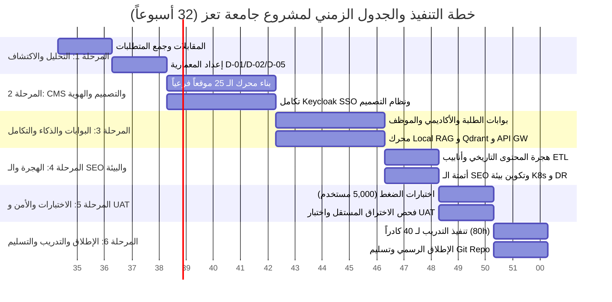

# خطة العمل التفصيلية لـ 32 أسبوعاً ومصفوفة WBS
## TAIZ-TENDER-04 — 32-WEEK WORK PLAN & WORK BREAKDOWN STRUCTURE (WBS)

> **المرجع التعاقدي:** كراسة المناقصة رقم 2/2026 — القسم التاسع: خطة التنفيذ والجدول الزمني (ص 30-32).
> **المدة الإجمالية:** 32 أسبوعاً (8 أشهر تقويمية) موزعة على 6 مراحل تنفيذية رئيسية ومترابطة بدقة عبر المسار الحرج (*Critical Path*).

---

## 1. المخطط الزمني الشامل للمراحل الست ومصفوفة WBS

---

## 2. جدول توزيع الأنشطة والمخرجات أسبوعياً (Weekly Schedule)

| المرحلة التنفيذية | الأسابيع | الأنشطة الرئيسية والمسارات المتوازية | المخرجات والتسليمات المرتبطة | بوابات التوقف والاعتماد |
| :--- | :--- | :--- | :--- | :--- |
| **المرحلة 1: الاكتشاف والتحليل** | **W1 – W4** | - عقد ورش العمل مع عمادات الكليات وإدارات النظم. - فحص قواعد بيانات الأنظمة القديمة (SIS/HR). - إعداد وثائق التحليل والمعمارية. | **D-01** (المواصفات) **D-02** (نطاق العمل) **D-05** (المعمارية D-05) | **Gate 1:** اعتماد وثيقة المعمارية رسمياً لصرف الدفعة 2 (15%). |
| **المرحلة 2: الـ CMS والتصميم والهوية** | **W5 – W12** | - بناء نواة الـ Multi-Tenant لـ 25 موقعاً فرعياً. - تطوير نظام التصميم وقوالب الكليات. - دمج خادم Keycloak وتفعيل OIDC و MFA. - تطبيق ضوابط النفاذية WCAG 2.2 AA. | **D-03** (الوثيقة الوظيفية) **D-04** (غير الوظيفية) **D-08** (نظام التصميم) | **Gate 2:** تشغيل المواقع الـ 25 تجريبياً وفحص الـ A11y. |
| **المرحلة 3: البوابات والـ AI والتكامل** | **W13 – W20** | - تطوير بوابات الطلبة والأكاديميين والموظفين. - بناء خط أنابيب Local RAG و Qdrant. - تطبيق المعالجة الصرفية العربية (Farasa). - تهيئة Kong API Gateway وموصلات SIS. | **D-07** (محرك الذكاء الاصطناعي) كود البوابات والـ APIs | **Gate 3:** معاينة المساعد الذكي واختبار موصلات الـ SIS (صرف الدفعة 3: 35%). |
| **المرحلة 4: الترحيل والـ SEO والبيئة** | **W21 – W24** | - سحب وتنقية وهجرة الأرشيف الإخباري القديم. - إعداد خريطة تحويل الروابط 301 Redirects. - أتمتة الـ SEO وتوليد Schema.org JSON-LD. - تكوين كلاستر Kubernetes والـ DRP محلياً. | **D-09** (الاستضافة والـ DR) سكربتات ETL وخريطة 301 | **Gate 4:** اكتمال هجرة 100% من البيانات وتفعيل WAL Streaming. |
| **المرحلة 5: الاختبارات الشاملة و UAT** | **W25 – W28** | - اختبارات الضغط لمحاكاة 5,000 مستخدم متزامن. - فحص واختبار اختراق من جهة أمنية مستقلة. - تنفيذ اختبارات قبول المستخدمين (UAT). - معالجة وإغلاق كافة الملاحظات. | **D-06** (الأمن السيبراني) **D-10** (تقارير الاختبارات) **D-14** (معايير القبول) | **Gate 5:** تقرير فحص اختراق نظيف وتوقيع شهادة قبول UAT. |
| **المرحلة 6: الإطلاق والتدريب والتسليم** | **W29 – W32** | - تنفيذ 80 ساعة تدريبية لـ 40 كادراً جامعياً. - تسليم حزمة التوثيق والأدلة بالعربية D-01-D-16. - تسليم مستودع الشفرة المصدرية (Git Repo). - الإطلاق الرسمي وبدء سريان الضمان لـ 12 شهراً. | **D-11** (وثيقة الضمان SLA) **D-12, D-13, D-15** **D-16** (حزمة العرض النهائي) | **Gate 6:** توقيع محضر الاستلام الابتدائي وصرف الدفعة 4 (30%). |

---

## 3. إدارة المسار الحرج وبوابات التوقف (Critical Path & Halt Gates)

1. **المسار الحرج (Critical Path):**
   `W1-W4 (المعمارية)` -> `W5-W12 (نواة الـ Multi-Site و Keycloak)` -> `W13-W20 (البوابات والـ RAG و API Gateway)` -> `W25-W28 (فحص الاختراق واختبار الضغط)` -> `W29-W32 (التدريب والإطلاق)`.
2. **بوابات التوقف عند نقص البيانات (Halt Gates):**
   - يتوقف العمل في الأسبوع 4 إذا لم توفر الجامعة مواصفات خوادم الداتاسنتر أو صلاحيات قواعد البيانات.
   - يتوقف الانتقال لمرحلة الإطلاق في الأسبوع 28 إذا لم يصدر تقرير اختبار الاختراق المستقل النظيف من أي ثغرات حرجة.
