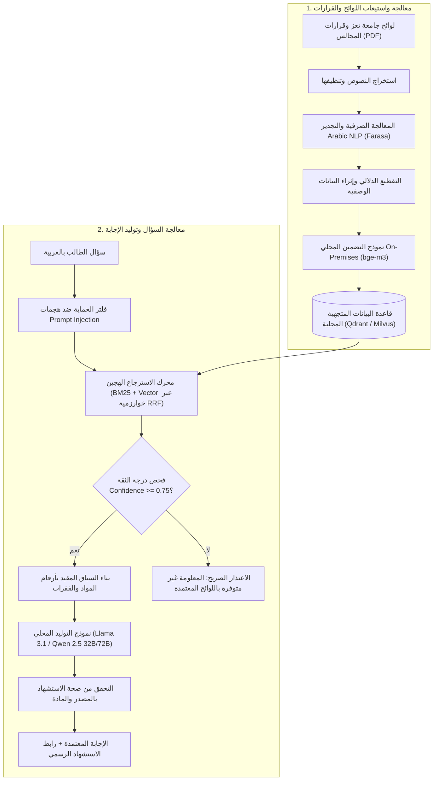

# منهجية الذكاء الاصطناعي السيادي والبحث الدلالي
## TAIZ-TENDER-04 — SOVEREIGN LOCAL RAG & ARABIC NLP APPROACH

> **المرجع التعاقدي:** كراسة المناقصة رقم 2/2026 — الجزء الثامن: الذكاء الاصطناعي والمساعد الجامعي الذكي (ص 20-22)، ومخرج D-07 (ص 30).
> **المبدأ الحاكم:** **استضافة محلية سيادية 100% On-Premises** داخل مركز بيانات جامعة تعز دون أي استدعاء لخوادم سحابية خارجية للـ LLM، لحماية سرية البيانات الأكاديمية واللوائح الجامعية.

---

## 1. معمارية محرك RAG المحلي والبحث الهجين

---

## 2. آليات مكافحة الهلوسة والاستشهاد الصارم بالمصادر

1. **التقييد الصارم بالسياق (Strict Context-Grounded Generation):**
   - توجيه نموذج الـ LLM بتعليمات نظام غير قابلة للتجاوز تحظر الإجابة بناءً على المعرفة العامة، وتلزمه بالصياغة الحصرية من واقع الفقرات المسترجعة.
2. **الامتناع الذكي عند ضعف الأدلة (Abstention Policy):**
   - إذا كانت درجة تشابه الفقرات المسترجعة أقل من عتبة الثقة المقترحة (0.75) [PROPOSED_BENCHMARK خاضع للمعايرة أثناء الـ PoC]، يمتنع النظام فوراً ويعتذر للمستخدم تجنباً لأي إجابة مضللة.
3. **الإسناد الدقيق والاستشهاد المباشر:**
   - تتضمن كل إجابة روابط استشهاد واضحة تشمل: (اسم الوثيقة، رقم اللائحة، رقم المادة، ورقم الصفحة) مع إمكانية عرض النص الأصلي للمستخدم.

---

## 3. حوكمة مصادر المعرفة والتدخل البشري (Human-in-the-Loop)

1. **دورة حياة اعتماد الوثائق:**
   - لا يتم تغذية محرك الـ AI بأي وثيقة أو لائحة إلا بعد توقيعها واعتمادها إلكترونياً من مدير محتوى الجامعة.
2. **الحماية ضد هجمات حقن الأوامر (Prompt Injection Defense):**
   - تطبيق طبقة حماية متقدمة (NeMo Guardrails / Llama-Guard) لتطهير مدخلات المستخدم ومنع محاولات التلاعب بتعليمات النظام.
3. **مستهدفات التقييم الفني للمساعد الذكي:**
   - دقة الاسترجاع **Recall@10 > 95% [TARGET_TO_BE_VALIDATED]**.
   - معدل الهلوسة **< 2% [TARGET_TO_BE_VALIDATED]**.
   - زمن الاستجابة الكلي **< 2.5 ثانية [TARGET_TO_BE_VALIDATED]**.
