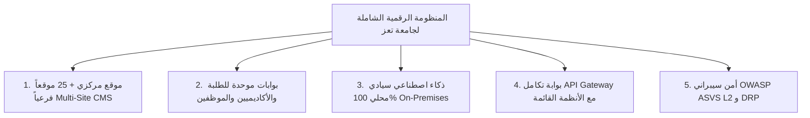

# الملخص التنفيذي للعرض الفني
## TAIZ-TENDER-04 — EXECUTIVE SUMMARY & STRATEGIC VALUE PROPOSITION

> **الهدف:** تقديم ملخص استراتيجي وتنفيذي مقنع ومتحفظ هندسياً يوضح فهم احتياج جامعة تعز، القيمة المضافة، والجدوى التنفيذية الكاملة خلال 32 أسبوعاً.

---

## 1. فهم الاحتياج الاستراتيجي لجامعة تعز

تخوض جامعة تعز مرحلة تحول رقمي محورية تتطلب الانتقال من المواقع المنفصلة والمعاملات الورقية المشتتة إلى **منظومة رقمية جامعية موحدة وسريعة وسهلة الاستخدام** تخدم أكثر من 30,000 طالب وباحث وموظف وأكاديمي، وتلبي المعايير العالمية في النفاذية الرقمية والأمن السيبراني، مع استيعاب ذروة التسجيل وإعلان النتائج بكفاءة عتادية عالية في مركز البيانات المحلي للجامعة.

---

## 2. عناصر القيمة المقترحة والحل المتكامل

### ركائز التميز في العرض الفني:
1. **منصة واحدة موحدة لـ 25 موقعاً فرعياً (Multi-Tenant Core):**
   - إدارة مركزية للموقع المؤسسي ومواقع الكليات والمراكز الـ 25 بنواة برمجية واحدة، مع توجيه آلي للنطاقات الفرعية (`*.taiz.edu.ye`)، ونظام تصميم موحد متوافق مع معيار النفاذية العالمي WCAG 2.2 Level AA، واستقلالية كاملة لمحرري الكليات.
2. **التكامل الآمن مع الأنظمة القائمة دون استبدالها:**
   - ربط آمن مع نظام شؤون الطلاب (SIS)، ونظام الموارد البشرية، والمالية عبر بوابة API Gateway وطبقة موصلات (Anti-Corruption Layer) تحافظ على استقرار الأنظمة القديمة وتوفر البيانات اللحظية للمستخدمين.
3. **ذكاء اصطناعي وبحث دلالي سيادي 100% On-Premises:**
   - استضافة محلية كاملة لنماذج اللغة والبحث المتجهي داخل مركز بيانات الجامعة دون إرسال أي بايت لخوادم سحابية خارجية، مع تطبيق المعالجة الصرفية العربية (Farasa) وسياسة امتناع حازمة لمنع الهلوسة والاستشهاد الحصري باللوائح المعتمدة.
4. **الملكية الفكرية المطلقة للجامعة (Full Source Code Git):**
   - تسليم كامل الشفرة المصدرية غير المغلقة، مع التوثيق البرمجي الكامل وسكريبتات البناء والتشغيل، دون أي رسوم تراخيص احتكارية أو قيود مستقبلية.
5. **الجدوى الزمنية والالتزام بـ 32 أسبوعاً:**
   - خطة عمل هجينة واقعية مبنية على 6 مراحل تنفيذية و 16 مخرجاً تعاقدياً معتمدين، تضمن الانتقال السلس وبناء القدرات عبر 80 ساعة تدريبية لـ 40 كادراً جامعياً.

---

## 3. النتائج والمستهدفات القابلة للقياس (Target Key Results)

| المحور | المستهدف الفني والتشغيلي | أسلوب التحقق والإثبات |
| :--- | :--- | :--- |
| **سعة التحمل** | 5,000 مستخدم متزامن تتوسع إلى 25,000 [TARGET] | اختبار ضغط حي عبر Locust/JMeter في المرحلة 5 |
| **زمن استجابة الـ API** | أقل من 300ms للعمليات الداخلية [TARGET] | قياس مؤشرات APM و Prometheus |
| **النفاذية الرقمية** | مطابقة معيار WCAG 2.2 Level AA [TARGET] | فحص أداة axe-core والتدقيق اليدوي في المرحلة 2 |
| **الأمن السيبراني** | خلو النظام من الثغرات الحرجة (ASVS L2) [TARGET] | تقرير فحص واختراق معتمد من طرف ثالث مستقل |
| **التعافي من الكوارث** | RPO <= 1 ساعة و RTO <= 4 ساعات [TARGET] | محاكاة انقطاع مفاجئ واختبار Failover دوري |
| **الضمان والدعم الفني** | 12 شهراً مجاناً مع استجابة P1 <= 2 ساعة [COMMITMENT] | اتفاقية SLA معتمدة وبوابة تذاكر دعم فني |
