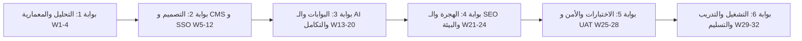

# منهجية التنفيذ وإدارة المشروع
## TAIZ-TENDER-04 — IMPLEMENTATION METHODOLOGY & PROJECT GOVERNANCE

> **المنهجية المعتمدة:** منهجية هجينة منضبطة (*Hybrid Agile / Waterfall*) تجمع بين الصرامة التعاقدية للمراحل وبوابات القبول (*Stage Gates*) والمرونة التكرارية في تطوير واختبار الموديولات البرمجية.

---

## 1. دورة حياة المشروع وبوابات العبور الست (The 6 Stage Gates)

---

## 2. تفصيل بوابات العبور وشروط الانتقال (Stage Gate Criteria)

| البوابة والمرحلة | المدخلات الأساسية | الأنشطة الهندسية | المخرجات التعاقدية | شرط القبول والخروج (Exit Criteria) |
| :--- | :--- | :--- | :--- | :--- |
| **البوابة 1: الاكتشاف والتحليل**  (الأسابيع 1 - 4) | كراسة المناقصة، المقابلات، فحص الأنظمة القائمة | دراسة الاحتياجات، تدقيق البيانات، وتوثيق المعمارية | وثائق D-01, D-02, D-05 | اعتماد اللجنة الفنية للجامعة لوثيقة المعمارية ونطاق العمل التفصيلي (صرف الدفعة 2). |
| **البوابة 2: الـ CMS والهوية والتصميم**  (الأسابيع 5 - 12) | وثائق التحليل المعتمدة، الهوية البصرية للجامعة | بناء محرك الـ 25 موقعاً فرعياً، قوالب التصميم، و Keycloak | وثائق D-03, D-04, D-08، كود الـ CMS | تشغيل الـ 25 موقعاً تجريبياً واجتياز فحص النفاذية WCAG 2.2 AA. |
| **البوابة 3: البوابات والذكاء والتكامل**  (الأسابيع 13 - 20) | إعدادات الـ CMS وخادم الهويات Keycloak | بناء بوابات الطلبة والأكاديمي، محرك Local RAG، و API Gateway | مخرج D-07، كود البوابات والـ AI | اجتياز دقة المساعد الذكي واختبار موصلات الـ SIS (صرف الدفعة 3). |
| **البوابة 4: الترحيل والـ SEO والبيئة**  (الأسابيع 21 - 24) | أرشيف الموقع القديم، لوائح الجامعة، خوادم الداتاسنتر | تنفيذ أنابيب ETL لهجرة المحتوى، أتمتة الـ SEO، وبيئة K8s والـ DR | مخرج D-09، سكربتات الترحيل و 301 | هجرة 100% من المحتوى المعتمد وتفعيل WAL Streaming لـ DRP. |
| **البوابة 5: الاختبارات الشاملة و UAT**  (الأسابيع 25 - 28) | النظام البرمجي المتكامل والبيئة المهيأة | اختبارات ضغط 5k مستخدم، اختبار اختراق خارجي، واختبار UAT | وثائق D-06, D-10, D-14، تقرير Pentest | تقرير فحص اختراق نظيف من طرف ثالث وتوقيع شهادة قبول UAT. |
| **البوابة 6: الإطلاق والتدريب والتسليم**  (الأسابيع 29 - 32) | المنظومة المجتازة للاختبارات | تدريب 40 كادراً (80 ساعة)، النشر الرسمي، وتسليم Git Repo | وثائق D-11, D-12, D-13, D-15, D-16 | تسليم كامل الشفرة المصدرية وتوقيع محضر الاستلام الابتدائي (صرف الدفعة 4). |

---

## 3. حوكمة إدارة التغيير والمخاطر (Change & Risk Control)

1. **إدارة طلبات التغيير (Change Control Board - CCB):**
   - دراسة أي طلب تعديل على النطاق أو المتطلبات من خلال لجنة مشتركة، وتقييم أثره على الجدول الزمني والتكلفة قبل اعتماده رسمياً.
2. **الاجتماعات الدورية والتقارير الشهرية:**
   - عقد اجتماع متابعة أسبوعي مع مهندسي الجامعة وتقديم تقرير إنجاز شهري موثق يوضح نسبة التقدم المحرز ومطابقته للجدول الزمني.
