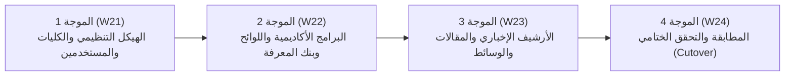

# استراتيجية ترحيل البيانات والتكامل مع الأنظمة القائمة
## TAIZ-TENDER-04 — DATA MIGRATION STRATEGY & LEGACY INTEGRATION

> **المرجع التعاقدي:** كراسة المناقصة رقم 2/2026 — الجزء الثالث (ص 7)، بند RTM-07 و RTM-09 (ص 24)، والجدول 4 في الـ BOQ (ص 39).

---

## 1. استراتيجية هجرة المحتوى القديم وموجات الترحيل الأربع

### خطة الحفاظ على الأرشفة والترتيب الأكاديمي (301 Redirects):
- إعداد جدول تحويلات دائم (301 Permanent Redirects) يربط كافة روابط الموقع القديم بالأقسام والصفحات الجديدة لمنع ظهور أخطاء 404 والحفاظ الكامل على ترتيب جامعة تعز في تصنيف Webometrics ومحركات البحث العالمية.

---

## 2. معمارية موصلات الأنظمة القائمة وأنماط الوصول

| الموصل والنظام القائم | نمط الوصول (Access Mode) | استراتيجية الربط والتعامل مع الأعطال |
| :--- | :--- | :--- |
| **موصل شؤون الطلاب (SIS Adapter)** | `READ` (للسجلات)  `UNKNOWN_NEEDS_DISCOVERY` (للتحديث) | استعلام آمن لقراءة حالة الطالب والدرجات عبر واجهات وسيطة محمية بقواطع الدائرة (Circuit Breaker). |
| **موصل الموارد البشرية (HR Adapter)** | `READ` (للدليل الوظيفي)  `UNKNOWN_NEEDS_DISCOVERY` (للإجازات) | سحب بيانات الكادر التدريسي والإداري للقراءة فقط، مع عزل النظام عند البطء. |
| **موصل النظام المالي (Finance Adapter)** | `READ` (للتحقق من السندات)  `OUTSIDE_PORTAL_SCOPE` (للدفع) | التحقق من أرقام السندات والرسوم المسددة يدوياً؛ وعمليات الدفع تتم خارج البوابة عبر القنوات البنكية. |
| **موصل الأرشيف القديم (Legacy DB Adapter)** | `READ` (ترحيل ومزامنة تاريخية) | سحب المحتوى التاريخي عبر أنابيب ETL مؤتمتة ومطابقة الأعداد بـ Checksums. |

---

## 3. المبادئ الهندسية لطبقة التكامل (Integration Resilience)

1. **طبقة مكافحة الفساد (Anti-Corruption Layer - ACL):** تحويل كافة هياكل البيانات القديمة إلى نماذج قانونية معيارية موحدة (Canonical Models) لعزل النواة البرمجية عن عيوب الأنظمة القديمة.
2. **مفاتيح منع التكرار (Idempotency Keys):** فرض مفتاح فريد لكل معاملة لمنع التكرار في حال انقطاع الاتصال وإعادة المحاولة.
3. **التتبع الموزع (Correlation Tracking):** تمرير معرف تتبع موحد `X-Correlation-ID` عبر كافة العمليات لتسهيل التدقيق والتشخيص السريع للأخطاء.
