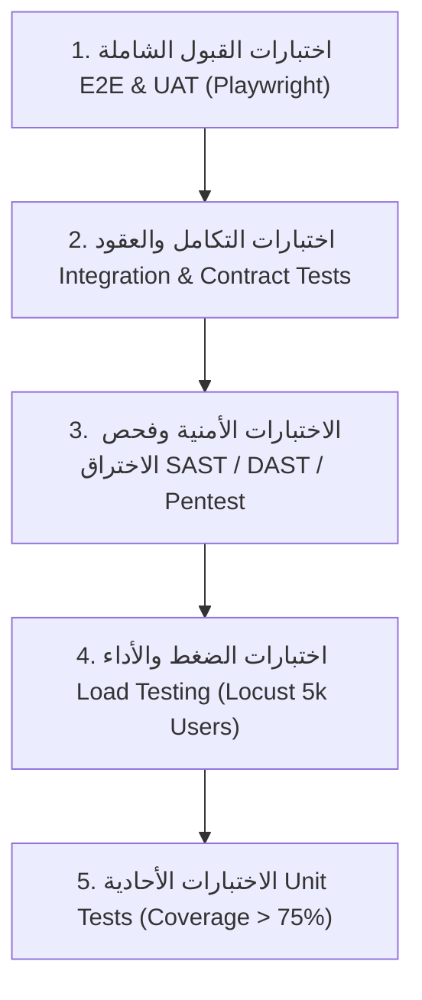

# استراتيجية ضمان الجودة، الاختبارات، ومعايير القبول
## TAIZ-TENDER-04 — QUALITY ASSURANCE, TESTING STRATEGY & ACCEPTANCE

> **المرجع التعاقدي:** كراسة المناقصة رقم 2/2026 — القسم الثاني عشر: إطار ضمان وجودة البرمجيات (ص 34)، والمخرجات D-06 و D-10 و D-14 (ص 30-31).
> **المبدأ الهندسي:** الأرقام المذكورة تمثل **مستهدفات ومعايير قبول تعاقدية تُثبت باختبارات فعلية في المرحلة 5 [TARGET_TO_BE_VALIDATED]** وليست ادعاءات مسبقة قبل التنفيذ.

---

## 1. هرم الاختبارات الشامل ومستويات الفحص

---

## 2. مصفوفة مستهدفات القبول والاختبارات الفنية

| نوع الاختبار | الأداة والمنهجية | المستهدف الفني ومعيار القبول | مرحلة الإثبات |
| :--- | :--- | :--- | :--- |
| **الاختبارات الأحادية (Unit Testing)** | Vitest / Jest | تغطية كود لا تقل عن **75%** وخلو من Critical Bugs | مستمر في CI/CD |
| **اختبارات التكامل والعقود (Contract)** | Supertest / Pact | تطابق عقود الـ APIs مع مواصفات OpenAPI 3.0 بنسبة 100% | المرحلة 3 |
| **النفاذية الرقمية (Accessibility)** | axe-core / Pa11y | اجتياز معيار **WCAG 2.2 Level AA** بنسبة 100% | المرحلة 2 |
| **اختبارات الضغط (Load Testing)** | Locust / JMeter | محاكاة **5,000 مستخدم متزامن** مع زمن استجابة API < 300ms | المرحلة 5 |
| **فحص الثغرات البرمجية (SAST/DAST)** | Semgrep / SonarQube | خلو الكود تماماً من ثغرات OWASP Top 10 | مستمر في CI/CD |
| **اختبار الاختراق المستقل (Pentest)** | شركة أمنية مستقلة مرخصة | تقرير فحص اختراق رسمي نظيف وفق OWASP ASVS L2 | المرحلة 5 |
| **اختبار التعافي من الكوارث (DRP Test)** | محاكاة انقطاع مفاجئ | استعادة البيانات خلال أقل من 4 ساعات وفقدان < ساعة | المرحلة 4 |
| **دقة الذكاء الاصطناعي (AI Recall)** | بنك أسئلة جامعية (100+ سؤال) | دقة استرجاع Recall@10 > 95% ومعدل هلوسة < 2% | المرحلة 3 |
| **اختبار قبول المستخدمين (UAT)** | سيناريوهات استخدام واقعية | توقيع محضر قبول UAT من ممثلي الكليات والطلاب | المرحلة 5 |

---

## 3. مصفوفة تصنيف الأخطاء وأزمنة المعالجة (Defect Severity SLA)

| درجة الخطأ | التوصيف الفني | الحد الأقصى للإصلاح | شرط قبول المخرج |
| :--- | :--- | :--- | :--- |
| **حرج (Critical - S1)** | توقف كامل للبوابة، تسريب بيانات، أو عجز عن تسجيل الدخول | خلال **4 ساعات** | حظر قبول المخرج حتى الإغلاق التام |
| **عالي (Major - S2)** | تعطل خدمة أكاديمية أو فشل موصل دون توقف النظام الكلي | خلال **12 ساعة** | حظر قبول المخرج حتى المعالجة |
| **متوسط (Medium - S3)** | خلل في تنسيق صفحة، تأخر استجابة غير حرج، أو خطأ في تقرير | خلال **3 أيام عمل** | قبول مشروط بخطة معالجة |
| **منخفض (Minor - S4)** | ملاحظات تجميلية أو تعديل صياغة نصية في واجهة المستخدم | خلال **5 أيام عمل** | لا يعيق قبول المخرج |
