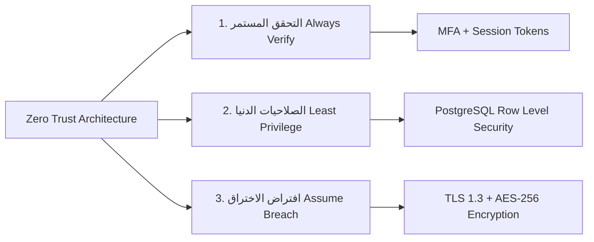

# إطار الأمن السيبراني، الخصوصية، والتعافي من الكوارث
## TAIZ-TENDER-04 — CYBERSECURITY, DATA PRIVACY & DISASTER RECOVERY

> **المرجع التعاقدي:** كراسة المناقصة رقم 2/2026 — القسم الرابع عشر (ص 34)، ومخرجات الأمان D-06 و D-09 (ص 30).

---

## 1. تطبيق معيار OWASP ASVS v4.0 Level 2 ومبدأ Zero Trust

### ركائز الأمن السيبراني المعتمدة:
1. **التشفير الشامل للبيانات:**
   - تشفير البيانات أثناء الحركة باستخدام بروتوكول **TLS 1.3** مع تطبيق سياسات HSTS وإلغاء الشفرات القديمة للحصول على تصنيف A+ في اختبارات SSL Labs.
   - تشفير البيانات الحساسة أثناء السكون باستخدام خوارزمية **AES-256** على مستوى قاعدة البيانات وتخزين MinIO.
2. **سجلات التدقيق غير القابلة للتعديل (Immutable Audit Trails):**
   - تسجيل كافة الأنشطة الإدارية ومحاولات الدخول ورصد الدرجات في جداول Append-Only مشفرة ومحمية ضد التعديل أو الحذف من أي مستخدم.
3. **فحص الملفات المرفوعة وحظر الفيروسات:**
   - تمرير كافة المستندات المرفوعة عبر بروتوكول ICAP ومحرك فحص الفيروسات وعزل أي ملف مشبوه وحظر الملفات التنفيذية.
4. **حوكمة خروج البيانات الخارجية (Zero Confidential Data Egress):**
   - حظر تام لأي تصدير لبيانات الطلاب أو الكادر لخوادم خارجية؛ وقصر استدعاءات Google Indexing على المحتوى العام المنشور للعموم فقط.

---

## 2. خطة التعافي من الكوارث واستمرارية الأعمال (DRP)

1. **المستهدفات التعاقدية للتعافي:**
   - **هدف نقطة الاستعادة (RPO):** لا يتجاوز **ساعة واحدة** (RPO <= 1h).
   - **هدف زمن الاستعادة (RTO):** لا يتجاوز **4 ساعات** (RTO <= 4h).
2. **آلية المزامنة المستمرة:**
   - تطبيق `PostgreSQL WAL Streaming Replication` لنقل سجلات العمليات لحظياً إلى السيرفر الاحتياطي بموقع الـ DR.
   - مزامنة الأصول الرقمية والملفات في MinIO بشكل دوري مؤتمت كل 15 دقيقة.
3. **تقرير اختبار الاختراق المستقل (Third-Party Pentest):**
   - الالتزام بالتعاقد مع شركة أمن سيبراني مستقلة ومرخصة لإجراء اختبار اختراق شامل (Black-box & Gray-box) وإصدار تقرير رسمي نظيف يثبت خلو المنظومة التام من أي ثغرات حرجة أو عالية قبل الاستلام الابتدائي.
