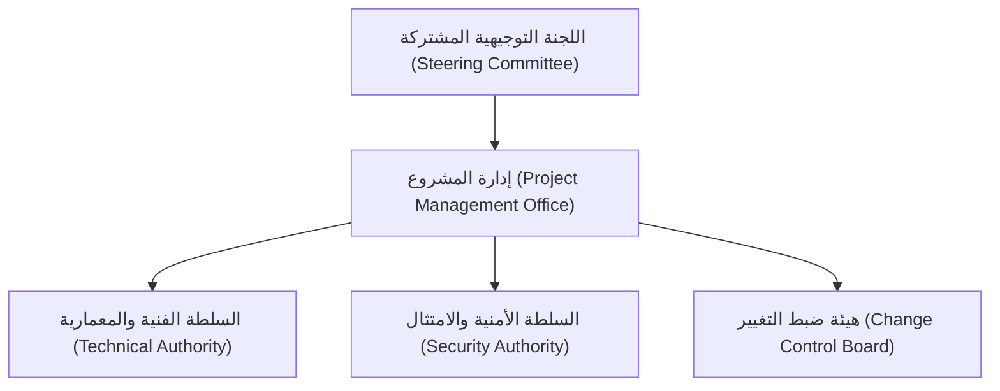

# هيكل فريق العمل، المؤهلات، وحوكمة المشروع
## TAIZ-TENDER-04 — PROJECT TEAM STRUCTURE, QUALIFICATIONS & GOVERNANCE

> **المرجع التعاقدي:** كراسة المناقصة رقم 2/2026 — القسم العاشر: مصفوفة فريق العمل (ص 32-33)، ودليل تعليمات مقدم العرض (ص 35-36).
> **القاعدة الحاكمة الصارمة:** يُحظر حظراً تاماً اختراع أسماء وهمية أو شهادات غير مثبتة؛ وتُصنف كافة الأدوار كـ `TO_BE_NOMINATED` مع الإشارة لحالة توثيق السير والشهادات كـ `PENDING_CV` / `PENDING_CERTIFICATE` / `PENDING_COMMITMENT_LETTER`.

---

## 1. مصفوفة الكادر البشري الأساسي الـ 8 ومتطلبات التأهيل

| # | المسمى الوظيفي (Key Position) | المؤهل والشهادة المهنية المطلوبة | سنوات الخبرة | نسبة التفرغ والمراحل | اسم المرشح | حالة السيرة والشهادة |
| :--- | :--- | :--- | :--- | :--- | :--- | :--- |
| **1** | **مدير المشروع**  `Project Manager` | شهادة `PMP` أو `PRINCE2` معتمدة سارية | >= 8 سنوات | %100 (كامل المشروع W1-32) | `TO_BE_NOMINATED` | `PENDING_CV` + `PENDING_CERTIFICATE` (PMP) + `PENDING_COMMITMENT_LETTER` |
| **2** | **قائد معمارية الحلول**  `Solutions Architect` | شهادة `TOGAF` أو `AWS Certified Architect` | >= 10 سنوات | %50 (المراحل 1 - 3) | `TO_BE_NOMINATED` | `PENDING_CV` + `PENDING_CERTIFICATE` (TOGAF) + `PENDING_COMMITMENT_LETTER` |
| **3** | **قائد الخدمات الخلفية**  `Backend Lead` | بكالوريوس هندسة برمجيات / علوم حاسوب | >= 7 سنوات | %100 (المراحل 2 - 5) | `TO_BE_NOMINATED` | `PENDING_CV` + `PENDING_CERTIFICATE` (Degree) + `PENDING_COMMITMENT_LETTER` |
| **4** | **قائد الواجهات والنفاذية**  `Frontend Lead` | بكالوريوس تقنية معلومات / علوم حاسوب | >= 6 سنوات | %100 (المراحل 2 - 5) | `TO_BE_NOMINATED` | `PENDING_CV` + `PENDING_CERTIFICATE` (Degree) + `PENDING_COMMITMENT_LETTER` |
| **5** | **مهندس الذكاء الاصطناعي**  `AI/RAG Specialist` | ماجستير أو بكالوريوس ذكاء اصطناعي | >= 5 سنوات | %75 (المراحل 3 - 5) | `TO_BE_NOMINATED` | `PENDING_CV` + `PENDING_CERTIFICATE` (MSc AI) + `PENDING_COMMITMENT_LETTER` |
| **6** | **خبير الأمن السيبراني**  `Cybersecurity Specialist` | شهادة `CISSP` أو `CEH` أو `ISO 27001 Auditor` | >= 6 سنوات | %40 (المراحل 2، 5) | `TO_BE_NOMINATED` | `PENDING_CV` + `PENDING_CERTIFICATE` (CISSP) + `PENDING_COMMITMENT_LETTER` |
| **7** | **مهندس عمليات DevOps**  `DevOps Specialist` | شهادة `CKA` (Kubernetes) أو `Docker Certified` | >= 5 سنوات | %50 (المراحل 2، 4، 6) | `TO_BE_NOMINATED` | `PENDING_CV` + `PENDING_CERTIFICATE` (CKA) + `PENDING_COMMITMENT_LETTER` |
| **8** | **أخصائي ترحيل المحتوى والتدريب**  `Content/Training Lead` | بكالوريوس نظم معلومات | >= 4 سنوات | %100 (المراحل 4 - 6) | `TO_BE_NOMINATED` | `PENDING_CV` + `PENDING_CERTIFICATE` (Degree) + `PENDING_COMMITMENT_LETTER` |

---

## 2. مصفوفة توزيع المسؤوليات (RACI Matrix)

| النشاط / المخرج الرئيسي | مدير المشروع | معمار الحلول | قائد الباك إند | قائد الواجهات | مهندس الـ AI | خبير الأمن | مهندس DevOps | أخصائي التدريب |
| :--- | :---: | :---: | :---: | :---: | :---: | :---: | :---: | :---: |
| **المعمارية ونطاق العمل D-01, D-05** | A | R | C | C | C | C | C | I |
| **نواة الـ Multi-Site CMS لـ 25 موقعاً** | A | C | R | R | I | C | I | C |
| **تكامل Keycloak SSO و MFA** | A | C | R | C | I | R | C | I |
| **بناء محرك Local RAG و Qdrant** | A | C | C | C | R | C | C | I |
| **تكوين بيئة Kubernetes و DRP** | A | C | C | I | C | C | R | I |
| **فحص الاختراق المستقل ASVS L2** | A | I | C | I | I | R | C | I |
| **هجرة المحتوى والـ 301 Redirects** | A | I | C | C | I | I | I | R |
| **تنفيذ التدريب لـ 40 كادراً (80h)** | A | I | C | C | C | C | C | R |

*(الرموز: R = مسؤول عن التنفيذ، A = مساءل نهائي، C = مستشار فني، I = مطلع على المخرجات)*

---

## 3. هيئات الحوكمة وإدارة المشروع (Governance Framework)

1. **اللجنة التوجيهية المشتركة (Steering Committee):** تضم ممثلي رئاسة الجامعة واللجنة الفنية المشرفة والمدير التنفيذي لمقدم العطاء، وتجتمع شهرياً لمتابعة مؤشرات الإنجاز واعتماد الدفعات.
2. **هيئة ضبط التغيير (Change Control Board):** تدرس أي طلب تعديل في النطاق وتصدر قرارات موثقة لتجنب التأثير على موعد التسليم الـ 32 أسبوعاً.
3. **مصفوفة التصعيد (Escalation Matrix):**
   - المستوى 1 (تشغيلي): حل المشاكل الفنية اليومية بين قادة الفرق خلال 24 ساعة.
   - المستوى 2 (إداري): تصعيد المعوقات لمدير المشروع واللجنة الفنية خلال 48 ساعة.
   - المستوى 3 (استراتيجي): تصعيد المسائل العالقة للجنة التوجيهية لاتخاذ قرار نهائي خلال 5 أيام عمل.
