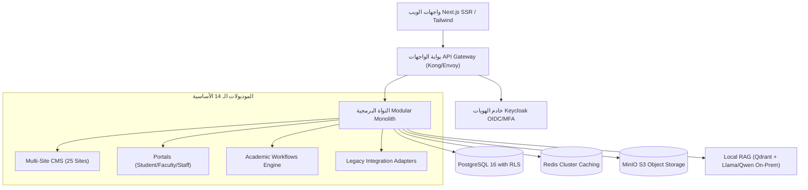

# الحل الفني والمعمارية الهندسية المستهدفة
## TAIZ-TENDER-04 — TECHNICAL SOLUTION & ARCHITECTURAL BLUEPRINT

> **المرجع التعاقدي:** مصفوفة المعمارية المستهدفة (`TAIZ_TENDER_03_C4_ARCHITECTURE.md`) وسجل الموديولات (`TAIZ_TENDER_03_MODULE_BOUNDARIES.md`).

---

## 1. المعمارية الموحدة (Modular Monolith)

تم اختيار نمط **المعمارية الموحدة منضبطة الحدود (Modular Monolith)** لتشغيل منظومة جامعة تعز لكونه الخيار الهندسي الأكثر كفاءة وملاءمة لبيئة الاستضافة المحلية (On-Premises)، حيث يوفر:
- **أداءً فائقاً وزمن استجابة أقل من 300ms [TARGET_TO_BE_VALIDATED]** عبر التواصل المباشر في الذاكرة بين الوحدات وتجنب تأخير الشبكة.
- **كفاءة عتادية عالية وتوفير ~30% إلى 40% من استهلاك الموارد [DESIGN_ASSUMPTION]** مقارنة بالخدمات المصغرة المشتتة.
- **حدوداً واضحة لـ 14 موديولاً مستقلاً** مع استقلالية تامة للبيانات تتيح فصل أي موديول مستقبلاً إلى Microservice مستقل دون المساس بالنواة.

---

## 2. تفصيل الطبقات البرمجية والحلول التقنية

### 2.1 طبقة الواجهات ونظام التصميم (Presentation Tier):
- إطار العمل المرجعي: **Next.js (React 19 / TypeScript)** مع دعم العرض على الخادم (SSR) والتوليد الثابت المتجدد (ISR) لتحقيق أعلى سرعة تصفح وأرشفة ممتازة في محركات البحث.
- نظام التصميم: مكتبة مكونات متجاوبة بالكامل مبنية على Radix UI و Tailwind CSS 4 مع دعم كامل لاتجاه اللغة العربية (RTL) وخط Cairo المؤسسي المعتمد، ومطابقة تامة لمعيار النفاذية العالمي WCAG 2.2 Level AA.

### 2.2 طبقة المنطق المؤسسي (Application Tier):
- إطار الخدمات الخلفية: **NestJS / Node.js أو FastAPI / Python** مقسم إلى 14 موديولاً مستقلاً يتواصل عبر العقود ونواقل الأحداث الداخلية (In-Process Domain Events).
- إدارة الهوية والمصادقة: خادم **Keycloak** أو ما يعادله مفتوح المصدر لدعم الدخول الموحد (SSO) عبر OpenID Connect و SAML 2.0 مع المصادقة الثنائية (MFA) عبر TOTP/SMS.

### 2.3 طبقة البيانات والتخزين (Data & Storage Tier):
- قاعدة البيانات المركزية: **PostgreSQL 16 Enterprise** مع تطبيق سياسات الأمان على مستوى الصفوف (Row Level Security - RLS) للعزل التام لبيانات الكليات والمستخدمين.
- التخزين المؤقت: **Redis Cluster** لتخزين الجلسات وكاش استعلامات الـ CMS والبوابات لتخفيف الحمل على قاعدة البيانات بنسبة استهداف (Cache Hit Ratio > 85%).
- تخزين الوثائق والوسائط: **MinIO S3-Compatible Storage** لتخزين وتشفير الملفات والشهادات والوسائط محلياً وتوليد روابط تحميل خاصة مؤقتة (Signed URLs).

### 2.4 طبقة الذكاء الاصطناعي السيادي (Local Sovereign RAG Tier):
- محرك RAG محلي بلغة Python مع قاعدة بيانات متجهية (**Qdrant أو Milvus**)، ونماذج لغة مفتوحة المصدر (**Llama 3.1 / Qwen 2.5 32B/72B**)، ومكتبة **Farasa** للمعالجة الصرفية العربية، مع حظر كامل لأي اتصال بخوادم خارجية لضمان الخصوصية والسيادة الرقمية.
