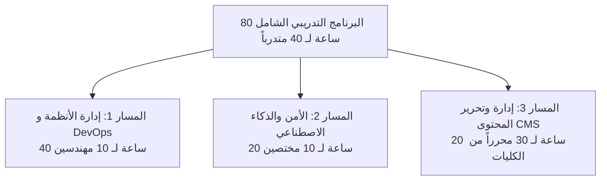

# خطة التدريب، نقل المعرفة، الضمان، والدعم الفني
## TAIZ-TENDER-04 — TRAINING, KNOWLEDGE TRANSFER & SLA SUPPORT PACKAGE

> **المرجع التعاقدي:** كراسة المناقصة رقم 2/2026 — القسم الخامس عشر (ص 34)، ومخرجات التدريب والضمان D-11 و D-16 (ص 30-31)، والجدول 6 و 7 في الـ BOQ (ص 40).

---

## 1. الخطة التدريبية الشاملة لـ 80 ساعة لـ 40 متدرباً

### تفصيل المسارات التدريبية الثلاثة:
1. **المسار الأول: إدارة البنية التحتية، الحاويات، والشفرة المصدرية (40 ساعة - 10 مهندسين):**
   - إدارة وتشغيل كلاستر Kubernetes محلياً، تكوين التوسع التلقائي HPA، إدارة وتوسيع PostgreSQL 16 و Redis و MinIO، خطة التعافي من الكوارث Failover، وبناء واختبار الشفرة المصدرية من مستودع Git.
2. **المسار الثاني: الأمن السيبراني وإدارة محرك الذكاء الاصطناعي (20 ساعة - 10 مختصين):**
   - إدارة ضوابط OWASP ASVS L2، مراجعة سجلات التدقيق والتشفير، إدارة وتغذية قاعدة بيانات Qdrant باللوائح، وضبط فلاتر مكافحة Prompt Injection.
3. **المسار الثالث: إدارة ونشر المحتوى وإمكانية الوصول النفاذية (20 ساعة - 30 محرراً ومراجعاً من الكليات):**
   - استخدام محرر الصفحات المرئي، إدارة دورة حياة المحتوى (Draft -> Review -> Publish)، النشر على المواقع الفرعية الـ 25، وتطبيق معايير النفاذية والـ Alt Text والـ SEO.

---

## 2. حزمة التوثيق ونقل المعرفة باللغة العربية (Documentation Package)

- تسليم حزمة التوثيق الرسمية المكتملة باللغة العربية بصيغتي PDF و Word وتوثيق OpenAPI التفاعلي بصيغة Swagger، وتشمل:
  1. وثيقة المعمارية الهندسية ومخططات C4.
  2. نموذج وتصميم قاعدة البيانات وسجلات الصلاحيات.
  3. الأدلة التشغيلية لإدارة وتشغيل ونشر النظام وسكريبتات البناء.
  4. دليل توثيق الواجهات البرمجية (API Documentation).
  5. أدلة الاستخدام المصورة لكافة بوابات المستخدمين ومحرري الـ CMS.

---

## 3. الضمان المجاني واتفاقية مستوى الخدمة (12-Month Free Warranty & SLA)

1. **الضمان المجاني الشامل لمدة عام كامل:**
   - صيانة برمجية شاملة، معالجة الثغرات، والتحديثات الدورية مجاناً لمدة 12 شهراً كاملة بعد الاستلام الابتدائي للمنظومة.
2. **مصفوفة أزمنة الاستجابة وفق اتفاقية مستوى الخدمة (SLA Matrix):**

| مستوى البلاغ | تصنيف المشكلة | زمن الاستجابة الأولي | الحد الأقصى للإصلاح |
| :--- | :--- | :--- | :--- |
| **الأولوية 1 (Critical - P1)** | توقف المنظومة بالكامل أو انقطاع خدمة حرجة | **خلال ساعتين (<= 2h)** | **خلال 6 ساعات** |
| **الأولوية 2 (High - P2)** | تعطل جزئي لأحد المواقع الفرعية أو خلل بمحرر CMS | خلال 4 ساعات | خلال 24 ساعة |
| **الأولوية 3 (Medium - P3)** | بطء غير حرج في استجابة صفحة أو استفسار مساعد ذكي | خلال 8 ساعات | خلال 48 ساعة |
| **الأولوية 4 (Low - P4)** | استفسار تشغيلي، طلب تعديل شكلي، أو تحسين طفيف | خلال 24 ساعة | خلال 5 أيام عمل |
