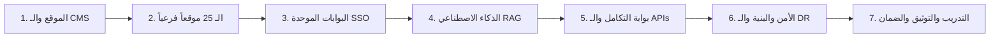

# فهم المشروع ونطاق العمل والمسؤوليات
## TAIZ-TENDER-04 — PROJECT UNDERSTANDING, DETAILED SCOPE & RESPONSIBILITIES

> **المرجع التعاقدي:** كراسة المناقصة رقم 2/2026 — الجزء الثاني: نطاق المشروع وأهدافه (ص 3-5)، وسجل المتطلبات المجمد (`TAIZ_TENDER_00_REQUIREMENTS_REGISTER.md`).

---

## 1. حزم نطاق العمل الرسمي المعتمد (In-Scope Packages)

### تفصيل الحزم الـ 7:
1. **حزمة الموقع الإلكتروني المؤسسي ونظام الـ CMS:**
   - بناء الموقع المركزي لجامعة تعز، إدارة الأخبار، الإعلانات، الفعاليات، دليل البرامج الأكاديمية، السير الذاتية للكادر، مكتبة الوسائط، ومنشئ النماذج الإلكترونية.
2. **حزمة منصة المواقع المتعددة (25 Subdomains):**
   - منصة Multi-Tenant تدير 25 موقعاً فرعياً للكليات والمراكز والمرافق عبر نطاقات فرعية مستقلة مع الحوكمة المركزية واستقلالية التحرير ونظام التصميم الموحد.
3. **حزمة البوابات الرقمية الموحدة والدخول الموحد (Portals & SSO):**
   - بوابة الطالب (السجل الأكاديمي والطلبات الإلكترونية والرسوم)، بوابة الأكاديمي (المقررات والدرجات والمجالس الأكاديمية)، بوابة الموظفين (الإجازات والمراسلات)، مع خادم Keycloak SSO و MFA و RBAC.
4. **حزمة محرك الذكاء الاصطناعي والبحث الدلالي السيادي (Local Sovereign RAG):**
   - محرك RAG محلي 100% On-Premises مع المعالجة الصرفية العربية (Farasa)، والبحث الهجين، والامتناع عند ضعف الأدلة، والاستشهاد بنصوص اللوائح، وحوكمة التدخل البشري.
5. **حزمة التكامل والتواصل مع الأنظمة القائمة (Integration Layer):**
   - طبقة API Gateway وموصلات القراءة والعرض مع أنظمة شؤون الطلاب (SIS)، والموارد البشرية، والمالية، وأنابيب ترحيل البيانات التاريخية مع روابط 301 Redirects.
6. **حزمة الأمن السيبراني والبنية التحتية والتعافي من الكوارث (Security & DR):**
   - الالتزام بـ OWASP ASVS L2، التشفير TLS 1.3/AES-256، تقرير فحص اختراق من طرف ثالث، بيئة حاويات Kubernetes مع التوسع التلقائي لـ 5,000 إلى 25,000 مستخدم، وخطة DRP عبر PostgreSQL WAL Streaming.
7. **حزمة التدريب ونقل المعرفة والضمان والدعم الفني (Training & SLA):**
   - تدريب 80 ساعة لـ 40 كادراً جامعياً، تسليم حزمة التوثيق الكاملة باللغة العربية D-01 إلى D-16، تسليم كامل الشفرة المصدرية Git، وضمان ودعم فني لعام كامل وفق SLA.

---

## 2. الأعمال الخارجة عن النطاق صراحة (Out-of-Scope)

1. **بوابة الدفع الإلكتروني المباشر داخل المنصة:** لا تتضمن المنصة استقبال بطاقات ائتمانية أو تداول مالي مباشر داخل الموقع؛ ويقتصر النظام المالي على التحقق من السداد وتوجيه الطلاب للسداد عبر القنوات البنكية المعتمدة للجامعة.
2. **استبدال الأنظمة الجامعية القائمة:** لا يتضمن المشروع إعادة برمجة أو استبدال نظام شؤون الطلاب (SIS) أو نظام الموارد البشرية القائم، بل الربط التكاملي الآمن معها.
3. **توفير خطوط الإنترنت والربط الشبكي الخارجي:** تقع مسؤولية توفير شبكة الإنترنت وسرعات الاتصال واستقرار التيار الكهربائي بمركز البيانات على عاتق الجامعة.

---

## 3. الاعتماديات ومسؤوليات جامعة تعز (University Responsibilities)

| المسؤولية والاعتمادية | الجهة المسؤولة في الجامعة | التوقيت الحرج في الخطة |
| :--- | :--- | :--- |
| **توفير الخوادم والبيئة العتادية (سيرفرات الحاويات و GPU)** | مركز الحاسوب وتقنية المعلومات | الأسبوع 1 - 4 (المرحلة 1) |
| **توفير صلاحيات الوصول لقواعد بيانات الأنظمة القائمة (SIS/HR)** | إدارة النظم والمعلومات | الأسبوع 2 - 6 (المرحلة 1-2) |
| **تسمية ضباط الاتصال ومحرري الكليات (40 متدرباً)** | نيابة شؤون الطلاب وعمادات الكليات | الأسبوع 4 (المرحلة 1) |
| **توفير اللوائح الأكاديمية والقرارات الرسمية المعتمدة** | إدارة الشؤون القانونية والأكاديمية | الأسبوع 4 - 8 (المرحلة 1-2) |
| **اعتماد المخرجات المرحلية وتوقيع محاضر الاستلام D-01 إلى D-16** | اللجنة الفنية المشرفة للمناقصة | خلال 10 أيام من تسليم كل مخرج |
