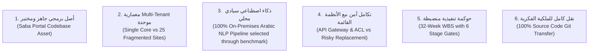

# عوامل التميز التنافسي ونقاط قوة سيستراك
## TAIZ-TENDER-04A — COMPETITIVE DIFFERENTIATORS & WIN THEMES

> **الهدف:** إبراز نقاط القوة الحقيقية والقابلة للدفاع التي تميز عرض سيستراك عن المنافسين التقليديين أمام لجنة التحكيم الفنية لجامعة تعز.

---

## 1. محاور التميز التنافسي الستة (The 6 Win Themes)

---

## 2. تفصيل عناصر التميز التنافسي وأدلتها في العرض

### 1. أصل برمجي أكاديمي عامل ومختبر مسبقاً (Proven Academic Asset):
- **لماذا يهم اللجنة؟** يقلل مخاطر التعثر والتأخير الزمني بنسبة كبيرة مقارنة بالشركات التي ستبدأ البرمجة من الصفر.
- **الدليل:** وجود محرك طلبات طلابية مختبر بـ 7 خدمات أكاديمية، ومنظومة مجالس أكاديمية متكاملة، ونظام RLS مثبت في مستودع الشفرة.
- **مكان الظهور في العرض:** الفصل 3 (الحل الفني) والفصل 6 (ضمان الجودة).

### 2. نواة Multi-Site موحدة لـ 25 موقعاً فرعياً (Unified Multi-Tenant Core):
- **لماذا يهم اللجنة؟** يمنع تشتت المواقع في 25 نسخة ووردبريس منفصلة يصعب تأمينها وتحديثها وربطها.
- **الدليل:** تصميم معمارية Multi-Tenant تدير 25 نطاقاً فرعياً بقاعدة بيانات واحدة ونظام قوالب موحد (Design System).
- **مكان الظهور في العرض:** الفصل 3 (الحل الفني) وفصل المواقع المتعددة.

### 3. ذكاء اصطناعي سيادي محلي مع المعالجة الصرفية العربية (Local Sovereign RAG):
- **لماذا يهم اللجنة؟** يحمي خصوصية وسرية لوائح وبيانات الجامعة بنسبة 100% ويمنع تسريبها لخوادم سحابية خارجية، مع ضمان الاستشهاد الحصري بالمواد والفقرات لمنع الهلوسة.
- **الدليل:** خط أنابيب RAG محلي مع Qdrant وأنابيب Farasa الصرفية ونماذج Llama 3.1 / Qwen 2.5 المستضافة On-Premises.
- **مكان الظهور في العرض:** الفصل 8 (منهجية الذكاء الاصطناعي).

### 4. التكامل غير الهدام مع الأنظمة القائمة (Non-Destructive Legacy Integration):
- **لماذا يهم اللجنة؟** يجنب الجامعة تكاليف ومخاطر استبدال نظام شؤون الطلاب (SIS) القائم ويحفظ استقرار قواعد البيانات.
- **الدليل:** طبقة موصلات API Gateway ونمط مكافحة الفساد (Anti-Corruption Layer) مع قواطع الدائرة (Circuit Breaker).
- **مكان الظهور في العرض:** الفصل 3 والفصل 9 (التكامل والترحيل).

### 5. حوكمة تنفيذية صارمة وتدريب مكثف (Governance & 80h Training):
- **لماذا يهم اللجنة؟** يضمن تسليم المنظومة وتشغيلها باستقلالية تامة من قبل كادر الجامعة بعد انتهاء المشروع.
- **الدليل:** برنامج تدريبي لـ 80 ساعة لـ 40 كادراً جامعياً، مع حزمة توثيق كاملة باللغة العربية D-01 إلى D-16.
- **مكان الظهور في العرض:** الفصل 5 (منهجية التنفيذ) والفصل 10 (التدريب والتوثيق).

### 6. تسليم كامل الشفرة المصدرية ونقل الملكية (Full Source Code & IP Transfer):
- **لماذا يهم اللجنة؟** يمنع احتكار المورد (Vendor Lock-in) ويمنح الجامعة حق التطوير والصيانة غير المقيد.
- **الدليل:** تعهد رسمي صريح بتسليم مستودع Git بكافة الأكواد والسكريبتات، بدون أي ملفات ثنائية مشفرة أو تراخيص مغلقة.
- **مكان الظهور في العرض:** خطاب التقديم والفصل 1 والفصل 14.
