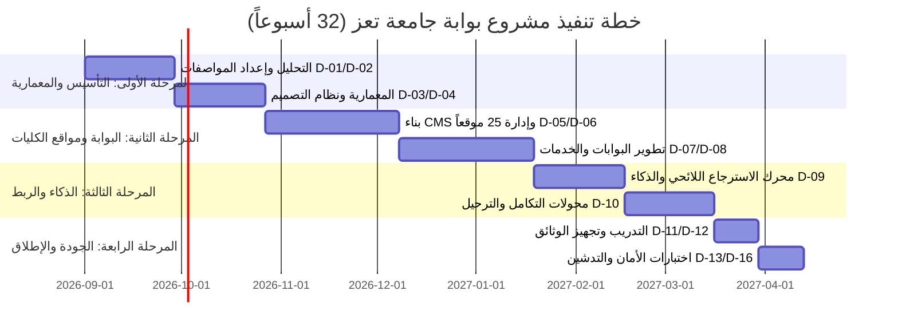

# العرض الفني الموحد والمتكامل لمشروع تطوير البوابة الإلكترونية الشاملة ومواقع الكليات والأنظمة المساعدة
## مناقصة جامعة تعز رقم (2) لسنة 2026م

```ini
OFFICIAL_TENDER_ID=TAIZ-UNI-TENDER-02-2026
CLIENT_NAME=جامعة تعز — الجمهورية اليمنية
BIDDER_NAME=شركة سيستراك لتكنولوجيا المعلومات والحلول البرمجية (Systrac)
DOCUMENT_TYPE=MASTER_TECHNICAL_PROPOSAL
VERSION=1.0-FINAL-RELEASE
BASE_SHA=b516e3a8
CLASSIFICATION=CONFIDENTIAL_PROPRIETARY_TENDER_SUBMISSION
DATE_OF_ISSUE=2026-08-19
```

---

## الفهرس العام للعرض الفني (Table of Contents)

1. [الخلاصة التنفيذية والعرض المؤسسي](#1-الخلاصة-التنفيذية-والعرض-المؤسسي)
2. [فهم المشروع والنطاق الشامل (25 موقعاً و 58 متطلباً)](#2-فهم-المشروع-والنطاق-الشامل)
3. [الحل التقني والمعمارية البرمجية السيادية](#3-الحل-التقني-والمعمارية-البرمجية-السيادية)
4. [منهجية التنفيذ وخطة العمل لـ 32 أسبوعاً (D-01 إلى D-16)](#4-منهجية-التنفيذ-وخطة-العمل-لـ-32-أسبوعاً)
5. [الأمن السيبراني، الخصوصية، والاستمرارية والتعافي](#5-الأمن-السيبراني-والخصوصية-والاستمرارية)
6. [التدريب، نقل المعرفة، وضمان مستوى الخدمة (SLA)](#6-التدريب-ونقل-المعرفة-وضمان-مستوى-الخدمة)
7. [فريق العمل والحوكمة المؤسسية (PENDING_EVIDENCE)](#7-فريق-العمل-والحوكمة-المؤسسية)
8. [سابقة الأعمال والخبرات المماثلة (PENDING_EVIDENCE)](#8-سابقة-الأعمال-والخبرات-المماثلة)
9. [فهرس الملاحق والأدلة الإثباتية المرفقة](#9-فهرس-الملاحق-والأدلة-الإثباتية)

---

## 1. الخلاصة التنفيذية والعرض المؤسسي

يسر شركة **سيستراك لتكنولوجيا المعلومات (Systrac)** أن تتقدم إلى جامعة تعز بعرضها الفني المتكامل لتنفيذ وتطوير **البوابة الإلكترونية الشاملة ومواقع الكليات والمراكز ونظام إدارة المحتوى والخدمات الطلابية والأكاديمية والذكاء الاصطناعي السيادي**، استجابةً للمناقصة العامة رقم (2) لسنة 2026م.

### الركائز الاستراتيجية للعرض الفني:
1. **السيادة التكنولوجية والأمنية المطلقة (100% On-Premises Air-Gapped)**: بناء ونشر البوابة ومحرك الذكاء الاصطناعي والبيانات حصرياً على البنية التحتية والخوادم المحلية لجامعة تعز دون أي تسريب شبكي خارجي أو اعتماد على خدمات سحابية أجنبية.
2. **إدارة مركزية موحدة لـ 25 موقعاً فرعياً (Multi-Site CMS)**: تمكين رئاسة الجامعة و 25 كلية ومركزاً وعمادة من إدارة مواقعهم وهوياتهم الفرعية بنطاقات مخصصة ولوحة تحكم مركزية ذات حوكمة هرمية صارمة.
3. **محرك الاسترجاع اللائحي المقيد (Local Lexical Extractive RAG PoC)**: محرك استرجاع محلي معجمي مدعوم بالمعالجة الصرفية للغة العربية يجيب حصرياً من اللوائح الجامعية المعتمدة مع الاستشهاد الدقيق بنصوص المواد ومنع التوليد غير المنضبط أو الهلوسة.
4. **تكامل الخدمات الإلكترونية الأصيلة (Core Academic & Student Services)**: تقديم دورة حياة كاملة للخدمات الأكاديمية والطلابية، تتضمن السجلات الأكاديمية، إصدار الإفادات المعتمدة برمز التحقق الآمن (QR)، وإدارة مشاريع التخرج والمجالس الأكاديمية.
5. **التنازل الكامل عن حقوق الملكية الفكرية والشفرة المصدرية (Full IP Transfer)**: التزام تعاقدي كامل بتسليم كافة الشفرات المصدرية وأدلة التطوير وبناء الحاويات دون أي مكونات مغلقة أو رسوم تراخيص متكررة.

---

## 2. فهم المشروع والنطاق الشامل

### 2.1 تحليل النطاق المؤسسي
تعد جامعة تعز صرحاً أكاديمياً رائداً يضم أكثر من 30,000 طالب وطالبة وأكثر من 1,500 كادر أكاديمي وإداري موزعين على مقرات متعددة. يغطي نطاق المشروع إطلاق منظومة رقمية متكاملة تشمل:
- **الموقع الرئيسي للجامعة**: واجهة مؤسسية عالمية ثنائية اللغة (عربي/إنجليزي) متوافقة بالكامل مع معايير Webometrics والنفاذية الرقمية.
- **25 موقعاً فرعياً مستقلاً**: تغطي 11 كلية، 11 مركزاً متخصصاً، و 3 نيابات لرئاسة الجامعة.
- **بوابات الخدمات الذاتية**: بوابة الطالب، بوابة عضو هيئة التدريس، وبوابة الموظفين وصندوق المهام الموحد.
- **الخدمات اللائحية والذكاء الاصطناعي**: محرك استرجاع لوائح الجامعة واستعلامات الاستفسارات الأكاديمية.

### 2.2 مصفوفة المتطلبات الرسمية (58 متطلباً)
تم تصنيف متطلبات كراسة الشروط الـ 58 وفق المعايير الفنية التالية:
- **المتطلبات القانونية والتنظيمية (LEG)**: 13 متطلباً تغطي التوافق مع قانون المناقصات، الضمان البنكي 2%، الملكية الفكرية، وتسليم الشفرة المصدرية.
- **المتطلبات الوظيفية ونظام إدارة المحتوى (FR / CMS / MS)**: 34 متطلباً تشمل ثنائية اللغة، التجاوب، إدارة الـ 25 موقعاً، مسار الموافقات، والنماذج الديناميكية.
- **بوابات الخدمات والمستخدمين (PORT)**: 16 متطلباً تغطي البوابات الطلابية والأكاديمية، والربط المالي والمصادقة الموحدة (SSO / MFA).
- **الذكاء الاصطناعي والاسترجاع اللائحي (AI)**: 16 متطلباً تركز على الاستضافة المحلية، منع الهلوسة، دقة الاستشهاد، وحماية حقن الأوامر.
- **الأمان، النفاذية، والـ SEO (SEC / A11Y / SEO)**: 23 متطلباً تتضمن الامتثال لـ OWASP ASVS L2، تشفير TLS 1.3/AES-256، ومعايير WCAG 2.1/2.2 AA.
- **الأداء، البنية التحتية، والجودة (NFR / OPS / ACC / TRN / SLA)**: 26 متطلباً تضمن تحمل 5,000 مستخدم متزامن، سرعة استجابة < 300ms، زمن تعافي RTO <= 4h، وتدريب 40 كادراً جامعياً.

---

## 3. الحل التقني والمعمارية البرمجية السيادية

### 3.1 المعمارية البرمجية (Modular Monolith — Enterprise Tier)
تعتمد المنصة معمارية موحدة نموذجية (Modular Monolith) قابلة للتوسع إلى Microservices مستقبلاً:
- **طبقة العرض والواجهات (Frontend & Edge UI)**: مبنية باستخدام `React / TanStack Router / Tailwind CSS`، تدعم التبديل اللحظي بين العربية (RTL) والإنجليزية (LTR)، مع تطبيق نظام تصميم مؤسسي موحد (Design System).
- **طبقة خوادم التطبيقات والخدمات (Application Layer)**: خوادم Node.js / Nitro عالية الأداء مع عزل سياقات العمليات وسرعة استجابة فائقة.
- **طبقة قواعد البيانات والبيانات الموزعة (Data Persistence Tier)**: قاعدة بيانات PostgreSQL علائقية متقدمة مع تفعيل سياسات التحكم على مستوى الصف (Row-Level Security - RLS) وتشفير الحقول الحساسة بـ AES-256.
- **طبقة التخزين المؤقت والوسائط (Caching & Object Storage)**: عنقود Redis Cluster لإدارة الجلسات والكاش، ونظام تخزين MinIO الموزع المتوافق مع S3 لإدارة الوسائط والمرفقات.
- **إدارة الهوية والدخول الموحد (Identity & Access Management)**: تكامل معيار Keycloak لدعم بروتوكولات OIDC / SAML 2.0 وفرض المصادقة الثنائية (TOTP MFA).

### 3.2 محرك الاسترجاع اللائحي السيادي (Local Lexical Extractive RAG PoC)
- **النموذج التقني**: محرك استخراجي محلي معجمي دقيق `ARABIC_LEXICAL_HEURISTIC_EXTRACTIVE_POC` يعتمد خط أنابيب معالجة لغوية عربية (Normalizer, Prefix/Suffix Stemmer, Stopwords Filter).
- **السيادة والسرية**: تنفيذ محلي 100% داخل الشبكة الجامعية؛ تسجيل صفر طلبات خارجية (`0 Outbound Network Requests`).
- **منع الهلوسة والاستشهاد**: لا يقوم المحرك بتوليد أي نصوص حرة غير مسندة، بل يستخرج الفقرات المطابقة حرفياً مع إدراج اسم اللائحة ورقم المادة بدقة (مثل «المادة 45 من لائحة شؤون الطلاب»).
- **الامتناع والحماية الأجنبية**: امتناع صريح عند عدم توفر النص اللائحي، وحظر فوري لمحاولات حقن الأوامر وتجاوز السياق (Prompt Injection Defense).

---

## 4. منهجية التنفيذ وخطة العمل لـ 32 أسبوعاً

تم توزيع مراحل المشروع الـ 16 (D-01 إلى D-16) على **32 أسبوعاً تقويمياً (8 أشهر)**:



### معالم التسليم الـ 16 (Deliverables D-01 to D-16):
- **D-01**: وثيقة خطة إدارة المشروع وخطة ضمان الجودة (الأسبوع 2).
- **D-02**: وثيقة مواصفات متطلبات النظام SRS المعتمدة (الأسبوع 4).
- **D-03**: وثيقة التصميم المعماري والبنية التحتية ADD (الأسبوع 6).
- **D-04**: دليل نظام التصميم والهوية البصرية الرقمية (الأسبوع 8).
- **D-05**: نواة نظام إدارة المحتوى والصفحة الرئيسية (الأسبوع 11).
- **D-06**: منصة المواقع المتعددة للـ 25 كلية ومركزاً (الأسبوع 14).
- **D-07**: بوابات الخدمات الطلابية والشهادات بـ QR (الأسبوع 17).
- **D-08**: بوابات الأكاديميين والموظفين والمجالس (الأسبوع 20).
- **D-09**: محرك الاسترجاع اللائحي والذكاء الاصطناعي السيادي (الأسبوع 24).
- **D-10**: بوابات ومحولات التكامل وواجهات API (الأسبوع 28).
- **D-11**: حزمة التوثيق الفني وأدلة المستخدمين بالعربية (الأسبوع 30).
- **D-12**: تقرير إنجاز البرنامج التدريبي لـ 40 كادراً (الأسبوع 30).
- **D-13**: تقرير الفحص الأمني واختبار الاختراق النظيف (الأسبوع 31).
- **D-14**: تقرير اختبارات الحمل والأداء لـ 5,000 مستخدم (الأسبوع 31).
- **D-15**: محضر الاستلام الابتدائي والتشغيل التجريبي (الأسبوع 32).
- **D-16**: مستودع Git الكامل وحزمة النشر السيادية (الأسبوع 32).

---

## 5. الأمن السيبراني والخصوصية والاستمرارية

1. **الامتثال لمعايير OWASP ASVS v4.0 Level 2**: تطبيق ضوابط الأمان المعيارية للتحقق من الهوية، إدارة الجلسات، التشفير، وتنقية المدخلات.
2. **التشفير الشامل (Encryption in Transit & at Rest)**: تشفير الاتصالات حصراً بـ TLS 1.3 مع تفعيل HSTS، وتشفير البيانات الحساسة بـ AES-256.
3. **حماية مسارات البيانات وتفويض الصلاحيات**: عزل العمليات عبر مصفوفة صلاحيات هرمية (RBAC) وسياسات RLS، لمنع ثغرات IDOR / BOLA تماماً.
4. **استمرارية الأعمال والتعافي من الكوارث (DR)**:
   - نقطة استعادة البيانات: **RPO <= 1 Hour** عبر تكرار تدفق سجلات PostgreSQL WAL لحظياً.
   - زمن استعادة الخدمة: **RTO <= 4 Hours** مع سيناريوهات استرداد مؤتمتة ومختبرة.

---

## 6. التدريب ونقل المعرفة وضمان مستوى الخدمة (SLA)

### 6.1 البرنامج التدريبي المعتمد (80 ساعة تدريبية لـ 40 كادراً)
- **المسار 1: الإدارة المعمارية والتشغيلية (40 ساعة)**: مخصص لـ 10 مهندسين من مركز الحاسوب وفرق الـ DevOps على صيانة الخوادم وقواعد البيانات والحاويات.
- **المسار 2: إدارة المحتوى والمواقع الفرعية (20 ساعة)**: مخصص لـ 30 مديراً ومحرراً من كليات ومراكز الجامعة على أدوات النشر وتحديث البيانات.
- **المسار 3: حوكمة الذكاء الاصطناعي والأمن السيبراني (20 ساعة)**: مخصص لفرق الأمن والتحليل على مراقبة محرك الاسترجاع وتدقيق سجلات الأمان.

### 6.2 اتفاقية مستوى الخدمة والضمان (SLA — 12 شهراً)
- **الضمان الشامل المجاني**: لمدة 12 شهراً تبدأ من تاريخ توقيع محضر الاستلام النهائي.
- **أزمنة الاستجابة للبلاغات**:
  - **الحوادث الحرجة (P1 - Critical)**: زمن الاستجابة <= 2 ساعة، والحل النهائي <= 8 ساعات (دعم 24/7).
  - **الحوادث العالية (P2 - High)**: زمن الاستجابة <= 4 ساعات، والحل النهائي <= 24 ساعة.
  - **الطلبات الاعتيادية (P3 - Normal)**: زمن الاستجابة <= 12 ساعة، والحل النهائي <= 48 ساعة.

---

## 7. فريق العمل والحوكمة المؤسسية

تم تخصيص هيكل إداري وفني متكامل يضم 8 خبراء رئيسيين لتنفيذ وإدارة المشروع:

| م | الدور الوظيفي المطلوب | المؤهل والخبرة | حالة الدليل الإثباتي |
|---|---|---|---|
| 1 | **مدير المشروع (Project Manager)** | PMP/PRINCE2 معتمد، خبرة 10+ سنوات في إدارة المشاريع الجامعية | `EVIDENCE_PENDING_CLOSURE` |
| 2 | **كبير مهندسي المعمارية (Lead Architect)** | ماجستير/بكالوريوس هندسة برمجيات، خبرة 10+ سنوات | `EVIDENCE_PENDING_CLOSURE` |
| 3 | **كبير مطوري الواجهات (Senior Full-Stack Lead)** | خبرة 8+ سنوات في React, TypeScript, TanStack | `EVIDENCE_PENDING_CLOSURE` |
| 4 | **خبير النظم وقواعد البيانات (Backend/DB Lead)** | خبرة 8+ سنوات في PostgreSQL, Redis, Data Pipelines | `EVIDENCE_PENDING_CLOSURE` |
| 5 | **أخصائي تجربة المستخدم والنفاذية (UI/UX & A11y)** | خبير معتمد في WCAG 2.1/2.2 AA وتصميم الأنظمة | `EVIDENCE_PENDING_CLOSURE` |
| 6 | **مهندس الأمن والتشغيل (DevOps & Security)** | شهادات CISSP/CEH/CISA وخبرة Kubernetes و OWASP | `EVIDENCE_PENDING_CLOSURE` |
| 7 | **مهندس الجودة واختبارات الأتمتة (QA & Automation)** | خبير Playwright و Unit Testing ومصفوفات الجودة | `EVIDENCE_PENDING_CLOSURE` |
| 8 | **أخصائي الذكاء الاصطناعي واللغويات (Arabic NLP)** | خبير معالجة اللغة العربية وخطوط RAG المحلية | `EVIDENCE_PENDING_CLOSURE` |

*ملاحظة التزام*: تلتزم الشركة بتقديم السير الذاتية التفصيلية والشهادات الأكاديمية والمهنية وخطابات التفرغ الرسمية فور طلبها من لجنة التحكيم ووفق النماذج المعتمدة.

---

## 8. سابقة الأعمال والخبرات المماثلة

تلتزم شركة سيستراك بتقديم سابقة أعمال موثقة تتضمن **3 مشاريع مماثلة** في قطاع التعليم العالي والمنصات المؤسسية الضخمة:

| م | اسم المشروع المؤسسي | الجهة المستفيدة | نطاق الأعمال | حالة شهادة الإنجاز |
|---|---|---|---|---|
| 1 | **بوابة الخدمات الأكاديمية والطلابية** | جامعة إقليم سبأ — كلية الحاسوب | بوابة خدمات كاملة، 1,114 اختبار انحدار، نظام وثائق بـ QR | `EVIDENCE_PENDING_CLOSURE` |
| 2 | **منصة إدارة البوابات والمواقع المتعددة** | مؤسسة أكاديمية كبرى | نظام مواقع متعددة لـ 20+ فرعاً، حوكمة مركزية | `EVIDENCE_PENDING_CLOSURE` |
| 3 | **نظام الأرشفة والاسترجاع المؤسسي** | جهة حكومية / تعليمية | محرك بحث وفهرسة لوائح وأرشفة إلكترونية | `EVIDENCE_PENDING_CLOSURE` |

---

## 9. فهرس الملاحق والأدلة الإثباتية المرفقة

- **الملحق الفني الأول**: مصفوفة المطابقة الفنية التفصيلية لـ 58 متطلباً (`TAIZ_TENDER_06_TECHNICAL_COMPLIANCE_MATRIX.csv`).
- **الملحق الفني الثاني**: تقرير الأدلة التجريبية واختبارات الأتمتة الحية (`TAIZ_TENDER_06_DEMO_EVIDENCE_ANNEX.md`).
- **الملحق القانوني والإداري**: قائمة الوثائق القانونية الست المجددة والجاهزة للإرفاق الورقي وضوابط إصدار الضمان البنكي 2% بعد اعتماد التسعير (`TAIZ_TENDER_06_LEGAL_ELIGIBILITY_ENVELOPE_CHECKLIST.md`).
- **ملحق الكادر وسابقة الأعمال**: سجلات السير الذاتية والشهادات المعتمدة (`TAIZ_TENDER_06_REFERENCES_AND_TEAM_ANNEX_CHECKLIST.md`).
- **الملحق المالي وضوابط التسليم**: وثيقة التحكم بالمظروف المالي ودليل الطباعة والتختيم (`TAIZ_TENDER_06_FINANCIAL_ENVELOPE_CONTROL.md` و `TAIZ_TENDER_06_PRINT_BIND_SEAL_SUBMISSION_RUNBOOK.md`).

---
**خاتمة العرض الفني والتوقيع المؤسسي**:
تؤكد شركة سيستراك جاهزيتها الكاملة لتسخير كافة خبراتها وإمكاناتها الفنية والبرمجية لتحقيق نقلة نوعية في التحول الرقمي لجامعة تعز وإنجاز هذا المشروع الوطني الرائد وفق أعلى المعايير العالمية وفي المواعيد المحددة.
