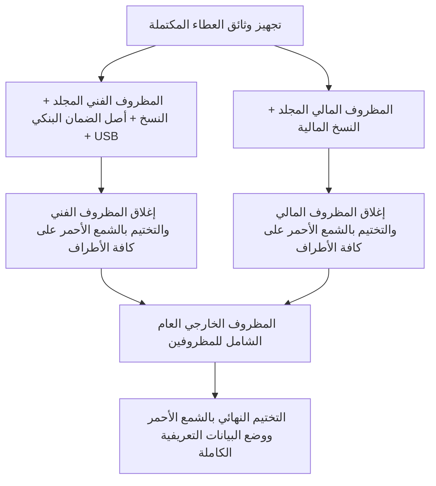

# دليل الطباعة والتجليد والتختيم والتسليم الميداني (Print, Bind, Seal & Submission Runbook)
## الإجراءات التشغيلية والميدانية لتجهيز وتسليم العطاء — مناقصة جامعة تعز رقم 2/2026

```ini
RUNBOOK_ID=TAIZ-TENDER-06-PRINT-BIND-SEAL
CLIENT=جامعة تعز — الإدارة العامة للمشتريات والمخازن
SUBMISSION_LOCATION=مبنى رئاسة جامعة تعز — حبيل سلمان — محافظة تعز
SUBMISSION_TIMELINE_BUFFER=24_TO_48_HOURS_BEFORE_DEADLINE
PHYSICAL_SECURITY_LEVEL=RED_WAX_SEALED_TWO_ENVELOPE_SYSTEM
PHYSICAL_LEGAL_DOCUMENTS_FINAL_CHECK=PENDING_FINAL_ENVELOPE_ASSEMBLY
LEGAL_DOCUMENTS_STATUS=READY_FOR_PHYSICAL_ATTACHMENT_MANAGEMENT_CONFIRMED
BID_BOND_STATUS=DEFERRED_UNTIL_FINAL_TENDER_VALUE_APPROVED (Formula: TOTAL × 0.02)
```

---

## 1. بروتوكول الفحص المادي للوثائق القانونية قبل الإغلاق (Submission Day Check)

قبل البدء بالتجليد والتشميع النهائي، يُلزم ضابط الجودة والمستشار القانوني بتنفيذ فحص دقيق للوثائق المجددة الست وأصل الضمان البنكي (`PHYSICAL_LEGAL_DOCUMENTS_FINAL_CHECK=PENDING_FINAL_ENVELOPE_ASSEMBLY`):

| م | الوثيقة المفحوصة | معيار التحقق الميداني | حالة التحقق |
|---|---|---|---|
| **1** | **السجل التجاري** | مطابقة الاسم، رقم السجل، وتاريخ السريان لعام 2026م واشتمال نشاط البرمجيات | يتم التأشير والتوقيع يوم التجهيز |
| **2** | **البطاقة الضريبية** | مطابقة الرقم الضريبي، تاريخ السريان 2026م، والختم الرسمي لمصلحة الضرائب | يتم التأشير والتوقيع يوم التجهيز |
| **3** | **البطاقة الزكوية** | مطابقة تاريخ السريان لعام 2026م، وختم الهيئة العامة للزكاة | يتم التأشير والتوقيع يوم التجهيز |
| **4** | **شهادة ضريبة المبيعات** | التحقق من شهادة التسجيل بضريبة المبيعات والختم المعتمد | يتم التأشير والتوقيع يوم التجهيز |
| **5** | **شهادة التأمينات** | التحقق من سريان إبراء الذمة وسداد الاشتراكات لعام 2026م | يتم التأشير والتوقيع يوم التجهيز |
| **6** | **شهادة الاسم التجاري** | مطابقة قيد الاسم التجاري الرسمي وحمايته القانونية | يتم التأشير والتوقيع يوم التجهيز |
| **7** | **أصل الضمان البنكي 2%** | التحقق من أصل الخطاب، مطابقة نسبة الـ 2% الدقيقة من إجمالي العطاء، سريان 90+ يوماً، وصيغة الكراسة | يتم الإيداع في حافظة بلاستيكية مستقلة |

---

## 2. مواصفات وعدد النسخ المطلوبة (Copy Counts & Media)

| م | نوع النسخة والمجلد | المواصفات الفنية للطباعة والتجليد | العدد |
|---|---|---|---|
| **1** | **المجلد الفني الأصلي (Technical Offer - Original)** | طباعة ملونة فاخرة (A4 100g)، تجليد حراري مقوى (Hardcover Ring/Thermal Binding) مع فواصل تبويب ملونة (Index Tabs) وموسوم بـ «الأصل» | **1 نسخة أصلية** |
| **2** | **النسخ الفنية المطابقة (Technical Copies)** | طباعة عالية الجودة، تجليد حراري بسلك لولبي وفواصل ملونة وموسومة بـ «صورة 1» و «صورة 2» | **2 نسختين مطابقتين** |
| **3** | **المظروف المالي الأصلي (Financial Offer - Original)** | طباعة واضحة لجداول BOQ ونموذج تقديم العطاء، تجليد أنيق وموسوم بـ «الأصل» | **1 نسخة أصلية** |
| **4** | **النسخ المالية المطابقة (Financial Copies)** | صور طبق الأصل مصدقة لجداول الأسعار والعطاء المالي وموسومة بـ «صورة 1» و «صورة 2» | **2 نسختين مطابقتين** |
| **5** | **الوسائط الرقمية (Digital Media)** | وحدة تخزين فلاشية (USB 3.0 Flash Drive) سعة 32GB تحتوي على النسخ الرقمية الكاملة بتنسيق PDF و CSV للوثائق الفنية | **1 فلاش ميموري** |

---

## 3. ترتيب وهيكلية المجلدات والفواصل الداخلية

### ترتيب أقسام المجلد الفني (Technical Folder Structure):
1. **غلاف المجلد الفني الرسمي**: اسم المناقصة، رقمها، اسم الجهة، واسم الشركة.
2. **خطاب تقديم العطاء الرسمي (Letter of Bid)**: موقع ومختوم من المفوض العام للشركة.
3. **أصل خطاب الضمان البنكي الابتدائي (Bid Bond 2%)**: في حافظة بلاستيكية شفافة بارزة (يودع فور استخراجه من البنك).
4. **الفاصل 1 (الملف القانوني والتنظيمي المجدد)**: السجل التجاري، البطاقة الضريبية، البطاقة الزكوية، ضريبة المبيعات، التأمينات، شهادة الاسم التجاري، والإقرارات القانونية.
5. **الفاصل 2 (العرض الفني الرئيسي)**: الفصول الستة الرئيسية للعرض الفني الموحد.
6. **الفاصل 3 (مصفوفة المطابقة الفنية)**: جدول المطابقة لـ 58 متطلباً مطبوعاً بحجم A4/A3.
7. **الفاصل 4 (ملحق الأدلة التجريبية والـ PoC)**: تقارير Playwright، فحص الحزمة، دقة RAG، والنفاذية.
8. **الفاصل 5 (سابقة الأعمال والخبرات)**: شهادات الإنجاز لـ 3 مشاريع مماثلة.
9. **الفاصل 6 (فريق العمل والسير الذاتية)**: السير الذاتية والشهادات المهنية للخبراء الـ 8.

---

## 4. قواعد الترقيم والتوقيع والتختيم (Numbering & Stamping Rules)

1. **الترقيم التسلسلي الإلزامي**: ترقيم كافة صفحات المجلد بصيغة «صفحة X من Y» لمنع فقدان أو استبدال أي صفحة.
2. **التوقيع الحي**: توقيع المفوض القانوني على كافة صفحات العرض الفني والمالي.
3. **الختم الرسمي**: وضع الختم الرسمي الدائري لشركة سيستراك على كافة الصفحات، الفواصل، والوثائق.
4. **تأكيد عدم وجود كشط**: التأكد من خلو الجداول من أي شطب أو تعديل يدوي، وتوقيع المفوض بجانب أي تصحيح معتمد إن وجد.

---

## 5. إجراءات الإغلاق والتشميع بالشمع الأحمر (Red Wax Sealing)



### ملصق البيانات على المظروف الخارجي (External Envelope Labeling):
```text
┌─────────────────────────────────────────────────────────────────────────────┐
│  إلى: الأخ/ رئيس جامعة تعز — رئيس لجنة المناقصات والمزايدات                 │
│  الجهة: جامعة تعز — الإدارة العامة للمشتريات والمخازن — حبيل سلمان          │
│                                                                             │
│  عطاء المناقصة العامة رقم (2) لسنة 2026م                                   │
│  بشأن: مشروع تطوير البوابة الإلكترونية الشاملة ومواقع الكليات والأنظمة المساعدة│
│                                                                             │
│  اسم مقدم العطاء: شركة سيستراك لتكنولوجيا المعلومات والحلول البرمجية (Systrac) │
│  نوع المحتوى: يحتوي على (المظروف الفني) و (المظروف المالي) منفصلين ومختومين  │
│                                                                             │
│  تنبيه هام: لا يُفتح إلا بمعرفة لجنة فتح المظاريف في الموعد المحدد للجلسة     │
└─────────────────────────────────────────────────────────────────────────────┘
```

---

## 6. خطة التسليم الميداني وهامش الأمان (Logistics & Safe Delivery Buffer)

1. **هامش الأمان الزمني**: إتمام الطباعة والتجليد والتشميع قبل 48 ساعة من الموعد النهائي لجلسة فتح المظاريف.
2. **فريق التسليم الميداني**: تكليف مندوب رسمي مفوض رسمياً مع خطاب تفويض لحضور جلسة فتح المظاريف وقيد استلام العطاء في سجل المناقصات الرسمي.
3. **استلام إشعار الإيداع**: الحصول على سند استلام رسمي مختوم من أمانة سر لجنة المناقصات يوضح تاريخ ووقت إيداع العطاء وحالة الشمع الأحمر.
