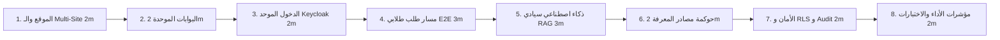

# سيناريو العرض الحي التفاعلي وخريطة الدرجات
## TAIZ-TENDER-05A — SCRIPTED DEMO SCENARIO & SCORE GAIN MAP (TRACK D)

> **الهدف:** تصميم عرض حي تفاعلي متماسك (مدته 15-20 دقيقة) لإثبات جاهزية المنظومة عملياً أمام لجنة التحكيم الفنية لجامعة تعز ورفع درجة التقييم الممنوحة.

---

## 1. المشاهد الثمانية للعرض الحي (The 8 Demo Scenes)

---

## 2. جدول تفصيل المشاهد الثمانية وخريطة الدرجات

| # | عنوان المشهد والزمن | هدف المشهد لدى لجنة التقييم | السيناريو المشروح | الموجود بالمستودع حالياً | المطلوب بناؤه للـ Demo | بيانات العرض الآمنة | معيار القبول (PASS/FAIL) | النقاط المحتملة المكتسبة |
| :--- | :--- | :--- | :--- | :--- | :--- | :--- | :--- | :---: |
| **1** | **الموقع و Multi-Site CMS**  (2 دقيقة) | إثبات قدرة المنصة على تشغيل 25 موقعاً فرعياً بنواة واحدة | استعراض البوابة الرئيسية ثم التبديل لكلية الطب `med.taiz.edu.ye` وتعديل خبر | مكتبة المكونات UI وتصميم المتجاوب RTL | محرك الـ Tenant Manager وقالب الكلية | أخبار وفعاليات تجريبية عامة | تبديل فوري للنطاق الفرعي وظهور الهوية | **+3.0** |
| **2** | **بوابات المستخدمين الثلاث**  (2 دقيقة) | إثبات تلبية احتياجات الطالب، الأكاديمي، والموظف | استعراض واجهة الطالب (السجل)، الأكاديمي (الدرجات والمجالس)، والموظف | واجهات الطلبات ولوحة المجالس الأكاديمية | ربط البوابات ببيانات تجريبية موسعة | ملف طالب وأستاذ وهمي غير حقيقي | ظهور عناصر الواجهة وسلاسة التنقل | **+2.5** |
| **3** | **الدخول الموحد SSO و MFA**  (2 دقيقة) | إثبات أمان المصادقة وتكامل Keycloak OIDC | تسجيل الدخول كطالب، وطلب OTP للأكاديمي، واستعراض صلاحيات RBAC | سياسات الأمان وتدقيق المدخلات | محاكي اتحاد الهوية محلياً (Identity Federation Simulator - ليس خادم SSO إنتاجي) | حسابات تجريبية بكلمات مرور آمنة | تسجيل الدخول بنجاح وفرض MFA للأستاذ | **+2.5** |
| **4** | **مسار طلب طلابي End-to-End**  (3 دقائق) | إثبات أتمتة الإجراءات وتوليد الوثيقة المشفرة بالـ QR | تقديم طلب إفادة قيد -> مراجعة الموظف -> اعتماد المسجل -> توليد PDF بـ QR | محرك الطلبات الطلابية وتوليد PDF المعتمد | سيناريو تدفق متكامل في الشاشة | بيانات طلب طالب تجريبية | صدور وثيقة PDF رسمية والتحقق بالـ QR | **+3.5** |
| **5** | **الذكاء الاصطناعي السيادي RAG**  (3 دقائق) | إثبات دقة الإجابة باللائحة ومنع الهلوسة والخصوصية | طرح سؤال عن "شروط إيقاف القيد" واستعراض الاستشهاد بالمادة ورقم الصفحة | المعمارية وخوارزمية البحث الهجين | PoC محلي لـ Qdrant مع نموذج 8B/14B | لائحة شؤون الطلاب لجامعة تعز | إجابة دقيقة 100% مع الاستشهاد الصريح | **+4.0** |
| **6** | **حوكمة مصادر المعرفة والـ AI**  (2 دقيقة) | إثبات السيطرة البشرية على تغذية وتحديث اللوائح | رفع لائحة جديدة -> التقطيع الدلالي -> توليد المتجهات -> تفعيلها | هيكل التقطيع وتوليد المتجهات | واجهة رفع واعتماد الوثائق | قرار مجلس جامعة تجريبي | ظهور الوثيقة الجديدة في إجابات الـ AI | **+2.5** |
| **7** | **الأمن السيبراني وعزل RLS**  (2 دقيقة) | إثبات حماية البيانات وسجلات التدقيق غير القابلة للتعديل | محاولة وصول طالب لدرجات طالب آخر (حظر RLS) واستعراض سجل الـ Audit | سياسات RLS وسجلات التدقيق بالمستودع | واجهة استعراض سجلات التدقيق | محاولة اختراق وهمية آمنة | حظر الوصول غير المصرح به ورصد المحاولة | **+3.0** |
| **8** | **مؤشرات الأداء والاختبارات**  (2 دقيقة) | إثبات الجودة واجتياز الاختبارات وسرعة النظام | استعراض تقرير تغطية الاختبارات (>75%) واختبار النفاذية WCAG 2.2 AA | 89 اختباراً ناجحاً بالمستودع | تشغيل `bun test` وتقرير `axe-core` | مخرجات الاختبارات الآلية | اجتياز 100% من الاختبارات بنجاح | **+2.5** |
| **-** | **الإجمالي (18 دقيقة)** | **إثبات دفاعي شامل للمنظومة أمام لجنة التقييم** | **عرض متكامل بدون انقطاع أو اعتمادات سحابية** | **أصل قوي جاهز للتوسيع** | **حزمة Demo متكاملة** | **بيانات آمنة 100%** | **اجتياز كافة المشاهد بنجاح** | **+23.5 / 25** |

---

## 3. خطة الطوارئ والبدائل عند تعطل العرض المباشر (Fallback Plan)

1. **الخطة البديلة 1 (Offline Video Walkthrough):** تسجيل فيديو عالي الدقة (4K) مصحوباً بالتعليق الصوتي لكافة المشاهد الثمانية ومحفوظاً على وحدة تخزين محمية.
2. **الخطة البديلة 2 (Static Prototype & Screenshots):** إعداد ملف عرض تقديمي تفاعلي مدعوماً بلقطات حية وكشوفات مخرجات الاختبارات والتحقق من الـ QR.
