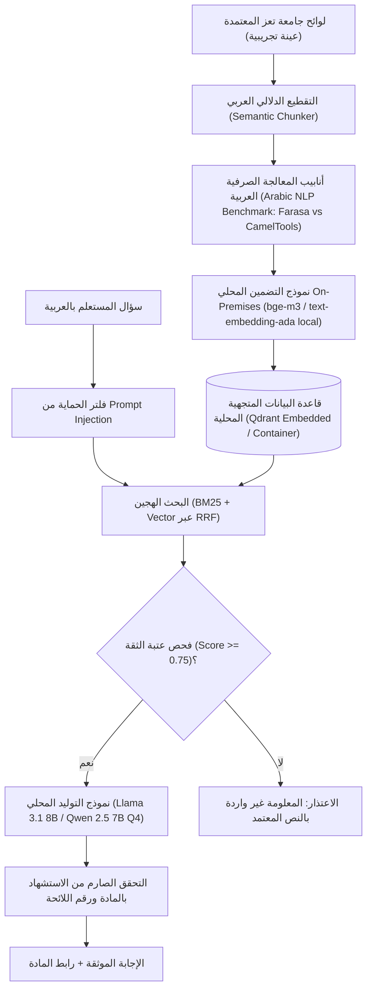

# مواصفات النموذج التجريبي للذكاء الاصطناعي السيادي
## TAIZ-TENDER-05A — LOCAL SOVEREIGN RAG POC SPECIFICATION (TRACK D)

> **الهدف:** بناء نموذج تجريبي محلي سيادي (*Minimum Defensible Local RAG PoC*) يعمل داخل بيئة معزولة 100% On-Premises دون أي اتصال بسحابة خارجية لإثبات دقة المعالجة الصرفية العربية ومكافحة الهلوسة.

---

## 1. المعمارية الفنية للنموذج التجريبي المعزول (Local PoC Architecture)

---

## 2. بنك أسئلة التقييم ومؤشرات القياس (Evaluation Dataset & Benchmarks)

1. **مجموعة بيانات الفحص والتقييم (Benchmark Dataset):**
   - استيعاب 3 لوائح جامعية حقيقية معلنة لجامعة تعز (لائحة شؤون الطلاب الموحدة، لائحة الدراسات العليا، واللائحة المالية للخدمات).
   - إعداد بنك اختبار يحتوي على **مجموعة تقييم مقترحة بحجم تجريبي (PROPOSED_EVALUATION_SET_SIZE - ليس اشتراطاً تعاقدياً)** (30 سؤالاً مباشراً، 10 أسئلة مركبة، و 10 أسئلة فخاخ خارج اللائحة لاختبار الامتناع).
2. **المستهدفات القياسية للـ PoC:**
   - **دقة الاسترجاع (Recall@10):** `>= 95% [TARGET_TO_BE_VALIDATED]`.
   - **معدل استرجاع المرتبة الأولى (MRR):** `>= 0.85 [TARGET_TO_BE_VALIDATED]`.
   - **الالتزام بالسياق (Groundedness):** `>= 98% [TARGET_TO_BE_VALIDATED]`.
   - **دقة الاستشهاد بالمصدر (Citation Accuracy):** `100% [TARGET_TO_BE_VALIDATED]`.
   - **معدل الامتناع عند الأسئلة غير المتوفرة:** `100% [TARGET_TO_BE_VALIDATED]`.
   - **زمن الاستجابة الكلي:** `< 2.5 ثانية [TARGET_TO_BE_VALIDATED]` على معالج محلي أو كرت شاشة متوسط.

---

## 3. حوكمة الخصوصية وعدم تسريب البيانات (Zero External Egress)

- يعمل الـ PoC بالكامل دون الحاجة لأي اتصال بالإنترنت (Offline air-gapped ready).
- يتم تضمين فحص أمني للشبكة يثبت عدم إرسال أي استدعاءات API أو حزم بيانات خارج السيرفر المحلي.
