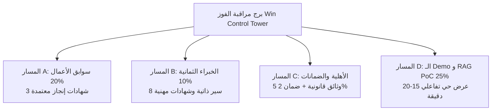

# برج مراقبة خطة الفوز وإغلاق الفجوات
## TAIZ-TENDER-05A — WIN CONTROL TOWER & CLOSURE DASHBOARD

> **الهدف:** إدارة وتحويل فجوات الفوز من التقييم الحالي (24.0 / 100) إلى المستهدف التنافسي المدافع عنه (**85+ إلى 91.0 / 100**) عبر 4 مسارات تنفيذية منضبطة.

```
================================================================================
PRIMARY_OBJECTIVE:       MAXIMIZE_SYSTRAC_WIN_PROBABILITY
CURRENT_VERIFIED_SCORE:  24.0 / 100 (In-Repo Code Only)
PROJECTED_7D_SCORE:      69.0 / 100
PROJECTED_14D_SCORE:     91.0 / 100 (Crosses 85+ Target)
BEST_DEFENSIBLE_SCORE:   97.0 / 100
EXECUTIVE GATE DECISION: PASS_TO_DEMO_IMPLEMENTATION
================================================================================
```

---

## 1. لوحة المؤشرات للمسارات التنفيذية الأربعة



### ملخص حالة المسارات الأربعة:
1. **المسار A (سوابق الأعمال - 20 نقطة):** الحالة الراهنة `0 / 20` -> المستهدف `18.0 / 20` عبر تأمين 3 شهادات إنجاز رسمية لمشاريع بوابات جامعية/مؤسسية مماثلة.
2. **المسار B (فريق العمل - 10 نقاط):** الحالة الراهنة `0 / 10` -> المستهدف `9.0 / 10` عبر توقيع اتفاقيات التزام مشروطة بالترسية مع 8 خبراء معتمدين (PMP, TOGAF, CISSP, CKA).
3. **المسار C (الأهلية القانونية والضمانات - شرط استبعاد):** الحالة الراهنة `BLOCKED` -> المستهدف `CLEAR` عبر استخراج خطاب الضمان البنكي (2% لـ 90 يوماً) وتجديد البطاقات القانونية الخمس.
4. **المسار D (الـ Demo و Local RAG PoC - 25 نقطة):** الحالة الراهنة `10.0 / 25` -> المستهدف `23.5 / 25` عبر بناء سيناريو Demo تفاعلي (15-20 دقيقة) و PoC محلي للذكاء الاصطناعي مع قياس دقة الاسترجاع.

---

## 2. جدول توزيع نقاط التقييم وخارطة الارتقاء

| محور التقييم بالكراسة | الوزن | الحالي بالمستودع | بعد 7 أيام | بعد 14 يوماً | الأثر التراكمي | المسار المرتبط |
| :--- | :---: | :---: | :---: | :---: | :---: | :--- |
| **المعمارية والمنهجية والـ Demo** | 25% | 10.0 | 20.0 | 23.5 | **+13.5** | المسار D (الـ Demo والوثائق) |
| **سابقة الأعمال والمشاريع المماثلة** | 20% | 0.0 | 12.0 | 18.0 | **+18.0** | المسار A (شهادات الإنجاز الثلاث) |
| **حلول الذكاء الاصطناعي و RAG** | 15% | 0.0 | 10.0 | 13.5 | **+13.5** | المسار D (الـ PoC واختبار المعايرة) |
| **الأمن والأداء وقابلية التوسع** | 15% | 8.0 | 11.0 | 13.5 | **+5.5** | المسار D (ASVS L2 وفحص الثغرات) |
| **خطة التنفيذ والجدول وهجرة البيانات**| 15% | 6.0 | 11.0 | 13.5 | **+7.5** | المسار D (WBS لـ 32 أسبوعاً و 301) |
| **مؤهلات فريق العمل والكادر البشري** | 10% | 0.0 | 5.0 | 9.0 | **+9.0** | المسار B (السير والشهادات الـ 8) |
| **المجموع الإجمالي المحسوب** | **100%** | **24.0 / 100** | **69.0 / 100** | **91.0 / 100** | **+67.0** | **تحقيق مستهدف 85+ (91.0)** |

---

## 3. الفهرس التنفيذي لملفات حزمة الفوز الـ 12

1. [`TAIZ_TENDER_05A_WIN_CONTROL_TOWER.md`](TAIZ_TENDER_05A_WIN_CONTROL_TOWER.md) — برج مراقبة خطة الفوز.
2. [`TAIZ_TENDER_05A_REFERENCE_EVIDENCE_REGISTER.md`](TAIZ_TENDER_05A_REFERENCE_EVIDENCE_REGISTER.md) — سجل أدلة سوابق الأعمال الثلاث.
3. [`TAIZ_TENDER_05A_REFERENCE_CERTIFICATE_TEMPLATES.md`](TAIZ_TENDER_05A_REFERENCE_CERTIFICATE_TEMPLATES.md) — قوالب طلب وتوثيق شهادات الإنجاز.
4. [`TAIZ_TENDER_05A_EXPERT_SOURCING_REGISTER.md`](TAIZ_TENDER_05A_EXPERT_SOURCING_REGISTER.md) — سجل استقطاب وتوثيق الخبراء الثمانية.
5. [`TAIZ_TENDER_05A_EXPERT_ENGAGEMENT_TEMPLATES.md`](TAIZ_TENDER_05A_EXPERT_ENGAGEMENT_TEMPLATES.md) — قوالب التعاقد المشروط وإقرارات التفرغ.
6. [`TAIZ_TENDER_05A_LEGAL_AND_BOND_CHECKLIST.md`](TAIZ_TENDER_05A_LEGAL_AND_BOND_CHECKLIST.md) — قائمة الأهلية القانونية والضمانات البنكية.
7. [`TAIZ_TENDER_05A_DEMO_SCENARIO_AND_SCORE_MAP.md`](TAIZ_TENDER_05A_DEMO_SCENARIO_AND_SCORE_MAP.md) — سيناريو العرض الحي وخريطة الدرجات.
8. [`TAIZ_TENDER_05A_LOCAL_RAG_POC_SPEC.md`](TAIZ_TENDER_05A_LOCAL_RAG_POC_SPEC.md) — مواصفات PoC الذكاء الاصطناعي المحلي السيادي.
9. [`TAIZ_TENDER_05A_DEMO_BUILD_DECISION.md`](TAIZ_TENDER_05A_DEMO_BUILD_DECISION.md) — وثيقة قرار موضع وعزل الـ Demo.
10. [`TAIZ_TENDER_05A_SCORE_UPLIFT_LEDGER.csv`](TAIZ_TENDER_05A_SCORE_UPLIFT_LEDGER.csv) — سجل الارتقاء بالدرجات الفنية.
11. [`TAIZ_TENDER_05A_48H_7D_14D_ACTION_PLAN.md`](TAIZ_TENDER_05A_48H_7D_14D_ACTION_PLAN.md) — خطة العمل الزمنية لإغلاق الفجوات.
12. [`TAIZ_TENDER_05A_DECISION.md`](TAIZ_TENDER_05A_DECISION.md) — وثيقة قرار الانتقال لتنفيذ الـ Demo.
